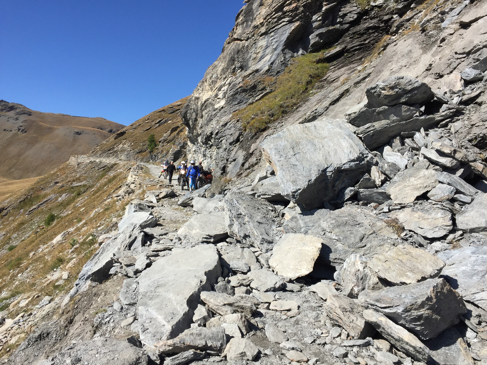
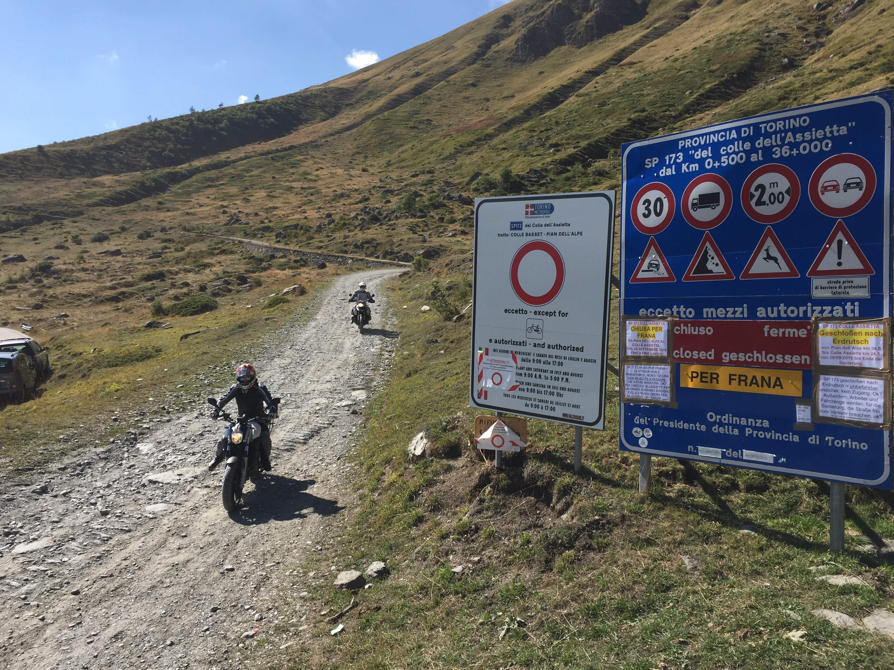
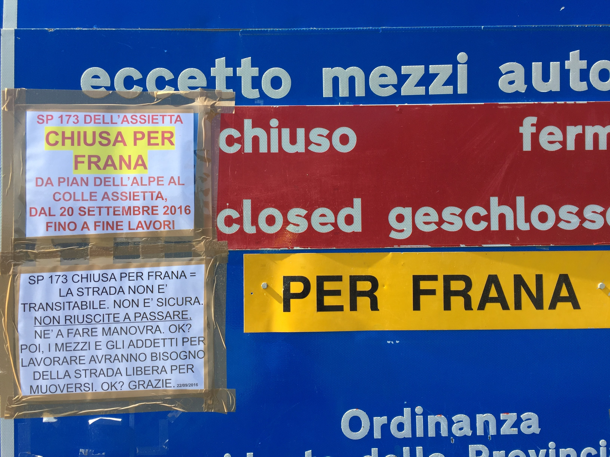

  <strong>Aggiornamento</strong>:** nel 2017 la frana è stata rimossa e la strada è nuovamente percorribile da tutti i mezzi.

Sulla SP 173 Strada dell’Assietta tra il Colle delle Finestre ed il Colle dell’Assietta c’è stata una frana, il Comune di Pragelato ha provveduto ha chiuderla in data 16 settembre 2016 a data da destinarsi. **In moto si riesce a passare a proprio rischio e pericolo**.

Download: [Ordinanza di sospensione temporanea della circolazione della città metropolitana di Torino N° 149-25742/2016](http://www.pragelatoturismo.it/public/news/ordinanza.jpg).

<figure><iframe style="border: 0;" src="https://www.google.com/maps/embed?pb=!1m18!1m12!1m3!1d9962.745538627365!2d6.9635730587763165!3d45.06004608929178!2m3!1f0!2f0!3f0!3m2!1i1024!2i768!4f13.1!3m3!1m2!1s0x0%3A0x0!2zNDXCsDAzJzQwLjEiTiA2wrA1OCcwMS4xIkU!5e1!3m2!1sit!2sus!4v1475244980130" width="100%" height="540" frameborder="0" allowfullscreen="allowfullscreen"></iframe></figure>

*Posizione della frana.*

Probabilmente il passaggio verrà ripristinato all’apertura della strada nella primavera 2017.

Colle e Testa dell’Assietta restano accessibili da Sestriere o Sauze d’Oulx passando per il Col Basset.

Siamo passati a motore spento spingendo in 4, consigliamo caldamente di **non avventurarsi in solitaria**: si rischia di cadere lungo la frana.

I mezzi a 4 ruote devono evitare tassativamente il passaggio, manca spazio di manovra e si rischiano 10km di retromarcia!

