Ci sono giorni in cui anche a Torino capita di svegliarsi sotto un limpido cielo azzurro, senza tracce di smog, solo qualche cumulo di nubi a ovest, sulle Alpi Cozie: in quei giorni è davvero difficile resistere alla tentazione di prendere permesso da lavoro e scappare dalla città in sella alla moto!

Così in una bella giornata di metà luglio ho finalmente deciso di percorrere l'anello di 350km che da Torino porta in Francia e Val d'Aosta, passando per il Colle del Moncenisio, Col de l'Iseran e Colle del Piccolo San Bernardo.

<iframe style="border: 0;" src="https://www.google.com/maps/embed?pb=!1m46!1m12!1m3!1d369866.85931650276!2d7.0574479181160195!3d45.4124660530755!2m3!1f0!2f0!3f0!3m2!1i1024!2i768!4f13.1!4m31!3e0!4m5!1s0x47886d0cc3ed5cdf%3A0x405e67d473c94e0!2sTorino+TO%2C+Italia!3m2!1d45.0703393!2d7.686864!4m5!1s0x4789a2dfd1b66fd3%3A0x41da24430d71cb23!2sColle+del+Moncenisio%2C+Lanslebourg-Mont-Cenis%2C+Francia!3m2!1d45.2596238!2d6.9008601!4m5!1s0x47890853519a421d%3A0x58dd660a95d9352f!2sColle+dell'Iseran%2C+Bonneval-sur-Arc%2C+Francia!3m2!1d45.417125999999996!2d7.030626!4m5!1s0x47896a17735e3631%3A0x751f1ac32f22922a!2sColle+del+Piccolo+San+Bernardo%2C+S%C3%A9ez%2C+Francia!3m2!1d45.6802785!2d6.88389!4m5!1s0x47886d126418be25%3A0x8903f803d69c77bf!2sTorino%2C+TO%2C+Italia!3m2!1d45.070312!2d7.686856499999999!5e0!3m2!1sit!2sfi!4v1472737964621" width="100%" height="450" frameborder="0" allowfullscreen="allowfullscreen"></iframe>

In generale le strade sono molto ben asfaltate, ad eccezione del tratto che congiunge Lanslebourg al Col de l'Iseran... ma vediamo il tragitto nel dettaglio.

## Torino - Susa

La strada per il primo dei colli affrontati passa per la Val di Susa, e qui sono possibili 3 opzioni:

- per i **frettolosi**: si prende la tangenziale e poi l'autostrada Torino-Bardonecchia in direzione Frejus, si esce a Susa... oltre ad essere un po' noiosa costa un sacco di soldi (€6,10 per 55km a luglio 2016)
- per chi arriva **da Torino Nord**: SP24 passando per Caselette (occhio agli **autovelox fissi**), Almese, a Borgone Susa si attraversa la Dora Riparia e si segue per Bussoleno e infine Susa
- per chi arriva **da Torino Sud**: la strada che da Rivoli passa per Villarbasse, Reano e Buttigliera Alta è un po' stretta ma davvero bella, poi ci si ricongiunge alla SP24 (citata prima) attraverso la circonvallazione di Avigliana

A Susa è quasi obbligatorio fermarsi al Panificio Favro (dentro il minimarket CRAI) per comprare i panini farciti con **formaggi e affettati della Val Susa** e la squisita **focaccia dolce** di Susa!

<iframe style="border: 0;" src="https://www.google.com/maps/embed?pb=!1m0!3m2!1sit!2sfi!4v1472739857643!6m8!1m7!1sEAwJRDtr2_7RLs_Ac074cQ!2m2!1d45.13687583093684!2d7.0611414571677!3f156.86717648071334!4f1.3129570610931438!5f0.9104685568143478" width="100%" height="450" frameborder="0" allowfullscreen="allowfullscreen"></iframe>

## Susa - Lago e Colle del Moncenisio

  <strong>ATTENZIONE</strong>: da Susa a Val d'Isère (85 km) non ci sono benzinai, il posto giusto per fare il pieno è questo!

La SS25 che da Susa porta al Lago del Moncenisio è molto larga, asfaltata da poco (luglio 2016), con curve per tutti i gusti: **dai tornanti stretti ai curvoni veloci**, è facile farsi prendere la mano e lasciare urlare il motore... nei weekend **la strada è molto frequentata** da motociclisti, camper e auto.

Passato il confine con la Francia inizia un asfalto meno regolare ed una serie di tornanti abbastanza stretti, passato l'edificio della ex dogana si riprende con curvoni fantastici che portano alla diga del Lago del Moncenisio (quota 1974 m).

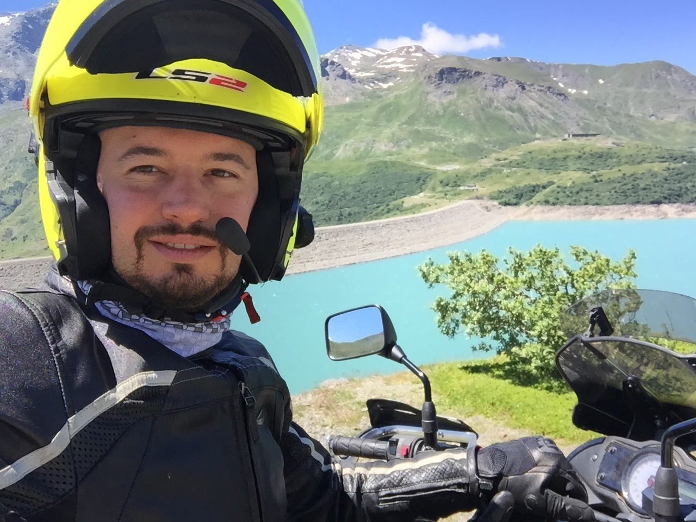
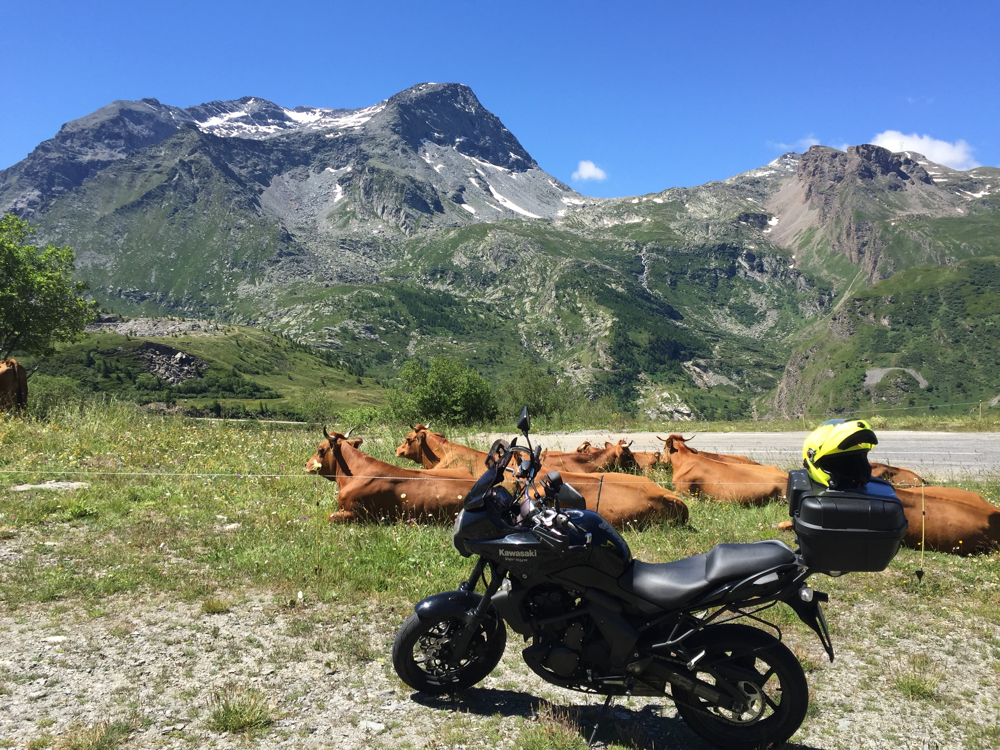

La diga del Moncenisio risale al 1968 ed ha la particolarità di non essere costruita in calcestruzzo, ma da una montagna di rocce e sedimenti.

Costeggiando il lago si arriva ad uno spiazzo con la caratteristica chiesa piramidale, diversi bar e ampio parcheggio (sempre che non sia invaso dalle moto)... un ottimo **punto panoramico** per godersi il paesaggio e far riposare moto e natiche!

## Moncenisio - Col de L'Iseran

Dal lago del Moncenisio si prosegue in direzione Lanslebourg su una strada larga e ben asfaltata, fino al bivio per Lanslevillard e Col de l'Iseran, dove si lascia la strada principale per avventurarsi in una splendida vallata poco abitata.

<iframe style="border: 0;" src="https://www.google.com/maps/embed?pb=!1m0!3m2!1sit!2sfi!4v1472742336403!6m8!1m7!1sEI6GjkKjkHLKfHwSxj0E8g!2m2!1d45.2849475!2d6.9080002!3f342.11329985433997!4f2.705233710103684!5f0.7820865974627469" width="100%" height="450" frameborder="0" allowfullscreen="allowfullscreen"></iframe>

Purtroppo la strada che da qui porta al prossimo colle non è delle migliori, soprattutto dopo Bonneval-sur-Arc: carreggiata stretta, piena di buche, anche d'estate si rischiano di trovare temperature basse e neve.

In compenso il paesaggio è stupendo e vale la pena arrivare al Col de l'Iseran, dato che con i suoi 2770 m è il **valico stradale più alto d'Europa**!

 il valico stradale più alto d'Europa!")
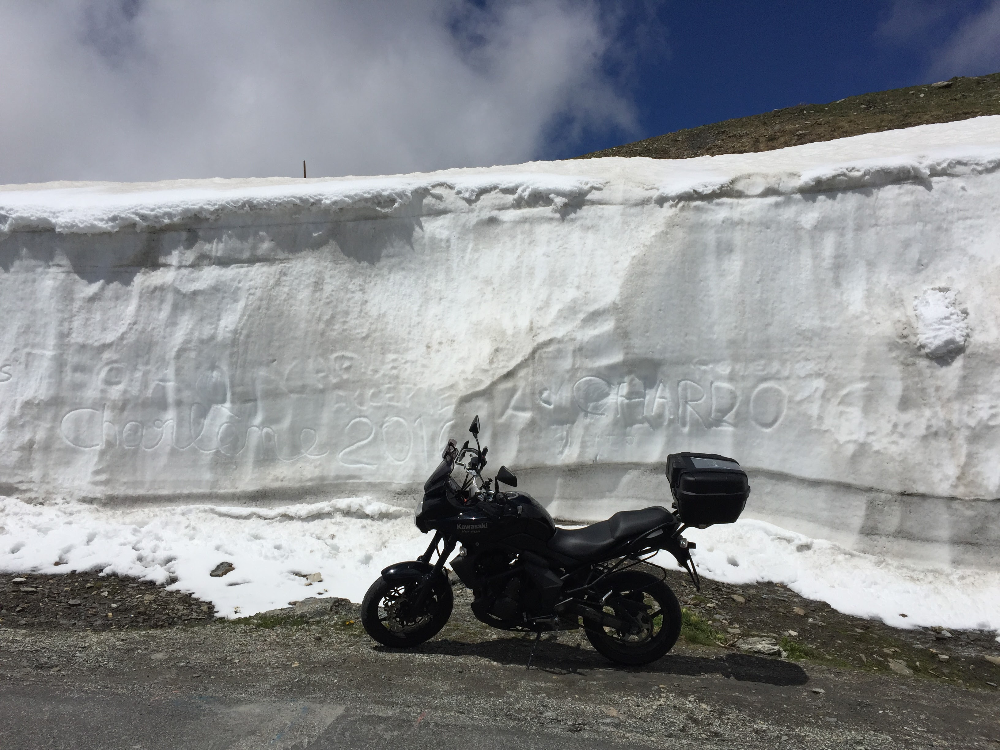
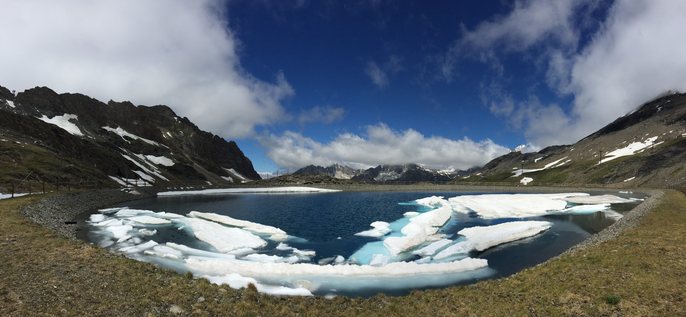

## Iseran - Colle del Piccolo San Bernardo

La discesa che dal colle porta al paese di Val-d'Isère migliora decisamente come fondo stradale. La strada torna ad essere divertente, ma bisogna stare attenti alla miriade di ciclisti!

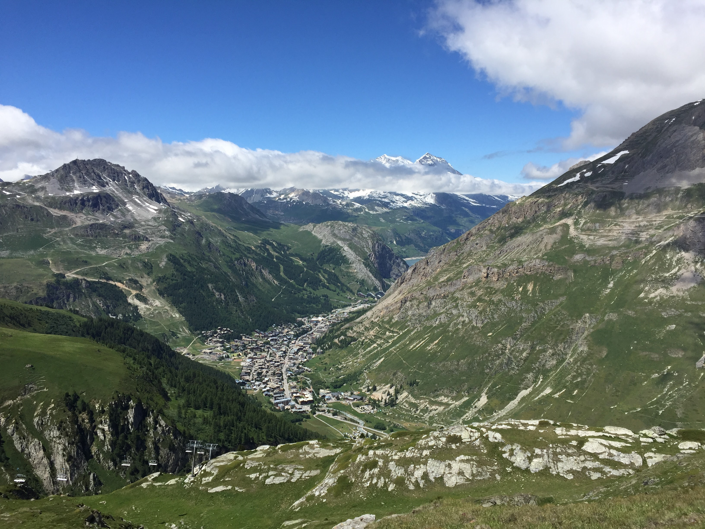

Al fondo della discesa mi sono imbattuto in un'inaspettata [fiera del veicolo elettrico](http://salon-vehicule-electrique.com) che si svolge a metà luglio... molto interessante!

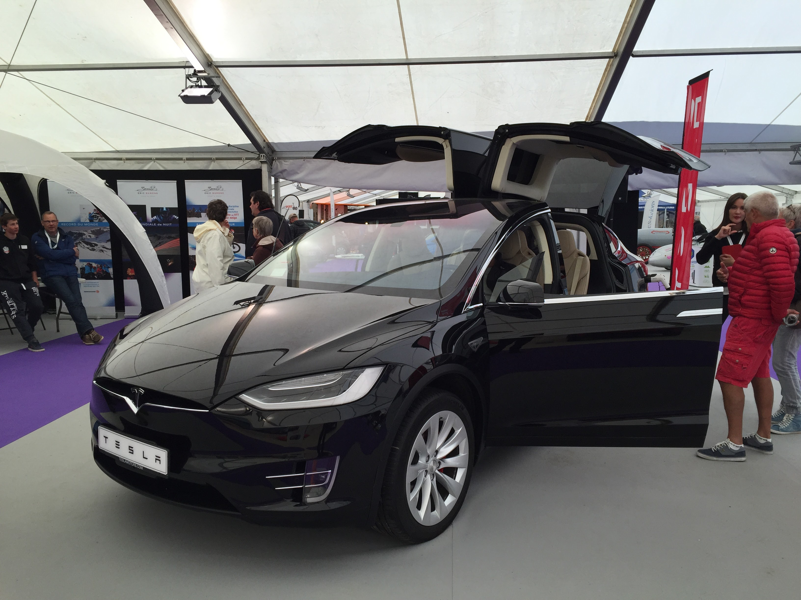
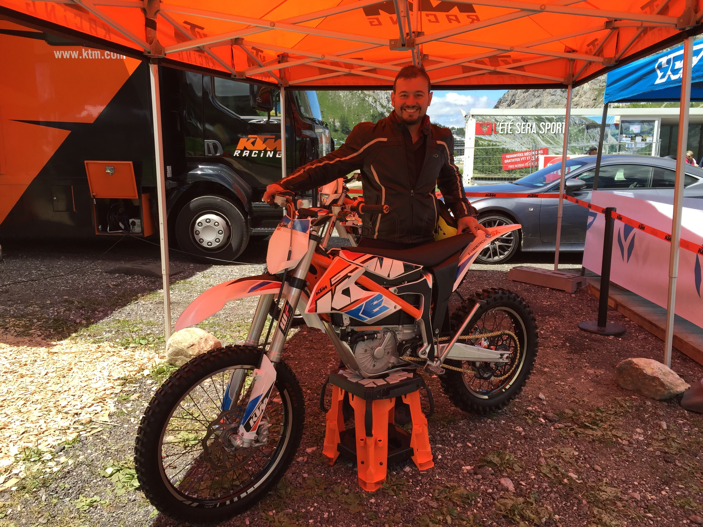
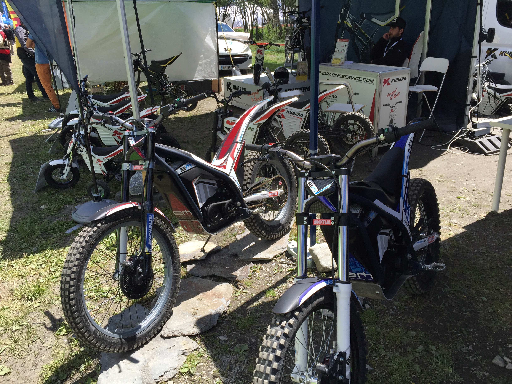
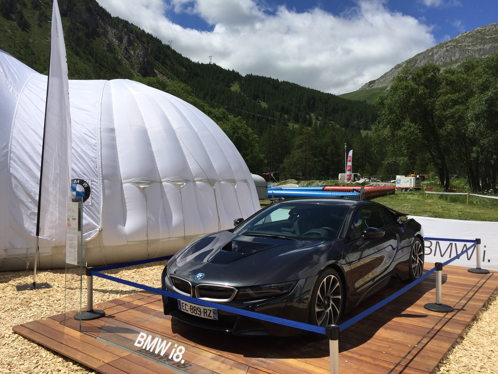

Da Val-d'Isère si prosegue costeggiando il Lac du Chevril su una strada di **belle curve veloci**. Passata la diga si comincia a scendere per arrivare a Sainte-Foy-Tarentaise, dove si lascia la bella D902 in direzione Col du Petit Saint-Bernard
Parliamoci chiaramente: la strada per il colle non è niente male ed è molto ben tenuta... ma il paesaggio è meno spettacolare e la guida meno divertente rispetto a Moncenisio ed Iseran.

Rettilineo, tornante, rettilineo, tornante, rettilineo, tornante... ogni tanto l'imprevisto di una controcurva a salvare dalla monotonia!

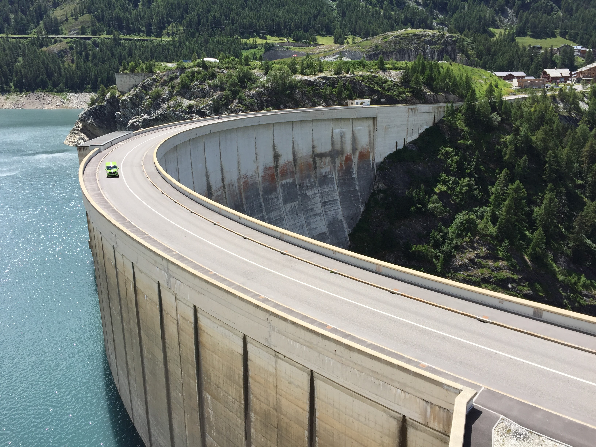
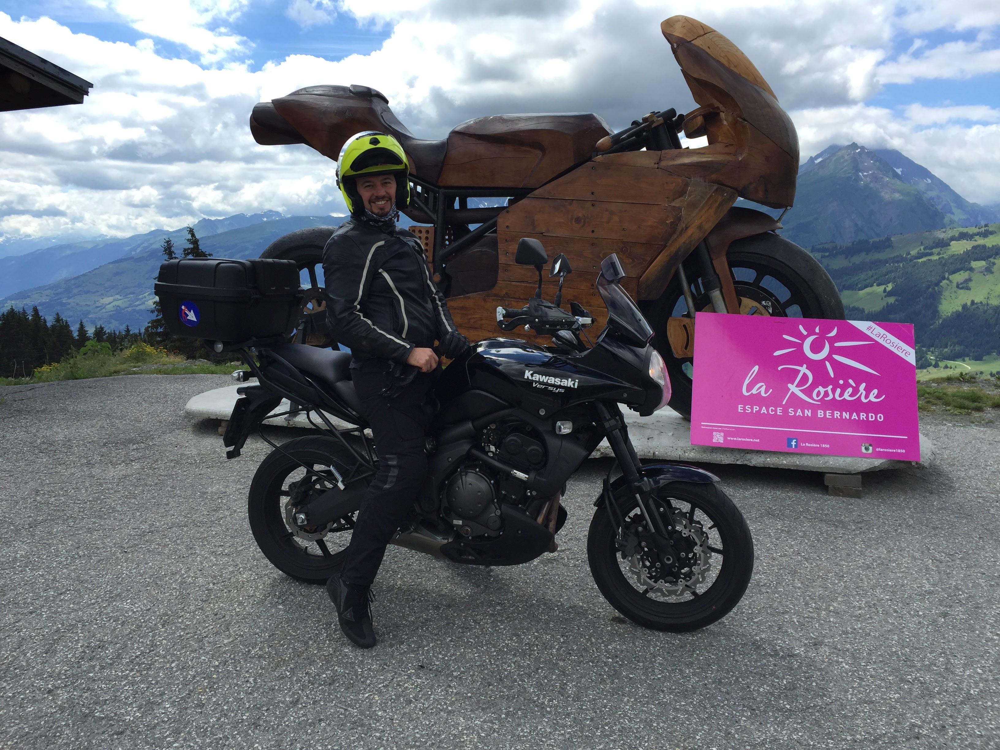

Finalmente si arriva al Colle del Piccolo San Bernardo! Mi aspettavo di trovare gli omonimi cani, ma a quanto pare li tengono nascosti da qualche parte...

## Piccolo San Bernardo - Torino

Molto bella la discesa dal colle a La Thuile: **divertente, varia, asfaltata benissimo**!

All'inizio bisogna stare un po' attenti al freddo (si parte da 2188 m), poi le temperature cominciano a salire ed è meglio togliersi qualche strato.

Ci si diverte ancora fino a Prè Saint Didier, poi il mio consiglio è di andare in statale fino ad Aosta per evitare il salasso dell'autostrada del Monte Bianco, da lì proseguire per Torino in autostrada: sono 100km per circa 16€ di pedaggi, ma dopo 3 colli e svariate ora in sella è giusto rilassarsi un po'!

## Un consiglio finale

Prendetevi tempo: i panorami sono stupendi e vale la pena godersi questi paesaggi in compagnia e approfittarne per rilassarsi tra una tratta e l'altra!

Dato che le quote sono abbastanza elevate è necessario portarsi un vestiario adeguato e stare attenti a possibile ghiaccio per terra (in particolare sulla strada che porta al Col de l'Isèran).
