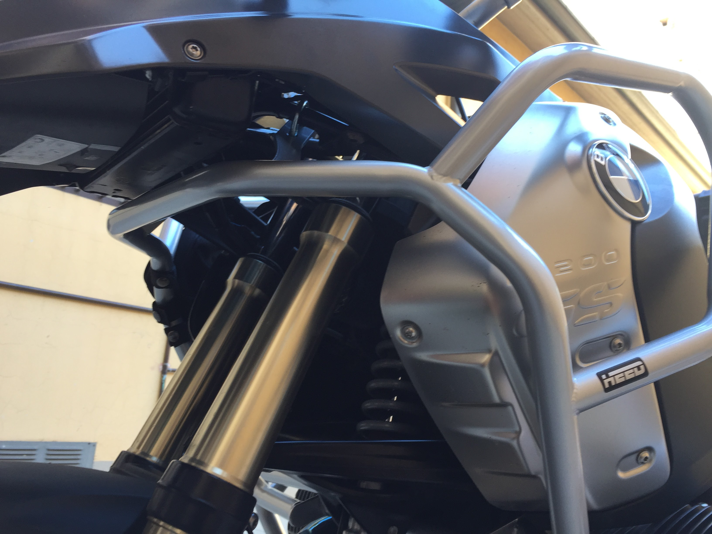

Da poco ho comprato una BMW R 1200 GS MY 2008 già provvista delle barre paramotore originali, molto solide e dall'aspetto poco invasivo.

Sicuramente sono in grado di proteggere il motore Boxer da una caduta da fermo o poco più, lasciano qualche dubbio nel caso la moto dovesse strisciare sull'asfalto o cadere su terreno poco accidentato.

## Paramotore HEED Full Bunker per BMW R 1200 GS 04-12

Dopo [varie considerazioni](https://www.amazon.it/gp/search/ref=as_li_qf_sp_sr_tl?ie=UTF8&camp=3370&creative=23322&index=aps&keywords=paramotore%20bmw%20r%201200%20gs&linkCode=ur2&tag=motovia-21) ho deciso di acquistare le crash bar HEED Full Bunker specifiche per le annate da 2004 a 2012: oltre a proteggere completamente il motore offrono protezione per serbatoio, possibilità di aggiungere due borse laterali sull'avantreno e faretti supplementari.

Il prezzo è molto allettante ma a giudicare dalle [foto presenti sul sito ufficiale](http://www.heed.com.pl/index.php/en/gmole-heed-for-r-1200-gs-08-12-full-bunker-en) sembrano un po' invasive.

Le ho comprate a [€280 su eBay](http://rover.ebay.com/rover/1/724-53478-19255-0/1?icep_ff3=9&pub=5575226208&toolid=10001&campid=5337960068&customid=&icep_uq=heed+full+bunker+bmw+1200+08+12&icep_sellerId=&icep_ex_kw=&icep_sortBy=12&icep_catId=&icep_minPrice=&icep_maxPrice=&ipn=psmain&icep_vectorid=229494&kwid=902099&mtid=824&kw=lg) per essere coperto dall'assicurazione di PayPal; subito dopo ho contattato HEED per chiedere di avere le borse laterali in offerta a €35.

L'azienda è stata molto veloce e ha risposto in italiano, mentre la spedizione è stata a dir poco fulminea: acquistate e spedite mercoledì dalla Polonia con corriere GLS, il sabato mattina erano già a casa mia.

L'imballo è realizzato con cura, il rischio che si possano rovinare nel trasporto sembra davvero remoto.

Si possono comprare anche su [Amazon Italia](http://amzn.to/2nUTLjQ) ad un prezzo leggermente superiore.

## Informazioni per il montaggio

Assemblare le crash bar è molto semplice e alla portata di tutti. Per farsene un'idea ecco i PDF con le istruzioni di montaggio: [parte bassa](./Inst_Mont_BMW_R_1200_GS_04-12_down_PL-EN.pdf) e [paraserbatoio](./Inst_Mont_BMW_R_1200_GS_04-12_up_PL-EN.pdf).

Per completare il lavoro servono diversi attrezzi:
- [chiave TORX T55](https://amzn.to/2HyamFL)
- [chiavi a brugola 10mm, 8mm, 6mm](https://amzn.to/2TqhFke) (quest'ultima deve essere abbastanza lunga da permettere di avvitare una piccola vite situata tra serbatoio e cilindro)
- [chiave fissa 10mm](https://amzn.to/2WncsM1)
- [chiave dinamometrica](https://amzn.to/2U9mx1G) (non fondamentale, ma sarebbe meglio usarla per i serraggi critici)

Da valutare l'acquisto di un [kit di inserti con chiave a bussola](https://amzn.to/2Tm9BRu): velocizza le operazioni ed è più economico rispetto alle singole chiavi.

È consigliabile farsi aiutare da un amico: per inserire senza sforzi la vite che collega il traliccio posteriore al motore bisogna alzare leggermente la moto agendo sul portapacchi posteriore.

Questa vite è facilmente riconoscibile perché è l'unica a richiedere una [chiave TORX T55](https://amzn.to/2HyamFL). Va rimpiazzata con la vite a brugola da 10 in dotazione al paramotore e chiusa con una [chiave dinamometrica](https://amzn.to/2U9mx1G) (coppia di serraggio: 55 Nm).

È una buona idea mettere una goccia di [frenafiletti](https://amzn.to/2ToQoyG) sulle viti più grosse per evitare che le vibrazioni possano farle svitare durante la marcia.

## Considerazioni

Non posso che consigliare l'acquisto delle [crash bar HEED Full Bunker](http://rover.ebay.com/rover/1/724-53478-19255-0/1?icep_ff3=9&pub=5575226208&toolid=10001&campid=5337960068&customid=&icep_uq=heed+full+bunker+bmw+1200+08+12&icep_sellerId=&icep_ex_kw=&icep_sortBy=12&icep_catId=&icep_minPrice=&icep_maxPrice=&ipn=psmain&icep_vectorid=229494&kwid=902099&mtid=824&kw=lg), anche se fortunatamente non mi è ancora capitato di dover provare la loro robustezza.

Le foto non rendono giustizia a questo paramotore: sembra molto più ingombrante di quanto sia realmente! Il colore ed il diametro delle barre sono pressoché identici al telaio della moto, dando l'idea di essere parte integrante della moto e non un'aggiunta successiva. Il look del R 1200 GS normale si avvicina di più alla versione Adventure.

Con il paraserbatoio arriva la possibilità di montare le borse laterali HEED. Hanno qualche difetto (si possono staccare facilmente e le cerniere non prevedono la possibilità di aggiungere un lucchetto), ma permettono di stipare alcuni accessori da avere sempre con sé. Nelle mie ho messo:
- [kit pronto soccorso](https://amzn.to/2TVTfUH)
- [kit riparazione pneumatici](https://amzn.to/2HyaZz7)
- [rete portaoggetti](https://amzn.to/2WghvgY)

## Prodotti alternativi

Ho considerato diverse alternative prima di effettuare questo acquisto. Ne elenco qualcuna nel caso si rivelasse più adatta alle necessità del lettore:

- Paracilindri originali BMW: disponibili in plastica (~€100) e alluminio (~€180), sono più economici delle crash bar e spesso sono di serie sulla moto. Non mi convincono perché il motore picchia direttamente a terra, ma possono essere un buon complemento al paramotore originale.

- [Protezione motore](http://rover.ebay.com/rover/1/724-53478-19255-0/1?icep_ff3=9&pub=5575226208&toolid=10001&campid=5337960068&customid=&icep_uq=hepco+becker+bmw+motore&icep_sellerId=&icep_ex_kw=&icep_sortBy=12&icep_catId=&icep_minPrice=&icep_maxPrice=&ipn=psmain&icep_vectorid=229494&kwid=902099&mtid=824&kw=lg) e [serbatoio](http://rover.ebay.com/rover/1/724-53478-19255-0/1?icep_ff3=9&pub=5575226208&toolid=10001&campid=5337960068&customid=&icep_uq=hepco+becker+bmw+protezione+serbatoio&icep_sellerId=&icep_ex_kw=&icep_sortBy=12&icep_catId=&icep_minPrice=&icep_maxPrice=&ipn=psmain&icep_vectorid=229494&kwid=902099&mtid=824&kw=lg) Hepco & Becker: sembrano un ottimo prodotto e sono vendute direttamente da BMW. Il prezzo è più alto delle HEED (~€420).

- [Protezione motore](https://shop.touratech.it/barra-paracilindro-e-paramotore-acciaio-inox-per-bmw-r1200gs-fino-a-2012.html) e [serbatoio](https://shop.touratech.it/barra-anticaduta-per-carenatura-acciaio-inox-per-bmw-r1200gs-2008-2012.html) Touratech: il marchio è una certezza, sono le uniche in acciaio inox. Prezzo elevato (~€500), scartate anche perché a mio parere necessitano dei paratesta per proteggere completamente il motore.

## Update

Abbiamo montato anche il [paramotore HEED per Honda Transalp](https://www.ebay.it/itm/173102504516)! [Leggi l'articolo](/2018/02/paramotore-heed-honda-xl-700-transalp/).