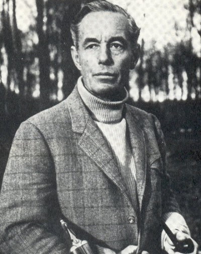
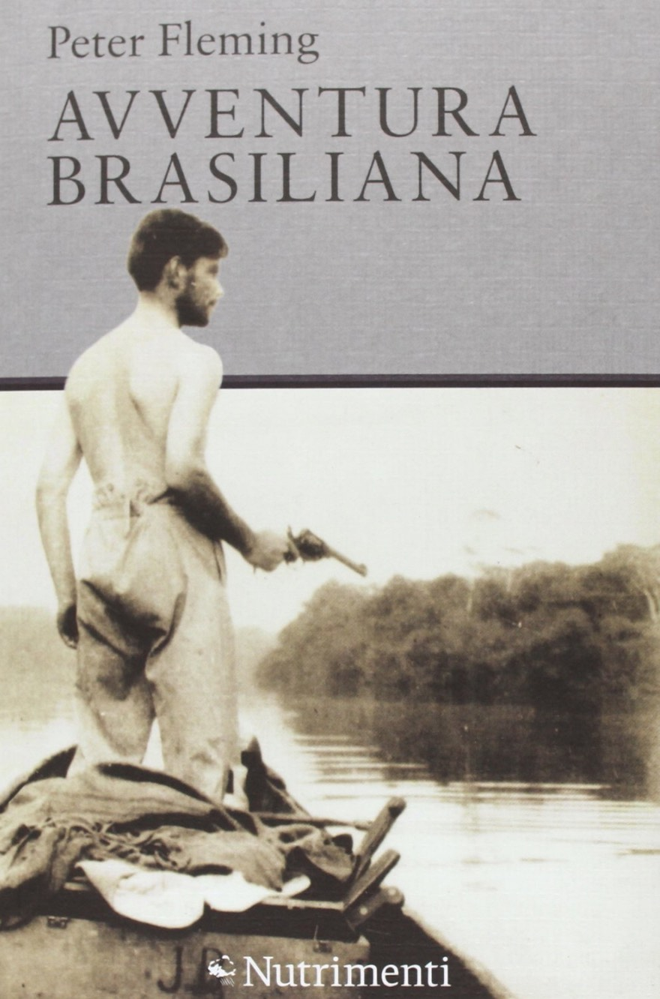

## Peter Fleming

Fratello maggiore del ben più noto Ian (autore della serie di romanzi dedicati all’agente segreto 007 James Bond), Peter Fleming (1907-1971) è stato un giornalista, scrittore, militare e agente segreto britannico.

All’età di 24 anni, leggendo gli annunci personali del quotidiano* Times, *Peter si imbatte in un annuncio improbabile:

> *Spedizione sportiva e di ricerca, guida esperta, partenza a giugno dall’Inghilterra, per esplorare fiumi Brasile centrale, possibilmente accertare sorte colonnello Fawcett; abbondanza di selvaggina, grossa e piccola; pesca eccezionale; POSTO PER ALTRI DUE CACCIATORI; ottime referenze richieste e fornite. Scrivere a Casella Postale X, The Times, East Central 4.*

La sua candidatura viene accettata e si guadagna un posto da corrispondente speciale, proprio per il *Times* da cui tutto è partito.

Questa non è che la prima delle avventure che caratterizzeranno la vita dell’autore: dopo la bizzarra spedizione brasiliana Fleming compie un lungo viaggio di 7 mesi attraverso i deserti della Cina; durante la Seconda Guerra è agente segreto della Corona attivo in Grecia, Norvegia e Sud Est asiatico; successivamente sarà un agente del MI6 a servizio di sua Maestà.

Non stupisce che il fratello Ian si ispirerà proprio a Peter Flaming per creare il personaggio di James Bond.

Muore all’età di 64 per un incidente di caccia, sua grande passione.

## Avventura Brasiliana

[Avventura Brasiliana](http://amzn.to/2jMIRJb) è lo strampalato racconto della strampalata spedizione di ricerca dello strampalato esploratore britannico Percy Fawcett, dato per scomparso nella giungla Brasiliana dal 1926.

> *Questo libro si distingue anche dalla maggior parte dei libri ambientati nell’entroterra brasiliano. Lo fa attenendosi strettamente alla verità, da capo a fondo. \[…\] Il lettore mi perdonerà, dunque, se la mia raffigurazione del Mato Grosso non quadra con le sue idee preconcette e melodrammatiche.*

Nel 1932 la spedizione parte per il Brasile con un corrispondente molto speciale: Peter Fleming.

> *Per il resto, oltre ad aver completato un viaggio di tremila miglia in una parte semisconosciuta del mondo, perlopiù in circostanze spassose, e aver scoperto un nuovo affluente dell’affluente di un affluente del Rio delle Amazzoni, non abbiamo ottenuto risultati degni di nota*

Due settimane di noioso viaggio in nave, seguite da giorni di inesorabile attesa rotti da un primo imprevisto: è scoppiata la rivoluzione paulista.

> *Nessuno di noi aveva avuto esperienze di rivoluzioni, prima d’allora; ma per quanto ne sapevamo, trovarsi in mezzo a una rivoluzione e non averne il minimo sentore fino a diciotto ore dopo che era iniziata sembrava indicare una certa mancanza di perspicacia. \[…\] Ci conveniva approfittarne il più possibile: avrebbe potuto non essercene un’altra, per quella stagione*

Mancato quasi subito il suo obiettivo primario, il viaggio si trasforma in uno sgangherato  attraversamento del Mato Grosso per raggiungere in tempo la nave per la Gran Bretagna, mosso soprattutto dall’antagonismo (nato un po’ per ripicca) nei confronti del capo spedizione, il maggiore Pingle.

## In breve

Il libro d’esordio di Fleming è considerato un classico della letteratura di viaggio del Novecento.

È quasi racconto d’avventura al rovescio: l’autore è sempre ironico nel descrivere paesaggi e situazioni “aliene”, non manca mai di sottolineare come tutto quanto risulti molto più monotono e meno pericoloso di come esposto nel tradizionale racconto di viaggio!

Per questo è un libro che consiglio ad ogni aspirante MotoViaggiatore: spesso abbiamo dei preconcetti e delle fobie che ci fanno percepire l’avventura al di fuori della nostra portata.

## Dello stesso autore

*   *[Avventura Brasiliana](http://amzn.to/2jMIRJb)* (1932 – edizione italiana del 2013) — esplorazione della giungla brasiliana alla ricerca dello scomparso colonnello Percy Fawcett
*   [*One’s Company: A Journey to China in 1933*](http://amzn.to/2jyIWTM) (1934) — viaggio attraverso la Manciuria, ristampato assieme a *Travels in Tartary*
*   [*News from Tartary: A Journey from Peking to Kashmir*](http://amzn.to/2k5z6JN) (1936) — viaggio da Pechino a Srinagar attraverso lo Xinjiang in compagnia della scrittrice Ella Maillart, ripubblicato assieme a *Travels in Tartary*
*   [*The Flying Visit*](http://amzn.to/2jaCv5F) (1940) — romanzo umoristico su un involontario viaggio di Adolf Hitler in Gran Bretagna
*   [*A Story to Tell: And Other Tales*](http://amzn.to/2japxVP) (1942) — raccolta di racconti brevi
*   [*The Sixth Column: “A Singular Tale of Our Times”*](http://amzn.to/2jpglh9) (1952) — una spy-story ambientata durante la Guerra Fredda
*   [*A Forgotten Journey*](http://amzn.to/2jprtKS) (1952) — diario che Fleming tenne durante il viaggio attraverso la Russia e la Manciuria nel 1934
*   [*My Aunt’s Rhinoceros: And Other Reflections*](http://amzn.to/2jN4Srw) (1956) — raccolta di saggi scritti per The Spectator
*   [*Operation Sea Lion*](http://amzn.to/2jaxB8G) (1957) — relazione sull’Operazione Seelöwe (del 1940)
*   [*Invasion 1940*](http://amzn.to/2iDhi8m) (1957) — relazione sui piani anti-invasione britannici durante la Seconda guerra mondiale
*   [*With the Guards to Mexico: And Other Excursions*](http://amzn.to/2iDbyM0) (1957) — raccolta di saggi scritti per The Spectator
*   [*The Gower Street Poltergeist*](http://amzn.to/2iDdJyZ) (1958) — raccolta di saggi scritti per The Spectator
*   [*The Siege at Peking*](http://amzn.to/2jMVNip) (1959) — relazione sulla Ribellione dei Boxer e l’assedio di Pechino
*   [*Bayonets to Lhasa: The First Full Account of the British Invasion of Tibet in 1904*](http://amzn.to/2iD7uez) (1961)
*   [*Goodbye to the Bombay Bowler*](http://amzn.to/2jyViel) (1961) — raccolta di saggi scritti per The Spectator
*   [*The Fate of Admiral Kolchak*](http://amzn.to/2iDgzny) (1963) — indagine su Aleksandr Vasil’evič Kolčak, comandante in capo dell’Armata Bianca che tentò di salvare la famiglia imperiale russa a Ekaterinburg nel 1918.