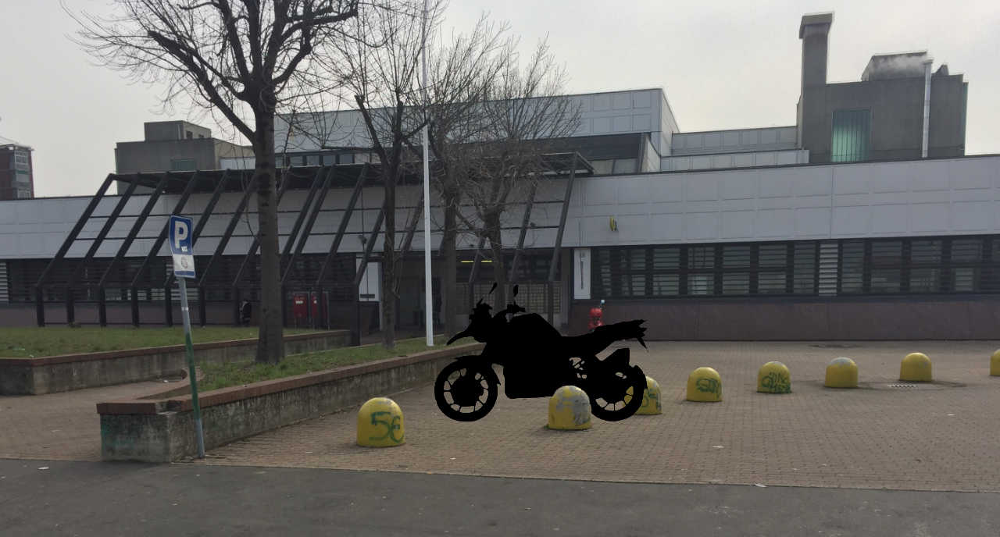
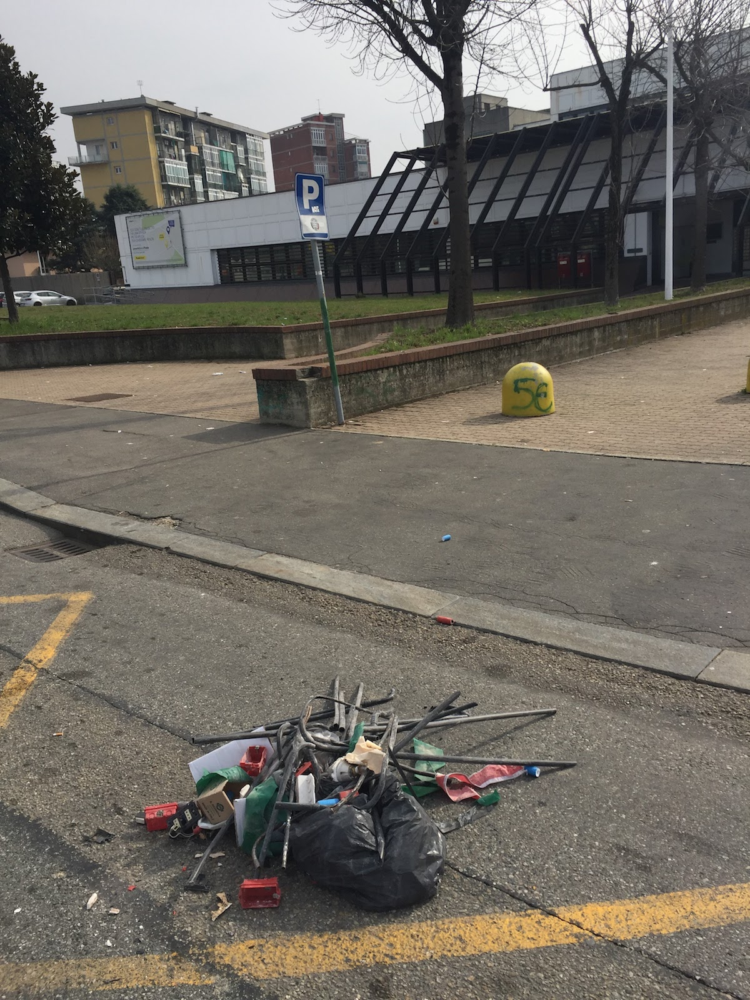

Siete mai stati vittime di un furto? Io purtroppo ci sono già passato troppe volte, ma non avrei mai immaginato che qualuno potesse avere il fegato di rubare una moto in pieno giorno, davanti ad un ufficio postale.

Fortunatamente la storia è a lieto fine… Ma andiamo con ordine!

### Il furto

Venerdì 24 febbraio ho approfittato della pausa pranzo per andare a ritirare un pacco all’ufficio postale. Purtroppo il centro raccomandate inesitate della mia zona si trova in un quartiere periferico di Torino, non proprio famoso per essere dei più tranquilli: Vallette.

Come molte altre volte, ho parcheggiato la mia BMR R1200GS proprio davanti alle finestre della sala d’aspetto, inserito il bloccasterzo e atteso il mio turno leggendo le notize dal mio smartphone.

20 minuti dopo ecco la *sorpresa*: la moto è sparita. A pochi metri c’è un mucchietto di immondizia, scarti di un impianto elettrico.

Tutto quel che ho potuto fare è chiamare il 112 per allertare la polizia e fiondarmi nell’ufficio postale, sperando che qualche telecamera abbia ripreso qualche immagine del furto. Purtroppo le registrazioni sono inaccessibili, si può soltanto tornare entro 48 ore con una denuncia e aspettare che i Carabinieri vadano a recuperare i filmati.

Realizzo la possibilità che la moto sia stata caricata su un furgone e che nell’operazione siano cadute le macerie viste sulla strada. Non ho potuto fare altro che andare a sporgere denuncia dai Carabinieri e aprire la pratica di furto con l’assicurazione per ottenere il rimborso.

Le prospettive nell’immediato non mi sono sembrate delle più rosee: aspettare per 30 giorni il ritrovamento della moto, aspettarne altri 30 per ricevere l’indennizzo decurtato del 25% di franchigia, trovare una moto sostitutiva a 52 giorni dalla partenza per il [#MaroccoInMoto](/categorie/viaggi/marocco).

Come mi sono sentito? Sconvolto e arrabbiato con me stesso per non essere stato più cauto, senza alcuna speranza di rivedere la mia R1200GS.

Così ho passato il weekend a leccarmi le ferite, cercando su tutti i siti web di usato una R1200GS che potesse sostituire la mia, ovvero un modello non più vecchio del 2008, con massimo 80.000 km, cerchi a raggi, ESA, ABS, ASC, RDC, ad un prezzo massimo di 7.500 €. Possibilmente in vendita nel Nord Ovest d’Italia.

Impossibile? Non proprio, dopo decine di email e telefonate ho trovato una gemella della mia vicino a Milano, con un gentilissimo proprietario (Remigio), che accetta di consegnarmi la moto il sabato successivo.

### Il ritrovamento

Non ancora completamente ripreso dall’accaduto, ma tranquillo per il viaggio in Marocco, ho cominciato a pensare ai preparativi per il ritiro della moto (assegno circolare, orari dei treni, controllo del meteo pericolosamente negativo per il weekend…).

Forse stavo parlavo proprio di queste cose, quando il cellulare ha preso a squillare.

Sono le 20,30 di martedì 28 febbraio. È la polizia. La moto è stata ritrovata.

YEAAAAAAH!

Mollo la cena, afferro chiavi, casco, guanti, prenoto la [Smart car2go](http://car2go.com) più vicina (a proposito, iscrizione e minuti gratis con il mio codice promozionale 15C3IT44030\_destegabry) e volo in via Campiglia angolo con via Sospello. Non molto distante da dove è stata rubata la moto.

La moto è lì, accanto ad una volante della Polizia. Quasi non posso crederci.

I poliziotti sono gentilissimi, mi chiedono di verificare che funzioni: giro la chiave, premo lo starter…

Niente. Sudo freddo.

Mannaggia allo staccamotore! Faccio scattare la levetta rossa ed ecco che il 1200 boxer si risveglia con il suo tipico rombo cupo.

Controllo danni:

*   il bloccasterzo è andato
*   il serbatoio è stato praticamente svuotato ed il tappo fozato
*   ci sono righe sul lato sinistro della moto, in particolare su [paramotore](/2016/09/paramotore-tubolare-heed-bmw-r-1200-gs/), paramani, specchietto e [cupolino WRS Touring](https://www.ebay.it/sch/i.html?_from=R40&_trksid=m570.l1313&_nkw=wrs+touring&_sacat=0)
*   la chiusura del bauletto [Kappa Garda 52](http://amzn.to/2m5nrdt) è stata forzata malamente e si apre senza bisogno di chiave
*   la [rete portabagli elastica](http://amzn.to/2mnKalS) ed il [sottocasco Tucano Urbano](http://amzn.to/2lFjxoa) che tenevo all’interno sono spariti, al loro posto trovo vari attrezzi usati per forzare le serrature
*   svanite anche le [borse laterali del paramotore HEED](https://www.ebay.it/sch/i.html?_from=R40&_trksid=m570.l1313&_nkw=borse+heed&_sacat=0), il [pronto soccorso](http://amzn.to/2mnKCR6), il [kit riparazione pneumatici](http://amzn.to/2mW71lo), i [cavi per la batteria](http://amzn.to/2mWprSO).

La moto è stata ritrovata in un garage. Gli agenti non hanno voluto spiegarmi come sono riusciti a rintracciarla. Quando faccio presente la mancanza delle borse laterali, uno di loro si avvicina all’auto d’ordinanza e comincia a chiedere ad una persona seduta all’interno dove potessero essere: ma quindi è appena successo tutto, il ladro/ricettatore/complice o non so che altro è appena stato arrestato ed è ancora qui!

I poliziotti mi fanno capire che devo stare lontano, poi mi portano a cercare le borse mancanti nel garage del misfatto.

Due piani sotto terra c’è una batteria di box auto invenduti. Qualche giorno dopo scoprirò che l’[amministratore del mio condominio](http://qubiko.com) ha l’incarico di amministrare anche questi garage, che regolarmente vengono forzati ed utilizzati dai malviventi di turno.

La mia R1200GS era là dentro, quando entro le torce elettriche della polizia illuminano uno scenario sconfortante: targhe, resti di bauletti forzati, abbigliamento anti pioggia, guanti in pelle, caschi… i rimasugli di altre moto meno fortunate della mia. Purtroppo le borse non sono tra la refurtiva.

Firmo il verbale di riconsegna e riporto la moto a casa.

### Epilogo

Sono stato molto fortunato. Pensavo di non rivedere mai più la mia BMW R1200GS.
La prudenza non è mai troppa, se usate quotidianamente la moto non posso che consigliarvi di tenerla sempre assicurata contro episodi del genere.

Non fidatevi dell’indicatore di un serbatoio svuotato a forza: mi è toccato spingere la moto fino ad un benzinaio nonostante il computer di bordo stimasse un’autonomia residua di 35 km.

Sto ancora aspettando di sapere quanto verrò rimborsato dall’assicurazione per i danni subiti a causa del furto.
Pare che per ripristinare il bloccasterzo potrebbe essere necessario cambiare il telaio della moto (!!).

Dal meccanico ho incontrato un poliziotto motociclista, da cui ho cercato di ricavare qualche informazione.

Pare che i furti vengano perpetrati caricando le moto su furgoni, oppure spaccando il bloccasterzo e guidandole grazie ad un complice che spinge con uno scooter.

Le moto vengono poi lasciate qualche giorno in un piazzale aperto per verificare che non siano installati [antifurti satellitari](https://amzn.to/2OCS3Q8). Le bande più organizzate usano jammer o furgoni schermati per bloccare il segnale GPS e GSM.

Le moto di valore vengono ritargate e vendute sul mercato dell’usato, quelle economiche smontate per i ricambi.

Se possibile, fate tesoro della mia esperienza!