<iframe style="border: none; overflow-y: hidden; background-color: white; min-width: 320px; max-width: 800px; width: 100%; height: 420px;" src="https://www.gaiagps.com/datasummary/track/83fcdfc5254f8920d6dff475e0f54372/?embed=True" width="300" height="150" scrolling="no" seamless="seamless"></iframe>

Dopo [Strada dell’Assietta](/2016/09/strada-assietta-off-road-alta-quota/) e [Col de l’Iseran](/2016/09/moncenisio-iseran-piccolo-san-bernardo/) siamo andati a provare l’*ennesima* strada più alta d’Europa… In effetti questa strada bianca a pagamento permette di portare *quasi* qualunque mezzo alla quota di 3000 metri sul mare.

<strong>Nota:</strong> il Colle del Sommeiller si trova alla quota di 2993 o 3009 metri a seconda dell’interpretazione… noi non faremo i pignoli e scriveremo 3000 m. Lasciamo al lettore il compito di tornare sul posto per misurare esattamente la quota.

Per *“quasi qualunque mezzo”* si intendono moto e auto non particolarmente basse, ma senza essere mezzi dedicati all’off-road: in punta alla strada c’era addirittura una Vespa targata Lussemburgo.

## La Strada ed il Colle del Sommeiller

Il Colle prende il nome da Germain Sommeiller, direttore dei lavori del traforo ferroviario del Frejus. È posto sul confine italo-francese ed è raggiungibile in moto soltanto dal versante Italiano.

La Strada Panoramica Bardonecchia-Sommeiller è stata inaugurata nell’estate del 1965 per raggiungere il Rifugio Ambin ed i due impianti di risalita per lo sci estivo. Il ghiacciaio si è progressivamente ritirato fino quasi a sparire, così nel 1984 gli impianti sono stati abbandonati.

Da oltre 50 anni il Colle del Sommeiller è meta finale dell’[incontro internazionale motociclistico Raid Stella Alpina](https://www.facebook.com/Motoradunobardonecchia/). La manifestazione dura 3 giorni e si tiene il secondo week-end di luglio, viene aperto un varco nella neve per l’occasione.

Oggi il ghiacciaio è praticamente sparito, i resti fatiscenti degli impianti sono stati smantellati. Al loro posto un laghetto glaciale ed un ampio parcheggio alla fine della strada.

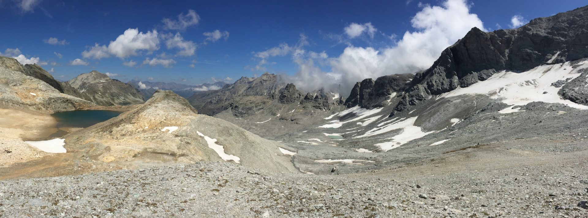

## Torino – Bardonecchia

Partiamo da Torino alle 8 del mattino con breve sosta per fare il pieno, la benzina basterà per tutta la giornata (sono meno di 250 km tra andata e ritorno). Come al solito ci fermiamo al [Panificio Favro di Susa](https://www.google.com/maps/place/PANIFICIO+FAVRO+DAL+1870/@45.1365641,7.0616441,15z/data=!4m2!3m1!1s0x0:0x39a116982e7fa821) per comprare panini farciti al momento (al colle non sono presenti punti di ristoro) e la squisita focaccia dolce di Susa! Attenzione: chiude la domenica.

Poco dopo la SS24 del Monginevro smette di correre sul fondo valle e si trasforma in una bella strada di montagna con una serie di ampi tornanti tra Susa e Gravere. Nella maggior parte dei centri abitati attraversati sono presenti semafori che diventano rossi al superamento del limite di velocità.

In alternativa è possibile percorrere tutta l’autostrada A32 Torino-Bardonecchia, stando attenti a non entrare nel traforo del Frejus!

## Bardonecchia – Rifugio Scarfiotti

Arrivati a Bardonecchia **sgonfiamo gli pneumatici per avere più grip** sul fondo sterrato. Seguendo le indicazioni per Rochemolles la statale si stringe, fino a diventare un piccolo nastro di asfalto nel bosco.

Poco dopo la piccola frazione di Rochemolles inizia lo sterrato: il fondo è di terra compatta, coperto da un po’ di pietrisco. Ogni tanto la strada è attraversata da canali per lo scolo dell’acqua piuttosto accentuati, se presi *allegramente* fanno saltare la moto: scopro che la R1200GS non è particolarmente adatta a volare, il baricentro è molto spostato sull’anteriore.

Superati i primi tornanti immersi nel bosco si arriva alla diga e lago di Rochemolles (quota 1974 m). Il livello dell’acqua è piuttosto basso, l’estate dev’essere stata molto secca anche da queste parti. Senza la protezione degli alberi la strada viene arsa dal sole, **le moto alzano polveroni** che ci costringono a rallentare parecchio per non riempire di terra i numerosi escursionisti che incrociamo.

Proseguiamo fino al bivio per il Rifugio Scarfiotti: qui è posta una casetta dove pagare il *pedaggio* per proseguire sulla Strada del Sommeiller. Optiamo per rimandare il pagamento prendendo la strada a sinistra, dopo una discesa leggera attraversiamo un piccolo guado sul Torrente di Rochemolles ed eccoci al rifugio per una meritata pausa caffè.

Il Rifugio Scarfiotti (quota 2165 m) è situato al fondo del Pian du Fond, incastonato in un anfiteatro di montagne a picco. Dal bastione di roccia dietro il rifugio scende un’imponente cascata che si forma dall’unione del Rio della Balma ed il Rio di Fond. È un luogo ideale per passare qualche ora a rilassarsi e prendere il sole. Infatti troviamo molti ciclisti a riposarsi e fare scorta d’acqua alla fontana.

Da qui parte un itinerario geologico ad anello che permette di scoprire le particolari rocce della zona in 4 ore di camminata. Soprassediamo e montiamo in sella.

## Rifugio Scarfiotti – Colle dell’Assietta

Attraversiamo nuovamente il guado e ci fermiamo al *casello* per versare l’obolo di €5 al Comune di Bardonecchia. Iniziamo la scalata con stretti tornanti circondati da cespugli di rododendri ed un panorama mozzafiato, fermandoci molte volte per fotografare la cascata ed il vallone del rifugio Scarfiotti.

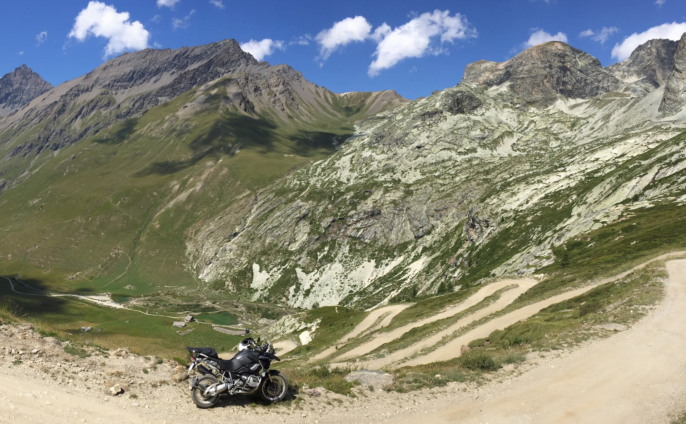

Dopo una quindicina di tornanti arriviamo al Pian dei Morti (quota 2290 m), il torrente scorre di nuovo vicino alla strada. Altri 5 tornanti fanno salire di quota fino ai 2676 m del Pian dei Frati. Qui troviamo un guado più profondo e largo rispetto al precedente, aggirabile tramite un ponticello in legno. Ovviamente opto per attraversare il Rio di Fond mettendo le ruote a bagno, approfittandone per dare una sciaquata alla [Xiaomi Yi](/2017/01/xiaomi-yi-action-camera-video-hd-al-prezzo-giusto/ "Recensione Xiaomi Yi") coperta di polvere.

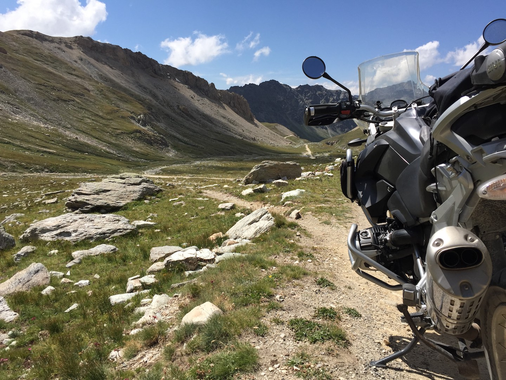

La valle glaciale termina e con questa i prati: davanti a noi la strada si inerpica su una ripida pietraia attraverso stretti tornanti. Qui troviamo il fondo stradale peggiore, con ghiaia e pietroni per tutti e 10 i tornanti della strada: la guida diventa più faticosa e andrebbe affrontata in piedi per evitare di sollecitare troppo le sospensioni.

La fatica è ricompensata dal paesaggio meraviglioso, con la scusa ci fermiamo in tutti i tornanti che svoltano a destra per fare qualche foto e ammirare la strada che si snoda sinuosamente sotto di noi. A 2800 m c’è il breve Piano Patarè, un po’ di neve resiste a bordo strada e il fondo migliora leggermente.

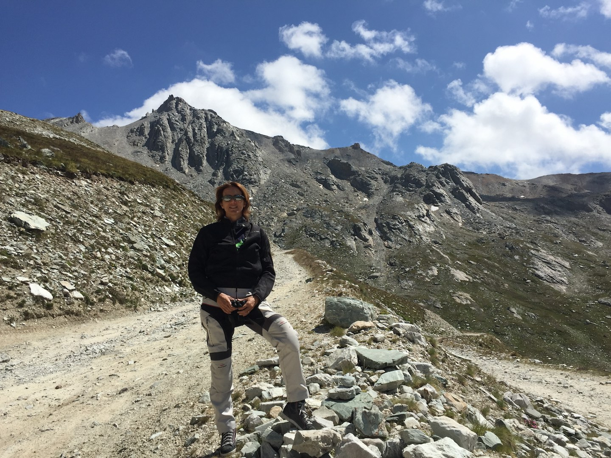

Gli ultimi tornanti ci portano alla quota finale, **eccoci ai 3000 m del Colle del Sommeiller!**

Il colle vero e proprio non è accessibile con la moto, che va lasciata al parcheggio (quota 2991 m). Qualche 4×4 si spinge oltre e vediamo diverse tracce lasciate da pneumatici enduro… la recinzione di legno è posticcia, un deterrente poco efficace.

Noi parcheggiamo dove richiesto e avanziamo a piedi seguendo il piccolo sentiero che sulla destra porta al punto panoramico (3033 m). Da qui si ammira il panorama sui versanti italiano e francese del colle, circondati dai picchi della Punta Sommeiller (3332 m), Rocca d’Ambin (3378 m) e della Rognosa d’Etiache (3382 m).

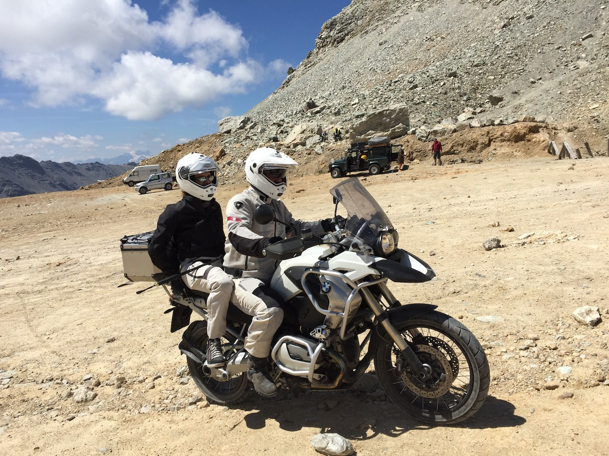
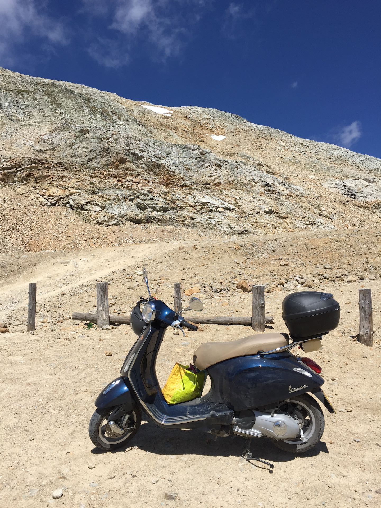
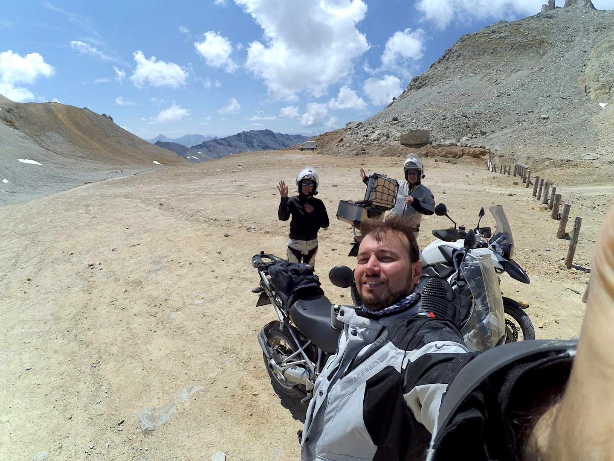
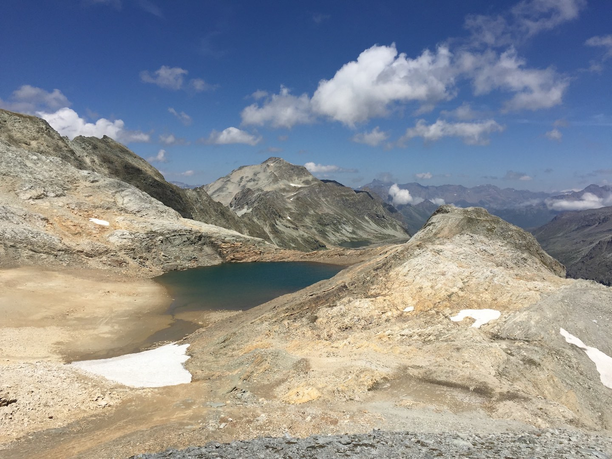
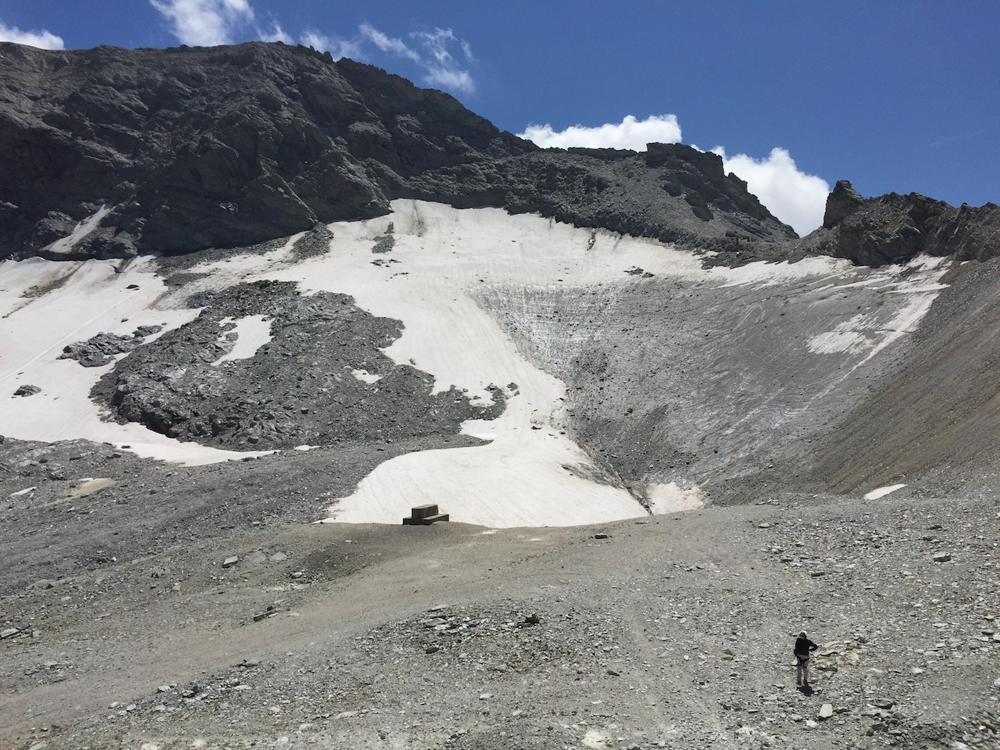

Scendiamo al lago camminando sul nevaio, misero rimasuglio del ghiacciaio su cui un tempo si poteva sciare nei mesi estivi. Pranziamo al sacco sulle rive del lago: la conca in cui è adagiato ci protegge dal vento, nonostante i 12°C di temperatura il sole ci scalda e possiamo stare in T-Shirt… e che T-Shirt! Che ve ne pare delle magliette ufficiali MotoViaggiatori?

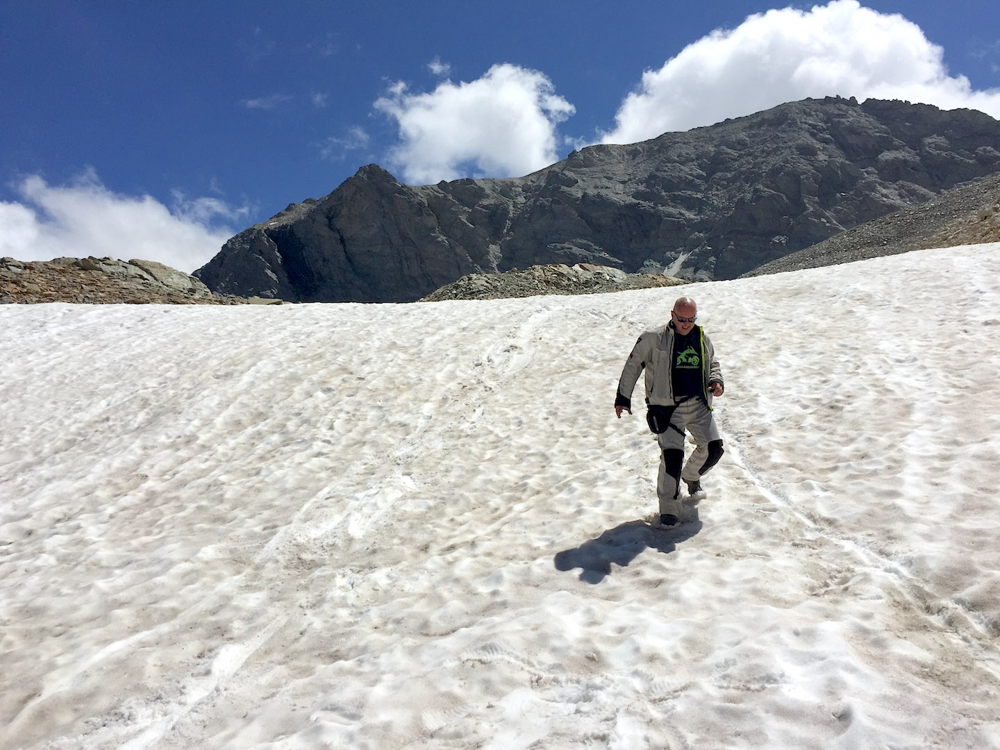
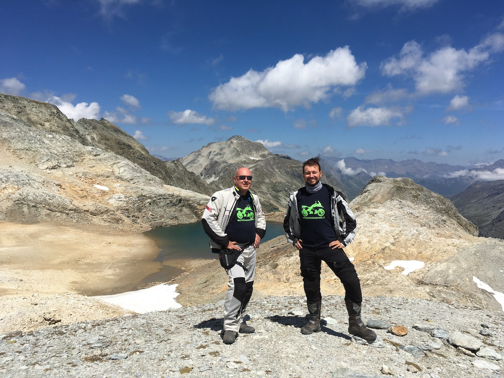

Portatevi la crema solare!

Il ritorno si fa per forza sulla stessa strada dell’andata: il Colle del Sommeiller è raggiungibile soltanto dal versante italiano e non c’è modo di proseguire in Francia.

Scendendo *taglio* un paio di tornanti sui sentieri single track che abbondando prima del Pian dei Frati e scopro che i canali di scolo si prestano meglio ai salti rispetto alla salita.

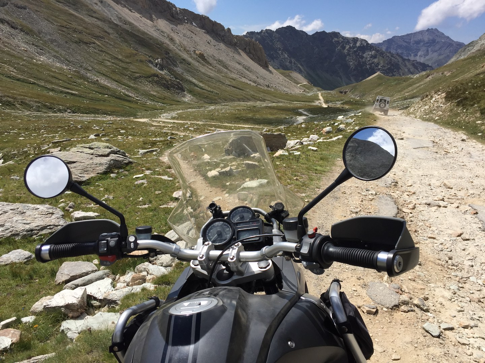
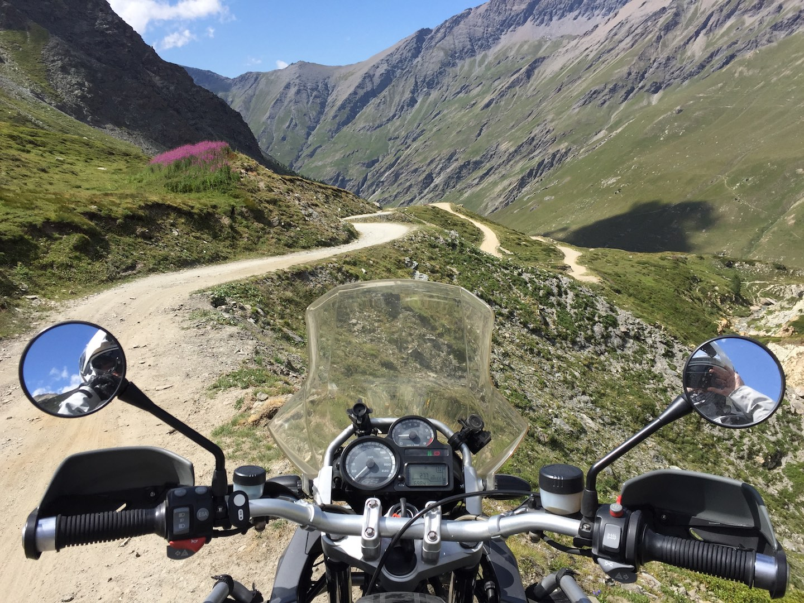
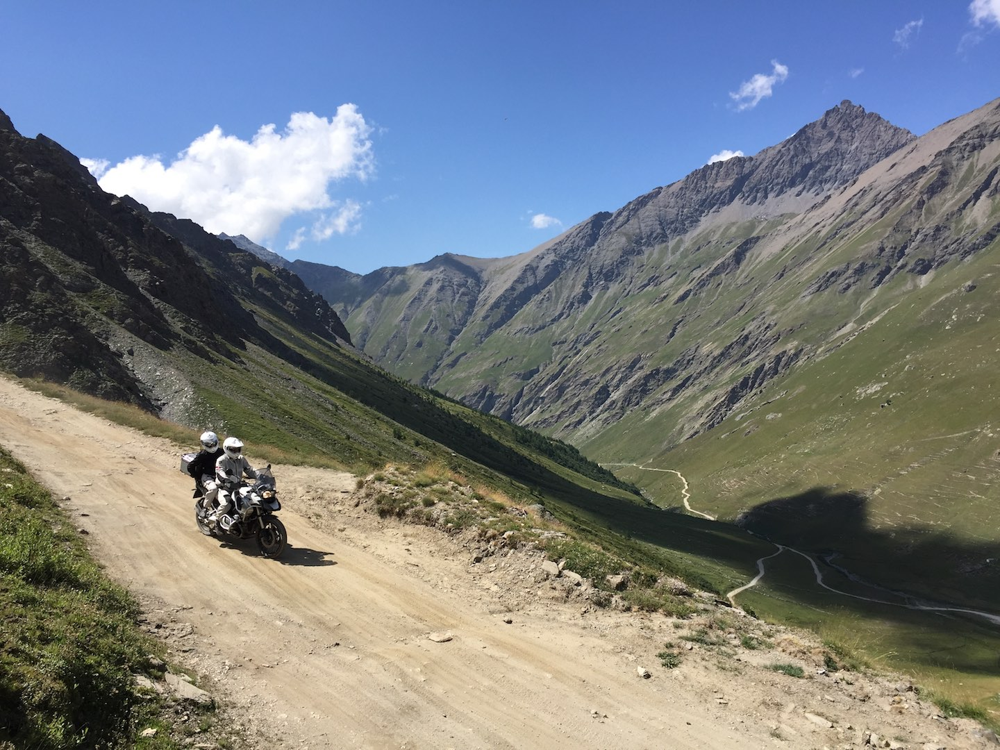

Ci fermiamo al rifugio Scarfiotti per un caffè (non male) e poi a Bardonecchia per mangiare un gelato alla pasticceria Ugetti, che sconsigliamo: gelato caro e per nulla buono! Meglio tenersi la voglia fino all’[agrigelateria di Villar Focchiardo](https://www.google.it/maps/place/Azienda+agricola+Re+Piera/@45.1173697,7.2322836,17z/data=!3m1!4b1!4m5!3m4!1s0x47884bb0761d912b:0xcc7a9de5fd1a461!8m2!3d45.1173697!4d7.2344776), oltre al gelato è possibile acquistare formaggi prodotti in loco.

## Informazioni pratiche

La Strada del Sommeiller è percorribile senza limitazioni fino al Rifugio Scarfiotti, dopodichè è possibile proseguire (salvo neve) nel periodo 1 maggio – 30 novembre. Tra il 15 luglio ed il 30 agosto la strada è **chiusa tutti i giovedì**, negli altri giorni è aprta **dalle 9 alle 17 con pagamento di €5** a moto.

Il limite massimo di velocità è fissato a 20 km/h per tutto il percorso, si deve rallentare ulteriormente quando si incrociano escursionisti per evitare di sollevare polvere. Nonostante il buono stato della strada si raccomanda cautela: il transito avviene a proprio rischio e pericolo tenendo a mente la propria responsabilità per danni procurati a sé stesso, cose e persone.

Il percorso è praticabile con qualunque moto, anche se per divertirsi davvero servono gomme tassellate e sospensioni con escursione adeguata.
Ci siamo comunque trovati bene con le nostre R1200GS gommate [Pirelli Scorpion Trail 2](http://rover.ebay.com/rover/1/724-53478-19255-0/1?icep_ff3=10&pub=5575226208&toolid=10001&campid=5337960068&customid=&icep_uq=Pirelli+Scorpion+Trail+2&icep_sellerId=&icep_ex_kw=&icep_sortBy=12&icep_catId=&icep_minPrice=&icep_maxPrice=&ipn=psmain&icep_vectorid=229494&kwid=902099&mtid=824&kw=lg) e [Dunlop TrailSmart](http://rover.ebay.com/rover/1/724-53478-19255-0/1?icep_ff3=10&pub=5575226208&toolid=10001&campid=5337960068&customid=&icep_uq=Dunlop+TrailSmart&icep_sellerId=&icep_ex_kw=&icep_sortBy=12&icep_catId=&icep_minPrice=&icep_maxPrice=&ipn=psmain&icep_vectorid=229494&kwid=902099&mtid=824&kw=lg).
