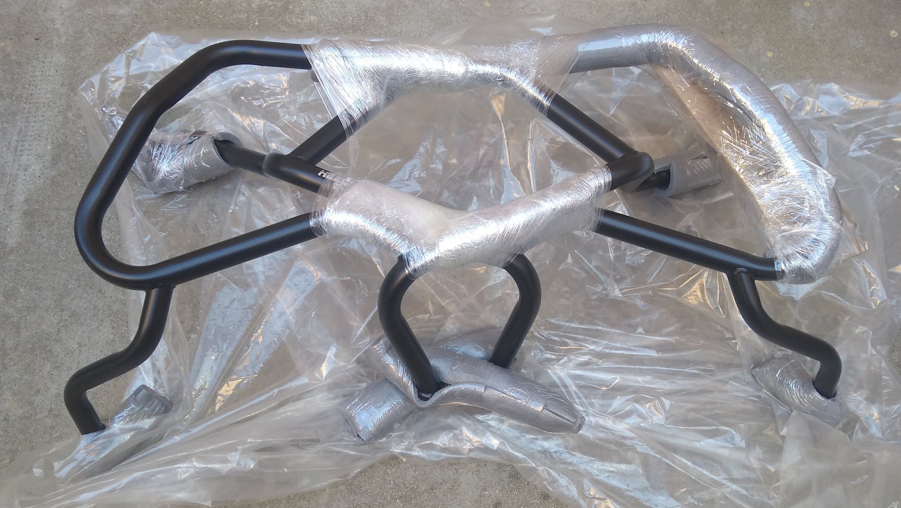
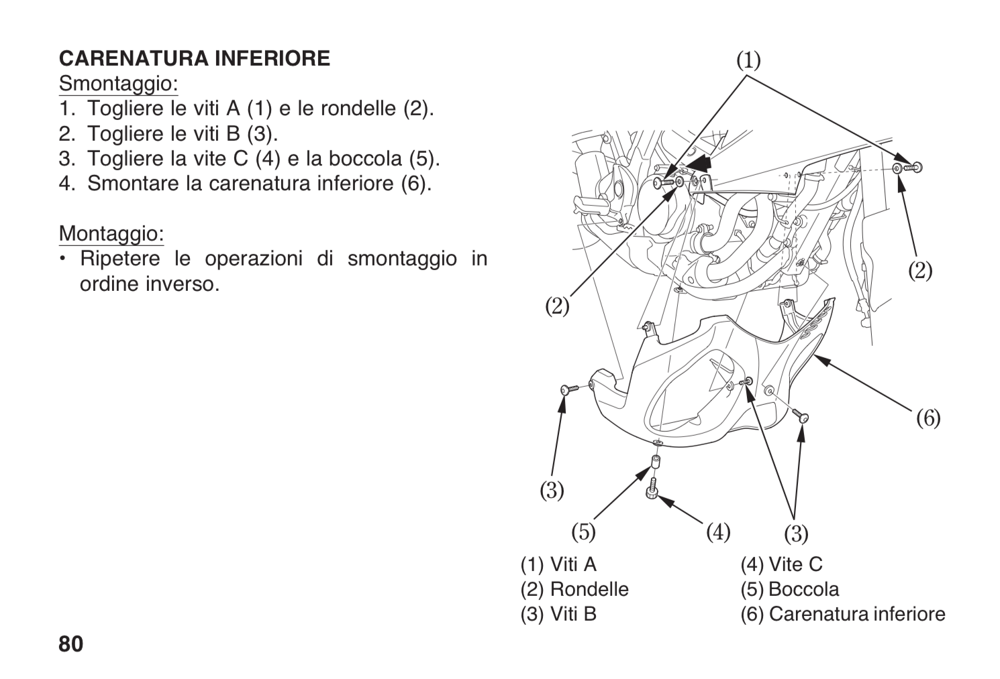
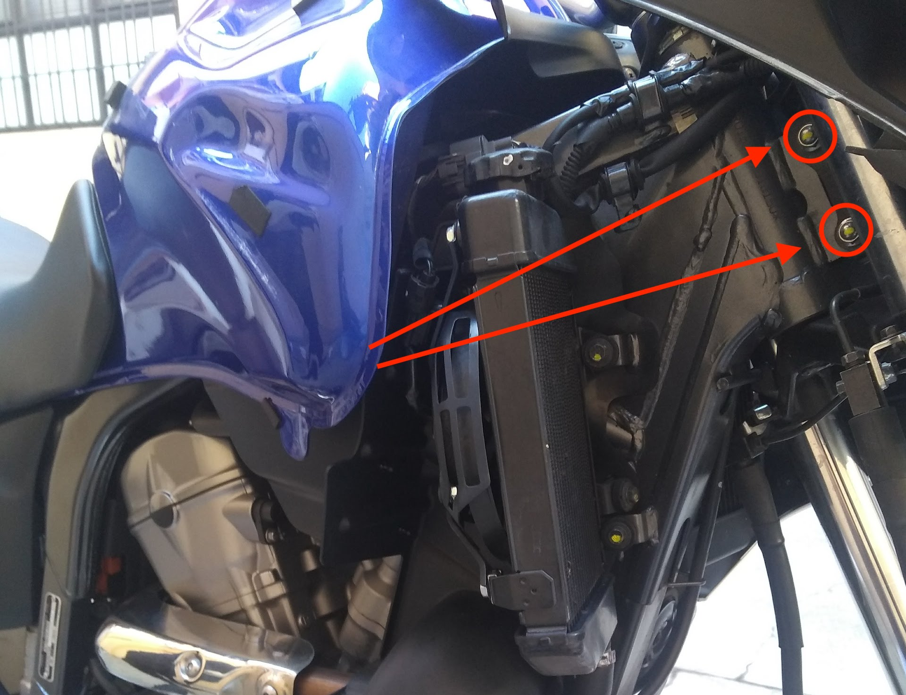
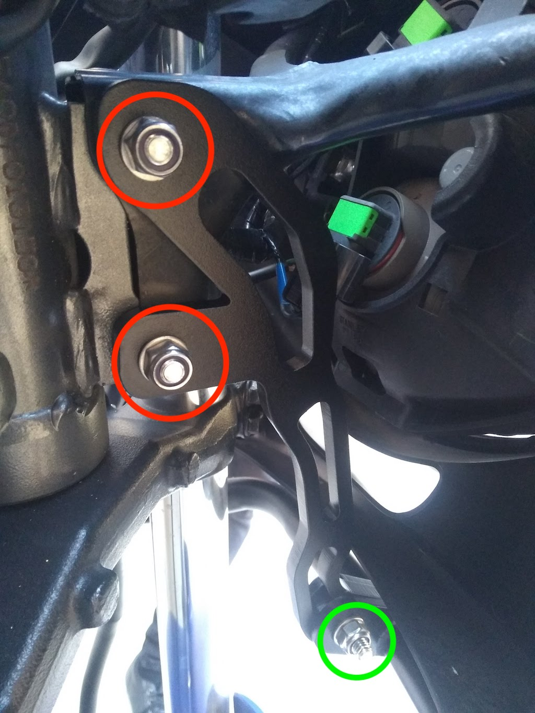
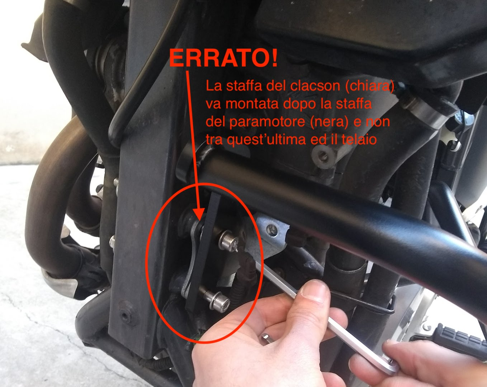

Da pochi giorni il team MotoViaggiatori si è allargato, una Honda Transalp del 2012 è quasi pronta a partire per un nuovo viaggio primaverile! Prima di mettere le ruote fuori strada abbiamo deciso di aggiungere [la protezione già collaudata sulle 2 BMW R1200GS](/2016/09/paramotore-tubolare-heed-bmw-r-1200-gs/).

## Paramotore HEED Honda XL 700 Transalp (08-15)

L’ultima incarnazione della mitica Honda Transalp ripropone il classico motore Honda a V ben protetto dalla carenatura della moto. Allora perché montare un paramotore tubolare? In effetti le [protezioni tubolari HEED](http://amzn.to/2H9B8kd) (156€) servono soprattutto a proteggere la carenatura in caso di caduta, oltre ad offrire un buon punto di ancoraggio per le ottime [borse impermeabili in tessuto](https://www.ebay.it/sch/i.html?_odkw=heed+transalp+700&_osacat=0&_from=R40&_trksid=m570.l1313&_nkw=heed+transalp+700+borse&_sacat=0) (50€ la coppia) sempre offerte dalla polacca HEED.

Le barre vengono prodotte utilizzando macchinari CNC per la piegatura e tagliate con il laser; saldatura TIG e verniciatura a polvere completano un prodotto dall’ottimo rapporto qualità/prezzo.

Riverniciare o sostituire le carene ha un costo ben superiore a quello del [kit barre tubolari comprensivo di borse](https://www.ebay.it/sch/i.html?_odkw=heed+transalp+700&_osacat=0&_from=R40&_trksid=m570.l1313&_nkw=heed+transalp+700+borse&_sacat=0) (meno di 180€). Il paramotore allarga leggermente la moto senza essere troppo intrusivo, oltre a proteggere maggiormente i carter del cambio.

La spedizione è davvero veloce, dopo aver effettuato l’acquisto sul [negozio eBay HEED ufficiale](https://www.ebay.it/usr/heed_heed) e pagato in totale sicurezza con PayPal, ho ricevuto il codice di tracking GLS: in soli 3 giorni il pacco è arrivato direttamente dalla fabbrica situata in Polonia.

## Informazioni per il montaggio

Purtroppo le istruzioni fornite da HEED sono molto sintetiche e sospetto che siano state tradotte dal polacco con Google Translate. Dopo aver sbagliato almeno 3 volte, siamo qui a spiegare per bene come montarle correttamente ed in poco tempo!

Il montaggio è un’operazione a portata di chiunque, si può tranquillamente effettuare da soli. Non servono attrezzi particolari:

*   [cacciavite a stella medio](http://amzn.to/2Hb0mys)
*   [chiavi fisse da 12 e 13](http://amzn.to/2o2H85t) (meglio averne una coppia per ogni misura)
*   [chiavi esagonali da 5 e 6](http://amzn.to/2EDFth5)

Consigliamo l’acquisto di un [set di inserti con chiavi a bussola](http://amzn.to/2nV4Ml4): velocizza e semplifica le operazioni, oltre ad essere più economico rispetto alle singole chiavi.

Cominciamo smontando le carenature destra, sinistra e inferiore, come illustrato a pagina 79 e 80 del [libretto di uso e manutenzione ufficiale](http://www.hondaitalia.com/pdf/manuali/2010YM/Transalp.pdf).

A questo punto bisogna rimuovere le 2 viti situate sul canotto dello sterzo che reggono faro anteriore e quadro strumenti, sostituendole con le viti in dotazione più lunghe per fissare la staffa di collegamento anteriore. Si tratta di un braccio sagomato che passa sotto il faro della moto e permette l’ancoraggio delle barre tubolari.

**Attenzione**: la staffa deve essere ancorata sul lato destro della moto.

Ora possiamo rimontare le carene laterali, seguendo a ritroso i passi del manuale Honda.

Per fissare solidamente le barre paramotore alla moto, è necessario rimuovere le due viti che sostengono il supporto carene e clacson.
Si svitano utilizzando due chiavi fisse da 12mm, ma prima di rimuoverle completamente bisogna sfilare i 2 connettori faston del clacson (situato sul lato sinistro della moto) prestando attenzione a non farlo cadere.

Finalmente possiamo assemblare le barre laterali: iniziamo collegando la parte sinistra del paramotore al montante centrale del telaio della moto (punto 1 della prima foto) cercando di avvitare le due viti simmetricamente e **non stringendole troppo**; a questo punto possiamo collegare il paramotore alla staffa anteriore montata precedentemente (punto 2 della prima foto).

Ripetiamo le due operazioni per i tubolari del lato destro, facendo attenzione a non schiacciare il cavo della sonda lambda tra il collare del paramotore ed il montante centrale del telaio.

Inseriamo le 2 viti in dotazione sulla staffa del clacson ed avvitiamo il tutto sui fori dei supporti carene (punto 3 della prima foto), reinseriamo i faston del clacson.

**Attenzione**: la staffa del clacson deve essere a tra la staffa del paramotore e la testa della vite, altrimenti non sarà possibile rimontarla! Prima di proseguire verificare il funzionamento del clacson.

, poi avvitando la staffa anteriore (2) ed infine i supporti carene ed il clacson (3)")

Serriamo saldamente tutte le viti, rimontiamo la carena inferiore, piazziamo le borse laterali… e siamo pronti per il prossimo viaggio!

## Considerazioni e prodotti alternativi

Abbiamo montato le [barre paramotore HEED](https://www.ebay.it/sch/i.html?_odkw=heed+transalp+700&_osacat=0&_from=R40&_trksid=m570.l1313&_nkw=heed+transalp+700+borse&_sacat=0) da pochi giorni, ma possiamo già fare qualche considerazione:

*   completano il look adventure della Honda XL 700 Transalp
*   sembrano molto solide, quelle [testate su BMW R1200GS](/2016/09/paramotore-tubolare-heed-bmw-r-1200-gs/) hanno salvato i paracilindri ben 3 volte
*   le borse laterali sono di ottima fattura e sono l’ideale per trasportare un [kit di pronto](http://amzn.to/2nUFRye) soccorso e le camere d’aria di scorta, ma non contate sull’impermeabilità dato che le cerniere sono di tipo tradizionale
*   la verniciatura è ben fatta, ma si fa in fretta ad intaccarla

HEED produce [barre paramotore per tutte le serie di Honda Transalp](https://www.ebay.it/sch/i.html?_odkw=paramotore+heed+transalp&_osacat=0&_from=R40&_trksid=p2045573.m570.l1313.TR0.TRC0.H0.Xparamotore+heed+honda+xl+transalp.TRS0&_nkw=paramotore+heed+honda+xl+transalp&_sacat=0).

In alternative a quelle montate da noi, sono disponibili

*   [PM Company](http://amzn.to/2nVjhW2): leggermente più economiche ma meno protettive, non permettono di montare borse
*   [Givi TN455](https://www.ebay.it/sch/i.html?_odkw=paramotore+honda+transalp+700&_osacat=0&_from=R40&_trksid=p2045573.m570.l1313.TR0.TRC0.H0.Xparamotore+honda+transalp+700+tn455.TRS0&_nkw=paramotore+honda+transalp+700+tn455&_sacat=0): prezzo simile, Made in Italy, purtroppo non permettono di montare borse
*   [SW Motech](http://amzn.to/2CfERct): un po’ più care, anche qui niente borse da serbatoio

Il nostro verdetto è ovviamente a favore delle crash bar HEED, [comprale su Amazon](http://amzn.to/2o5MAVt) oppure su [su eBay con il kit borse laterali](https://www.ebay.it/sch/i.html?_odkw=heed+transalp+700&_osacat=0&_from=R40&_trksid=m570.l1313&_nkw=heed+transalp+700+borse&_sacat=0).