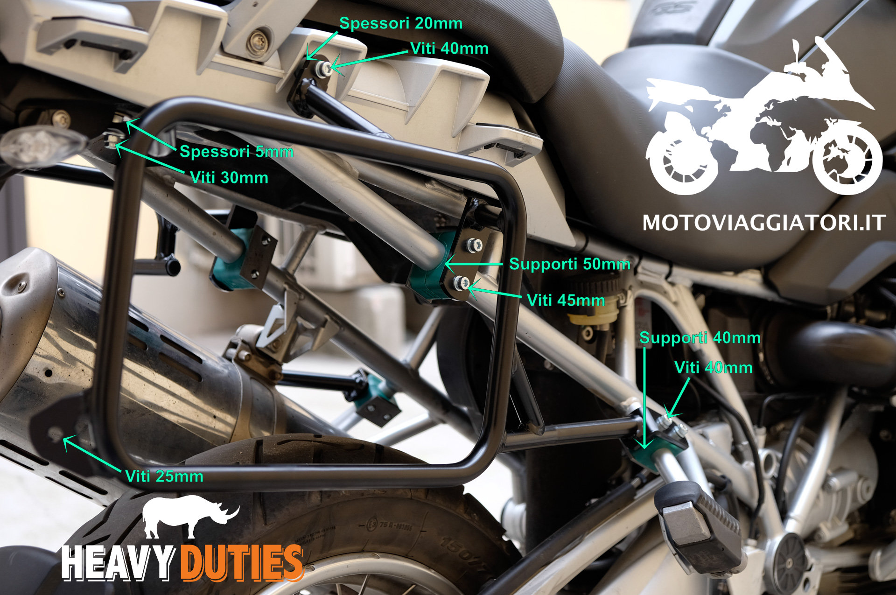

**Nota**: questo articolo è stato aggiornato il 18/05/2018 per aggiungere informazioni sul nuovo sito con e-commerce.

## Heavy Duties?

Heavy Duties è un’azienda nata in Romania dalla passione per il viaggio avventura su due ruote: dal 2007 [realizza prodotti testati in prima persona](https://heavyduties.ro/ourstory/) dai fondatori della società.

Oltre a valigie laterali in alluminio e relativi telai, Heavy Duties produce barre paramotore, cavalletti centrali, portapacchi, riser manubrio e [accessori vari](http://www.heavyduties.ro/accessories/).

In questo articolo mi soffermo sulla versione per BMW R1200GS 2004-12, ma esistono telai e borse adatti a tutte le principali super-enduro in circolazione… elencarle qui sarebbe inutile e rischierei di dimenticarne qualcuna, andate direttamente sul [sito ufficiale per scoprire modelli, accessori e prezzi.](http://heavyduties.ro/)

### Acquisto e spedizione

Le valigie laterali e tutti gli accessori si comprano direttamente dal sito Heavy Duties, una volta piazzato l’ordine Heavy Duties mi ha contattato per pianificare pagamento e spedizione.

È **possibile pagare con bonifico bancario o PayPal**, la spedizione avviene tramite il trasportatore Atlassib con [ritiro in agenzia](http://www.atlassib.it/agenzie/) (38€) o consegna a domicilio (72€).

Ho acquistato la [coppia di valigie HD panniers](http://www.heavyduties.ro/panniers/) da **40/48 litri nere con doppia cerniera** (la borsa sinistra è sagomata per via del passaggio della marmitta) con rivestimento interno in polietilene e protezioni extra in plastica sui bordi, telaio specifico per la mia moto, per un **totale di 620€ + spedizione**.

Ho pagato con bonifico e scelto di ritirare in agenzia: dopo circa 48h un SMS mi ha avvisato della possibilità di ritirare i 2 colli (una scatola per le valigie ed una per il telaio). L’imballaggio è molto curato, dubito che il trasporto possa danneggiare i prodotti.

### Montaggio e dettagli

Il montaggio del telaio sulla moto è piuttosto rapido e le istruzioni fotografiche inviate da Heavy Duties spiegano bene i passi da seguire per assemblare il tutto: unica pecca, non è chiarissimo dove usare alcune viti e spessori (nella fotogallery qui sotto cerco di sopperire a questa mancanza).

Montate le parti lasciando le viti molto lasche, una volta assemblato il tutto procedete al serraggio finale simmetricamente.

Le Heavy Duties si montano sul telaio mediante un sistema di attacchi solidali alle borse: in questo modo la linea della moto rimane abbastanza pulita quando si viaggia senza valigie laterali (al contrario dei telai Givi che hanno un sacco di protuberanze antiestetiche). Il fissaggio viene completato avvitando due pomelli situati all’interno di ogni valigia, non è quindi necessario utilizzare attrezzi particolari per rimuovere le borse dalla moto.

Una volta montate entrambe le valigie, la **larghezza totale della moto è di 94cm** abbondantemente sotto il limite consentito dalla legge (100cm) e decisamente meno di quanto accade con il sistema Touratech (103cm). Il manubrio della R1200GS è largo 90cm, per cui non bisogna fare troppa attenzione alla larghezza aggiuntiva.

La borse in versione BMW R1200GS 2004-12 (non LC) pesano circa 6kg e hanno una capienza di **48 litri per la valigia destra e di 40 litri per la sinistra**. Le dimensioni interne sono 47cm (larghezza) 24cm (profondità)  36cm + 6cm (altezza valigia + coperchio). La valigia con lo scasso marmitta è profonda 15,5cm nel punto più stretto.

Il coperchio in alluminio può essere dotato di chiusura a serratura doppia, oppure serratura singola e cerniera: io ho optato per la doppia serratura con la **possibilità di rimuovere completamente il coperchio**. Una singola chiave è in grado di aprire tutte le serrature.

L’interno delle valigie è foderato con uno strato di polietilene che protegge gli oggetti dagli urti contro le pareti di **alluminio spesso 2mm**; una guarnizione in gomma garantisce una chiusura perfetta del coperchio.

Esternamente la valigia è dotata di protezioni in plastica sugli spigoli, logo Heavy Duties in bassorilievo, adesivi catarifrangenti e passanti per il fissaggio di ganci o cinghie. Ho scelto di aggiungere delle protezioni extra in plastica sui bordi, per un totale di 30€.

Sono disponibili una coppia di maniglie in tessuto (26€ la coppia).

### Considerazioni finali

Consiglio a tutti di comprare le valigie laterali in alluminio Heavy Duties: non hanno nulla da invidiare alla concorrenza nonostante il prezzo più basso del mercato!

Se come me possedete una coppia di valigie BMW Vario potrete venderle sul mercato dell’usato (Subito.it o Kijiji) e comprare le Heavy Duties aggiungendo una differenza minima.

#### Punti di forza

- prezzo basso (meno di 600€ per il modello in alluminio non verniciato senza accessori con telaio specifico R1200GS spedite in agenzia Atlassib)
- ottima qualità costruttiva
- telaio discreto e senza sporgenze (al contrario del telaio Givi)
- larghezza complessiva della moto di soli 94cm
- capienza totale 88 litri contro i 78 delle Vario

#### Migliorabile

- serrature che agiscono da cerniera quando sono chiuse (come le [Givi Trekker Outback](https://www.ebay.it/sch/i.html?_nkw=givi+trekker+outback+bmw))
- possibilità di sostituire i pomelli interni con viti a testa piatta per guadagnare spazio interno (al costo di usare una chiave per smontare le valigie)

#### Cosa manca

- un bauletto Heavy Duties in linea con le borse (e soprattutto con la stessa chiave)
- [cassetta porta attrezzi](https://amzn.to/2GQrPsN) da montare sul telaio dal lato senza marmitta
- borse interne di misura

**Nota**: questo articolo è stato aggiornato il 18/05/2018 per aggiungere informazioni sul nuovo sito con e-commerce.
