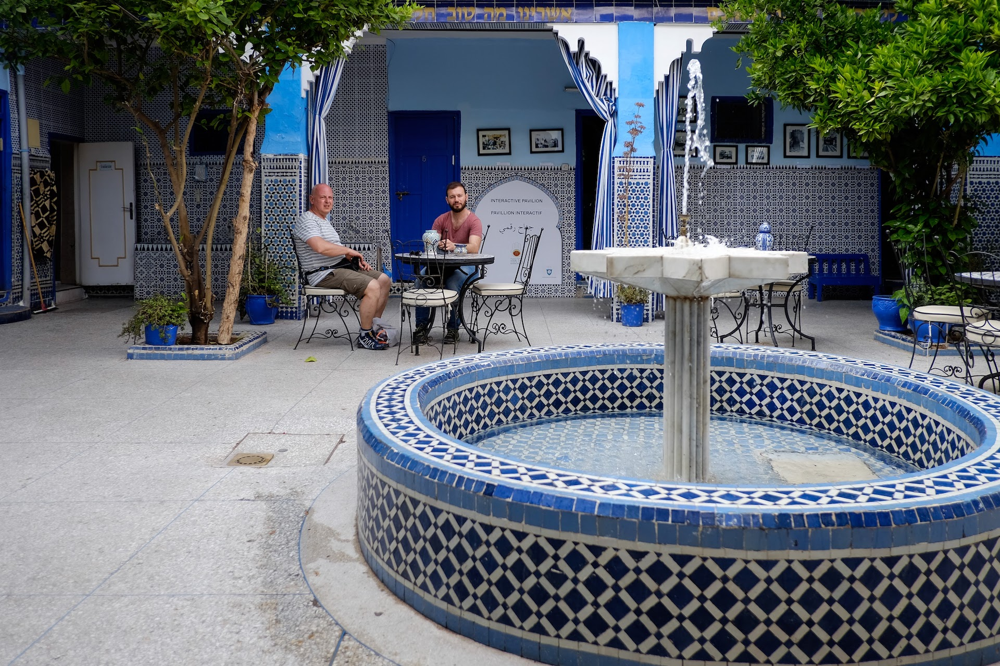
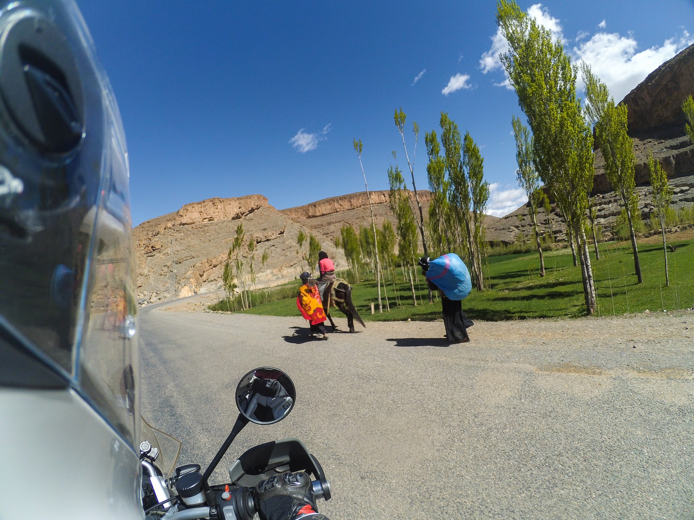

## Giorno 2: esplorando Marrakech

Dopo l’incredibile [attraversamento della medina in moto](/2017/12/marocco-moto-medina-marrakech/) del giorno prima, decidiamo di lasciar riposare le BMW R 1200 GS nel parcheggio poco distante la centralissima piazza **Jemaa el-Fna**, patrimonio UNESCO e vero cuore pulsante di Marrakech: è proprio da qui che ieri sera abbiamo iniziato la visita della città.

Al tramontare del sole la piazza si popola di luci, profumi e colori; centinaia di bancarelle vendono prodotti da ogni regione del Marocco e la tentazione di assaggiare tutto quel che vediamo è forte. Veniamo avvicinati da venditori ambulanti, guide abusive ed un sacco di loschi figuri che cercano a tutti i costi di farci pagare qualche spicciolo per una foto con un serpente a sonagli o una bertuccia. Li evitiamo senza esitare, e vi consigliamo di fare altrettanto: questi animali muoiono nel giro di pochi giorni a causa delle cattive condizioni in cui vengono tenuti, il modo più semplice per fermare questa crudeltà è smettere di pagare per una foto ricordo di dubbio gusto.

Ceniamo in uno dei tanti ristoranti che si affacciano sulla piazza, godendo del magnifico spettacolo che il brulicare di questo enorme mercato offre da secoli ai viaggiatori che hanno la fortuna di posarvi gli occhi.

Il mattino successivo ci svegliamo di buon’ora per visitare come si deve la città, ma scopriamo che il souk degli artigiani alle 9 del mattino è ancora deserto. Ci spostiamo alla **Madrasa Ben Youssef**, antica scuola coranica fondata nel XIV secolo, autentica perla di architettura arabo-andalusa.

Procediamo verso est in direzione del **quartiere delle concerie**, zona autentica e poco turistica di Marrakech, ovvero decisamente sporca e piuttosto disagiata! Veniamo subito avvicinati da un sacco di guide improvvisate e alla fine cediamo per un tour delle *tanneries*.

Tutte le fasi della lavorazione del pellame avvengono qui ed è possibile vedere come le pelli dei vari animali arrivino ancora coperte di pelo e finiscano per diventare giubbotti, calzature, borse… i metodi di lavorazione sono completamente artigianali e fermi a secoli fa. Il pellame attraversa molte vasche riempite di differenti sostanze dall’odore nauseabondo per essere preparato, conciato ed infine colorato. I lavoratori delle concerie passano gran parte della loro giornata immersi in queste vasche maleodoranti, apparentemente assuefatti agli odori penetranti, mentre noi ci aggiriamo per le concerie armati di un bel mazzo di menta tenuto sul naso!

Il tour guidato *ovviamente* finisce in un negozio in cui non compriamo nulla, con sommo disappunto della guida che a quel punto ci chiede di pagare una decina di euro per il disturbo.

Rientrati nella parte più turistica della medina visitiamo le **Tombe Sa’diane**, mausoleo del XV secolo in cui si possono ammirare stupende decorazioni realizzate in marmo di Carrara e circondate da un piccolo giardino.

Raggiungiamo i **giardini Menara** in taxi, un grande oliveto di proprietà del re del Marocco irrigato da canali sotterranei che portano l’acqua direttamente dalle montagne dell’Atlante ad una grande vasca situata al centro. Ci riposiamo un po’, girovaghiamo tra gli ulivi e torniamo in città per visitare il **Mellah (quartiere ebraico)** ed infine cenare al ristorante NOMAD che propone piatti della tradizione marocchina rivisitati in chiave moderna.

Rientriamo al *Riad Riva* per preparare i bagagli, domani mattina si parte per il deserto!

 di Marrakech")

## Giorno 3: Tizi n’Tichka, Télouet e lo ksar Ait-Ben-Haddou

Ci svegliamo presto per recuperare le moto prima che la medina si riempia di gente e grazie ad uno dei ragazzi del riad riusciamo ad uscire dal dedalo di vie senza perderci. I vari souk stanno iniziando a popolarsi ed in qualche punto le valigie laterali delle nostre moto rischiano di non passare tra le bancarelle o gli stretti vicoli del centro di Marrakech.

Raggiunta la periferia della città, imbocchiamo la strada nazionale N9 in direzione del passo Tizi n’Tichka. Più ci avvicinamo alle montagne e più il rosso di Marrakech sfuma verso il verde della vegetazione che ricopre l’Alto Atlante. La strada è piuttosto ben tenuta ed il traffico scorrevole. Inizia il tratto montano ed i numerosi camion ed autobus che ci precedono cominciano ad arrancare… ringraziamo di avere 2 ruote e 105 cv!

Saliamo di quota abbastanza lentamente, fino a raggiungere il letto del torrente che dà il nome alla vallata, l’Oued Tichka. Il paesaggio cambia rapidamente, la vegetazione sparisce e le corsie del nastro d’asfalto nuovo di pacca raddoppiano, lasciandoci pennellare curve bellissime fino ai 2260 metri del **passo Tizi n’Tichka**.

Superate le bancarelle di cibarie, adesivi e minerali ci rendiamo conto che il pesaggio sta cambiando nuovamente ed il colore delle rocce torna ad essere di quel bel rosso caratteristico di questi luoghi: il Tizi n’Tichka è la nostra porta di ingresso al Sahara e la sensazione di essere realmente entrati in Africa adesso è fortissima.

Dopo pochi kilometri raggiungiamo il bivio che tengo d’occhio sulla fidata [cartina Reise Know-How](https://amzn.to/2NuHVGX): giriamo a sinistra e percorriamo la provinciale P1506 fino a raggiungere il fondo di una valle bellissima, fuori dai circuiti turistici e per questo ancora più affascinante. La strada è uno stretto nastro d’asfalto su cui 2 auto farebbero fatica ad incrociarsi, ma tanto siamo in moto e non vediamo altri mezzi circolare. Attraversiamo piccoli villaggi berberi, incontriamo qualche gregge di pecore e dopo una buona mezz’ora di viaggio arriviamo all’*Auberge Agdal*, giusto in tempo per il pranzo a base di una grade tajine da condividere. Rimontiamo in sella decisi a raggiungere la prossima tappa in fretta, ma siamo costretti a fermarci per fotografare uno stupendo pastore berbero con il suo gregge di pecore.

Raggiungiamo la **Kasbah di Télouet** a metà pomeriggio e ci lasciamo guidare all’interno da una guida berbera. L’esterno di questo caravanserraglio del XIX secolo è piuttosto povero, nulla lascia pensare che all’interno si nasconda una ricchezza di mosaici, stucchi e legni finemente decorati, frutto di una ricchezza accumulata grazie al passaggio delle rotte commerciali che dal deserto portano alla capitale del Marocco.

Subito fuori Télouet ci imbattiamo nei lavori di ampliamento della strada P1506, probabilmente questa zona presto sarà molto più frquentata dai turisti. Percorriamo diversi km di sterrato facile, fino ad incrociare il fiume Ounila: la strada torna asfaltata e piega verso Sud seguendo il percorso del fiume lungo un canyon spettacolare dalle ripide pareti rosse, dal fondo verde di oasi e tempestato di ksar in adobe. Siamo incantati dal paesaggio che ci circonda e non possiamo fare a meno di continuare a parlarci con gli [interfoni](https://amzn.to/2RuYaax) per avere conferma di non essere in un sogno.

Riprendo la strada con l’[action cam](https://amzn.to/2PeS4Jv) ripromettendomi di interrompere il video dopo ogni curva, ma il panorama è talmente spettacolare da far saltare tutti i buoni propositi di non tornare a casa con ore di video da montare. La guida è divertente, il paesaggio stupendo, la temperatura perfetta: vorremmo che questa vallata non finisse mai!

La ciliegina sulla torta è lo **ksar di Ait-Ben-Haddou**, cittadella fortificata costruita nel XVII secolo su una collina lungo il fiume Ounila. Realizzato interamente in mattoni di fango rosso, lo ksar è talmente bello da essere dichiarato patrimonio UNESCO e diventato set di numerosi film, da *Lawrence d’Arabia* a *Il Gladiatore*.

Lasciamo i nostri boxer bicilindrici a riposare davanti ad un locale, dove immancabilmente ci aspetta un ragazzo pronto ad improvvisarsi guida turistica. Per pochi Dirham un anziano si offre di tenere d’occhio moto, caschi e abbigliamento protettivo.

Guadiamo il fiume saltellando su rocce e sacchi di sabbia mentre la luce del tardo pomeriggio illumina le mura della fortezza con un luce caldissima, l’immagine è indimenticabile. Attraversiamo piccoli campi di grano e raggiungiamo un’arena costruita per le riprese del film *Il Gladiatore*; qui la nostra guida sbrodola il lungo elenco di film girati nello ksar. Esploriamo la cittadela visitando qualche casa e scopriamo che diverse famiglie abitano ancora all’interno di questo luogo fuori dal tempo. È possibile dormire in alcuni hotel all’interno delle mura e ci pentiamo di aver prenotato una sistemazione ad Ouarzazzate. Finito il giro turistico, torniamo sull’altra sponda del fiume per godere lo spettacolo del tramonto da un bar con terrazza.

Ripartiamo nostro malgrado in direzione di Ouarzazzate, dove abbiamo prenotato una stanza ed una tenda berbera nel campeggio *La Palmeraie*, che raggiungiamo nel buio più totale. Paolo scopre che la tenda berbera consiste in poco più che 4 pali piantati nella ghiaia del parcheggio, coperti da un telo leggero ed un tappeto a terra: bastano poche folate di vento per convincerlo a chiedere un cambio di sistemazione…

## Giorno 4: il palmeto di Skoura e la Valle delle Rose

I pavoni del campeggio decidono di svegliarci all’alba urlando come ossessi, standosene appollaiati proprio sul tetto della casupola in cui dormiamo. Passiamo per il centro di Ouarzazzate scoprendo una città moderna e poco affascinante, con un’economia basata sugli studi cinematografici usati da grandi produzioni estere: tra gli altri, qui viene girato *Il Trono di Spade*. Non ci fermiamo dato che il programma della giornata è piuttosto denso.

Poco dopo Ouarzazzate la N10 corre dritta lungo le sponde di un grande bacino artificiale creato sbarrando il fiume Dadés, dove sono nati resort e golf club. Ci fermiamo a fare qualche foto e proseguiamo verso il **palmeto di Skoura**, un’enorme oasi creata nel XII secolo irrigando la zona con un sistema di chiuse chiamato *khettara*. Vogliamo visitare la **kasbah Amridil**, ma sbagliamo strada e alla fine ci ritroviamo a fare mente locale gonfiando il pallone da calcio di un gruppetto di bambini trovato nel palmeto.

Portare un compressore può tornare utile, non solo in caso di foratura!

Ritrovata la strada giusta, passiamo la mattinata ad esplorare la kasbah, girovagare nel palmeto, osservare i contadini lavorare con metodi antichi e aspettare la cottura di un’enorme tajine di verdure ricoperte da uno spesso strato d’uovo; una birra ci starebbe proprio bene, ma da queste parti si beve acqua, té verde o spremuta d’arancia.

Riprendiamo la N10 con lo stomaco bello pieno e percorriamo i 50 km che ci separano da Kelaat M’Gouna, dove deviamo a sinistra e imbocchiamo la strada per la **Valle delle Rose**: in questa zona si coltiva la rosa centifolia del Marocco, da cui si estrae un olio essenziale profumatissimo utilizzato in cosmetica e profumeria. Contrariamente alle nostre aspettative le rose non sono coltivate in campi estesi, ma in siempi che delimitano centinaia di appezzamenti. Tra aprile e maggio basta lasciare la visiera del casco aperta per sentire il magnifico profumo di migliaia di boccioli di rosa pronti per essere colti.

Il paesaggio vario, i colori stupendi e la strada divertente ci fanno perdere di vista il bivio per la pista che ci porterà nella valle del Dadés. Poco male, perdiamo un po’ di tempo ma ci godiamo la guida immersa in questi luoghi magici. Facciamo inversione e nel paesino di Bou Tharar chiediamo informazioni per la pista. Iniziamo il percorso off-road all’interno del piccolo agglomerato di case in adobe, ma ci ritroviamo presto in una vallata laterale completamente deserta. Il fondo è uno sterrato piuttosto compatto che ogni tanto attraversa il letto di un torrente in secca, dove c’è qualche pietra smossa a richiedere un po’ di attenzione alla guida; tutto ciò che abbiamo attorno è meraviglioso e invoglia a fermarsi ogni momento per ammirare il paesaggio e fotografarlo. Purtroppo il pomeriggio avanza senza tregua e non vogliamo arrivare a destinazione con il buio. In tutto percorriamo meno di 16 km di sterrato divertente, solo gli ultimi 2 hanno un fondo poco più impegnativo per via delle pietre smosse.

Raggiunta la R704 realizziamo di essere un po’ stanchi e di avere ancora diversi km prima di raggiungere Tinghir, così decidiamo di saltare le Gorges du Dadés e andare alla ricerca di un letto. A Boulmane du Dadés facciamo una pausa per lavare le moto coperte di polvere. Invece che fermarci nella città di Tinghir, proseguiamo verso le Gorges du Todra: lo spettacolo è mozzafiato, decidiamo di tornare indietro e fermarci a dormire il più vicino possibile per godercele al meglio domani mattina. Passiamo la serata alla *Kasbah Restaurant Amazir*, dotata di una bellissima piscina all’aperto da cui ammirare le ripide pareti rosse del canyon.

Andiamo a letto dopo aver fatto il bucato approfittando del lavatoio sul tetto dell’hotel, da cui scopriamo uno spettacolo di stelle incastonate tra le pareti della gola.

## Giorno 5: le Gorges du Todra e la traversata dell’Alto Atlante

Facciamo colazione, ritiriamo il bucato, chiudiamo le valigie delle moto e partiamo in direzione delle **Gorges du Todra**. La luce del mattino esalta il rosso della roccia e quando entriamo nella gola ci sentiamo davvero piccoli: le pareti verticali del canyon raggiungono i 160 metri di altezza e nel punto più stretto sono distanti soltanto 10 metri. Percorriamo la strada che si snoda sul letto del fiume Todra diverse volte per ammirare con il naso all’insù questo spettacolo della natura.

Seguiamo a lungo il percorso del fiume Todra sulla R703, superiamo diversi passi montani (tra cui uno a ben 2700 metri di quota), attraversiamo villaggi sperduti in cui i bambini ci esortano a sgasare con il polso a martello, incontriamo gruppi di berberi nomadi con i loro dromedari intenti ad attraversare la catena montuosa dell’Alto Atlante.

Ad Agoudal la nostra strada confluisce con la R704 che arriva dalle Gorges du Dadés, siamo un po’ dispiaciuti di non aver visitato anche questa vallata… sarà per un prossimo raid in Marocco! Proseguiamo sulla R317 e dalle parti di Imilchil il paesaggio cambia drasticamente: la roccia diventa grigia, le montagne più morbide e le coltivazioni aumentano. Girovagando in queste belle montagne dell’Alto Atlante notiamo che gli strumenti di lavoro principali nei campi sono ancora le braccia dell’uomo e la schiena dell’asino.

Attirati dall’azzurro intenso optiamo per una breve sosta sulla riva del **lago Tislit**; la leggenda vuole che il lago sia nato dalle lacrime di una sposa separata dal suo amante, che ha invece generato il vicino lago Isli. Approfitto dell’acqua dolce per testare l’impermeabilità dei miei nuovi stivali [Forma Adventure](https://amzn.to/2OLSg6f), che non deludono le aspettative. Proseguiamo risalendo nuovamente di quota per poi scendere lungo stretti tornanti su un manto stradale veramente rovinato: è la prima volta che troviamo una strada malconcia in Marocco e ce ne accorgiamo solo dopo aver percorso 1200 km.

Il primo posto in cui sembra sia possibile pranzare è l’[Hotel Atlas Tabourihte](https://goo.gl/maps/1AHnPoLmZzy), unica costruzione decente in un villaggio sgangheratissimo. Chiediamo alla giovane berbera che spazza il marciapiede se possiamo mangiare qualcosa e dopo pochi minuti siamo seduti ad un piccolo tavolo immerso in una grande sala da pranzo, evidentemente inutilizzata da tempo: siamo fuori stagione dato che i volantini sparsi nel locale descrivono i dintorni come il paradiso dello sci… chi avrebbe mai immaginato di ritrovarsi in una pseudo-stazione sciistica in Nord Africa?

La ragazza ci porta i menù in inglese e francese anche se pare non padroneggiare nessuna delle due lingue e la cucina è evidentemente chiusa per ferie; cerchiamo invano di ordinare piatti non disponibili fino a quando le sentiamo pronunciare la parola *omelette*, a cui annuiamo vigorosamente. La nostra cameriera improvvisata sparisce qualche minuto, torna reggendo un’insalatiera di plastica, attraversa la strada, spalanca la porta di una casa in decomposizione da cui vediamo uscire galline e pulcini, rispunta dall’oscurità reggendo un mucchio di uova ed in pochi minuti le nostre omelette riempiono i piatti pronte per essere divorate. Il vero cibo km 0!

Ripartiamo tra gli occhi increduli degli abitanti del piccolo villaggio in direzione Nord, pronti ad affrontare il Medio Atlante in paesaggi sempre più verdi, passi di montagna sempre più bassi ma soprattutto un infinito tratto di strada in costruzione composto da uno strato di ghiaia così spesso da costringerci a timonare più che guidare. Perdiamo un sacco di tempo a cercare di galleggiare su questo fondo incerto e la meta di oggi, Beni Mellal, sembra lontanissima. Fortunatamente raggiungiamo il tratto finito della R317 e torniamo a goderci la guida in un Marocco verdissimo.

Arrivati ad El Ksiba salutiamo definitivamente le montagne e cavalchiamo la pianura verso Ovest, in direzione di minacciosi nuvoloni neri che non promettono nulla di buono. Non arriviamo nemmeno a metà della strada che ci sepra da Beni Mellal che le prime gocce di pioggia ci fanno fare inversione, decisi a fermarci a dormire nel primo posto possibile. Peccato che tutti i villaggi della zona non sembrano offrire alcun tipo di sistemazione e ci tocca tornare fino ad El Ksiba per trovare qualcuno che indica una possibile soluzione ritornando verso le montagne. Quando finalmente raggiungiamo un [ostello](https://goo.gl/maps/w8wNNo7JmTR2) nascosto tra le colline siamo zuppi e infreddoliti; l’assenza di acqua calda, riscaldamento, lenzuola e asciugamani non basta a demoralizzarci: oggi abbiamo guidato su strade fantastiche, attraversato zone stupende al di fuori di ogni circuito turistico, visto da vicino il Marocco più autentico abitato dai berberi… non basta un acquazzone a rovinare il ricordo di una giornata così!

La tuta antipioggia ha la sua utilità anche in Africa

[Il viaggio prosegue nella terza parte: cascate di Ouzoud, scimmie, Meknes e Fes](/2018/12/marocco-moto-cascate-ouzoud-scimmie-meknes-fes/)
