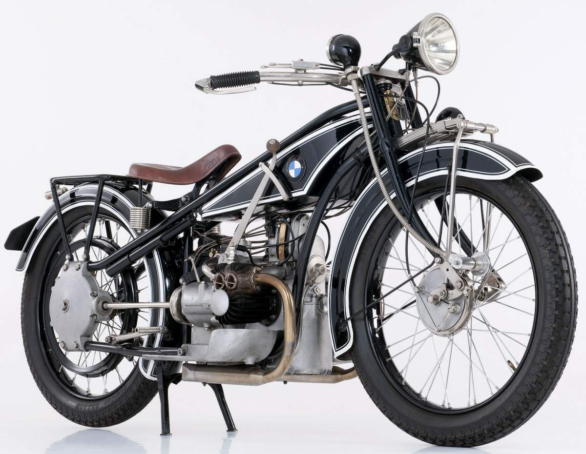
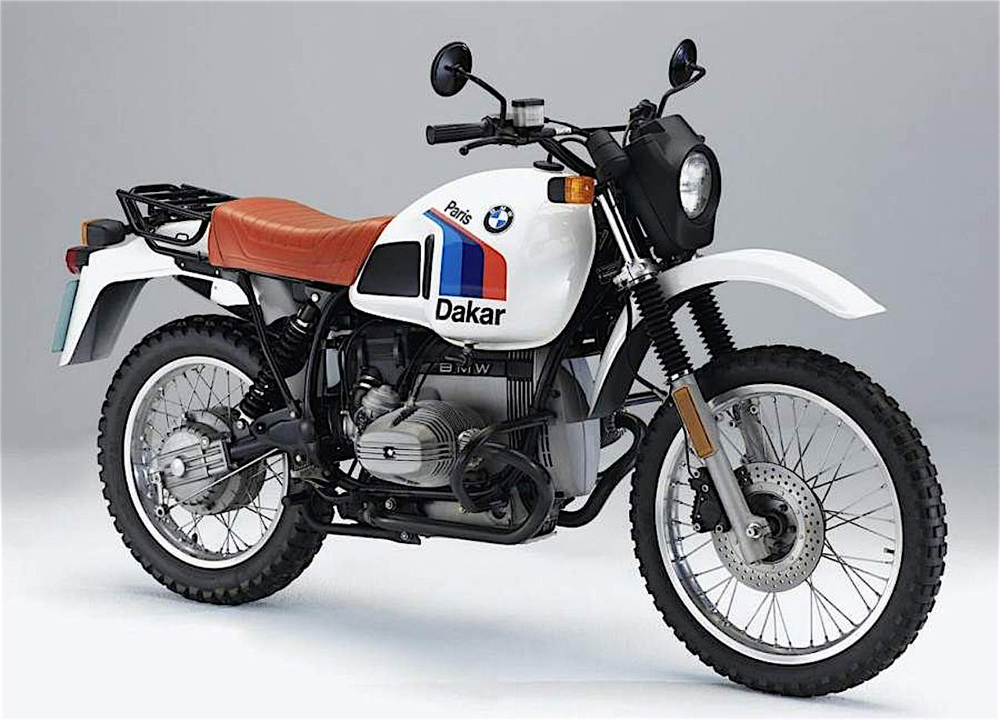
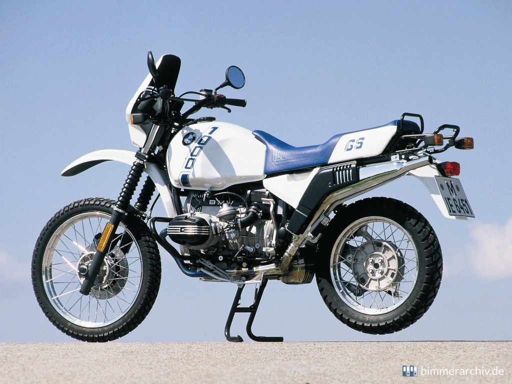
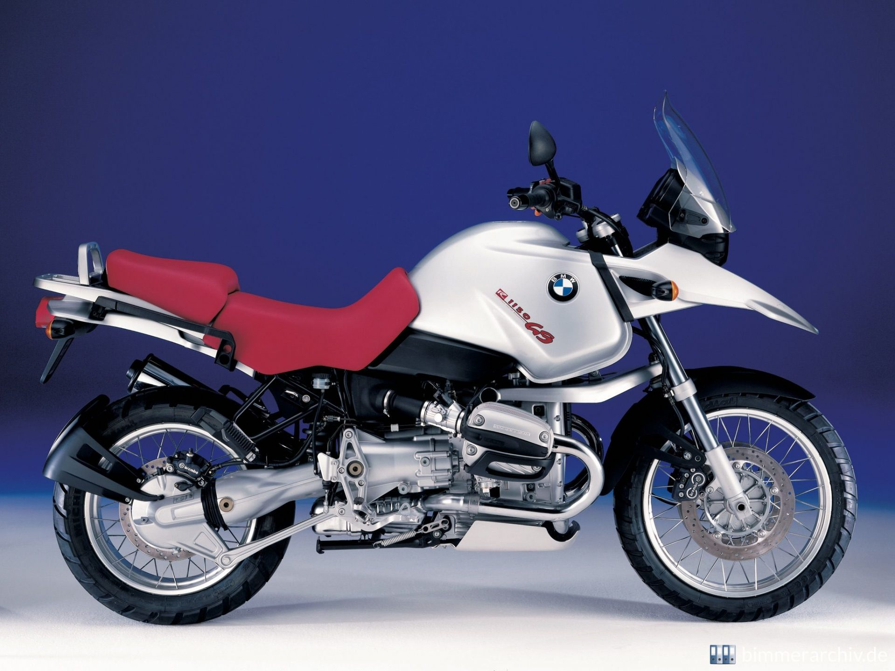
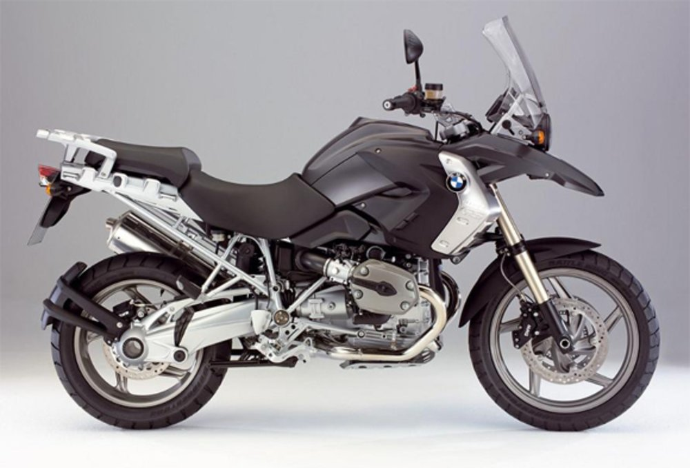

## Un po’ di storia

Le prime moto marchiate BMW nascono nel 1921, il caratteristico motore boxer a cilindri contrapposti fa la sua prima apparizione sulla **BMW R32** (486cc e 8,5cv) del 1923.

L’introduzione della sigla G/S (acronimo di *Gelände/Straße *ovvero *Sterrato/Strada*) avviene nel 1980 con la **BMW R 80 G/S** (797,5cc per 52 cv e 205kg a vuoto): una moto poliedrica nata per affrontare in scioltezza ogni tipo di percorso ed in controtendenza rispetto al merito dell’epoca, composto da moto specialistiche. Da questo modello tutte le BMW GS di grossa cilindrata avranno sospensione posteriore monobraccio *Paralever* con trasmissione a cardano e motore bicilindrico boxer.

La bontà del progetto viene messa a dura prova nella partecipazione a diverse edizioni della Paris-Dakar, dove otterrà 4 vittorie nei 5 anni di partecipazione (1981-1983-1984-1985).

Nel 1987 la cilindrata viene aumentata a 980cc, il nome della moto cambia in **BMW R 100 GS**, la potenza sale a 60cv ed il peso si attesta a 210 kg a vuoto.

Nel 1994 debutta la **BMW R 1100 GS** con motore boxer raffreddato ad aria e olio, ma soprattutto una rinnovata sospensione anteriore: si passa da una classica forcella all’inedito sistema *Telelever*, che dona alla moto una grande stabilità ed evita l’affondamento anteriore durante le frenate. La cilindrata aumenta a 1083cc, la potenza è di 80cv, il peso lordo raggiunge i 240kg.

Il 1999 è l’anno della **BMW R 1150 GS**, ancora molto apprezzata per via del ridotto impiego di elettronica. La *ghisona *ha un peso lordo che sfiora i 250kg, 1130cc di cilindrata per 85cv di potenza.

Nel 2004 gli ingegneri bavaresi presentano un modello tutto nuovo: la **BMW R 1200 GS**. Cilindrata e potenza salgono a 1170cc e 100cv, ma il peso (finalmente) scende di quasi 30kg. Il modello 2008 porta in dote un piccolo restyling, altri 5cv per un totale di 105, la possibilità di acquistare un *Integral ABS *di nuova generazione, controllo di trazione ASC, controllo pressione pneumatici RDC e sospensioni elettroniche ESA (regolazione precarico e ritorno dal computer di bordo). Il 2010 è l’anno del debutto della versione *bialbero*, equipaggiata con un motore boxer aria/olio allo stato dell’arte (e con una potenza di 110cv).

")

La tradizione nell’utilizzo di motori raffreddati ad aria si interrompe nel 2013, anno in cui viene presentata la **BMW R1200 GS LC** (Liquid Cooled, ovvero raffreddata a liquido): la potenza del motore sale a 125 cv ma anche il peso aumenta a 238 kg . Il modello 2017-18 introduce un restyling e l’adattamento delle emissioni alla normativa Euro 4 (mantenendo costante la potenza del motore).

Nel 2018 viene presentata la **BMW R 1250 GS** con un nuovo motore da 1262cc a fasatura variabile, 136cv ed un aumento di peso che la porta a 249kg.

")
")

A fronte di un costante aumento di potenza, il peso delle bicilindriche bavaresi è sempre aumentato (ad eccezione della *dieta dimagrante* del 2004): il rapporto tra potenza e peso è comunque sempre cresciuto:

## Perché comprare una R 1200 GS 2008 nel 2018?

Chi ha mai provato una GS sicuramente sa bene quanto siano *facili* nonostante il peso importante e la grande potenza disponibile, senza dimenticare il comfort elevato e la possibilità di farci un po’ di tutto… il rovescio della medaglia è sicuramente il costo elevato!

Il prezzo di partenza della nuovissima R 1250 GS è già piuttosto alto (17.850€), ma basta aggiungere pochi optional (secondo me) irrinunciabili per superare la barriera dei 20.000€… Ed ecco il motivo per cui trovo sensato acquistare una *vecchia* GS!

Se badate più alla sostanza che alla smania di possedere l’ultimo modello potrete fare grandi affari sul mercato dell’usato. Noterete che il valore di queste moto BMW rimane molto alto nel tempo, per cui potreste trovare moto di 8-10 anni al prezzo di una giapponese quasi nuova… consideratelo come un vantaggio: quando vorrete rivendere la vostra recupererete parecchi soldi.

Essendo un modello più che maturo, i difetti sono ben conosciuti (ne parleremo più avanti) e le soluzioni sono consolidate. Dato che la moto è abbondantemente fuori garanzia potrete evitare di effettuare la manutenzione dal concessionario (i meccanici specializzati in moto BMW non mancano nelle grandi città), risparmiando molti soldi… e se vi piace la meccanica sarete meno restii a mettere le mani su un modello con poca elettronica rispetto a quelli moderni!

## Come va la BMW R 1200 GS del 2008

In una parola: **bene**. La moto ha 10 anni e non li dimostra, il motore ha un gran tiro, la linea è ancora attuale e sul mercato non mancano gli accessori estetici per renderla più vicina al vostro gusto.

Il **motore** boxer da 1170cc e 105cv è molto regolare ed elastico, riprende bene dai 3.000 giri e spinge forte superata la tacca dei 5.000rpm. Non è un motore fatto per essere tirato al limite, ma per avere coppia sempre… basta aprire il gas e vi tirerete fuori da qualunque impaccio. Non sono un *manico* in off-road, ma il motore non fa sentire la necessità di diavolerie esoteriche come il DCT Honda: ingranate la seconda e pensate solo a divertirvi.

Il peso è decisamente importante nelle manovre da fermo, tuttavia il **baricentro basso** dona alle *Mucche Bavaresi* un’agilità inaspettata appena le ruote iniziano a girare.

I **tagliandi ogni 10.000km** sono abbastanza semplici da effettuare anche nel proprio garage; richiedono di smontare poco la moto dato che il motore boxer è quasi tutto a vista. Operazioni come la sostituzione olio e filtri si fanno tranquillamente in una mezz’oretta, peccato che quasi tutte le viti siano di tipo Torx e richiedano attrezzi dedicati.

**Consumi contenuti** e circa 400km di autonomia in viaggio: meno di 6l/100km in autostrada a 130km/h, meno di 5l/100km per l’andatura turistica a pieno carico. Uso la moto come mezzo di trasporto principale e pur vivendo in una città trafficata (Torino) ho una [media totale di circa 5,6l/100km](https://www.spritmonitor.de/en/detail/780855.html).

I cavalli non sono mai troppi, ma non ho mai sentito la necessità di avere maggiori prestazioni in termini di potenza massima. **Migliorabile la fluidità ai bassi regimi**: non sarebbe male avere un motore più reattivo nel range 1500-2500 giri (aspetto ampiamente migliorato nei modelli con motore raffreddato a liquido).

Ho ottenuto un notevole incremento di fluidità ai bassi regimi, motore più pieno tra i 4500-5000 giri (al costo di una leggera perdita di freno motore) montando la [S.M.A.R.T. IAT di Belinassu](http://www.belinassu.it). L'operazione è davvero semplice e reversibile.

La **trasmissione cardanica** ha il pregio di necessitare di poca manutenzione, se tutto va bene dovrete soltanto cambiare l’olio della coppia conica ogni 40.000km; se le cose vanno meno bene, dovrete cambiare i cuscinetti della coppia conica perché usurati (fatto a 68.000km). In ogni caso questo tipo di trasmissione vi eviterà di viaggiare con l’assillo di pulire, ingrassare e registrare la classica catena.

Gli innesti del cambio sono abbastanza rumorosi ma precisi, il contamarce integrato nella dashboard è una bella comodità. I rapporti sono ben distanziati, anche se mi piacerebbe che la sesta marcia fosse più lunga per abbassare ulteriormente i consumi in autostrada. L’azionamento della **frizione** è idraulico, la sostituzione dei dischi usurati necessita di smontare gran parte del retrotreno della moto, richiedendo un bell’esborso in manodopera.

La **ciclistica** è particolare per via della sospensione anteriore **paralever** posto di una tradizionale forcella telescopica. Questa soluzione rende la R 1200 GS **molto stabile** in curva ed evita l’impuntamento in frenata, anche se non è l’ideale per l’offroad estremo. La ruota anteriore da 19″ è un buon compromesso che permette agilità in strada e fuori (dove conviene abbassare la pressione degli pneumatici per aumentare il grip: 1,9 bar all’anteriore, 2 bar al posteriore).

Le **sospensioni** Showa non sono il massimo e soprattutto non sono revisionabili (ufficialmente): in caso di perdita d’olio vanno sostituite (cosa capitata a 75.000km).

L’impianto frenante è potente, l’**Integral ABS** (completamente disattivabile) di seconda generazione funziona molto bene: oltre ad impedire il bloccaggio delle ruote, azionando la leva del freno al manubrio ripartisce automaticamente la frenata tra ruota anteriore e posteriore. Il risultato è una frenata in spazi davvero ridotti.

L’**ergonomia** della moto è ben studiata, la posizione di guida è molto **comoda** sia da seduti che in piedi e non affatica nelle lunghe percorrenze, i comandi sono ben disposti sui blocchetti del manubrio. Il cupolino della versione standard è abbastanza coprente, ma non aspettatevi miracoli in autostrada: l’ho sostituito con un [cupolino maggiorato WRS](https://www.ebay.it/sch/i.html?_nkw=WRS+R1200GS+2004-2012) (disponibile anche in versione fumè).

L’elettronica c’è e si fa sentire: le **sospensioni ESA** permettono di regolare precarico e ritorno con la semplice pressione di un pulsante, il **controllo di trazione ASC** interviene al momento giusto e rende docili i 105cv (anche se la modalità standard è un po’ troppo zelante), il **controllo pressione pneumatici RDC** fa viaggiare tranquilli e permette di accorgersi in tempo di una foratura.

Purtroppo c’è anche qualche magagna: il **modulatore del relè pompa** (codice ricambio 16 14 7 720 776) e l’**antenna anulare dell’immobilizer** ([codice ricambio 61 35 7 705 247](https://www.bmw-motorrad-bohling.com/it/bmw-anello-circolare-blocchetto-di-accensione-per-modelli-con-can-bus.html)) sono componenti che possono lasciarvi a piedi senza alcun preavviso; se pianificate un viaggio di lunga durata procuratevi dei ricambi. Anche se non si tratta di elettronica, un altro componente che è bene avere in viaggio è la **cinghia alternatore** (codice ricambio 12 31 7 690 571).

## Accessori consigliati

Abbiamo testato in prima persona diverse soluzioni per gli accessori da viaggio più comuni, per ogni categoria vi elenchiamo pregi e difetti di quelli originali e offriamo almeno un’alternativa più economica.

### Bagagli

Il tris valigie BMW Vario è molto pratico in città, ma poco adatto al viaggio: essendo in plastica non si riparano facilmente in caso di rottura, il sistema telescopico per ampliare il volume delle borse diventa inutile (riduce il volume di carico e aggiunge peso superfluo). L’apertura delle [valigie laterali](https://www.bmw-motorrad-bohling.com/it/bmw-set-completo-valigie-laterali-vario-r1200gs-k25.html) *a conchiglia* rende poco pratico l’inserimento ed estrazione del contenuto, mentre il [topcase](https://www.bmw-motorrad-bohling.com/it/bmw-topcase-vario-r1200gs-2012-k25.html) è davvero piccolo e consente a malapena di riporre un casco di medie dimensioni. La [borsa da serbatoio originale](https://www.bmw-motorrad-bohling.com/it/bmw-borsa-serbatoio-r1200gs-2008-2012.html) è molto capiente, ma la rimozione è poco pratica, dopo qualche pieno di benzina cercherete qualcosa di meglio.

I nostri consigli:

- [valigie laterali in alluminio Heavy Duties](/2018/04/borse-alluminio-heavy-duties-bmw-r1200gs/) (alternative più costose: [borse in alluminio BMW](https://www.bmw-motorrad-bohling.com/it/bmw-set-completo-valigie-laterali-alluminio-r1200gs-adventure-codificabile.html) o [Touratech Zega](https://shop.touratech.it/zega-pro2-sistema-speciale-and-s-45-45-litri-con-supporto-acciaio-inox-per-bmw-r1200gs-fino-a-2012-r1200gs-adventure-fino-a-2013.html))
- bauletto in alluminio [Givi Trekker Outback 58](https://amzn.to/2Adqsiz) (alternativa economica: [Kappa KGR52 Garda](https://amzn.to/2QLMAuA)), è possibile modificare la serratura di entrambi per utilizzare la chiave di accensione della moto
- borsa da serbatoio [Givi Tanklock EA118](https://amzn.to/2SlX9kM) con innesto rapido sul tappo del serbatoio

Trovo comodo caricare le valigie con [piccoli contenitori](https://amzn.to/2TcNtcL) piuttosto che grandi valigie morbide, in modo da trovare in fretta ciò che si cerca.

### Protezione motore

Il boxer 1200 ha l’inconveniente di essere la prima parte della moto a toccare terra in caso di caduta, proteggere i cilindri è fondamentale.

BMW vende un [paramotore](https://www.bmw-motorrad-bohling.com/bmw-r1200gs-k25-engine-guard-stainless-steel.html) in acciaio inox e [paracilindri in alluminio](https://www.bmw-motorrad-bohling.com/it/bmw-protezione-cilindro-alluminio-r1200xx-2009.html) o [plastica](https://www.bmw-motorrad-bohling.com/it/bmw-protezione-cilindro-r1200xx-2009.html), ma se cercate qualcosa di più protettivo (e più economico) vi consigliamo le barre paramotore e serbatoio [HEED Full Bunker](/2016/09/paramotore-tubolare-heed-bmw-r-1200-gs) (in ferro verniciato) oppure la soluzione modulare di Touratech composta da [paramotore](https://shop.touratech.it/barra-paracilindro-e-paramotore-acciaio-inox-per-bmw-r1200gs-fino-a-2012.html) e [parasebatoio](https://shop.touratech.it/barra-anticaduta-per-carenatura-acciaio-inox-per-bmw-r1200gs-2008-2012.html) (in acciaio inox).

Tutte le soluzioni permettono di effettuare cambio olio e filtri senza smontare nulla.

### Sospensioni

Come già detto, le sospensioni originali non sono il massimo, in caso di perdita d’olio dal freno idraulico non sarà possibile revisionarle.

Sicuramente avrete già sentito parlare di Öhlins, produce ammortizzatori di ricambio sia ESA che non: sono ottime ma il prezzo non è dei più bassi (oltre 3.000€ per la versione ESA Mechatronic). Se volete risparmiare, vi consigliamo qualche alternativa altrettanto valida:

- **molle a carico progressivo Hyperpro**: massima resa e minima spesa (meno di 300€), il coefficiente elastico progressivo permette di avere molle morbide durante la prima fase di compressione ma sempre più rigide all’aumentare della forza esercitata sulla molla… ovvero: la moto è confortevole ma si comporta molto meglio in curva!
- **Streetbox Hyperpro BMW** in versione ESA (circa 2.000€) e non (circa 1.000€): un kit per la sostituzione completa delle sospensioni originali, revisionabile, con idraulica sofisticata e molle progressive

### Scarico

Il terminale di scarico originale è davvero pesante, sostituendolo con un aftermarket slip-on potreste risparmiare 4-5kg sul peso della moto. Le alternative non mancano, ma ad oggi non ne abbiamo provata nessuna dato che **non** siamo molto felici di fare molto più rumore!

### Attrezzi

BMW fornisce uno striminzito kit attrezzi da riporre nel sottosella, in viaggio preferisco essere pronto ad ogni evenienza e porto sempre con me:

- [kit riparazione tubeless](https://amzn.to/2R9RXDu)
- [pompa a pedale](https://amzn.to/2PTDpmN) (efficace e molto più leggera di un compressore 12v)
- un [buon set di inserti torx](https://amzn.to/2T8Daq6) con [chiave a cricchetto](https://amzn.to/2T8wbx1) e [adattatore 1/2-1/4](https://amzn.to/2QJPY9o)
- [chiave universale per ruota anteriore](https://amzn.to/2Rgntj9)
- [estrattore bobine](https://amzn.to/2RcVRLJ)
- [kit pronto soccorso](https://amzn.to/2Cw4XLG) (obbligatorio in alcuni Paesi)
- [bretelle catarifrangenti](https://amzn.to/2QL59iT) (obbligatorie in alcuni Paesi)
- [stucco ipossidico](https://amzn.to/2GzGqcj) (per riparare carter crepati e non solo)
- [borsa attrezzi a rullo](https://amzn.to/2AcFg15)

### Varie

Come già detto il [cupolino standard](https://www.bmw-motorrad-bohling.com/bmw-clear-windshield-for-r1200gs-k25-2012.html) non è molto coprente alle alte velocità (sono alto 1m76 e sento parecchia turbolenza sul casco), col tempo tende ad ingiallire e si rompe abbastanza facilmente in prossimità delle viti. WRS realizza cupolini per tutti i modelli di GS in versione trasparente, fumè o scuro: il [modello intermedio](https://www.ebay.it/sch/i.html?_nkw=WRS+R1200GS+2004-2012) può essere montato al posto dell’originale, mentre la versione [touring](https://www.ebay.it/sch/i.html?_odkw=WRS+R1200GS+2004-2012&_osacat=0&_from=R40&_trksid=m570.l1313&_nkw=WRS+touring+R1200GS+2004-2012&_sacat=0) richiede un telaio di supporto aggiuntivo (utile per agganciare navigatori GPS e altra strumentazione).

Allargare la superficie di appoggio del cavalletto laterale è utile quando ci si trova in fuoristrada su terreni morbidi. Ne esistono di tutti i prezzi: [Touratech](https://shop.touratech.it/allargamento-rivestimento-cavalletto-laterale-per-bmw-r1200gs-2008-2012-r1200gs-adventure-2008-2013.html), [Givi](https://amzn.to/2QOcVbP), [from China with love](https://www.ebay.it/sch/i.html?_from=R40&_sacat=0&_nkw=estensione+cavalletto+r1200gs+2008&_sop=15).

Spesso in viaggio è necessario ricaricare smartphone, fotocamere e actioncam, la moto potrebbe essere la vostra unica fonte di alimentazione. Potreste collegarvi alla [presa CAN-bus](https://amzn.to/2T1NNuH) sotto la sella, oppure bypassare la linea della moto [collegandovi direttamente alla batteria](https://amzn.to/2AkAu1F) per poter alimentare un compressore 12V (la R 1200 GS non ha fusibili e la centralina toglie alimentazione automaticamente alle linee che assorbono troppa corrente). Se volete spendere, [Touratech vende un bella soluzione a 2 prese che si integra con il quadro strumenti](https://shop.touratech.it/protezione-2-posto-di-guida-unita-tachigrafo-con-due-prese-corrente-bmw-r1200gs-2008-2012-r1200gs-adventure-2008-2013.html).

Purtroppo la BMW R 1200 GS è tra le moto più rubate d’Italia (e [lo abbiamo scoperto sulla nostra pelle](/2017/03/furto-moto-bmw-r1200gs-ritrovata/)). Nel sottosella è possibile riporre il [lucchetto a U ABUS Granit Extreme](https://amzn.to/2Cw8NUU), tra i più solidi sul mercato e in grado di bloccare la ruota posteriore passando nel buco della coppia conica; per evitare di partire con il lucchetto montato (e fare grossi danni) meglio dotarsi anche di un [cordino promemoria](https://amzn.to/2Rd7mCP).
