## Preludio

Ho sempre sognato di fare un lungo viaggio in moto e finalmente a Febbraio 2018 ci sono stati tutti gli elementi per permettermi di acquistare la mia prima moto: una [Honda XL700 Transalp](/tag/honda-xl-700-transalp/) del 2013. È una gran moto e mi sta dando un sacco di soddisfazioni!

Dopo l’acquisto della moto, un giorno in una qualunque pausa pranzo dal lavoro, Stefania mi dice: “Io e [Gabriele](/author/gabriele/) stiamo pensando di andare in Romania in moto. Vorresti venire anche tu?”

Ed io: “Perché no?”

<iframe style="border: 0;" src="https://www.google.com/maps/embed?pb=!1m52!1m12!1m3!1d5655063.482402049!2d10.146516753319283!3d46.20525342631151!2m3!1f0!2f0!3f0!3m2!1i1024!2i768!4f13.1!4m37!3e0!4m5!1s0x47886dbc61dcb4e1%3A0x1773d989088359bd!2sStazione+Dora%2C+Torino%2C+TO!3m2!1d45.0908136!2d7.677386299999999!4m5!1s0x477b2568d3ca2a5d%3A0xd89767d12195ac81!2sCastel+Lueghi%2C+6230+Predjama%2C+Slovenia!3m2!1d45.815847299999994!2d14.1267154!4m5!1s0x4765649ab25c4c93%3A0x82423480d251d176!2sDobrna%2C+Slovenia!3m2!1d46.3356141!2d15.225973199999999!4m5!1s0x4741c334d1d4cfc9%3A0x400c4290c1e1160!2sBudapest%2C+Ungheria!3m2!1d47.497912!2d19.040235!4m5!1s0x474585e32a3c10e5%3A0x3b25c170a904d2b!2sGhioroc%2C+Romania!3m2!1d46.1545588!2d21.5899546!4m5!1s0x474e8a8efc2a74cb%3A0x2cec7ae8ba35e916!2sCastelul+Corvinilor%2C+Strada+Castelului%2C+Hunedoara%2C+Romania!3m2!1d45.749318699999996!2d22.888276599999998!5e0!3m2!1sit!2sit!4v1534953032776" width="100%" height="400" frameborder="0" allowfullscreen="allowfullscreen"></iframe>

## La partenza: 12 Luglio 2018

L’avventura inizia il 12 luglio alle ore 06:00 nei pressi della stazione Dora di Torino. Si pensa subito alle cose importanti: pieno di benzina e incollare gli adesivi della missione.

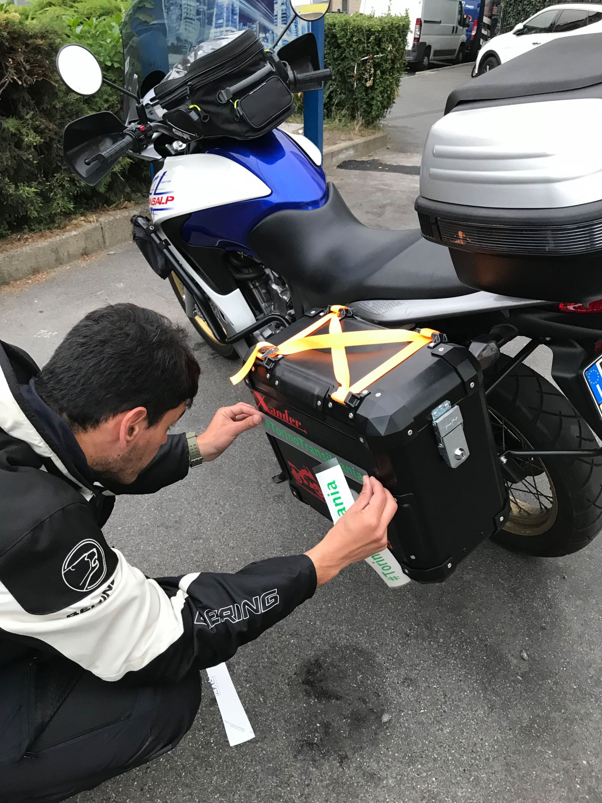
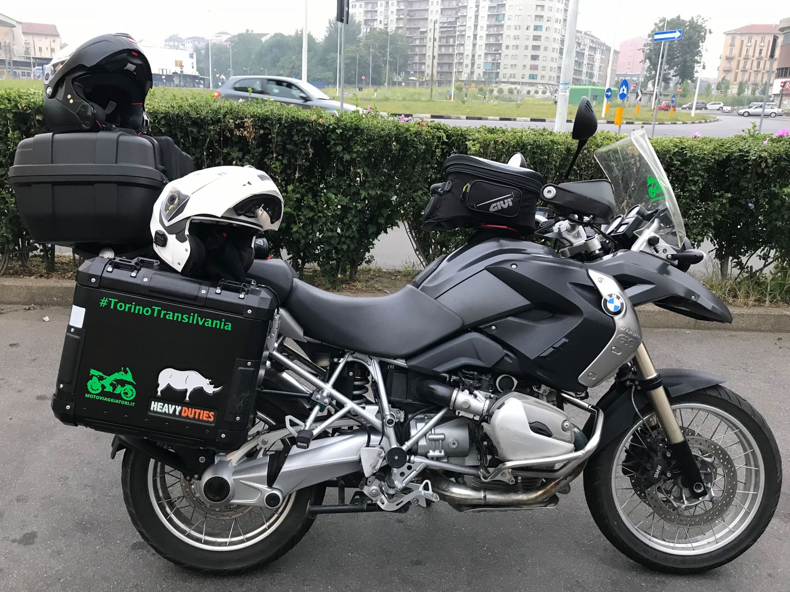
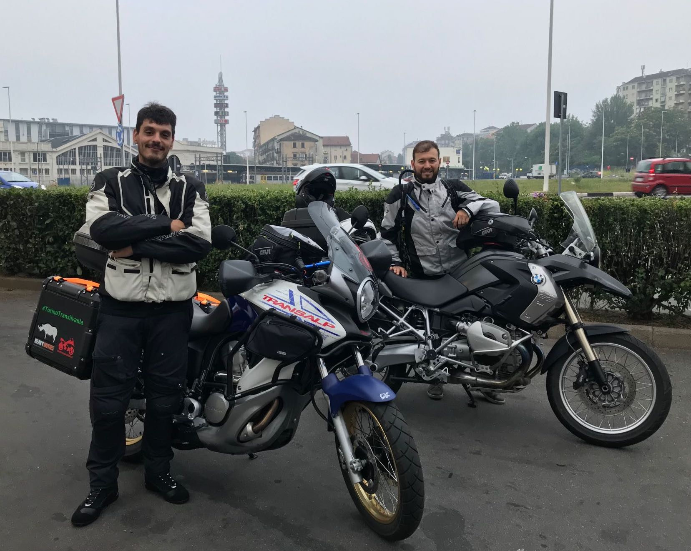

Finite le cose importanti si parte subito in direzione Milano per affrontare 5-6 ore di autostrada verso la Slovenia.

  <ul>
    <li>Se avete una moto con una sella non proprio morbidissima come quella del Transalp e non siete abituati a stare a cavallo del vostro mezzo per ore, un bel pantaloncino da ciclismo vi potrebbe salvare il fondoschiena! (Letteralmente)</li>
    <li>Se state sorpassando un camionista in autostrada e ha il finestrino abbassato, non è detto che voglia prendere un po’ d’aria, a magari sta per sputare fuori dal finestrino. Non è bellissimo se ti prende in pieno la visiera del casco! Per fortuna era chiusa.</li>
  </ul>

## In Slovenia

Dopo circa 6 ore di autostrada in Italia, varchiamo il confine con la Slovenia in tempo per il pranzo! Abbiamo deciso di fare una pausa pranzo un po’ più interessante visto che avevamo degli ottimi panini fatti in casa che avevano già affrontato un bel po’ di km e quindi abbiamo pranzato dinnanzi al castello di Predjama.

")
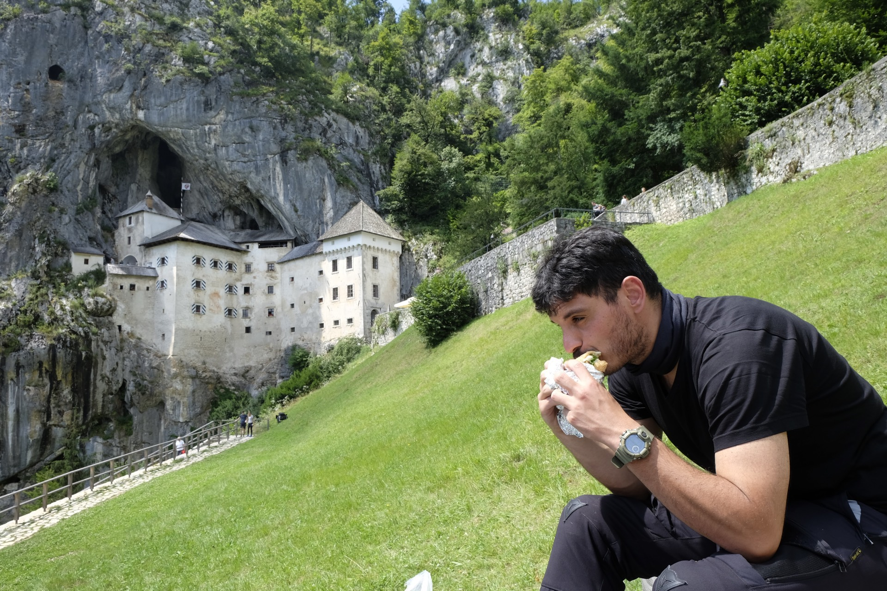

Un po’ di meritato riposo dopo i primi 600km e ci rimettiamo in viaggio per cercare di avvinarci il più possibile a Budapest. L’idea iniziale era di riuscire ad arrivare un po’ dopo Lubiana, ma poi un magico cartello ha attirato la nostra attenzione: TERME.

Di comune accordo abbiamo quindi deciso che 1h di viaggio in più il giorno seguente non valeva quanto il potersi rilassare alle terme. Siamo quindi giunti in un simpatico paesino della Slovenia chiamato Dobrna. in cui l’età media si aggirava intorno ai 65 anni. Cercato l’hotel su booking ([clicca qui per ottenere un 10% di sconto sulla tua prossima prenotazione](https://www.booking.com/s/34_6/desteg10)) e accordato il posto sicuro per le moto si va alle terme!

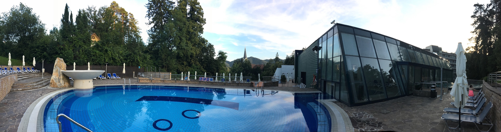
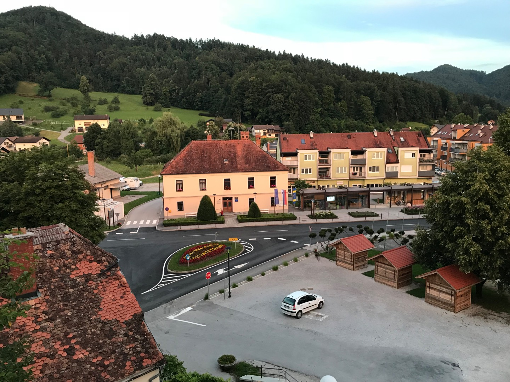
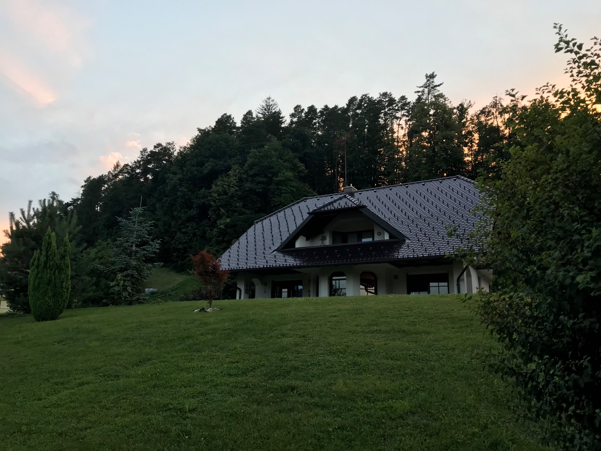

Ci sono anche ben due night club in cui la gente si reca col trattore, ma soprattutto pecore nei giardini privati che belano disperatamente per tutta la notte. Se cercate un posto economico dove rilassarvi e respirare aria buona in Slovenia, le terme Dobrna sono assolutamente consigliata!

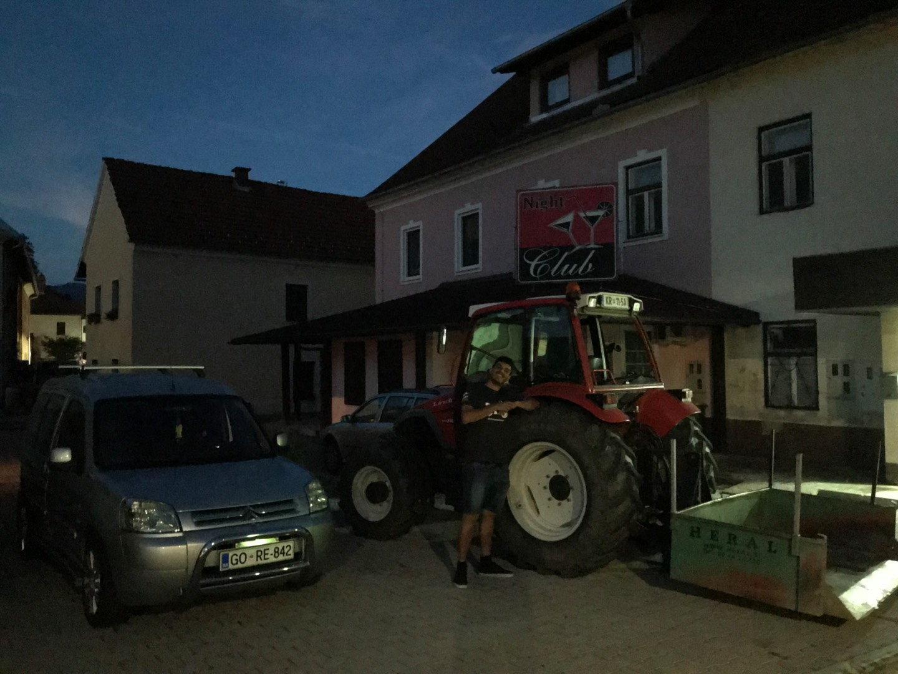

## 13 Luglio 2018: Ungheria – capitolo 1

Sveglia presto (con grande fatica), rapida rimozione della rugiada dalle moto e si parte in direzione Budapest. Gabriele mi fa una sola raccomandazione: “ricordiamoci di comprare la vignetta ungherese”.

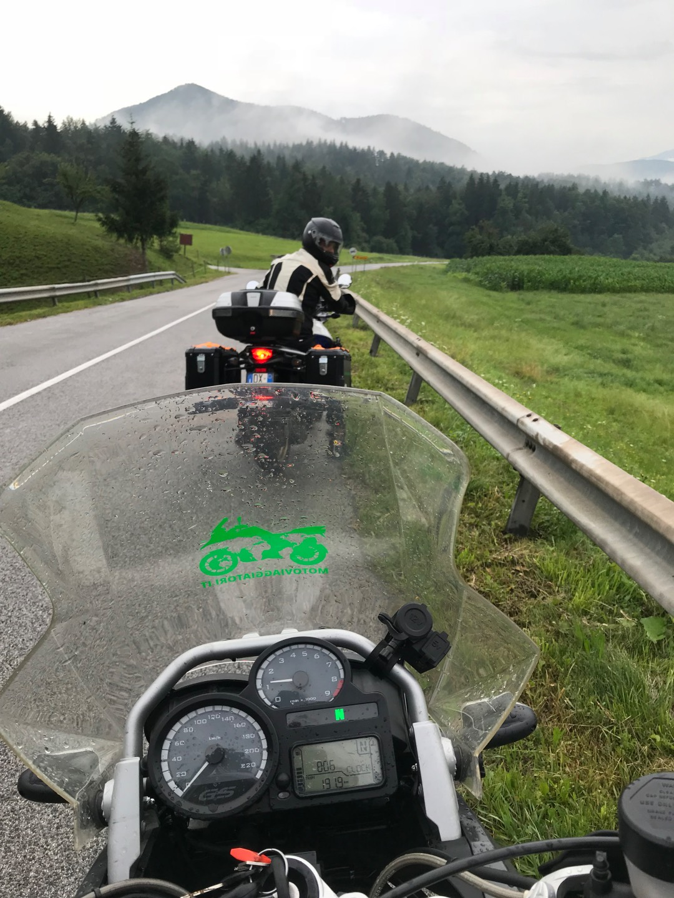
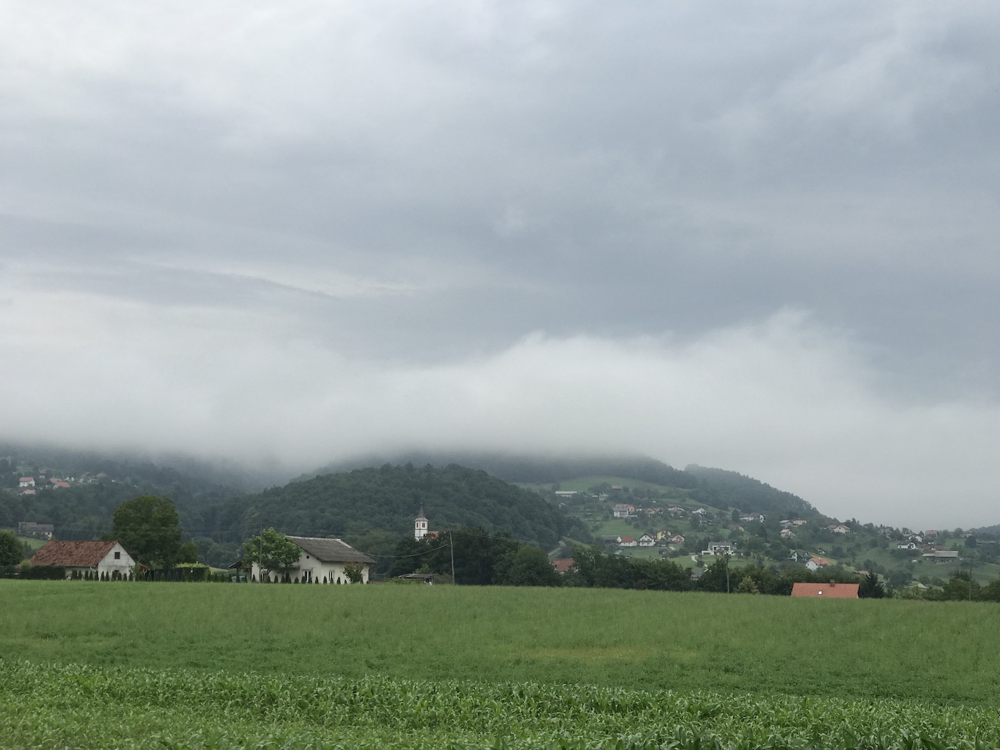

Siamo in autostrada, segnalato l’ultimo benzinaio sloveno in cui è possibile compare la vignetta, provo a contattare Gabriele con l’interfono, ma è occupato perché sta parlando al telefono. Provo a suonare il clacson, niente. I momenti passano e superiamo il benzinaio. Poco dopo riesco a contattare Gabriele che realizza la cosa e decidiamo di provare ad andare avanti. Superiamo il confine e lì ad attenderci le telecamere ungheresi che controllano le vignette… Prendiamo la prima uscita, torniamo in slovenia al benzinaio superato a piè pari e acquistiamo la vignetta. Passiamo nuovamente di fronte alle stesse telecamere e incrociamo le dita sperando abbiano capito la svista e non ci multino!

Comprate la vignetta prima di entrare in Ungheria, ma soprattutto verificate la correttezza della targa riportata sullo scontrino!

### Budapest

Abbiamo raggiunto Budapest all’ora di pranzo. Qui ho un contatto con un collega (il mitico Csaba) che ci ha fatto fare un mini tour della città.

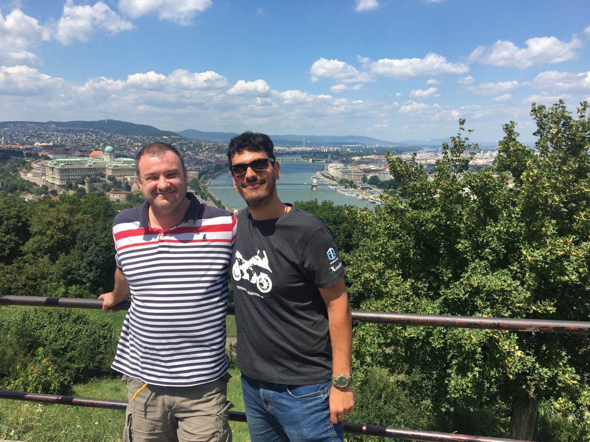
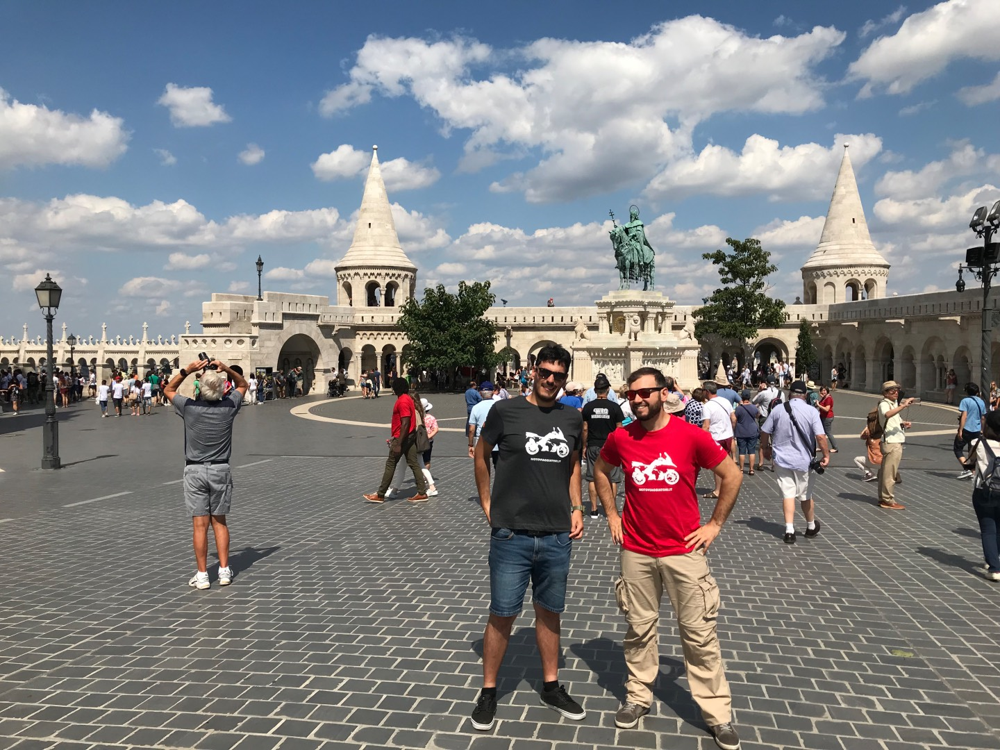
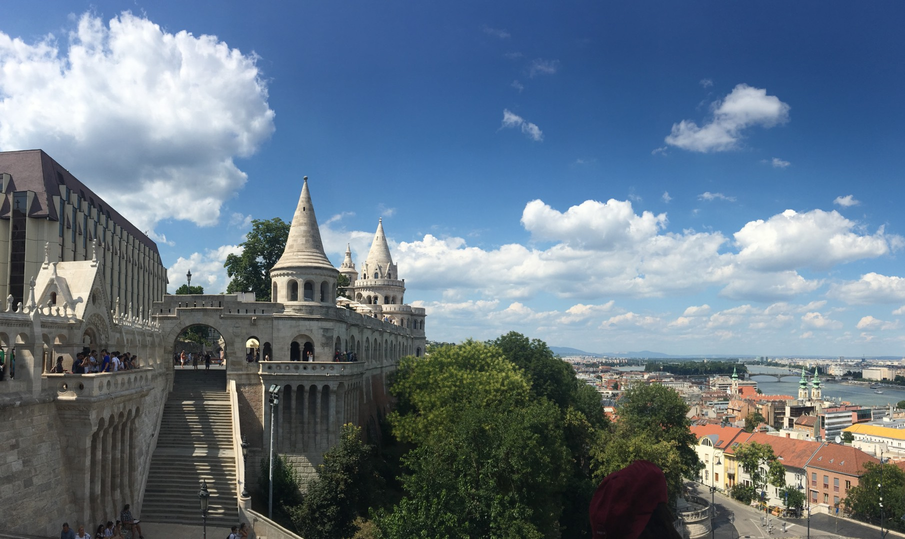

Se non avete mai visitato Budapest, beh fatelo! È davvero una città meravigliosa, sia dal punto di vista architettonico che dal punto di vista delle opportunità che offre. Inoltre la zona “locali notturni” costruita all’interno del vecchio ghetto ebraico è davvero meravigliosa.

Un esempio delle cose bellissime che ci sono in questa zona è lo Street Food & Beer Garden. Un vecchio parcheggio adibito a “zona cibo”. Chiunque abbia un foodtruck si può posizionare qui e proporre la propria scelta gastronomica!

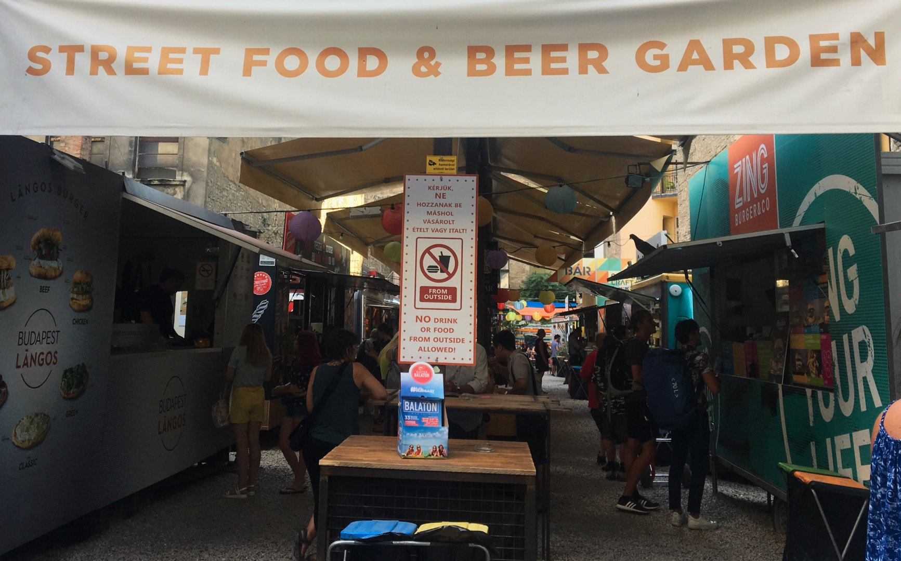
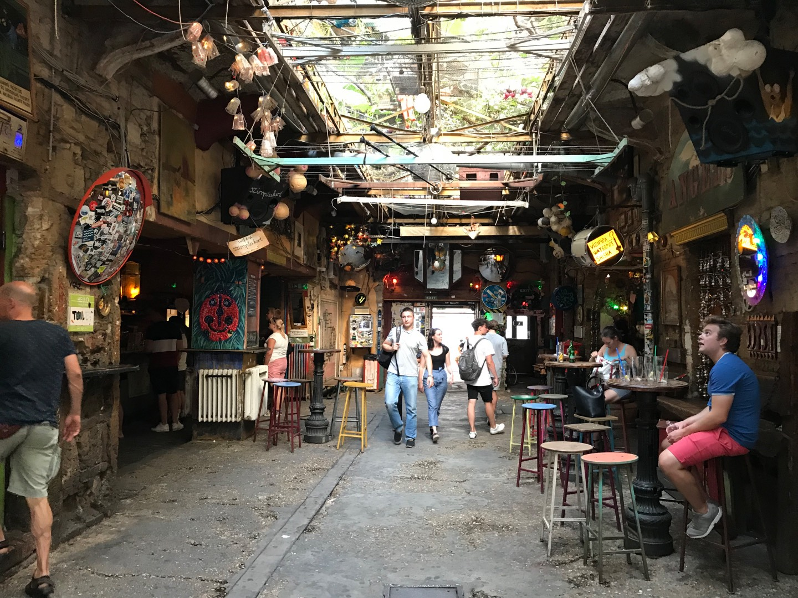
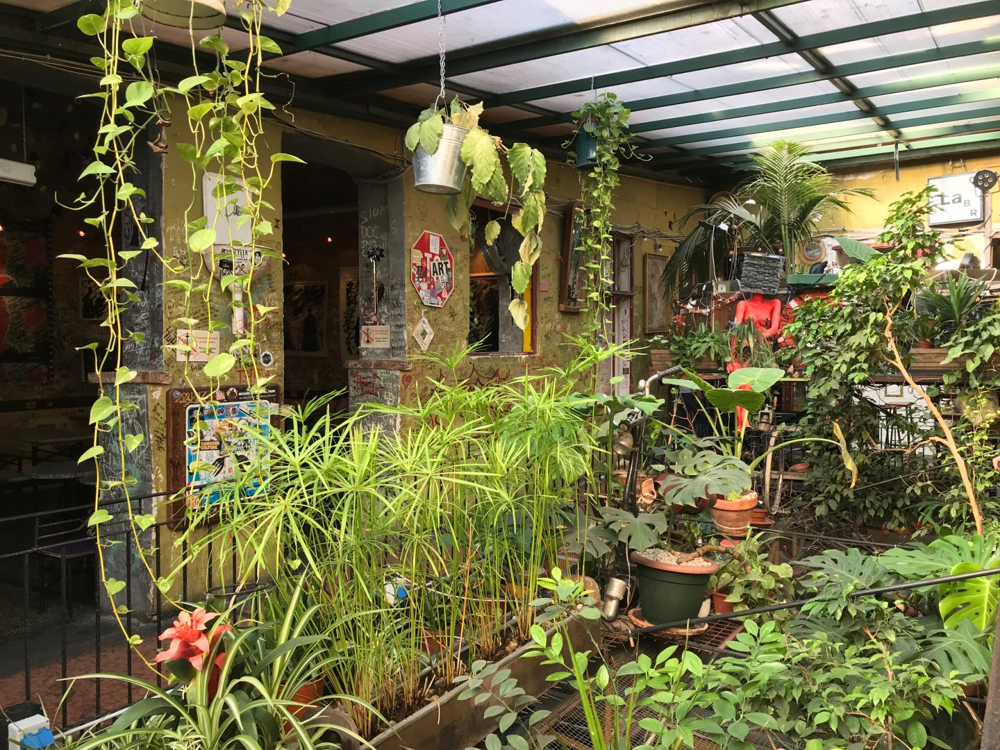

Un altro bellissimo esempio è questo insieme di bar all’interno di un palazzo che ha subito dei bombardamenti durante la seconda guerra mondiale.

Ore 19:30 ci dirigiamo in direzione Gyal (vicino l’aeroporto) per andare a controllare che la prenotazione del B&B non abbia problemi…

Premessa: avevo prenotato questo B&B su Booking.com, ma pochi giorni prima di partire ho dovuto disdire la prenotazione perché forse la partenza sarebbe slittata. Successivamente (qualche ora dopo) ho contattato la struttura con una mail in inglese in cui chiedevo se fosse possibile *annullare l’annullamento* della prenotazione e ho ricevuto una mail in un italiano improbabile in cui mi veniva detto che non c’era nessun problema e che non avremmo dovuto pagare nulla visto che booking mi aveva già addebitato il costo delle camere.

Arrivati a Gyal ci dirigiamo subito presso il B&B dove incontriamo il gestore: un tipo dall’aria molto simpatica, ma che ci riserva una sopresa: non parla una parola di inglese… Come quasi nessuno in Ungheria dopo tutto! Ho anche provato a chiedere ad alcuni poliziotti (gli stessi che ci sparavano l’autovelox addosso) di fare da traduttori, ma ahimé neanche loro parlavano inglese. Dopo più di 1h e 30m, svariate chiamate a Booking.com, Google Translate e al mio amico Csaba (Sant’uomo!) che faceva da traduttore inglese/ungherese abbiamo scoperto una bellissima cosa: se ricevete una mail di Booking.com con un addebito, fino a quando l’esercente non richiede la conferma tale addebito non viene reso effettivo; considerando che l’esercente non aveva ancora capito di essere nel 2018, non lo aveva fatto.

Ci siamo congedati con un mio messaggio su Google Translate che recitava: *Vi voglio bene, ma per favore imparate l’inglese!*

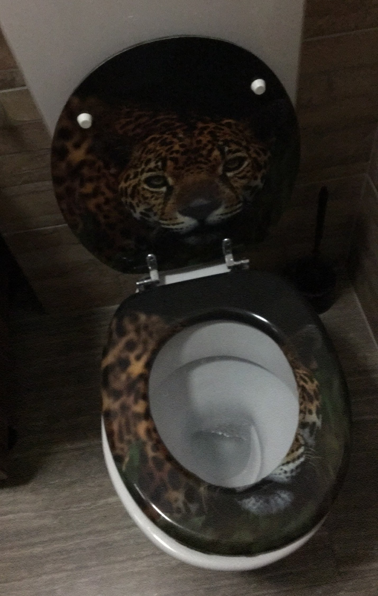

Dopo una fugace cena in un supermercato in quel di Gyal, ci dirigiamo all’aeroporto per recuperare Stefania. Torniamo al B&B alle 01:00 e ci mettiamo a letto.

## 14 Luglio 2018: Romania – giorno 1

Sveglia presto, carichiamo la moto e iniziamo a tagliare l’Ungheria in direzione Romania! Sulla strada incontriamo molti motociclisti e altrettanti carrelli carichi di moto (iniziamo un po’ ad invidiare chi viaggia comodamente in macchina in autostrada con la moto sul carrello). Le ore passano e la Romania si avvicina. Finalmente arriviamo al confine, facciamo il pieno poco dopo e inizia la nostra avventura rumena.

Il paesaggio attorno Arad è strano, post industriale e abbandonato, ma in lontananza scorgiamo il profilo di alcune colline che sono la nostra destinazione. All’ora di pranzo giungiamo a Ghioroc dove troviamo un ristorante con piscina (una pozza d’acqua senza cloro di un colore poco allettante) in cui i bambini giocano felicissimi.

Ci togliamo i vestiti da moto e prendiamo un po’ d’aria fresca. Scopriamo subito una delle qualità dei ristoranti rumeni: sono molto lenti. Il tempo medio di attesa dopo un ordine è di 1h e 30m, anche se ordini solo un’insalata ed il locale è vuoto… A loro piace fare le cose con calma!

Pranziamo al ristorante Konak e siamo pronti a ripartire, giusto il tempo di rimettersi i pantaloni da moto. Infilo la gamba sinistra e sento una puntura alla caviglia sinistra. Sembra una scheggia di legno, la rimuovo, ma il dolore aumenta, scuoto il pantalone e mi si presenta una sorpresa: non era una scheggia di legno, ma una vespa!

Scuotere sempre i pantaloni dopo averli abbandonati per ore all’aperto su una panchina d’estate

Con la caviglia gonfia, ci rimettiamo in marcia verso il primo castello rumeno: il Corvinilor!

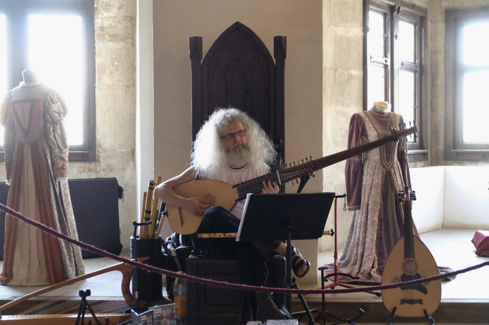
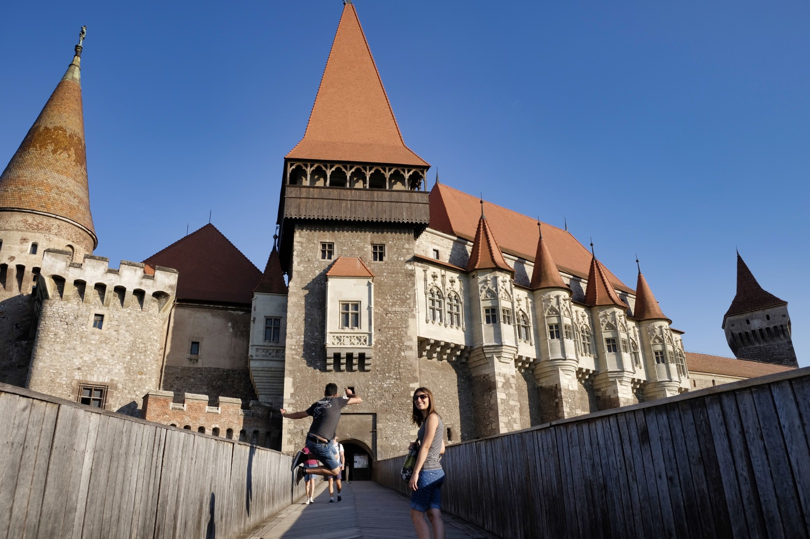
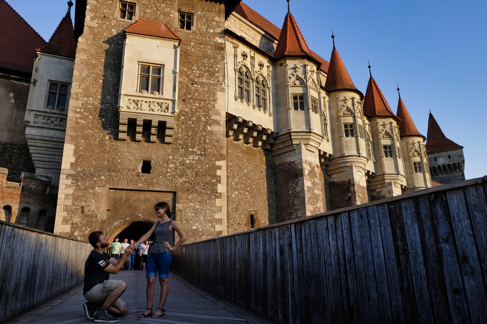

Andiamo a cena poco lontano dal castello, mangiamo tanto, bene e spendiamo pochissimo: 20€ in tre. Iniziamo già a capire che tutto questo ci mancherà e non poco!

Dopo cena torniamo al castello ad ascoltare un concerto di musica classica all’aperto con sfondo castello, illuminato in maniera molto suggestiva. Finito il concerto torniamo in B&B a riposare e caricarci per quello che ci aspetta il giorno seguente.