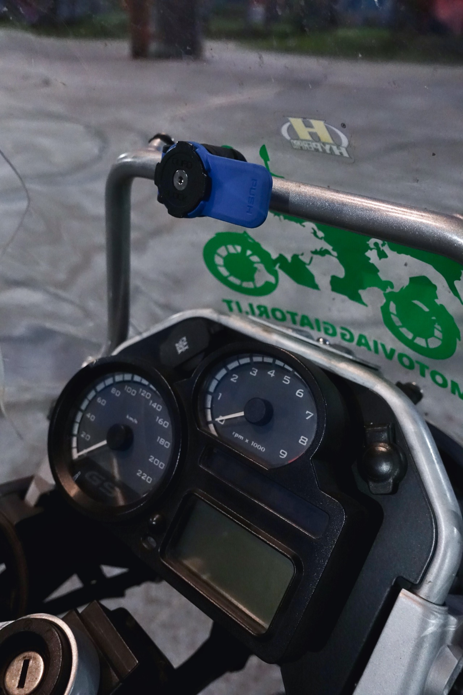

## Valigie

Borse laterali rigide o in tessuto? Di plastica o alluminio? Bauletto o borsone a rotolo? Borsa da serbatoio sì o no?

Purtroppo non esistono risposte assolute, molto dipende dalla destinazione e dalle strade che troverete. La tentazione di ogni viaggiatore alle prime armi è di optare per le valigie più grandi per portare tutto quel che sembra anche solo lontanamente utile. Quando preparate la moto tenete sempre a mente che più cose porterete con voi e più pesante sarà la moto, più ingombrante sarà in carreggiata, più faticosa sarà in off-road e nelle manovre da fermi.

La mia scelta personale è di non usare borse laterali in tessuto o borsone da sella principalmente per un motivo: sono facilmente apribili da chiunque si avvicini alla moto. Le borse in plastica sono leggere e resistenti agli urti, ma in caso di rottura possono diventare inservibili e quasi impossibili da riparare.

Tutti questi problemi vengono risolti dalle **borse in alluminio**, che oltrettutto hanno il pregio di avere coperchi che si aprono verso l'alto (rendendo molto più pratico il caricamento della moto e la ricerca di oggetti all'interno) e passanti per cinghie (io spesso ci lego la [tenda](https://amzn.to/2WPLJYD)).

Trovo molto comodo organizzare le valigie con [piccoli contenitori](https://amzn.to/2UFuR9A) dal contenuto omogeneo piuttosto che in un'unica grande borsa: questo metodo rende molto veloce trovare quel che cerco.

Nel 2018 ho montato le [valigie laterali Heavy Duties](/2018/04/borse-alluminio-heavy-duties-bmw-r1200gs), a distanza di un anno (ed un utilizzo abbastanza intensivo) non posso che consigliarle visto l'altissimo rapporto qualità prezzo.

Il **bauletto** potrà anche essere antiestetico, ma permette di portare il necessario per un'uscita di qualche giorno senza montare le ingombranti valigie laterali; quando è vuoto diventa un ricovero pratico e sicuro per i caschi... e come se non bastasse fa anche da poggiaschiena per il passeggero!

Attualmente ho un [bauletto GIVI Trekker Outback](https://amzn.to/2U1xyxV) da 58 litri: la spesa viene ripagata da qualità, capacità di carico e flessibilità di utilizzo. Purtroppo [rete elastica interna](https://amzn.to/2U24S7C) e [schienalino](https://amzn.to/2D2DTn0) per il passeggero vanno comprati a parte. Con un po' di manualità è possibile modificare la serratura per renderla apribile con la chiave originale della moto.

Per anni ho usato il [Kappa Garda 52](https://amzn.to/2TZAzhX), realizzato in plastica e leggermente meno capiente. La fattura è ottima ed i passanti per le cinghie integrati nella struttura permettono di caricare di tutto.

 rende il bauletto più confortevole per il passeggero")

Utilizzo la **borsa da serbatoio** per avere la cartina sempre sotto gli occhi e tenere a portata di mano i documenti personali e della moto, la borraccia, un cambio per affrontare improvvisi cali (o aumenti) di temperatura, gli oggetti di valore e gli aggeggi elettronici. La praticità di sgancio gioca un ruolo fondamentale dato che va rimossa quando ci si allontana dal mezzo e ad ogni rifornimento (a meno che la vostra moto sia una [BMW F800GS](/tag/bmw-f800gs)).

La mia scelta è ricaduta sulla [GIVI EA118](https://amzn.to/2uOTQZr) (25 litri) con sistema di sgancio rapido TankLock: si posiziona su una flangia installata sul tappo del serbatoio. Si espande in altezza con un sistema a cerniera, dispone di tracolla per il trasporto e *cuffia* antipioggia.

Nota di demerito per la borsa da serbatoio originale [BMW R1200GS](/tag/bmw-r1200gs): in caso di forte vento laterale tende ad appoggiarsi sulle braccia del pilota.

## Navigazione, comunicazione e documentazione

Perdersi è un buon modo per scoprire posti belli e autentici, ma non sempre è auspicabile. Il mercato mette a disposizione del motociclista moderno navigatori GPS (i più gettonati sono [Garmin Zumo](https://amzn.to/2D3BU1J) e [TomTom Rider](https://amzn.to/2YXmCET)), però io preferisco avere sott'occhio la buona vecchia cartina cartacea per capire esattamente dove sono e cosa ho attorno. Seguire pedestremente le indicazioni di un navigatore toglie sapore all'avventura e non mi dà la possibilità di capire se con una breve deviazione posso raggiungere luoghi interessanti ma fuori programma.

Questo non è un invito a rinunciare alla tecnologia, ma a risparmiare 400-500€ da investire in altro. Al giorno d'oggi chi è che non possiede uno smartphone? Alla cartina affianco l'app OsmAnd (disponibile per smartphone [iOS](https://itunes.apple.com/app/apple-store/id934850257) e [Android](https://play.google.com/store/apps/details?id=net.osmand)): permette di scaricare le mappe sul telefono e risparmiare sul consumo di dati.

Le carte stradali che preferisco sono le [Reise Know-How Landkarte](https://amzn.to/2uTbuet), nonostante siano plastificate ed impermeabili permettono di prendere appunti a matita, oltre ad essere quasi indistruttibili.

Ho provato diversi sistemi per montare il telefono sulla moto e purtroppo nessuno è perfetto:

* le [custodie impermeabili](https://amzn.to/2D2JrOm) tendono a surriscaldare il telefono e produrre riflessi che rendono lo schermo poco visibile
* il sistema [RAM Mount X-GRIP](https://amzn.to/2D2sHa5) è compatibile con tutti i cellulari ma quando inutilizzato è un po' ingombrante
* il sistema [Quad Lock](https://amzn.to/2CZVw72) è solido e discreto, purtroppo costa caro e richiede una cover specifica per il cellulare

Attualmente utilizzo il [supporto specchietto Quad Lock](https://amzn.to/2D19vcL) adattato per agganciarsi alla staffa del mio [cupolino WRS Touring](https://www.wrs.it/it/400-prodotti-wrs-cupolini), trovo sia il compromesso migliore. In caso di pioggia è disponibile una protezione aggiuntiva chiamata [Poncho](https://amzn.to/2D9mXex).

Per tenere sempre in carica lo smartphone e altri accessori è indispensabile disporre di una [presa 12V impermeabile](https://amzn.to/2WNBoMA). Io ho montato la protezione cruscotto con 2 prese integrate di [Touratech](https://shop.touratech.it/protezione-2-posto-di-guida-unita-tachigrafo-con-due-prese-corrente-bmw-r1200gs-2008-2012-r1200gs-adventure-2008-2013.html).

Per comunicare con il passeggero e le moto vicine mi affido da anni agli [interfoni Midland](https://amzn.to/2WY2bGp). Da poco sto testando la *relativamente nuova* generazione di interfoni Bluetooth e rispetto ai vecchi modelli siamo su un altro livello: riesco ad ascoltare i miei compagni di viaggio anche a velocità autostradali senza alcun problema. Con il vecchio sistema radio FM e musica dal cellulare erano utilizzabili solo nel traffico cittadino e alle basse velocità, mentre con i nuovi auricolari Hi-Fi e gli algoritmi di soppressione del rumore è possibile godersi un ascolto soddisfacente ad ogni andatura.

L'interfono [Midland BT NEXT PRO](https://amzn.to/2uTgVdw) è dotato di chip Bluetooth dual core e antenna potenziata, che senza battere ciglio permettono di mantere collegati contemporaneamente smartphone, navigatore, sistema TFT della moto e fino a 8 motociclisti in conferenza. Le potenzialità sono enormi ma in moto è importante non lasciarsi distrarre dalla comunicazione e tenere sempre gli occhi ben aperti sulla strada e sul traffico.

Documentare il proprio viaggio è praticamente obbligatorio nell'era dei social e della massima condivisione, ma spesso gli avanzatissimi sensori fotografici degli smartphone non permettono di catturare a dovere i luoghi che incontriamo sulla strada.

Per evitare di appesantirmi con voluminose fotocamere reflex o mirrorless, da poco sono passato ad una compatta fotocamera [Sony RX100](https://amzn.to/2WT6wKC) Mark IV: offre una lente Zeiss luminosissima (equivalente ad uno zoom 24-70mm f/1,8-2,8) accoppiata ad un sensore da 1" con una risoluzione di 20 MP, possibilità di controllare tutti i parametri di scatto, mirino elettronico che permette di vedere benissimo anche sotto il sole accecante e connessione WiFi per condividere le foto direttamente sullo smartphone. Tutto questo in un corpo macchina leggero che sta comodamente nelle tasche della giacca da moto.

Per le riprese video in 4K utilizzo sia la [Sony RX100M4](https://amzn.to/2KehkS9) che una piccola [action camera Xiaomi YI](https://amzn.to/2WP44F6), ottima alternativa alle più blasonate [GoPro](https://amzn.to/2DdIq6j).

## Attrezzatura

Solitamente viaggio con i bagagli personali nella valigia laterale destra e nel bauletto, mentre la borsa sinistra viene usata per tenere tutta l'attrezzatura per affrontare gli imprevisti di un viaggio in moto.

Il [kit pronto soccorso omologato](https://amzn.to/2YX4Hyd) andrebbe sempre portato con sè, inoltre in alcuni Paesi è obbligatorio (assieme alle [bretelle rifrangenti](https://amzn.to/2I8UpWM) da indossare anche durante la guida diurna).

Purtroppo una foratura può sempre capitare, un [kit per la riparazione pneumatici tubeless](https://amzn.to/2U1EYB6) può evitare la chiamata ad un carroattrezzi; se la moto utilizza le camere d'aria è meglio portarne un paio di scorta, assieme a [leve smontagomme](https://amzn.to/2IaTGEf) e [attrezzo universale per smontare la ruota anteriore](https://amzn.to/2uUokJo).

Per rigonfiare la gomma sconsiglio le bombolette usa e getta (ovviamente perché sono monouso) ed il compressore 12V (pesa molto ed è ingombrante), mi trovo benissimo con una [mini pompa a pedale](https://amzn.to/2I8Tiq8) completa di manometro analogico; volendo esiste anche con [manometro digitale](https://amzn.to/2VzaDeS).

Porto sempre con me un piccolo e leggero set di [cavi avviamento moto](https://amzn.to/2VukbYA) e, dopo aver rischiato di rimanere a secco tra i Monti Apuseni in [Romania](/categoria/viaggi/romania), mi sono dotato anche di una [tanica di emergenza](https://amzn.to/2D2PvX2) da 2 litri montata direttamente sul retro della valigia laterale destra (e di un piccolo [imbuto pieghevole in silicone](https://amzn.to/2P324X5)).

Ogni moto ha bisogno di chiavi specifiche, ma solitamente porto con me:
* [pinza](https://amzn.to/2UFcYYv) o [coltello](https://amzn.to/2Kld2sh) multiuso
* [set di chiavi esagonali](https://amzn.to/2VA45MX)
* [set di chiavi torx](https://amzn.to/2uWy3io)
* [chiave a cricchetto con inserti](https://amzn.to/2uWz61O) (epurata del superfluo)
* [chiave candele](https://amzn.to/2X089Xf)
* [chiave bobine](https://amzn.to/2uVzDRH)
* [chiave filtro olio](https://amzn.to/2I8UycQ)
* [borsa a rotolo](https://amzn.to/2KjJQSp) per contenere tutti gli attrezzi

*Last but not least*: [filo per stendere](https://amzn.to/2uWfRpi) e sapone di marsiglia!

 e imbuto pieghevole in silicone")

## Comfort e sicurezza

Dato che mi piace macinare migliaia di chilometri in sella alla moto, preferisco *investire* in comfort e sicurezza di guida piuttosto che nell'aumento delle prestazioni e del rumore.

Il cupolino alto (che piaccia o no) permette di rilassarsi parecchio quando si viaggia a velocità sostenute, alleggerendo il carico sulla muscolatura cervicale e riducendo il rumore causato dalla turbolenza. Sulla mia maxi-enduro ho montato un [cupolino maggiorato WRS](https://www.wrs.it/it/400-prodotti-wrs-cupolini), realizzato in Italia utilizzando plexiglass di alta qualità.

In molti consigliano l'utilizzo di tappi auricolari, ho provato gli [Alpine MotoSafe Pro](https://amzn.to/2UCkKSR) (riducono il rumore del vento lasciando passare la voce dell'interfono) ma a lungo andare li trovo fastidiosi.

Con la [S.M.A.R.T. IAT di Belinassu](http://www.belinassu.it) sono migliorati molto fluidità e tiro della mia [maxi-bicilindrica](/2018/12/bmw-r1200gs-2008-recensione-fuori-tempo-massimo) ai bassi regimi, ritrovandomi spesso ad utilizzare un rapporto più lungo di quanto facessi prima di averla. Si monta facilmente e l'intervento è reversibile, va segnalato che si perde un po' di freno motore.

Ho sostituito le pastiglie dei freni originali con le [Brembo mescola LA](http://mqmoto.it/brembo-pastiglie-mescola-sinterizzata-la/), che promettono una resa chilometrica molto alta e prestazioni di assoluto rispetto già alle basse temperature. Devo ammettere che la potenza frenante è davvero alta in tutte le condizioni e mi sono bastate poche *pinzate* per rodarle a dovere. Per avere conferma sulla durata dovrete darmi il tempo di utilizzarle un po'!

Sostituendo le molle dei miei ammortizzatori con le [Hyperpro](https://hyperpro.com/about-us/) ho cambiato radicalmente il comportamento della moto in strada. Il coefficiente elastico di queste molle aumenta proporzionalmente al carico che viene applicato su di esse, ovvero: più la molla si comprime, più diventa dura da comprimere. Grazie a questo effetto la moto diventa più stabile in curva ed in frenata, senza perdere in comfort sulle piccole asperità. Provare per credere, [fino al 30 aprile 2018 puoi ricevere uno sconto del 10%](https://www.facebook.com/motoviaggiatori/posts/1523802234427770) grazie al distributore italiano [Rinolfi](https://www.rinolfi.it/hyperpro-lista-applicazioni).

Spesso i chilometri da percorrere sono tanti ed il tempo a disposizione è limitato, l'autostrada diventa una scelta obbligata: per evitare di passare ore con la mano destra in tensione nella stessa posizione vale la pena montare un [semplice ed economico riposa polso](https://amzn.to/2WVOJTp).

 sono decisamente viola!")

Buon viaggio!