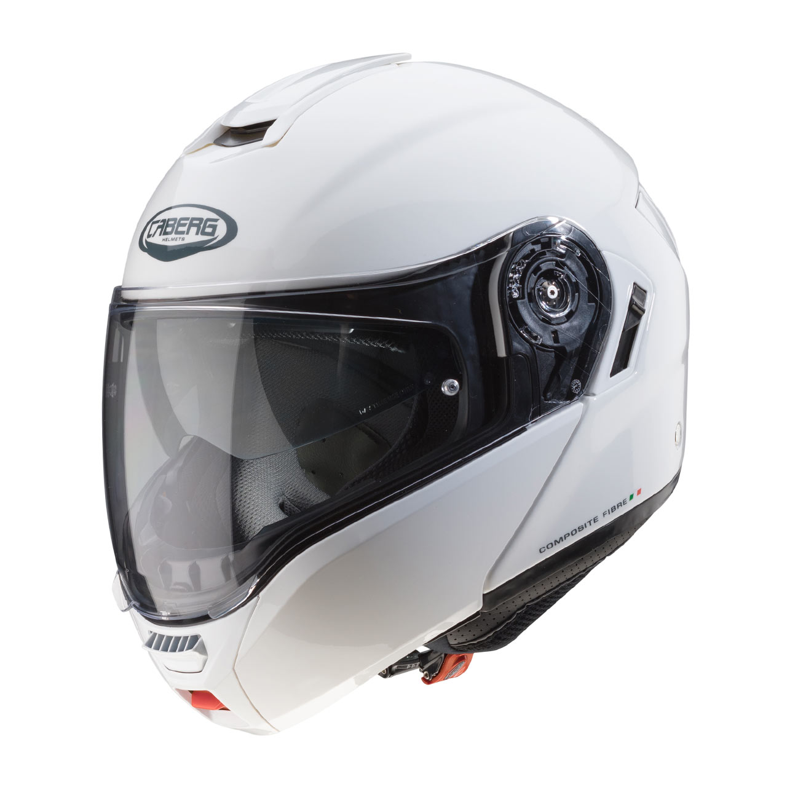
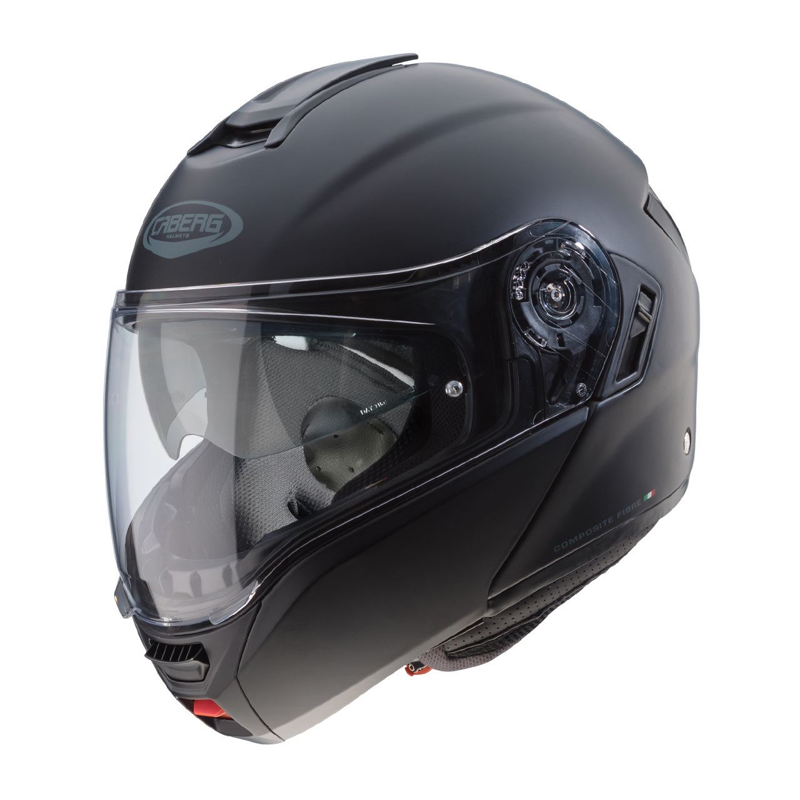
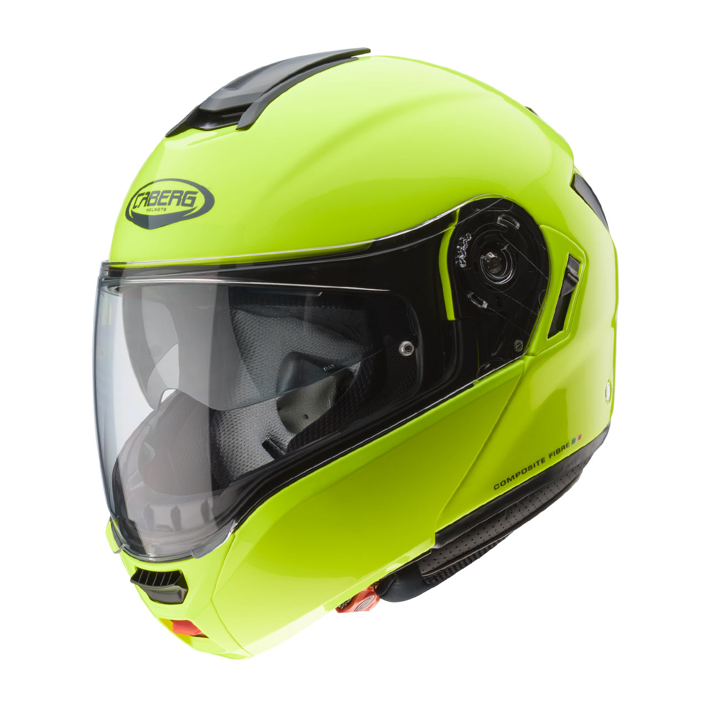
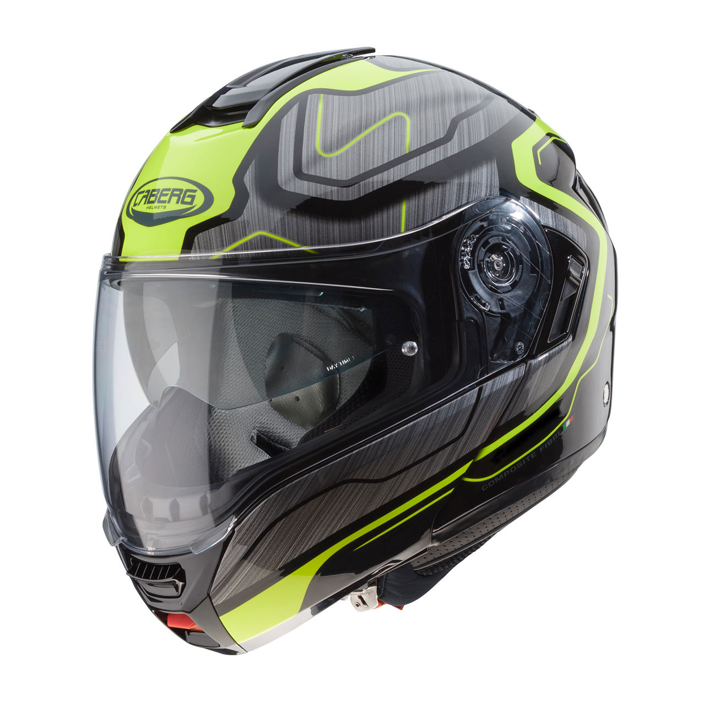
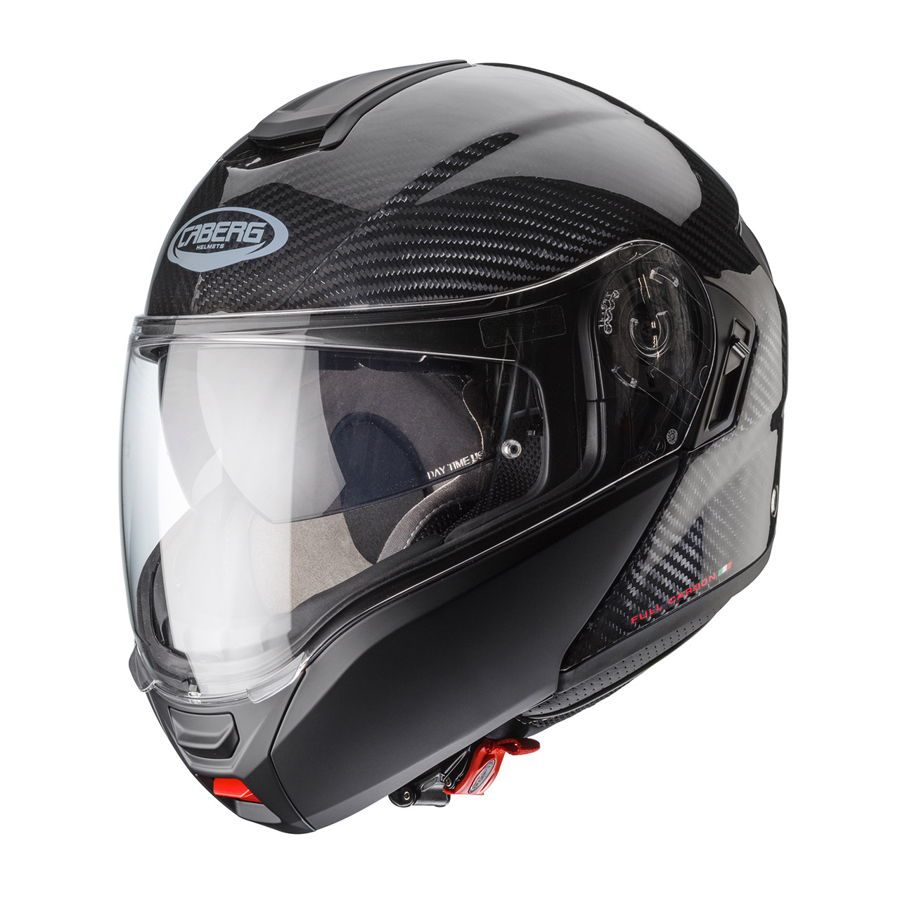

LEVO è il casco modulare situato al vertice della gamma Caberg, concepito per il mototurismo e progettato per raggiungere alti livelli di leggerezza, silenziosità, ventilazione, visibilità e rapporto qualità/prezzo. Per cominciare vi lasciamo al video ufficiale girato a Bergamo e dintorni:

`youtube:https://youtu.be/9fx8x4Kq1Yc`

## La prova

La nostra prova di lunga durata inizia a dicembre 2019 con una [visita alla sede bergamasca di Caberg](/2018/12/esclusivo-primo-contatto-con-il-casco-caberg-levo), dove riceviamo cinque unità di pre-produzione in varie taglie e colori. Ci stiamo preparando per un lungo viaggio in Turchia che ci permetterà di testare a fondo il casco.

Le cinque *teste di MotoViaggiatori* coinvolte nella prova indossano caschi di varie marche e modelli, per cui avremo la possibilità di confrontare il LEVO con: Caberg Duke II, Givi X.21 Challenger, Nolan

L'inverno piemontese non è il massimo per viaggiare in moto, ma le basse temperature ed il clima poco clemente ci permettono di testare subito le caratteristiche di ventilazione e resistenza alla pioggia.

## Verdetto

## Specifiche

- Casco modulare (apribile)
- Made in Italy
- Doppia omologazione ECE 22.05 P/J (mentoniera bloccabile in posizione aperta)
- Calotta in fibre composite o fibra di carbonio
- Visiera panoramica ultrawide da 338cm² e angolo di visione verticale pari a 82°
- Lente antiappannamento Pinlock® Max Vision di serie
- Visiera parasole a scomparsa
- Sistema di ventilazione dotato di 2 prese d'aria frontali e 2 estrattori posteriori
- Predisposizione interfono
- Interni ipoallergenici, asportabili e lavabili
- Guanciali ricoperti da uno strato di tessuto Coolmax®
- Alloggiamento per le stecche degli occhiali da vista/sole

### Taglie disponibili

| Calotta piccola ||  Calotta grande  ||
|--------|---------|---------|---------|
| **XS** | 53/54cm | **L**   | 59/60cm |
| **S**  | 55/56cm | **XL**  | 61/62cm |
| **M**  | 57/58cm | **XXL** | 63/64cm |

### Peso dichiarato

|                 | LEVO composite fibre |   LEVO CARBON   |
|-----------------|----------------------|-----------------|
| calotta piccola |    **1550±50gr**     |  **1450±50gr**  |
| calotta grande  |    **1650±50gr**     |  **1550±50gr**  |

### Colori

### Prezzi

Prezzi consigliati al pubblico (IVA inclusa):

- **€389,99** LEVO composite fibre
- **€409,99** LEVO composite fibre HI VIZION
- **€429,99** LEVO composite fibre FLOW graphic
- **€479,99** LEVO CARBON
