## L'idea

Torino – Brindisi, crica 1200 km di autostrada in estate… Una noia mortale specialmente in moto! Apro Google Maps e scelgo l’opzione evita autostrade e pedaggi, ma non sono convinto del percorso; Google suggerisce statali vicino al mare, ovvero: gente, gente, gente e caldo, caldo caldo! Poi penso alla bellissima catena montuosa situata al centro del nostro bellissimo Paese, inizio a spostare e forzare il percorso. Cosa vien fuori? 1400 km di statale montuosa, al fresco!

Preparo il mio primo viaggio in solitaria all’avventura, pianificando il percorso per passare in parchi e riserve naturali. Decido di non prenotare nulla e improvvisare giorno per giorno dove e quando fermarmi. Cerco sulla Rete quali sono i più bei passi degli Appennini e punti di interesse sulla strada. Ecco qui la perfetta ricetta per l’**Appenninata**. Cosa manca? Ah si, partire!

<iframe src="https://www.google.com/maps/d/u/2/embed?mid=127wHoS681ckoG-gS6978i43xnWAQhhMh" width="100%" height="700"></iframe>

## Giorno 1: Piemonte, Liguria, Toscana

Sveglia presto ma non prestissimo (06:00) per essere operativi alle 07:00. Contrariamente ai propositi del viaggio, imbocco un breve pezzo di autostrada (Torino – Ovada) per guadagnare 1 ora di tempo, il Piemonte lo conosco già abbastanza bene. Abbandonata la noiosa autostrada mi dirigo sulla statale che attraversa il **Parco Naturale delle Capanne di Marcarolo** e dopo soli 3 km ho già una bellissima sorpresa: un cerbiatto che attraversa la strada! Percorro il parco su asfalto perfetto, in mezzo ad un panorama molto strano: roccia e pezzi di bosco si alternano in maniera pittoresca con colori mozzafiato nelle tonalità di verde, rosso e giallo.

L’unica tappa prestabilita è il Passo del Bracco, indicato tra i più bei valichi dell’Appennino Ligure. Scorrono i paesi e salgono i km, fino alla tappa del passo. L’asfalto è nuovissimo appena posto: un ottimo inizio. Tornanti e curve costeggiano il fiume a destra e la parete rocciosa a sinistra. Inizia la salita e intravedo un cartello: **Passo del Bracco**, ben 650m slm. Abituato alle altitudini delle Alpi Piemontesi, non posso far altro che sorridere, ma meno di 1 km più in là due terrazze panoramiche mi danno la vista sul mare e purtroppo questo in Piemonte non lo puoi vedere.

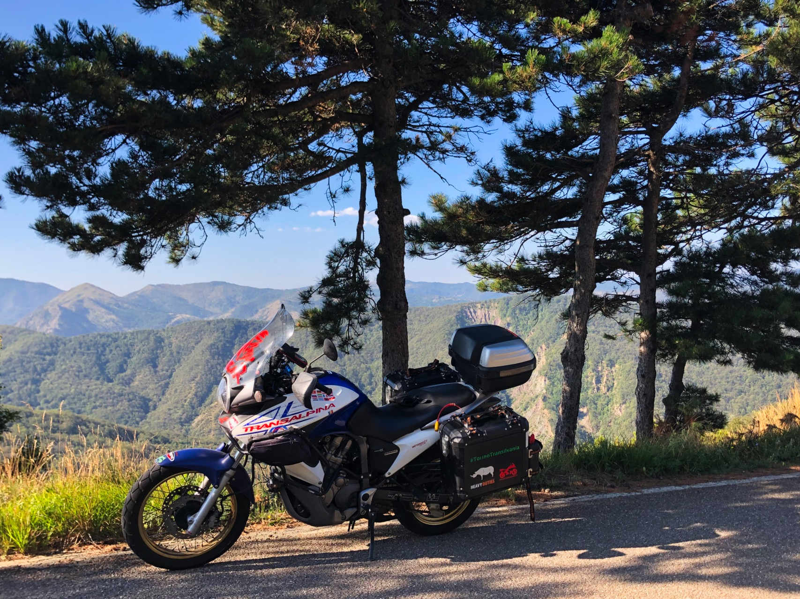
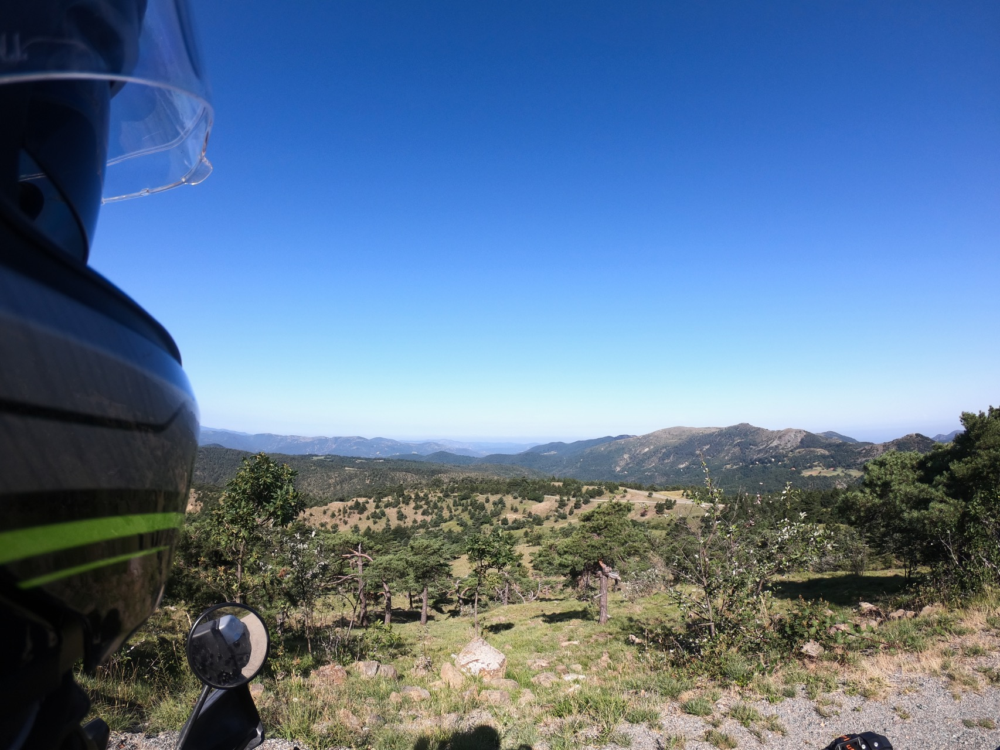

Mi fermo ad apprezzare il panorama, consumo il mio fugace pranzo con focaccia di Recco comprata con sosta tattica in provincia di Genova, e prenoto l’hotel per passare la notte a Volterra. Imposto il navigatore e mi incammino. Inizio a macinare chilometri e dopo un po’ qualcosa inizia a turbarmi: le montagne alla mia sinistra sono sempre più lontane, mentre il mare alla mia destra sempre più vicino… Mi fermo a ricontrollare il navigatore, mi pare tutto giusto. Continuo macinare chilometri e la situazione peggiora. In men che non si dica mi ritrovo a Forte dei Marmi imbottigliato tra la gente che vuole andare al mare e inizio a patire il caldo. Le Alpi Apuane mi sbeffeggiano guardandomi dall’alto delle loro cime fresche. Ricontrollo il navigatore e ovviamente ho selezionato il percorso sbagliato…

Per favore Google, se disegni un percorso puoi usare due colori diversi per evidenziare la strada che stai percorrendo e quella che dovresti seguire? Le tonalità di blu col sole battente non sono colori diversi!

Riesco a districarmi nel mare di gente e mi ridirigo verso le montagne speranzoso, in direzione Volterra passando per Lucca. Il panorama delle colline toscane è mozzafiato. **Girasoli, boschi e uliveti di stagliano in tutte le direzioni**, l’asfalto continua ad essere perfetto.

Arrivo a Volterra, doccia veloce meritata e mi dirigo a visitare la città a piedi. La città è molto caratteristica, pulita e ben tenuta e soprattutto una bella palestra! Non mancano i saliscendi tra i vicoli (più o meno allegri) e si respira l’aria della famosa accoglienza toscana. Giro 3 ore per la città e faccio aperitivo all’esorbitante cifra di € 4,50 dopodiché la stanchezza della giornata inizia a farsi sentire. Torno in hotel e mi preparo alla giornata successiva, destinazione Abruzzo.

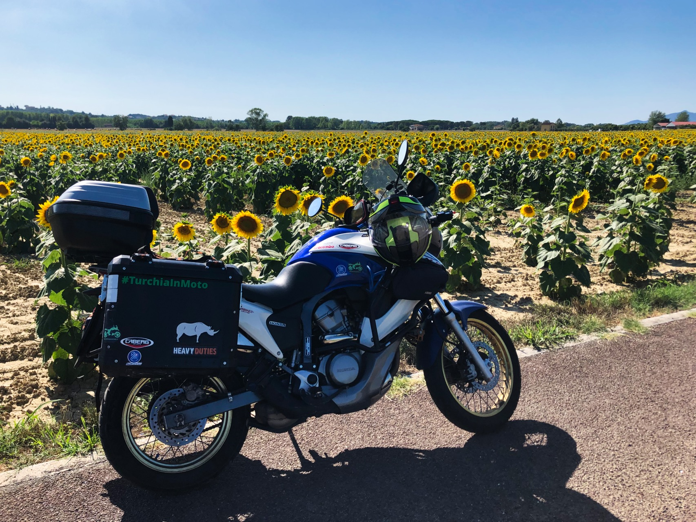
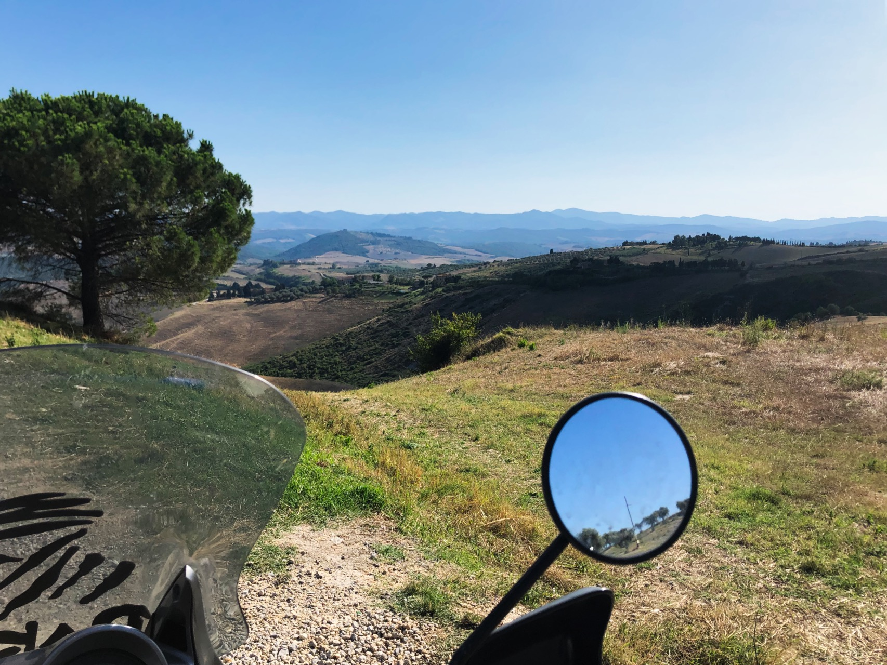
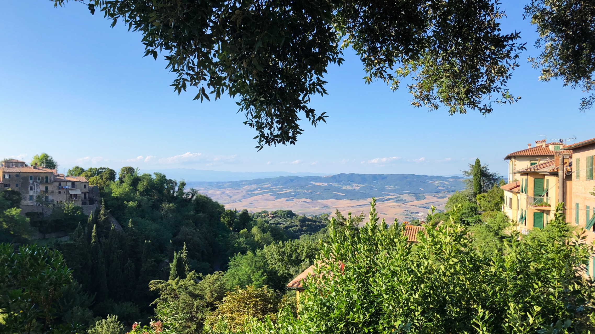

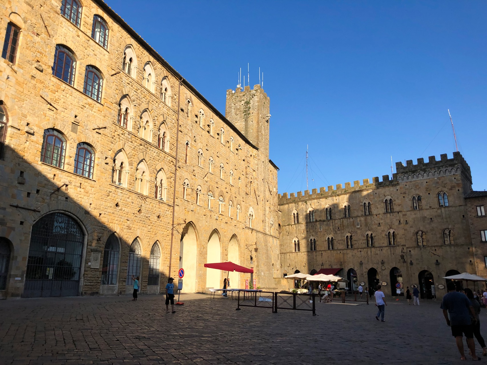
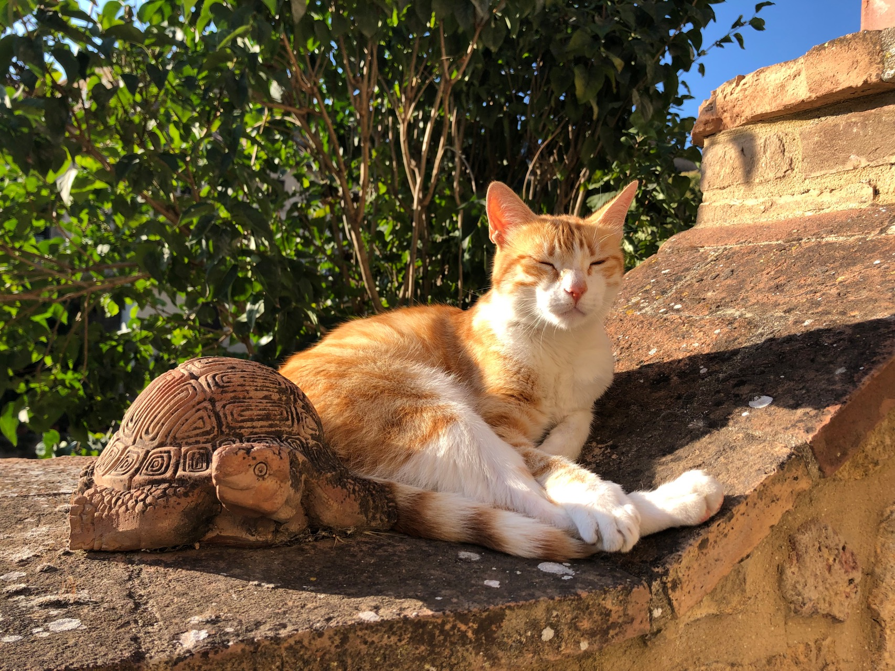

## Giorno 2: Toscana, Lazio, Abruzzo

Alle 6 fa bello fresco (13°C), esco per il checkout ed ecco la sopresa: è possibile lasciare la stanza dalle 08:00, ma sono le 06:30… Vado a fare il pieno, faccio colazione e cerco un supermercato in cui comprare acqua e qualche frutto. Sono le 07:15 ma apre alle 07:30. Prendo una sedia e mi godo il sole che timidamente illumina la porta etrusca di Volterra. Arriva la proprietaria, compro l’acqua, due bottiglie di Gatorade e qualche banana. Speranzoso torno in hotel. Il receptionist è lì, chiedo se posso fare il checkout e scopro che anche lui è un motociclista! Ne approfitto per chiederli una fascetta o del nastro isolante per sistemare il cavo di alimentazione del caricabatterie che intanto mi ha abbandonato. Faccio la riparazione e mi metto in viaggio.

Continua il mio giro nei colli toscani e scopro la vena di romanticismo nel macinare chilometri alle prime luci del giorno: il sole mi scalda in maniera piacevole e il vento fresco mi sferza in faccia tenendomi sveglio. Per oggi ho previsto due tappe: Civita di Bagnoregio (il paese che muore) e il Bosco Sacro (o Parco dei Mostri) di Bomarzo. Tutto il resto sarà quel che sarà. Guido senza sosta tra i colli toscani e arrivo in Lazio. Qui il panorama è completamente diverso e inizia a profumare di Sud.

Arrivo per l’ora di pranzo a **Civita di Bagnoregio**. Lascio la moto nel parcheggio preposto e mi dirigo a piedi fino al belvedere (e biglietteria) sotto il sole cocente per 1,5 km per poi scoprire che c’è un altro parcheggio anche lì. Poco male, lo spettacolo è mozzafiato.

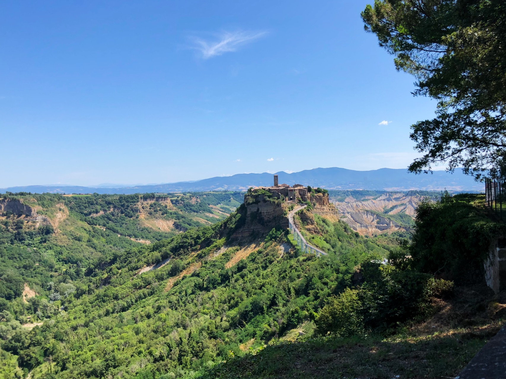
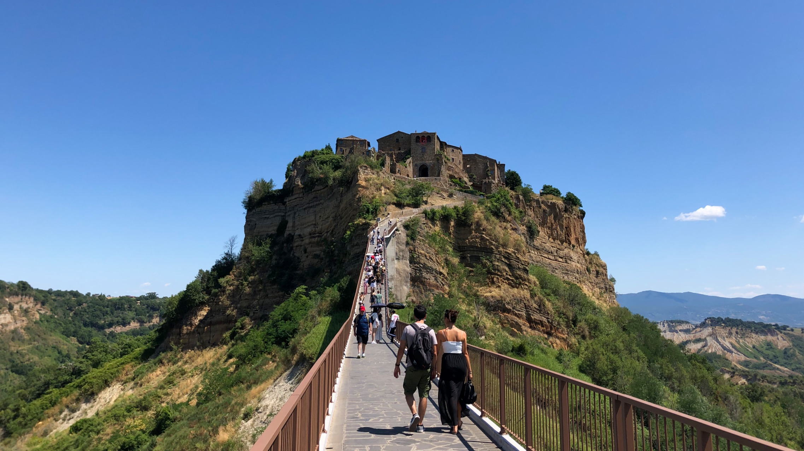

Se pensavo che camminare a Volterra fosse stato difficile è perché ancora non avevo conosciuto il ponte per arrivare a Civita e la sua struttura <em>aggrappata</em> ad una altura. Perdo 5 kg in liquidi, mi accascio in un bar in cui mi concedo granita, caffè e un po' di riposo. Visito la città dopodiché torno alla moto e imposto il navigatore per il **Parco dei Mostri**.

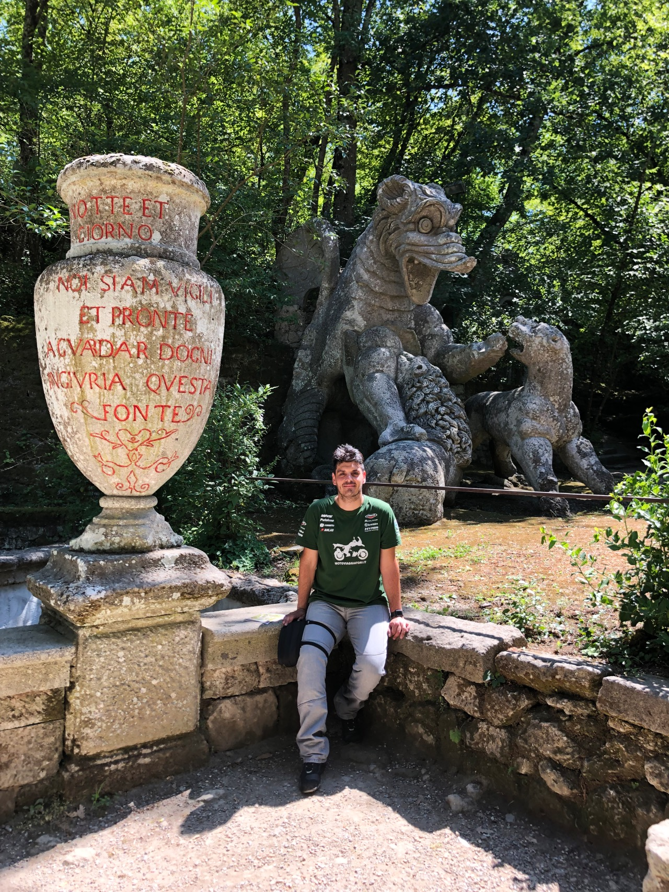
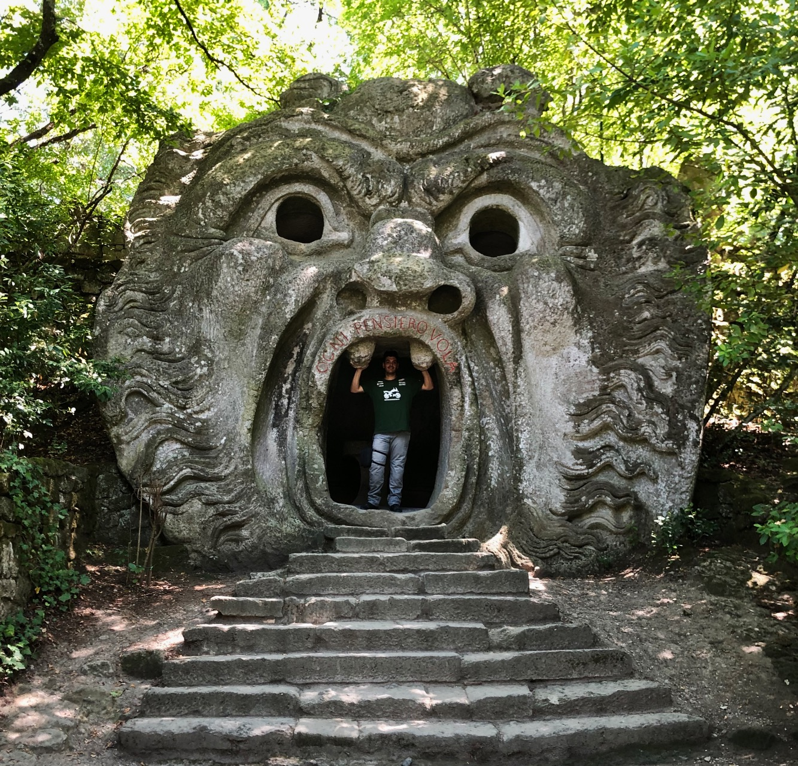

Arrivo sul luogo, faccio il biglietto e visito il bosco. è composto da 31 statue e scopro piacevolmente che è stato progettato dallo stesso architetto che concluse i lavori di San Pietro dopo la morte di Michelangelo. Concludo la visita e mi rimetto in marcia direzione Avezzano, ai piedi del Parco regionale di Abruzzo e delle Gole del Sagittario.

Arrivo in loco in prima serata, effettuo la manutenzione della catena, doccia e chiedo di cenare nel B&B in cui alloggio. Trovo una simpatica pelosetta con cui condividere vino, burrata con tartufo e limoncello. Dopodiché a nanna.

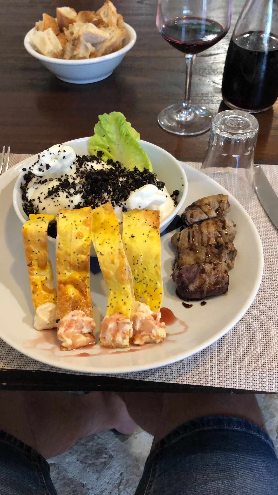

## Giorno 3: Abruzzo, Campania, Basilicata, Puglia

Mi sveglio alle 06.30, doccia, colazione e parto. Già dai primi chilometri capisco che sarà una giornata lunghissima, dovrò fermarmi ogni momento a fare foto… <em>Cammino con gli occhi sgranati, in ogni direzione foraggio per il mio sguardo affamato di meraviglie</em>.

Se girovagando per il Centro Italia vi sale la vena poetica non preoccupatevi, a Taranto passa tutto.

Arrivo alle **Gole del Sagittario**: Un posto stupendo in cui i paesini sono arroccatti nelle rocce e si respira aria di libertà. Capisco cosa voglia dire il contatto con la natura e realizzo che viviamo nel Paese più bello del mondo. Le montagne si specchiano nell’acqua dando un senso di vastità senza precedenti, la stradina tortuosa all’ombra è un piacere da percorrere.

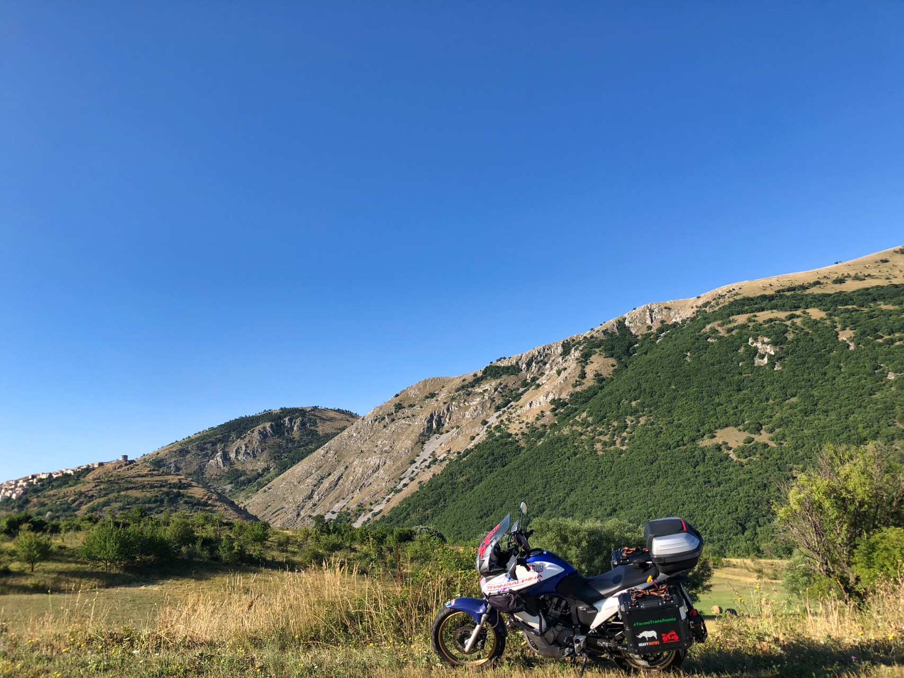
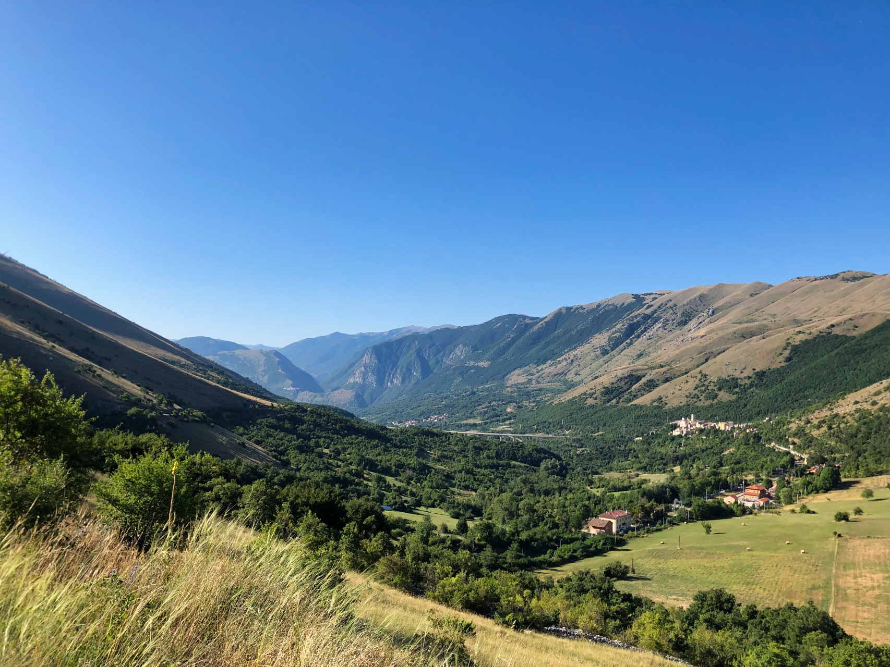
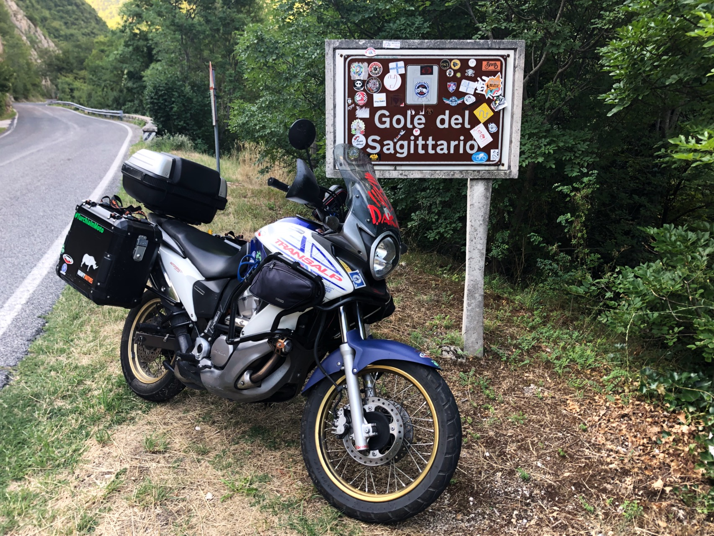

Continuo a salire di quota e dirigermi verso la Campania, arrivando al **Passo del Godi**, 1650 m slm… *not bad*! Scendo a valle, percorro un tratto di strada veloce (e qualche scorciatoia di campagna) per poi ricominciare ad arrampicarmi sul Parco Regionale del Matese in Campania. Tra laghi, pianure, cavalli e strade boscose, rimango estasiato e faccio il pieno di bellezza. Pranzo e mi riposo a San Gregorio. Ultimo paese pirma di scendere a valle e andare in direzione Benevento. È primo pomeriggio e la strada fino a Brindisi è lunga… Mi rimetto in viaggio per affrontare gli ultimi 330 km.

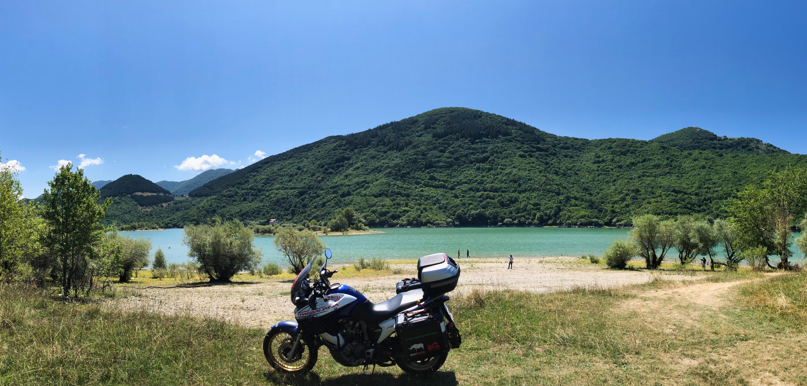
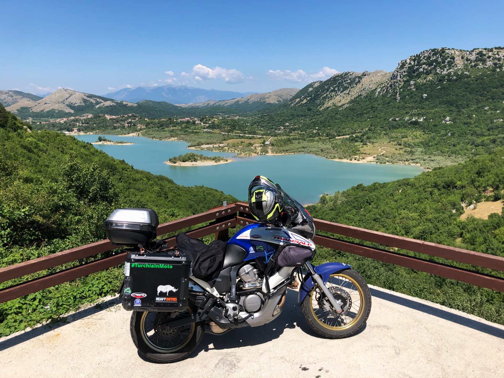

Finscono le montagne, i boschi, i laghi e iniziano i campi. Mi perdo vicino a Pietralcina in un campo, il navigatore insiste nel farmi passare in una strada inesistente in mezzo alle coltivazioni. Chiedo ad un passante e mi dice che sono completamente fuori strada. Seguendo le sue indicazioni riesco a ritrovare la via per Foggia, da cui poi devierò per dirigermi verso Taranto e infine Brindisi.

Macino chilometri e ringrazio di essere satollo di meraviglie poiché il paesaggio non offe molto… Arrivo in Basilicata e percorro agevolmente (ma con molta noia) le sue “autostrade regionali”. Oscillo due, tre volte tra Puglia e Basilicata e dopo due ore e mezza di guida inizio a intravedere la salvezza: le indicazioni per Taranto. Continuo a macinare chilometri di asfalto e arrivo al tumore d’Italia: l’ILVA. Mi fermo a fare il pieno e alle 19:15 arrivo a Brindisi (0m slm).

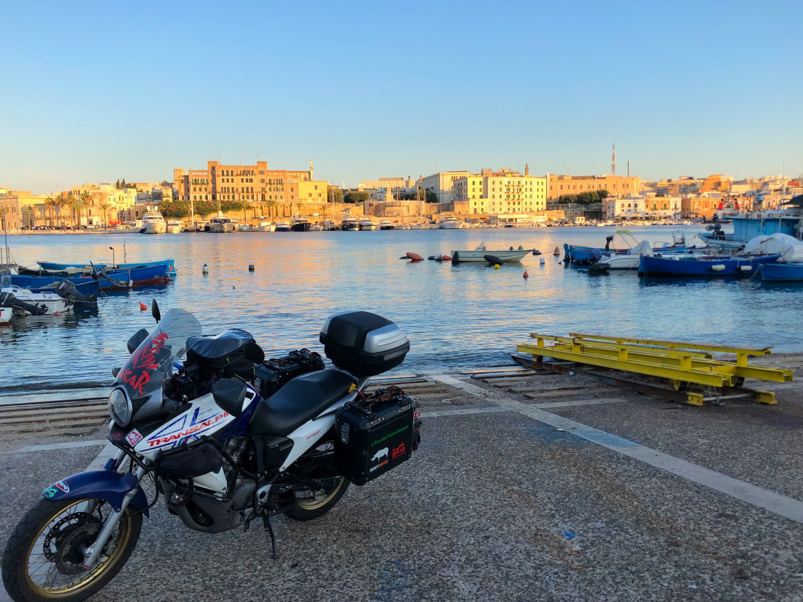
