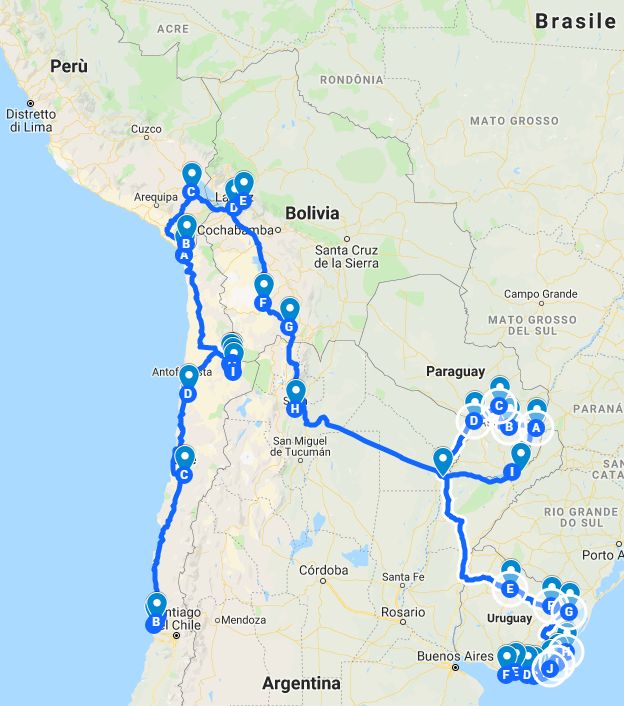

Quando un tempo pensavo ad un viaggio in moto in Sud America, lo vedevo come un’impresa di pochi, lontano dalle mie possibilità, lontano dai miei progetti, ed oggi sono qui che scrivo di come ho vissuto questo viaggio. La vita è meravigliosa.

Certo non è stato semplice arrivare a realizzare questo viaggio. C’è voluto tempo, impegno, sacrificio, sono dovute cambiare le abitudini, ma questo ha reso ancor più appassionate e entusiasmante questa avventura e l’attesa del suo inizio.

La preparazione è stata minuziosa ed è spaziata dalla preparazione della moto, alle tappe giornaliere, ai punti di rifornimenti di benzina, fino alla preparazione fisica. Ho imparato che le cose lasciato al caso, causano perdite di tempo e il tempo è sempre poco.

La moto è partita 50 giorni prima di noi, condividendo il container con altri amici conosciuti sui social. Il porto di destinazione è stato Valparaiso in Cile, dove lo sdoganamento è avvento in tempi rapidi.

Il viaggio parte con una falsa partenza, perché dopo poco più di 250 km siamo costretti a rientrare a Vina del Mar (Valparaiso) per una rottura della puleggia dell’alternatore della moto, evento più unico che raro. Ci sono voluti 4 gg, per riparare la puleggia effettuando ricerche da Vina del Mar a Santiago del Cile, dove disperati abbiamo cercato la puleggia anche nel quartiere colombiano e in quello cinese (cosa che ci era stata sconsigliata), per poi trovare un ricambio simile presso un centro autorizzato BOSCH. Devo ringraziare molte persone che ci sono state vicino e che ci hanno aiutato, in Cile e dall’ Italia, anche perché dopo svariate ricerche sembrava che l’unica soluzione fosse attendere l’arrivo di una nuova puleggia dall’Italia. Il viaggio a volte ha degli imprevisti, ma sta a noi coglierli senza farci travolgere, affrontandoli con il giusto temperamento, creandoci delle alternative in base all’evolvere dei fatti. La regola numero uno rimane l’ottimismo, la costanza e la caparbietà nel volercela fare, avendo sempre a disposizione una alternativa.

(foto 2)

La lunga permanenza a Valparaiso ci dà la possibilità di visitare i suoi innumerevoli grafiti presenti lungo le strette vie che corrono sulla collina, i suoi mercati colorati con verdure fresche di stagione e le spezie profumate, i mercati di pesce dove oltre al pesce fresco, si serve il pesce cucinato lungo la strada con i leoni marini e i pellicani che attirano l’attenzione dei turisti.  Poi c’è Vina del Mar con la sua lunga costa travolta dalle onde potenti dell’oceano, dove è evidente la sua radicata dote turistica accentuata dagli imponenti hotel e dagli innumerevoli ristorantini, con i bambini che giocano con gli aquiloni e i giovani giocolieri che intrattengono i conducenti delle auto ferme al semaforo. Passeggiando lungo la costa veniamo attratti da un gruppo di foche che giocano in acqua ricorrendosi e saltando tra le onde di una costa protetta dagli scogli fino a giungere a Don Dure dove la grande duna alta più di 80 metri con la sua imponenza, sembra travolgere le ricche residenze di villeggiatura che pullulano la costa. Non essendo stagione, la costa nell’ora di pranzo è popolata da numerosi lavoratori in pausa che sono impegnanti nelle attività di manutenzione delle residenze. Chiacchierando con loro emerge che in questi cantieri lavorano intere famiglie, per lo più di immigrati.

(foto 3)

Dopo una settimana dal nostro arrivo in Cile la moto viene riparata e siamo pronti a partire, ma i giorni persi ci costringono a modificare il nostro itinerario, rendendo le tappe ancora più serrate di quanto avevamo previsto inizialmente. Ci impieghiamo 2 gg a raggiungere il deserto di Atacama, percorrendo circa 1700 km. Lungo la strada che costeggia l’oceano si nota il lento cambiare del paesaggio che via via si trasforma in una lunga distesa di terriccio e sabbia comparendo i primi cactus. Dirigendoci verso nord, la presenza di auto si fa sempre più rarefatta. Ci faranno compagnia solo i lunghi camion, che sul posteriore riportano l’indicazione della loro lunghezza, avvertendo così chi volesse superarli.

(foto 4)

Leggo l’indicazione di un paesino che mi incuriosisce e deciso di visitarlo, svoltando a dx e lasciando così la lunga strada asfaltata. Dopo pochi km la strada diventa sterrata, e attorno ci sono solo pochi arbusti e delle capre che pascolano libere. Raggiungendo il gruppo di case, mi sembra di trovarmi in uno di quei vecchi film del far west dove la strada polverosa, i cespugli che rotolano spinti dal vento e le galline che ‘beccano’ a terra rendono tutto molto “SERGIO LEONE”. Le case sembrano tutte chiuse, ma alcune di esse hanno dei lunghi telai di panni stesi, dove affianco sono parcheggiati dei vecchi pick up CHEVROLET.  Al centro del paese c’è un negozzietto che vende alimentari, accessori di prima necessità e GASOLINE pescata da un vecchio bidone ruggine sul quale si trova una pompa a mano. Ci fermiamo per riposarci e per bere una bevanda, ma nei 10 minuti che rimarremmo lì non si fa vivo nessuno.

Riprendiamo la strada principale e alla prima stazione di rifornimento ci fermiamo per riempire il serbatoio. Qui conosciamo una coppia di giovani motociclisti cileni e la loro simpatica coppia di bassotti. Il bassotto maschio è una peste e corre libero sul piazzale della stazione di servizio, incurante dei richiami del padrone e della presenza dei lunghi tir ai quali abbaia. Percorreremo un tratto di strada assieme affiancandoci e selfandoci più volte nei successivi 200 km.
Ci fermiamo per la notte a COPIAMPO dove acquisteremo una tessera telefonica cilena passeggiando in paese, tra le bancherelle che espongono prodotti tipici. Qui conosciamo una coppia di motociclisti che possiede un BMW R1200 GS ADV del 2006 con le stesse colorazioni della nostra prima BMW. Ci invitano ad una festa tra motocilisti che si svolge fuori paese, ma purtroppo non possiamo accettare perché anche il giorno successivo dovremo alzarci presto perché ci aspettano numerosi km.
Il giorno dopo colazione riprendiamo il viaggio. Fa freddo e il cruscotto della moto segna -1 °C. Raggiungerà gli 8 °C solo nel pomeriggio. Il deserto ha sempre nutrito un grande fascino nei nostri confronti ed ora ci troviamo al centro dell’Atacama. Spesso ci fermeremo ad osservare queste lunghe distese di sabbia rotte solo in lontananza da colline di roccia rossastra. Incrociamo i primi rapaci che volteggiano leggeri sopra di noi e che con la loro apertura alare tagliano i freddi raggi di sole che accompagnano questa giornata.

Nel primo pomeriggio raggiungiamo la “MANO DEL DESIERTO”. L’abbiamo a lungo desiderata, e nel raggiungerla, osservavamo continuamente a dx e a sx il comparire di questa meta, fino a quando la presenza di numerosi turisti sulla nostra dx ci indicava l’arrivo alla tanto attesa destinazione. Raggiunta la statua per qualche minuto siamo rimasti in attesa ad osservarla, rendendoci conto che era esattamente come ce l’aspettavamo. I turisti accompagnati dai bus o venuti fin qui in auto ci guardano incuriositi e stringendosi nelle loro giacche a vento freddolosamente ci osservano magari chiedendosi se non avessimo freddo. Per fortuna dopo la foto di rito tutti risalivano in fretta sui mezzi, lasciandoci finalmente l’onore di poter scattale qualche foto davanti alle 5 dita più ammirate e fotografate al mondo. Dopo le foto di rito ci siamo concessi una passeggiata nei dintorni, riscaldandoci e lasciando la moto agli scatti dei turisti.

(foto 5)

Superiamo il tropico del capricorno e nel tardo pomeriggio raggiungiamo San Pedro di Atacama, ma prima ci fermeremo ad osservare da una collina, la valle di Arcoiris popolata dai numerosi turisti che accompagnati dai tour organizzati, osservano il tramonto del sole consumando un aperitivo accompagnato da della frutta. Il tramonto rende rossa tutta la valle. Scatteremo delle foto meravigliose. Arriviamo a San Pedro di Atacama con il buio, sorpresi dal fatto che fuori città la strada non è illuminata, ma è asfaltata, mentre in città la polvere sollevata dai mezzi che ci precedono e che corrono nelle strette vie sterrate della città, offusca le poche luci delle insegne e delle case. Solo il tempo di una veloce doccia e ci ritroviamo dopo una manciata di minuti a cenare in compagnia dei nostri compagni di container che trascorreranno a San Pedro di Atacama l’ultima notte, dandoci preziose informazioni sulle mete da visitare in questa zona.

Una informazione che testiamo fin da subito è la scarsa qualità della benzina venduta in questo luogo, difatti il giorno seguente veniamo svegliati dai continui tentativi di accendere il vecchio pick up del proprietario del B&B che ci sta ospitando. La nostra moto si accenderà solo dopo il 3° tentativo aiutata da un colpettino di acceleratore.

Oggi visitiamo la Valle della Luna che si trova molto vicina alla città di San Pedro. Sembra di essere su un altro pianeta. Le formazioni rocciose scavate dal vento, la sabbia rossastra, il vento che sposta la sabbia facendola volar via e facendole compire dei curiosi giochi di forme in aria. Non ho mai visto niente del genere.

Saliamo sulla grande duna soffermandoci ad osservare lo spettacolo del sorgere del sole che appare tra le montagne in lontananza e avvolge la valle di una luce forte e calda che scalda la sabbia e i nostri corpi rigidi.

La strada è percorsa da numerosi ciclisti che a volte si fermano per le lunghe salite piene di sabbia che impediscono di proseguire in sella. Solo al ritorno comprenderò di aver fatto bene ad arrivare di prima mattina perché questo luogo, inizialmente desertico, viene assaltato da numerosi tour che viaggiano su lunghi pulmini CHEVROLET popolandolo e rendendolo chiassoso e disordinato questo luogo unico. Anche se sperduto questo luogo è costantemente sorvegliato da guardiani che viaggiano su pick up e che seguono i turisti nei loro spostamenti.

 (foto 6)

Uscendo dalla valle della Luna ci attraversa la strada una famiglia di Tagua che corre spaventata,  per prima lungo la strada per poi scendere in una cunetta e scomparendo tra gli erbusti.

Nel pomeriggio andiamo a visitare al centro delle saline di Atacama, la laguna Cejar dove veniamo catturati dall’ azzurro intenso di quest’oasi d’acqua, avvolta dal bianco puro del sale che quasi ci acceca. L’azzurro viene interrotto solo dal rosa dei fenicotteri che piano piano si muovono con sullo sfondo le enormi montagne andine regalandoci uno dei sogni più belli della natura vissuta ad occhi aperti.

Nel percorrere la lunga pista sabbiosa che ci conduce alla laguna, ci fermiamo dopo un forte botto accompagnato da un raschiamento che proviene dalla nostra moto. Subito penso ad una foratura, ma appena fermo mi accorgo che si è rotto il parafango posteriore (ormai sto seminando parafanghi dappertutto; Tunisia - Senegal - Turchia e ora in Cile). Proseguire non è possibile perché il parafango è andato a finire sopra la ruota spezzando due viti e storcendo l’unica vite che lo trattiene. Non sarà semplice svitare quella vite piegata su questa pista polverosa. Questo è un altro insegnamento della strada. Se percorri svariati km su piste sassose, il parafango va rimosso. Tolto il parafango lo conserveremo in valigia, per poi sbarazzarcene al primo bidone dell’immondizia che incontreremo lungo la strada di ritorno.

All’imbrunire la temperatura precipita rapidamente così tanto che sceglieremo di trascorrere la serata nella stanza del B&B. Nel frattempo io e Alice valutiamo varie ipotesi sugli itinerari dell’indomani, perché l’imprevisto meccanico iniziale ci ha rubato molti giorni. La razionalità ci consiglierebbe di non proseguire per il Perù, ma alla fine ce ne freghiamo e decidiamo di riprendere il viaggio proseguendo verso Arica, città di porto e di confine caratterizzata dalla grande collina sulla quale sventola l’imponente bandiera cilena, per poi superare velocemente il confine peruviano, e attraversare l’omonimo deserto fino a raggiungere Puno.

(foto 7)

In Perù lungo la strada veniamo attratti dall’intenso odore di zolfo e dalla presenza di un corso d’acqua di colore giallastro. Dopo il ponte che sovrasta il piccolo fiume Titire ci sorprende la vista di 3 Gyser che fuoriescono da una roccia formando un triangolo d’ acqua termale che scende a valle. Ci troviamo nell’area termale di Puerte Bello.

(foto 8)

In prossimità di Puno veniamo attratti dalla vista del lago navigabile più alto al mondo, dove ogni cosa appare piccola e insignificante, perché il paesaggio è rubato da questa enorme distesa d’acqua che riflette il cielo dove le nuvole ci corrono sopra e le grandi montagne della Cordigliera Real sembra che lo contengano. Il termine Titicaca significa “roccia del Puma” perché secondo le popolazioni indigene, il lago ha una forma di un puma che caccia un coniglio. Nel lago Titicaca ci sono 34 isole grandi e piccole abitate da etnie quequa e aymara. Abbiamo letto che è possibile dormire in alcune di queste isole nelle case delle famiglie che ci abitano, le quali si rendono disponibili ad ospitare turisti. I turisti devono adattarsi subito ai ritmi del sole, quindi sveglia di buon mattino e a letto quando fa buio nel tardo pomeriggio, in camere senza riscaldamento con un piatto di papas, del formaggio di capra e infuso di munja selvatica. Sicuramente questo è il modo migliore per entrare a contatto diretto con questa terra e la sua gente e quindi chiediamo informazioni, ma per organizzare la cosa servono 3 gg e quindi siamo costretti a rimandare.

Soggiorniamo davanti all’isola Esteves e ben presto ci accorgiamo che l’hotel è frequentato da europei, i quali incuranti del fatto che stiamo scaricando i bagagli della moto , ci chiedono di scattare loro delle foto affianco alla moto. La sera conosciamo un gruppo di italiani che abitano nella nostra provincia e che si trovano lì per un tracking sulle ande. A tutti sorprende la nostra presenza in sella ad una moto in quel luogo, ed essendo loro stessi dei motociclisti, ci fanno la solita lista interminabile di domande scontate e banali tipo: Non è pericoloso? Come fate contro il freddo? E se si rompe la moto?…

Il giorno seguente ci dirigiamo al porto di Puno dove acquistiamo il biglietto del traghetto che ci accompagnerà a visitare l’isola fluttuante di Urus e l’isola di Taquile. Partiamo in orario attraversando i canneti che si trovano in prossimità delle sponde del lago e che proteggono i nidi delle numerose oche. Ci dirigiamo verso Urus dove veniamo accolti dal capo villaggio e da un gruppo di famiglie che impreparati corrono a dx e a sx per sistemare il piccolo spiazzo che ci accoglierà sull’isola. Ci sono donne e bambini, ma di uomini neanche l’ombra. Solo poi comprenderemo che gli uomini sono impegnati nella raccolta di grandi blocchi di terra che servono per mantenere queste grandi isole chiamate fluttuanti proprio perché possono salire e scendere seguendo il livello del lago e possono essere spostate come fossero delle grandi chiatte.

Quando attracchiamo all’isola e mettiamo piede sulla stessa, i nostri piedi sprofondano sulle canne di totora piegate e intrecciate fra loro per creare un piano asciutto e pulito dandoci l’evidente impressione di galleggiare sull’acqua. Il capo villaggio ci accoglie con il tipico benvenuto e ci intrattiene raccontandoci le origini di quest’isola nata per proteggere la gente del posto dagli attacchi bellicosi degli inca che miravano alla conquista delle sponde del lago. Poi ci spiega l’organizzazione gerarchica dell’isola e i compiti di ogni abitante. Tutta la presentazione ha un prevedibile fine commerciale che si conclude con l’acquisto di artigianato locale. Preferiamo proseguire il viaggio su una tipica barca tradizionale la REED BOAT trainata sul fianco da un motoscafo dove una ragazza si raccoglie i capelli annodandoli in una lunga treccia bagnata dalle acque del lago.

(foto 9)

Una lunga attraversata ci separa dall’isola di Taquile dove il turismo è strettamente controllato dagli anziani dell’isola col fine di mantenere la cultura della stessa. Per raggiungere il paese occorre percorrere 500 scalini. Certo gli oltre 3800 metri non aiutano a salire al paese, ma l’accoglienza e la gente del posto ci allietano la passeggiata ammirando l’artigianato locale e le coltivazioni di patate, quinoa, fagioli e mais. Incuriosisce che tutti gli uomini e le donne indossino gli abiti tradizionali. Gli uomini sposati hanno il cappello rosso, mentre quelli celibi indossano il cappello rosso e bianco. Le donne indossano gonne multistrato e camicie ricamate. Attorno alla grande piazza del paese veniamo accolti da numerosi ristorantini e negozi, ma ciò che la fa da padrone è la vista meravigliosa sul lago con in lontananza un grande vulcano innevato. Nei ristoranti del paese si mangia la sopa casalinga e la trota del lago appena pescata, una vera delizia. In questo paese si respira aria di assoluta tranquillità, tanto che gli stessi proprietari delle bancarelle a volte dormono seduti con i gomiti appoggiati alle ginocchia e le mani che sostengono la testa. Notiamo che il conducente del traghetto utilizza come merce di scambio delle foglie di coca che conserva in un sacchettino legato alla vita. Dopo pranzo proseguiamo la passeggiata scendendo dall’altra sponda della collina e risalendo sul traghetto che ci ricondurrà a Puno in tarda serata.

Il giorno seguente ci rimettiamo in strada di buon mattino, scelta azzeccata per la lunga strada da percorrere, un po’ meno per il freddo pungente. Arrivati alla dogana peruviana proseguiamo dritti senza accorgerci dell’indicazione e quindi dopo qualche centinaio di metri siamo costretti a tornare indietro. Le pratiche sono veloci, e molto simili a quelle del confine cile-peruviano. Al confine sorprende la fila interminabile di TIR che attendono il permesso di proseguire. Costeggiamo il lago Titicaca per qualche decina di km e poi ci faranno compagnia solo lunghe distese di praterie e qualche piccolo agglomerato di case vicino alle quali pascolano dei maiali di piccole dimensioni che inizialmente avevamo scambiato per dei cani.

(foto 10)

Arrivati a La Paz siamo costretti ad entrare in città per cambiare un po’ di soldi e per fare il pieno di benzina alla moto. Pur costretti ci rendiamo subito conto di non aver fatto una buona scelta ad entrare in città perché ci sono numerosi semafori, che spesso non superiamo neanche con il colore verde a causa dell’intenso traffico. Ci sono centinaia di pulmini, tutti suonano, tutti vogliono passare, tutti chiedono di rimettersi in marcia o di fermarsi da un lato. Tra la confusione verremmo tamponati, per fortuna non avevo nessuno davanti a noi e non avevo ne’ il freno pinzato, ne’ la marcia inserita.

Ciò che mi complisce a La Paz, oltre al traffico disordinato, ai clacson continuamente azionati, e alla presenza di vigili del traffico che con un fischietto al centro della strada (non protetti da alcun’che), cercavano di ricondurre il traffico impazzito e confuso alla normalità, è la presenza di numerosissime tende lungo la strada che occupano tutti i marciapiedi e che ospitano immigrati di paesi vicini in cerca di una vita migliore.

Superato il caos di questa metropoli, proseguiamo verso Coroico per poi imboccare la CARETERA DELLA MUERTE o YUNGAS ROAD. Imboccata con semplicità (anche se temevo di non trovare l’accesso) noto che viene chiamata DEATH ROAD o CAMINO DE LA MUERTE. Si tratta di una strada in parte asfaltata e per buona parte sterrata senza parapetto che corre da La Cumbre a Coroico. Visibili lungo la strada alcune croci, quasi a ricordare la pericolosità di quel luogo. Lungo la strada incrociamo alcuni ciclisti e un pick up che ci fa segno di fermarci. Il conducente ci dice che la strada è chiusa per uno smottamento, che verrà rimosso solo nell’arco di qualche ora. Visto l’orario e la prenotazione dell’hotel fatta a Coroico, decidiamo di fare ritorno alla strada asfaltata per giungere all’hotel solo in tarda serata. L’indomani le scarse informazioni raccolte dal proprietario dell’hotel unite a quelle di una agenzia che organizza la giornata in sella alle mountainbike ci costringono a fare ritorno a La Paz su asfalto per poi proseguire verso Uyuni.

Nella regione di Oruro troviamo un asfalto liscio e deformato dal transito dei grandi camion e dalle corriere a due piani e un paesaggio piatto estremamente noioso, fatto di grandi praterie deserte, abitato da pochi alpaca che spaventati si allontanano quando ci fermiamo per fare loro delle foto. Nella regione di Potosi, la desolazione fa spazio alla sabbia che fa largo solo a poveri corsi d’acqua, ristoro per piccoli greggi di alpaca condotti da pastori soli, con la pelle di colore marrone segnata dal vento e dal sole.

Avevo letto che il modo più rapido per raggiungere il monumento di DAKAR BOLIVIA dalla strada asfaltata era prendere una deviazione al paese di Colchani, quindi arrivati al paese, anche se ancora con la moto carica, devio verso dx puntando una carovana di fuoristrada che sfrecciano leggeri sulla sabbia di una pista poco battuta. Riesco a non insabbiami, ma proseguo lentamente fino a che la pista si fa di terra battuta e quindi posso aumentare la velocità fino ad una collinetta che mi fa guadagnare la pista principale, inizialmente in buono stato, ma che poi si intervalla a pozzanghere profonde e piene d’acqua e sale, che spesso mi costringono a brusche deviazioni, alternate a frenate. Quando finalmente la concentrazione nella guida viene ridotta dal miglioramento dello stato della pista mi accorgo che davanti a me c’è lui… ci sono, non ci credo, sono emozionato, quasi incredulo, sono sul lago salato Uyuni, mi viene da piangere, ma non posso farmi trascinare dall’emozione devo stare concentrato nella guida perché ormai ci sono. Lo strato di sale rende la superfice scivolosa, ma non mi impedisce di accelerare rendendo gli avvallamenti di sale sempre meno percettibili quasi come mi trovassi a viaggiare su una nuvola; FANTASTICO. Percorsi alcuni km sul lago salato, mi fermo ad osservare questa meraviglia che ci acceca e che riflette il sole tiepido con un vento leggero che ci accarezza la pelle raffreddandola e ricordandoci i 6°C di questa giornata. Sarà difficile levare il casco, ma le foto in questo luogo sono la coronazione di un grande sogno, sono il risultato di tanti sacrifici. Risaliamo in sella per raggiungere il monumento di DAKAR BOLIVIA. E’ una giornata strepitosa, la ricorderò per tutta la vita. Ogni parola non può descrivere l’emozione di trovarsi qui, difronte a questo monumento, in un luogo così magico, per non parlare della Plaza de Las Banderas Uyuni che si trova a qualche centinaio di metri dal monumento e che ospita numerose bandiere di varie dimensioni provenienti da tutto il mondo. Li vicino l’omonimo ristorante e museo con davanti la fontana.

(foto 11)

Nel frattempo le luci della moto iniziano a riflettersi sul fondo bianco del lago, segno che ormai si fa sera e quindi dobbiamo dirigerci verso Uyuni dove trascorreremo la notte. Nel frattempo il tramonto che si trova dietro di noi ci costringe a fermarci più volte per scattare delle foto meravigliose. Raggiungiamo la città sul lago salato rincorrendo i numerosi fuoristrada che rientrano in città per decine di km e una volta arrivati ci rendiamo conto che le guide lette prima di partire per questo viaggio, non esageravano quando indicavano la città di Uyuni come un gruppo di case tra strade sabbiose, che non sapeva dare molto ospitalità al turista venuto fin qui per visitare il grande lago salato.

Il giorno seguente decidiamo di visitare il lago salato su un fuoristrada. Il Tour ci terrà occupati per tutto il giorno accompagnandoci a visitare il cimitero dei treni, il monumento di DAKAR e la Isla Incahuasi, uno sperone collinare e roccioso che si trova in questa pianura di sale con una forte presenza di cactus e sulla quale si può godere la vista di questi 10.582 km quadrati di bianco. L’isola Incahuasi ha svariati nomi, tra i quali INKA WASI o meglio tradotta come terra INCA, o isola del Pescado perché a forma di pesce. La giornata si concluderà osservando il trasmonto riflettersi nelle limpide acque di questo lago, sorseggiando del buon bicchiere di vino boliviano.

L’indomani partiamo verso il confine argentino, quando dopo circa 200 km ci troviamo a percorrere una strada tra canyon e gole in una cornice racchiusa tra montagne stratificate di vario colore. Prendiamo una pista che ci fa scendere in un canalone dove le montagne ci sovrastano e i cactus delimitano il tratto di strada ghiaioso, quando ci accorgiamo di trovarci in un letto di un fiume ridotto ad un piccolo filo d’acqua che crea sulla strada pozzanghere che proseguendo crescono di dimensione e profondità. La pista non è segnata sul nostro navigatore, ma la città sembra vicina, quindi decidiamo di proseguire fino a che notiamo che davanti a noi ci precede un auto che seguiamo, fino a quando la strada termina davanti ad un cancello di una residenza privata. Nel valutare cosa fare, notiamo che poco sopra di noi c’è la strada principale e quindi decidiamo di raggiungerla superando un dirupo alto qualche metro. Raggiunta la strada ghiaiosa  notiamo che a qualche centinaio di metri c’è un camion cisterna. Proseguendo il colore della strada cambia diventando sempre più scuro, e le ruote tendono a scivolare, quasi fossero bucate. Mi fermo con cautela e mettendo a terra i piedi comprendo che il suolo è molto scivoloso. Alice scende dalla moto e subito mi dice di uscire da quel tratto di strada perché la moto è coperta di catrame. Consultando la cartina in abbinata al navigatore, notiamo che proseguendo per quella strada saremmo arrivati in paese. Riguadagniamo quindi la strada procedendo con cautela, quando alla fine di quello che doveva essere un tratto di strada in manutenzione troviamo 3 grandi mucchi di terra posti al centro della carreggiata che dovrebbero evitare l’accesso. Levando dei grossi sassi riesco a passare tra due di questi grandi mucchi di terra arrivando in paese in una manciata di minuti e fermandomi al primo autolavaggio, dove per lavare la moto serviranno 4 litri di gasolio per togliere tutto il catrame che nel frattempo si era appiccicato alla stessa.

(foto 12)

A quell’autolavaggio conosciamo una famiglia di colombiani che con un piccolo van stanno visitando il Sud America. La famiglia è composta da padre, madre e figlia di 10 anni. Facendo amicizia capiamo che sono li per la rottura di un manicotto del van. Mi rendo disponibile a recuperargli il pezzo alla prima città, ma a loro non interessa. Hanno davanti altri 10 mesi di viaggio e se il destino li ha fermati li, un motivo ci sarà, quindi preferiscono conoscerci e scambiare consigli e opinioni di viaggio piuttosto che preoccuparsi di ciò che si può aggiustare. Sarebbe bello viaggiare senza limiti di tempo e denaro. Lavata la moto proseguiamo il viaggio salutando i nostri nuovi amici e scambiando i nostri profili social.

Arriviamo presto al confine argentino, che superiamo in circa 40 minuti, dirigendoci a La Quiaca, un paese di confine dove trascorreremo la notte passeggiando per le vie del centro in compagnia di musica e bancarelle.

Nei giorni successivi visiteremo Salta nota per la sua architettura coloniale, la cattedrale, e il suo “treno delle nuvole” che raggiunge Antofagasta e poi visiteremo Cafayate noto centro turistico dove percorreremo la bellissima valle del Calchaquies. Da qui percorriamo la RUTA 16, una strada monotona e piatta tra le praterie argentina, resa vivace solo per un tratto di 70 km dove sull’asfalto troviamo enormi e profonde buche che a tratti ci costringono ad uscire dalla carreggiata viaggiando sulla sabbia. I mezzi che incrociamo viaggiano fuori dalla carreggiata alzando nuvole di polvere che ci investono riempendoci di sabbia e costringendoci a brusche frenate per la scarsa visibilità. Superato questo lungo tratto siamo pronti ad entrare in Paraguay passando per l’Isla Yacyreta che si raggiunge superando un grande ponte, ma veniamo fermati dai doganieri che ci costringono a raggiungere Posadas per oltrepassare il confine. Oggi fin qui abbiamo percorso 800 km, non sono certo questi 130 km che ci infastidiscono, se non fosse per il fatto che sono le 19,00 e il tramonto non tarderà a lasciare il posto al buio della notte. Per fortuna la strada è asfaltata e incrociamo qualche auto che con i suoi fari ci aiuta a percorrere questa strada così buia, rimanendo costantemente con il pensiero degli animali liberi che incrociamo lungo la carreggiata durante il giorno.

Superiamo la dogana con un buio pesto oltrepassando il lungo ponte sul fiume Paranà che ci permette di raggiungere gli imponenti hotel illuminati che popolano la grande spiaggia di Encarnacion. Sul Paraguay non abbiamo raccolto informazioni rassicuranti, perché chi c’è stato ce lo ha descritto come un paese in cui la polizia effettua numerosi controlli costringendo a lunghe soste ingiustificate. I consigli sono importanti, ma abbiamo compreso che dipendono molto dall’esperienza di chi lo racconta e da quanto uno vuole farsi “FIGO”, quindi negli anni abbiamo deciso di fregarcene. Nessuno in questi 3 gg ci ha fermati, anzi ad un semaforo che ho superato con il rosso, mi ha raggiunto un poliziotto motociclista che affiancandosi mi ha consigliato di stare più attento.

Uscendo dalla citta di Encarnacion notiamo che le strade corrono tra le palme e sono ben tenute con un traffico regolare. Tutto troppo noioso per noi, e quindi decido di compiere una deviazione non programmata verso la città Tebicuarymi per andare a visitare il Salto Crystal una delle attrazioni di questo paese. Si tratta di una cascata raggiungibile lungo una strada sterrata scarsamente segnalata, non frequentata e piena di strade che deviano a dx e a sx e che non lasciano possibilità d’errore. Per accedere all’area che ci condurrà al Salto Crystal occorre pagare un compenso per niente economico al contadino proprietario di questa terra, che coltiva la terra per la gente del suo villaggio, allevando galline e maiali che corrono composti davanti a noi. Raggiunto un piccolo prato ci dobbiamo fermare perché l’area davanti a noi è transennata. Parcheggiamo la moto e ci incamminiamo lungo il sentiero per circa 3 km, tra rocce e pendii, oltrepassando ruscelli lungo i quali uccelli neri di grandi dimensioni (abbiamo poi scoperto essere l’”URUBù”) ci osservano per niente impauriti, quasi a volerti sfidare nel loro habitat. I ruscelli che si trovano lungo il cammino, ci impediscono di comprendere la vicinanza della cascata, che compare solo quando, ormai esausti avevamo perso le speranze di vederla. Appare subito una cascata alta, ma semplice con ai suoi piedi un laghetto dalle acque limpide e fredde, visibile solo grazie ad una sottile luce che traspare dalla folta vegetazione che la circonda.

(foto 13)

Raggiungere Asuncion potrebbe essere semplice, perché basta ripercorrere la strada di andata al contrario, per poi imboccare la gran ruote, ma decidiamo di chiedere al contadino di indicarci solo strade sterrate che passano per i villaggi dell’entroterra in direzione della capitale. Nel percorrere queste piste incrociamo solo qualche motorino e un grosso camion, che non riusciamo a superare perché inizialmente la strada è stretta, ma poi la vegetazione è così fitta e bassa che il grosso camion spezza i rami delle piante facendoli immancabilmente cadere sulla carreggiata, costringendoci a continui slalom. Decidiamo quindi di fermarci. La gente che incrociamo ci sorride e ci saluta, i bambini ci rincorrono con grida di gioia. Le case sono fatte di paglia con il tetto in lamiera, e la gente rimane seduta davanti all’uscio chiacchierando con i famigliari in compagnia della immancabile musica sud americana. La gente vive in un questo ambiente che trasuda di genuinità, di valori semplici come la famiglia, di attaccamento alla terra, di natura pura e esuberante, tra strade a tratti impercorribili per il fango, torrenti che se ne infischiano del fatto che quella è una strada, di ponti tappezzati di tavole fissate una sull’altra che anche oggi sopporteranno il peso di un altro mezzo che le sovrasta. Questo era ciò che cercavamo e questo è il meglio che questa terra ci ha regalato.

Le piste di terra rossa proseguono fino a una cinquantina di km dalla capitale dove arriveremo poche ore prima della partenza del volo di Alice.

Oggi non è stato un giorno di viaggio come gli altri. Ogni volta che i miei occhi incrociavano quelli di Alice, cascavamo in un vortice di silenzio e tristezza, perché da stasera proseguirò questo viaggio solo in quanto Alice deve rientrare a lavoro. Separarci è sempre molto difficile.

Le piste del Paraguay mi sono piaciute così tanto che le ho percorse anche il giorno successivo, dirigendomi verso nord per poi piano piano, riprendere la strada che mi condurrà al confine Argentino, quando ad un tratto incontro un motociclista che in compagnia di sua moglie sta smontando la camera d’aria della ruota anteriore. Mi fermo per aiutarlo, e contrariamente a ciò che mi aspettavo il motociclista non ha con se alcun attrezzo per la riparazione. Fortunatamente con me ho delle camere d’aria con relativo materiale di riparazione, che mi servono solo nel caso in cui dovessi strappare un tubeless. Ripariamo la foratura in una quindicina di minuti, ma quando arriva il momento di gonfiare il copertone, ci accorgiamo che la sua pompa a mano ha il beccuccio troppo grande. Per fortuna con un po' di nastro americano avvolto attorno alla valvola della camera d’aria riusciremo a gonfiare il copertone mentre la moglie del motociclista ci filma con il telefonino ridendo e godendosi la scena di io che rimprovero il motociclista mentre sudato aziono la pompa mentre il motociclista con le mani tenta con scarsi risultati di trattenere l’aria che fuoriesce dalla valvola.

Il giorno seguente supero il confine paraguayano ed entro in Argentina dirigendomi nel Parco nazionale Iberà, dove si trova una delle più vaste aree umide del Sud America. Ho cercato informazioni sul parco, ma non sono riuscito a trovarne e quindi mi dirigo prima verso Puerto Valle per poi scendere lungo la dorsale del parco, fino a raggiungere il centro de Interpretation Aguas Brillantes nella LAGUNA IBERA’ dove è possibile accedere al parco ammirando da vicino la flora e la fauna di questo ricco habitat tra cervi, capibara, caimani e uccelli di vario genere. C’è la possibilità di fare una gita in motoscafo accompagnati dalle guardie del parco, oppure di camminare su una lunga passerella di legno che ti permette di vedere da vicino la laguna e la sua natura.

Il mio viaggio prosegue verso Concordia dove supero il confine con l’ Uruguay sulla diga di Salto Grande Bridge Internacional e da qui proseguo sulla RUTA 26 una strada che corre in collina molto dissestata piena di ranch e grandi appezzamenti di terra recintati. Incontro struzzi liberi e uomini a cavallo che portano le mandrie al pascolo. Incuriosito dalla bellezza di questi luoghi, entro in un ranch e percorro la pista che attraversa la grande prateria facendo scappare i cavalli fino a raggiungere la fattoria, dove vedo fermi davanti alla casa due uomini a cavallo, ai quali chiedo informazioni con il pretesto di essermi perso. Mi invitano a bere del vino con loro, ma spiego loro che quando guido non bevo alcolici e quindi come fossimo vecchi amici mi raccontano della loro famiglia, spiegano che loro lavorano in quel ranch e tornano a casa solo una volta ogni due  settimane alternandosi la presenza al ranch. Il proprietario possiede anche altre proprietà nella zona tramandate di padre in figlio.

Riprendendo la strada sono fortunato perché vedo una scena bellissima; incrocio due mamme in sella al cavallo con aggrappati i propri figli che con le cartelle a tracolla colorate raccontano di come è andata la giornata a scuola.

Quando ormai sono a circa 150 km dalla costa, incrocio un motociclista brasiliano con il quale mi fermo a fare conoscenza. Mi invita a seguirlo percorrendo la RUTA 14 che corre in una laguna sul CAMINO DEL INDIO. La strada subito sterrata e polverosa per l’intenso traffico, migliora con i km fino a divenire poco trafficata, ma migliora decisamente quando prosegue attraversando una laguna fantastica con acqua da entrambi i lati piena di mangrovie e gruppi di fenicotteri. Arrivati a Chuy saluto il motociclista brasiliano che prosegue verso nord, mentre io mi dirigo verso Punta del Diablo incuriosito dal nome del paese, dove trascorro la notte.

Il giorno seguente attraverso la laguna di Rocha che unisce Paloma a Santa Isabel. La vicinanza alla spiaggia mi fa intuire che ci possa essere della sabbia sulla pista che non tarda a fare la sua comparsa. La laguna è bellissima e desolata. Solo arrivando nei pressi di Santa Isabel incontro alcune persone. Il viaggio si concluderà a Montevideo dopo essere transitato a Punta del Este dove la statua sulla spiaggia mostra le 5 dita di una mano, simbolo di questa città dal carattere e dalla dote puramente turistica.

(foto 14)

Soddisfatti di questo viaggio che ha distinto questa prima tappa in America, non possiamo che attendere che arrivi presto Dicembre per riprendere la strada verso sud.

Buona strada
