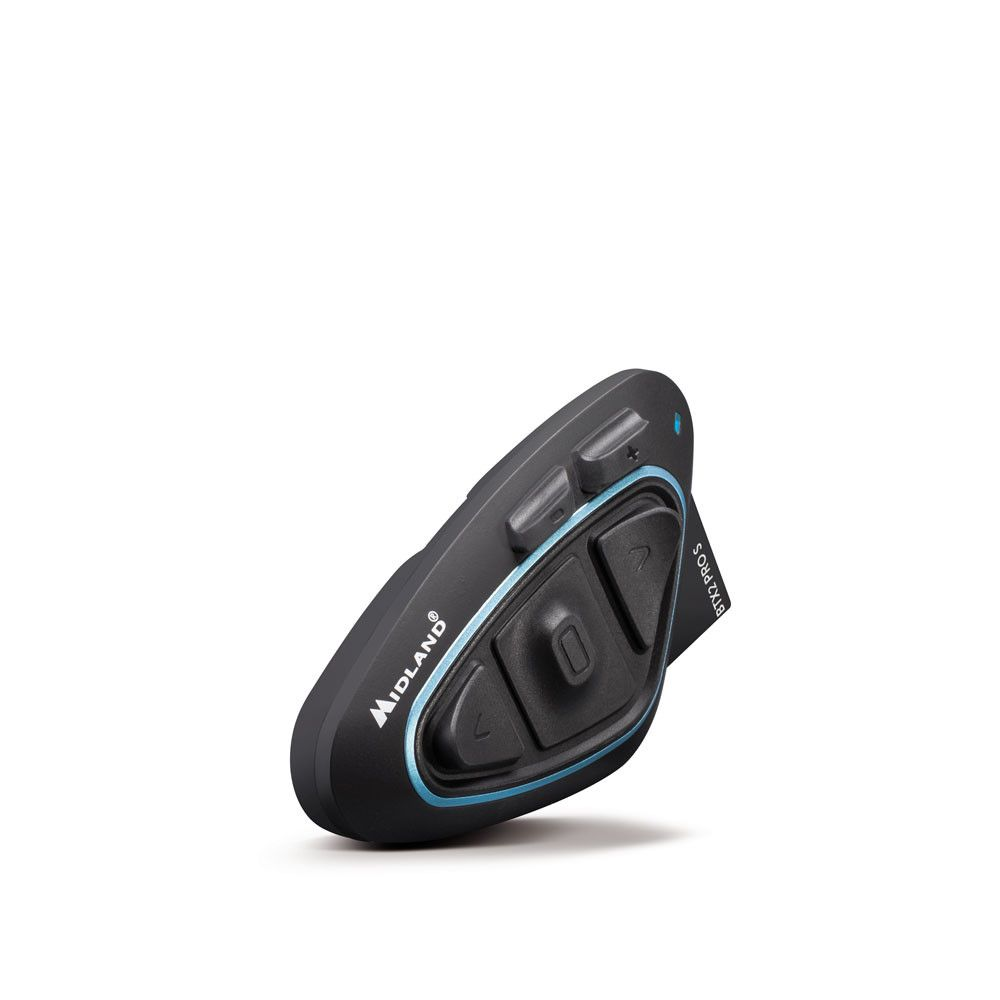
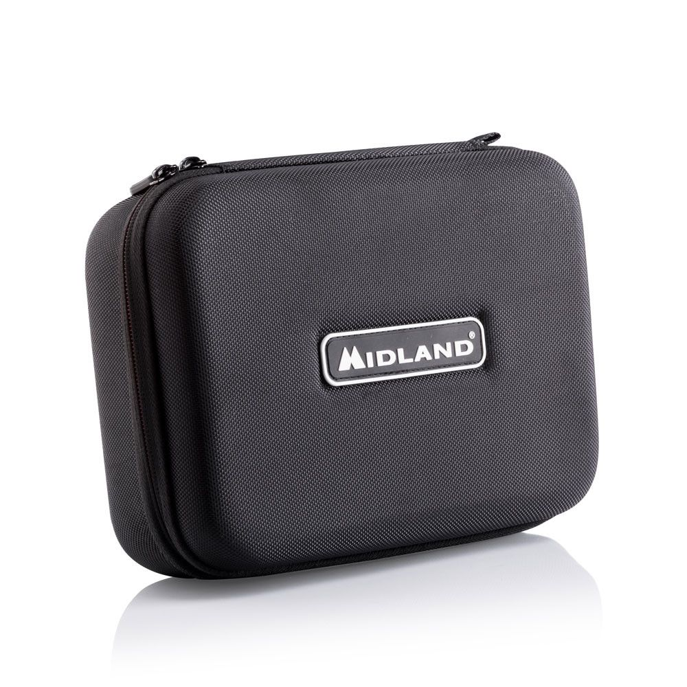
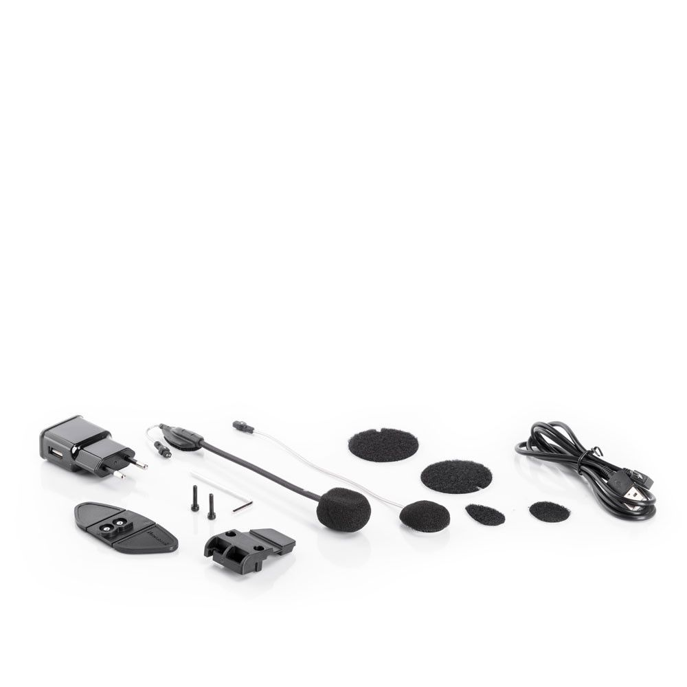

## La gamma Midland

Midland è un brand nato nel 1959 in una piccola fabbrica di Kansas City, oggi leader mondiale nel settore della radiocomunicazione ed elettronica di consumo. L'italiana CTE International entra a far parte della sua storia negli anni ’70 grazie a una partnership commerciale europea; negli anni ’90 acquisisce una quota significativa dell’azienda americana, contribuendo al suo successo in tutto il mondo.

Oggi gli interfoni moto Midland nascono in Italia, più precisamente nel quartier generale di Reggio Emilia, prima tappa del nostro [viaggio in Turchia](/categoria/viaggi/turchia), dove abbiamo preso contatto con gli interfoni che ci accompagnano da diversi mesi in tutti i nostri viaggi e gite: 3 [BT NEXT PRO](https://amzn.to/3491EWe) accompagnati da due esemplari di [BTX1 PRO S](https://amzn.to/2Zxo0gS) e [BTX2 PRO S](https://amzn.to/2zvzHdo) (che al momento del test non erano ancora disponibili sul mercato).

Il **BT NEXT PRO** è l'attuale top di gamma, mentre **BTX1 PRO S** e **BTX2 PRO S** sono un sostanzioso aggiornamento rispetto ai *vecchi* BTX1 PRO e BTX2 PRO: sono migliorate di molto ergonomia, portata e funzionalità Bluetooth.

Tutti gli interfoni della linea PRO condividono lo stesso kit audio da inserire nel casco e la slitta di connessione, rendendoli perfettamente intercambiabili tra loro; le caratteristiche sono molte e il sistema più pratico per mostrarvele tutte è una buona, vecchia tabella corredata da spiegazione delle varie voci:

|                           |    BTX1 PRO S    |    BTX2 PRO S    |   BT  NEXT PRO   |
|---------------------------|------------------|------------------|------------------|
|    **Portata massima**    |       800m       |       1200m      |       1600m      |
| **Intercom punto-punto**  |     3 persone    |    6 persone     |    6 persone     |
|  **Intercom conferenza**  |     3 persone    |    8 persone     |    8 persone     |
|     **Talk to all**       |        ✓         |        ✓         |        ✓         |
|         **DNK**           |        ✓         |        ✓         |        ✓         |
|         **AGC**           |        ✓         |        ✓         |        ✓         |
|         **VOX**           |        ✓         |        ✓         |        ✓         |
|    **Chip Bluetooth**     | v4.2 single chip |  v4.2 dual chip  |  v4.2 dual chip  |
| **Dispositivi Bluetooth** |        2         |        2         |        2         |
|    **Audio Background**   |       mono       |       AD2P       |       AD2P       |
|       **Radio FM**        |        ✓         |        ✓         |        ✓         |
|      **Waterproof**       |       IPX6       |       IPX6       |       IPX6       |
|      **Stop Light**       |        ✗         |        ✗         |        ✓         |
|      **BTT button**       |        ✗         |        ✗         |        ✓         |
|      **Autonomia**        |       23 ore     |      23 ore      |       20 ore     |
|    **FW Aggiornabile**    |        ✓         |        ✓         |        ✓         |
|    **Prezzo singolo**     |      €168,99     |     €228,99      |      €279,00     |
|     **Prezzo TWIN**       |      €288,99     |     €419,00      |      €459,00     |

- **Portata massima**: è la massima distanza a cui è possibile comunicare in uno spazio aperto senza ostacoli per una comunicazione precedentemente stabilita, nel mondo reale questo valore è ridotto dai disturbi che inevitabilmente incotrerete sulla strada; la distanza massima a cui si può stabilire una nuova comunicazione è circa 400 m.
- **Intercom punto-punto**: è il numero massimo di interfoni abbinabili al proprio, permettendo una comunicazione *privata* con ciascuno di questi.
- **Intercom conferenza**: è il numero massimo di interfoni che è possibile concatenare per avviare una comunicazione *pubblica* in conferenza.
- **Talk to all**: permette di abbinare e comunicare con interfoni di altre marche.
- **DNK**: Digital Noise Killer, un algoritmo di riduzione del rumore che elimina fino all'80% del fruscio di sottofondo; nella pratica si traduce in comunicazioni chiare e buon ascolto della musica anche a velocità autostradali.
- **AGC**: Automatic Gain Control, regola automaticamente il volume a seconda dell'intensità del rumore di fondo, liberando il motociclista dal doverlo fare manualmente all'aumentare della velocità.
- **VOX**: permette di aprire la comunicazione con l'interfono principale con la voce, senza staccare le mani dal manubrio.
- **Chip Bluetooth**: la [versione 4.2](https://it.wikipedia.org/wiki/Bluetooth#Caratteristiche_suddivise_per_versione) è lo standard più recente e a basso consumo, supportato praticamente dalla totalità degli smartphone e navigatori GPS da moto; le versioni dual chip permettono di avere connessioni multiple più stabili e sono quindi più adatte all'utilizzo con moto dotate di infotainment nel cruscotto.
- **Dispositivi Bluetooth**: numero di dispositivi Bluetooth utilizzabili contemporaneamente, è possibile associare un dispositivo principale ed uno secondario; associando un cellulare come principale le telefonate in ingresso hanno la priorità su tutte le altre funzioni.
- **Audio Background**: permette di ascoltare musica o le indicazioni di un navigatore GPS senza interrompere la comunicazione intercom.
- **Radio FM**: supporta lo standard RDS e permette di memorizzare 6 stazioni preferite selezionabili velocemente con i tasti dell'interfono.
- **GPS Background**: permette di ascoltare le indicazioni del GPS senza interrompere una comunicazione in corso o l'ascolto di radio e musica.
- **Waterproof**: la certificazione [IPX6](https://it.wikipedia.org/wiki/International_Protection#Protezione_contro_l'accesso_da_liquidi) garantisce la resistenza a ondate d'acqua, è quindi decisamente superiore a quanto si dovrebbe dover affrontare in moto.
- **Stop Light**: è una luce di stop di emergenza situata sul retro dell'interfono che si accende quando un accelerometro rileva frenate di emergenza.
- **BTT button**: è un pulsante Bluetooth da applicare al manubrio, associato al proprio cellulare permette di utilizzare l'app BTTalk (per [iOS](https://apps.apple.com/us/app/bttalk/id989746583) e [Android](https://play.google.com/store/apps/details?id=com.midlandeurope.bttalk&hl=en)) per comunicare con gruppi privati di amici (richiede una connessione ad Internet).
- **Autonomia**: è la durata della batteria con la comunicazione aperta, nell'uso reale corrisponde a diversi giorni di viaggio; la ricarica viene effettuata con un comunissimo cavo Micro USB.
- **FW Aggiornabile**: attraverso un'applicazione per Mac e Windows è possibile aggiornare il FirmWare dell'iterfono per supportare nuove funzioni.
- **Prezzo singolo**: prezzo di 1 interfono (aggiornato a settembre 2019).
- **Prezzo TWIN**: prezzo della confezione con 2 interfoni (aggiornato a settembre 2019).

")
")

## Installazione e funzionamento

Il kit audio Midland è il medesimo per tutta la linea BT PRO, è composto da un paio di cuffie Hi-Fi molto potenti ed 1 microfono (ad archetto o adesivo) da installare all'interno del casco. Sono universali ma prima di effettuare l'acquisto meglio verificare che il proprio casco sia completamente sfoderabile e abbia un po' di spazio libero in corrispondenza delle orecchie: per quanto sottili, gli altoparlanti potrebbero dare fastidio se il casco non è predisposto al loro alloggiamento.

Sulla calotta del casco va incollata una slitta adesiva con i contatti per la centralina che è il cuore vero e proprio del sistema. Rispetto alla serie precendete di interfoni Midland, questa slitta rende molto agevole rimuovere l'interfono dal casco per evitare di lasciarlo in bella vista mentre il casco "riposa" legato alla moto.

I 3 modelli provati condividono le principali funzionalità: interfono, telefono, radio FM e come visto differiscono per qualche caratteristica più o meno importante; il passaggio tra una modalità e l'altra si effettua tenendo premuto il tasto *centrale* per 5 secondi.

Tenendo premuto il tasto *centrale* per almeno 10 secondi si entra in modalità setup, con cui è possibile associare i vari dispositivi (altri interfoni, cellulari o GPS tramite il Bluetooth). Nelle confenzioni *TWIN* i due interfoni sono già associati sul tasto centrale. La conferenza tra più di 2 dispositivi è possibile "concatenando" i dispositivi come negli esempi:

Le opzioni di configurazione sono molte e vi rimandiamo ai [tutorial](https://www.youtube.com/playlist?list=PLfMdKqfglKNvoMev8H928BnfoZtSLWwy6) e manuali ufficiali per scoprire tutte le possibilità a seconda del modello: [BTX1 PRO S](https://www.midlandeurope.com/pub/media/Lyb/Assets/ManualiProdotti/BT/BTX1_PRO_S//MANUAL_BTX1%20PRO%20S.pdf), [BTX2 PRO S](https://www.midlandeurope.com/pub/media/Lyb/Assets/ManualiProdotti/BT/BTX2_PRO_S//MANUAL_BTX2%20PRO%20S.pdf), [BT NEXT PRO](https://www.midlandeurope.com/pub/media/Lyb/Assets/ManualiProdotti/BT/BT_NEXT_PRO//Manual_BT%20NEXT%20PRO.pdf).

Nella modalità **interfono** è sufficiente parlare a voce alta per attivare la comunicazione con l'interfono associato sul tasto centrale (l'attivazione non è istantanea, richiede circa 1 secondo e viene emesso un bip di conferma), oppure premere uno dei 3 tasti principali per aprire la conversazione con l'interfono corrispondente… sempre che *all'atro capo della connessione radio* il destinataio non stia già parlando con qualcuno: in tal caso si riceve un tono di *occupato*, mentre il destinatario verrà avvisato del tentativo di chiamata.

Dalla modalità interfono è possibile attivare la modalità **conference** tenendo premuto il tasto *avanti* per 7 secondi, a quel punto basterà premere indifferentemente il tasto *avanti* o *indietro* per attivare la comunicazione tra tutti i dispositivi agganciati alla "catena".

In modalità **telefono** il tasto *avanti* attiva l'assistente vocale del proprio dispositivo (ad esempio Siri o Google Assistant) ed effettuare molte operazione utilizzando semplicemente la propria voce. Utilizzando il tasto *centrale* è possibile riprodurre la musica salvata sul proprio dispotivo (e utilizzare i tasti *avanti* e *indietro*) per controllarne la riproduzione.

Per rispondere ad una telefonata in ingresso è sufficiente pronunciare una parola a voce alta (se la funzione VOX è attiva) o premere indifferentemente il tasto *avanti* o *indietro*; per rifiutarla bisogna tenerli premuti per 3 secondi. Associando un telefono sul tasto *vol +* le telefonate in arrivo avranno la priorità assoluta su tutte le comunicazioni in corso.

In modalità **radio FM** il tasto *centrale* accende/spegne la ricezione, i pulsanti  *avanti* e *indietro* permettono di ricercare nuove stazioni (pressione breve) o passare ad un'altra stazione memorizzata (pressione lunga).

## Il nostro test

Siamo partiti per la Turchia dopo una breve visita alla sede Midland di Reggio Emilia dove abbiamo ritirato gli interfoni e posato per qualche scatto promozionale. Viaggiando in 5 su 3 moto abbiamo optato per creare una "catena" per la conferenza tra i 3 piloti e dato la possibilità a ciascuno di questi di parlare privatamente con il proprio passeggero o gli altri 2 centauri.

Fissiamo le centraline con le slitte adesive in dotazione, si sposano bene con la linea dei caschi [Caberg Levo](/2019/07/recensione-casco-modulare-caberg-levo) Flow, anch'essi oggetto di test di lunga percorrenza in questo viaggio.

Gli interfoni mostrano subito le loro qualità nel lungo viaggio in autostrada fino ad Ancona. La qualità dell'audio è migliorata tantissimo rispetto alla vecchia generazione di interfoni Midland, si riesce a comunicare con naturalezza anche ai 130km/h: merito dei rinnovati speaker di maggiore potenza (a scapito di un po' di rumore elettrostatico che si può percepire a moto spenta e volume al massimo), ma soprattutto dell'algoritmo di sopressione del rumore del vento! Si può testarlo chiudendo e riaprendo la comunicazione con il passeggero mentre si viaggia a velocità sostenute: per i primi secondi si sentirà un marcato fruscio provenire dalle cuffie, che però svanisce quasi magicamente in qualche istante.

La conferenza è un po' macchinosa da attivare dato che bisogna interrompere la comunicazione corrente, attivare la modalità *conference* premendo il tasto *avanti* per 7 secondi e poi attivarla premento il tasto *avanti* o *indietro*… abbiamo spesso trovato più pratico parlare direttamente con un pilota e chiedere di fare il *passaparola* con l'altro. Probabilmente per gruppi di viaggiatori senza passeggero potrebbe essere sensato rimanere in modalità *conferenza* tutto il tempo e aprire sempre la comunicazione con tutti.

In viaggio l'interfono serve a parlare comandamente con i propri compagni d'avventura, segnalare pericoli o imprevisti, rendere meno noiosi i trasferimenti autostradali, ricevere indicazioni dal navigatore senza staccare gli occhi dalla strada… ma diventa un accessorio molto valido nell'utilizzo quotidiano della moto: non solo ricevere telefonate alla guida, ma anche inviare messaggi o richiedere informazioni attraverso Siri o Google Assistant.

L'autonomia dei dispositivi è alta, permette sempre di arrivare a fine giornata anche se lo si utilizza molto. Nella pratica si traduce in 3-4 giorni di utilizzo reale in viaggio. Il livello stato batteria viene *annunciato* dagli altoparlanti delle cuffie ad ogni accensione. La ricarica basata su comuni cavi Micro USB ha il vantaggio di essere praticamente universale e permette di caricare l'interfono anche con con la presa 12V della moto o un powerbank.

Abbiamo fatto qualche test della luce di stop di emergenza effettuando inchiodate in situazioni controllate, purtroppo l'accensione automatica ci è sembrata poco affidabile. Potrebbe essere più utile una modalità "lampeggiante" da attivare manualmente per essere più visibili di notte.

Dato che richiede una connessione a Internet, non abbiamo testato il BTT Button (permette di comunicare con un gruppo di motociclisti anche molto lontani tra loro); Sembra essere un dispositivo interessante, ma non è molto pratico in un viaggio all'estero dove la copertura di rete in roaming può essere molto costosa.

## Verdetto

Consigliamo l'acquisto dei dispositivi Midland della serie BT PRO, in particolare la versione **BTX1 PRO S** per via di un rapporto qualità/prezzo veramente alto; la versione **BTX2 PRO S** è da preferire da chi ha una moto recente dotata di infotainment Bluetooth o la necessità di comunicare con molte persone; la versione **BT NEXT PRO** è per chi ha bisogno di una portata molto alta, ma può rinunciare all'ergonomia migliorata delle due versioni più economiche.

Tutti i dispositivi sono disponibili sullo [store ufficiale Midland](https://www.midlandeurope.com/it/c/prodotti/interfoni-2224.html) con spedizione gratuita.

Pro:

- audio di qualità eccezionale ad ogni velocità
- riduzione del rumore davvero efficace
- integrazione con Siri e Google Assistant
- grande autonomia e flessibilità di carica

Contro:

- interfaccia utente non immediata, soprattutto quando si ha urgenza di effettuare una conferenza
- tasti della versione BT NEXT PRO poco sporgenti e difficili da operare con i guanti (perfetti su BTX1 PRO S e BTX2 PRO S)
- la gomma dei tasti si segna e consuma un po' troppo facilmente
- la luce di stop è praticamente inutile

Ci piacerebbe:

- selettore modalità basato su cursore o *rotellona*
- ricarica wireless o connettore USB-C
- radio digitale Dab+
