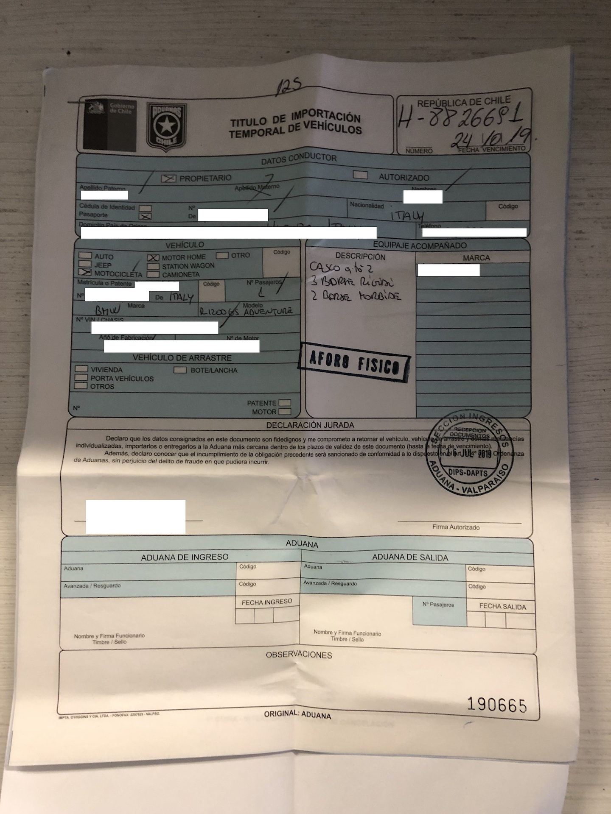
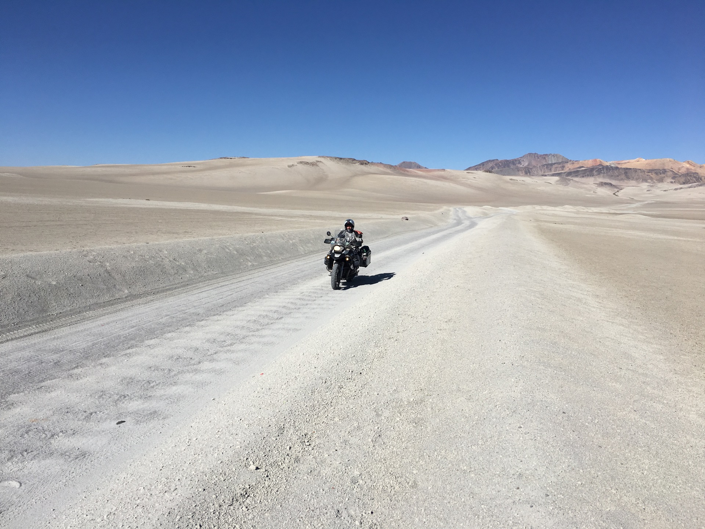
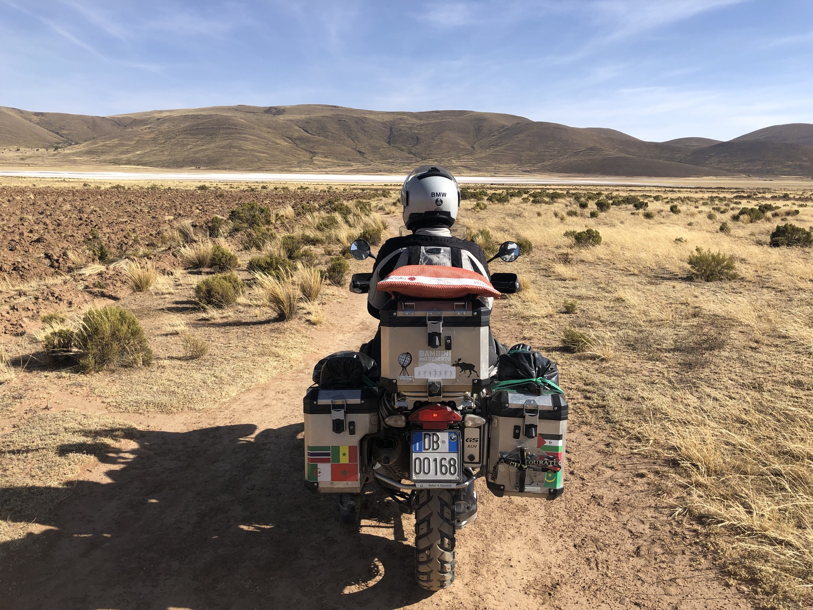
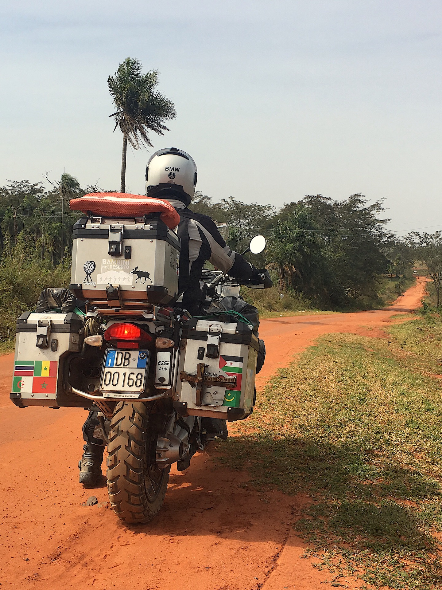

## Documenti necessari

Per affrontare un [viaggio in Sud America](/categoria/viaggi/panamericana) è fondamentale il **passaporto con validità residua di almeno 6 mesi**. La permanenza in America Latina per turismo può variare dai 3 ai 6 mesi, ma questo dipende dallo Stato in cui vi trovate. Alcuni Paesi vi possono indicare una permanenza iniziale di 15 giorni che si può  estendere a 90 rivolgendosi alla dogana o negli uffici preposti. I visti vengono rilasciati direttamente in dogana, quindi non serve richiedere permessi da casa.

|  Nazione  | Passaporto | Visto di ingresso |
|-----------|------------|-------------------|
| [Argentina](http://www.viaggiaresicuri.it/#/country/ARG) | Necessario | Non necessario per periodi di permanenza inferiori ai 3 mesi |
| [Bolivia](http://www.viaggiaresicuri.it/#/country/BOL) | Necessario con validità di almeno 6 mesi all'ingresso | Non necessario per turismo fino a 3 mesi di permanenza |
| [Cile](http://www.viaggiaresicuri.it/#/country/CHL) | Necessario con validità di almeno 6 mesi all'ingresso | Non necessario per turismo fino a 3 mesi di permanenza |
| [Paraguay](http://www.viaggiaresicuri.it/#/country/PRY) | Necessario con validità  superiore al periodo di permanenza | Non necessario per turismo fino a 90 giorni di permanenza |
| [Perù](http://www.viaggiaresicuri.it/#/country/PER) | Necessario con validità di almeno 6 mesi all'ingresso. Le Autorità di frontiera potrebbero chiedere di esibire il passaporto nonché il biglietto di andata e ritorno. | Non necessario per turismo fino a 90 giorni di permanenza |
| [Uruguay](http://www.viaggiaresicuri.it/#/country/URY) | Necessario | Non necessario per turismo fino a 90 giorni di permanenza |

Prima di partire è sempre meglio controllare la valitità di queste informazioni sull'apposito sito del Ministero degli Affari Esteri: [Viaggiare Sicuri](http://www.viaggiaresicuri.it/).

## Spedire la propria moto

Se volete vivere il viaggio con la vostra moto sappiate che ci sono 3 possibilità:

1. Spedire la moto via aerea: soluzione costosa, ma che vi permette di ridurre i tempi di distacco tra voi e la vostra moto. E’ necessario togliere i liquidi e i cavi della batteria, inoltre per ridurre gli ingombri della cassa è necessario rimuovere alcune parti della moto (specchietti, cupolino…).
2. Spedire la moto via container assieme ad altri amici: la soluzione può essere economica, ma ovviamente dipende dal numero di amici che aderisce al progetto, inoltre è fondamentale che tutti i componenti del gruppo possano spedire e ritirare la moto lo stesso giorno. E’ necessario che la moto sia consegnata in riserva, con i cavi della batteria staccati. Il costo approssimativo del container è di 6000€.
3. Spedire la moto via container assieme ad altro materiale: lo spedizioniere può abbinare la spedizione della moto ad altro materiale con la stessa destinazione permettendovi di contenere i costi. Può essere necessario rimuovere delle parti della moto, ma dipende dal materiale caricato nel container. Sicuramente la moto va consegnata in riserva e con i cavi della batteria staccati.

Spedire in container richiede una precauzione: **la moto sarà a contatto con la salsedine per un lungo periodo**, quindi è necessario proteggere le parti in metallo con olio siliconico.

In tutti e tre i casi dovete affidarvi ad un buon spedizioniere che abbia contatti seri sul posto, perché lo sdoganamento può diventare una vera odissea. Sul posto prima dello sdoganamento occorre compilare il *Titulo de importación temporal de vehículos* in dogana e solo dopo l’approvazione è possibile ritirare la moto. La bolla di spedizione deve riportare il materiale presente nel container, quindi se per motivi di spazio decideste di rimuovere una o più valigie dalla vostra moto, abbiate cura di indicare il numero di colli corretti. Nel mio caso per pura precauzione ho fatto delle foto a tutte le fasi di fissaggio della moto (che sono a cura dello spedizioniere), alle valigie, al sigillo del container e al numero di matricola dello stesso. Scaricando l’app potrete seguire il viaggio della vostra moto.

Se per qualche motivo decideste di lasciare la vostra moto nel Paese in cui vi trovate, sappiate che esistono dei limiti di tempo che vi vengono indicati nel permesso di entrata alla dogana e che dipendono da Stato a Stato. Questi permessi possono essere rinnovati (c’è un limite che dipende dalla nazione in cui vi trovate), ma per farlo deve essere presente sul posto il proprietario del mezzo. Se si dovessero superare i termini di tempo stabiliti all’entrata nel Paese, la moto verrà sequestrata e messa all’asta. Ovviamente finchè non si esce dal Paese o non si viene fermati per un controllo dalle forze dell’ordine, la moto rimane in mano a voi, anche se il suo destino è segnato. **L’unico Stato che permette di lasciare la moto ferma per 1 anno è l’Uruguay**.

Per viaggiare in Sud America **non è necessario dotarsi di *Carnet de passage***.

## Mezzi di trasporto

Se desiderate risparmiare sul viaggio vivendo a stretto contatto con la gente del posto, vi consigliamo di muovervi con i mezzi pubblici in quanto esistono degli economici e rapidi bus granturismo che compiono lunghe tratte notturne, permettendovi di risparmiare alcune notti in ostello. Per i trasferimenti in città esistono piccole corriere, ferro-tranvie o minivan che compiono economici trasferimenti in compagnia di musica latina e di ragazzi che pericolosamente viaggiano attaccati sui bordi dei mezzi per attirare nuovi clienti.

Non potete fare a meno dell’app Uber che vi permetterà di compiere rapidi trasferimenti in città di giorno e di notte, permettendovi di prenotare conoscendo la tariffa in anticipo e monitorare l’arrivo del mezzo.

Se decidete di noleggiare una moto o un’auto, sappiate che fuori da ogni aeroporto ci sono agenzie che vi possono aiutare nella scelta del mezzo adatto alle vostre esigenze. L’unica pecca è che molte di queste agenzie non vi permetteranno di espatriare con i loro mezzi.

## Patente

In tutta la Comunità Europea e in molti altri Stati al di fuori di questa è valida la patente italiana, ma per maggiori informazioni vi consiglio di consultare il sito [Viaggiare Sicuri](http://www.viaggiaresicuri.it/).

**In Sud America serve la patente internazionale conforme alla convenzione di Vienna del 1968**.

Preciso che alle dogane sudamericane i funzionari hanno sempre voluto visionare la patente italiana. La patente internazionale non me l’hanno mai chiesta. Da anni viaggio in Africa America utilizzando la patente internazionale della convenzione di Vienna, mi è stato chiesto di esibirla raramente.

Quando solcherò il confine degli Stati Uniti d’America, so già che dovrò stipulare la patente internazionale della convenzione di Ginevra.

## Assicurazione e bollo moto

L’**assicurazione italiana non è valida in Sud America** quindi, una volta spedita la moto, ho trasferito l’assicurazione su un’altro mezzo di mia proprietà. Nel frattempo ho stipulato su internet una RC Allianz che copre Cile, Bolivia, Argentina, Uruguay e Paraguay. Preciso che solo in Uruguay e in Bolivia i funzionari mi hanno chiesto di visionare il tagliando dell'assicurazione. Ho letto che in alcuni casi per sdoganare la moto serve esibire il tagliando, a noi non è stato chiesto.

Lungo il viaggio mi è capitato di incontrare e conoscere dei motociclisti europei che si vantavano di viaggiare senza assicurazione perché nessuno gliela aveva chiesta… Lascio a loro questo vanto, io continuerò a stipulare l’assicurazione consigliando a chi incontro di fare lo stesso.

Il contatto dell’assicuratore con cui ho stipulato la polizza è: [roby@speiserseguros.com.ar](mailto:roby@speiserseguros.com.ar).

L’unico Stato che non è coperto dall’assicurazione Allianz è il Perù. In frontiera ho chiesto informazioni e mi hanno consigliato di raggiungere Tacna dove potevo scegliere di rivolgermi all’assicurazione più adatta alle mie esigenze. In verità mi sono fermato in una concessionaria di motocarri nel primo paese che ho incontrato, lì ho chiesto alla segretaria se poteva stipularmi l’assicurazione: in soli 10 minuti (e con la modica cifra di 7€) ha compilato il tagliandino dell’assicurazione valido per 1 mese.

Per quando riguarda il bollo, essendo una tassa di proprietà, dovrà essere pagato regolarmente ad ogni scadenza anche se la moto si trova in Sud America.

Possiedo inoltre una assicurazione medica di viaggio di [Europe Assistance](https://www.europassistance.it/assicurazioni/viaggi) con scadenza annuale.

")

## Contanti e carte di credito

Dopo una brutta esperienza vissuta in Africa anni fa, **viaggio sempre con i contanti**. Gli euro vengono cambiati regolarmente in tutti gli Stati a parte la Bolivia, dove è meglio avere con sè dollari americani; ho aggirato la situazione effettuando dei prelievi con il bancomat.

In Sud America la carta di credito VISA è ben accettata, mentre la MASTERCARD non sempre viene gradita. **Prelevare allo sportello non è sempre possibile** perché non tutti i bancomat fanno parte del circuito CIRRUS. Il cambio dei soldi è possibile dal lunedì al venerdì in orari d’ufficio, mentre il sabato e la domenica non è possibile effettuare alcun cambio di valuta.

Sembrerà strano, non è possibile anticipare il cambio di valuta per il Paese della prossima destinazione. Faccio un esempio: se mi trovo in Bolivia e domani voglio raggiungere l’Argentina, in Bolivia non posso cambiare gli euro in peso argentini.

Per aiutarci nei cambi e nei vari acquisti abbiamo scaricato un'[app gratuita e offline](https://apps.apple.com/it/app/valuta-di-cambio-in-valuta/id537609905) che indicava il cambio tra moneta locale ed euro.

## Autostrada

Le autostrade in Sud America sono gratuite per le moto. Al casello esiste una corsia riservata alle moto, che a volte è un po’ stretta, ma basta spostare dei birilli per superarla. Se vi doveste per errore incolonnare al casello nella corsia delle auto, sappiate che non è possibile superare il casello gratuitamente, perché c’è un sistema di monitoraggio che conta i passaggi mettendoli in relazione con il ricavo giornaliero del casellante.

## Strade

Le strade di grande percorrenza sono ben mantenute e ben servite. Fuori dai centri abitati può capitare di percorrere centinaia di km senza incontrare stazioni di servizio.

Le strade secondarie, soprattutto fuori città, sono sterrate ma curate, quindi semplici e veloci da percorrere. Attenzione nelle aree desertiche dove è possibile incontrare, nei tratti di strada sterrata, dei lunghi tratti di sabbia fine e profonda.

Quando piove le strade sterrate con ghiaia rimangono percorribili, mentre quelle di terra battuta diventano molto scivolose (soprattutto a moto carica).

Lungo tutta la rete stradale viaggiano liberi animali di ogni genere, quindi consiglio massima attenzione e sconsiglio di viaggiare con il buio.

Un compagno di viaggio da cui difficilmente vi separerete è il vento: tutto bene finché è costante, quando si trasforma in forti raffiche diventa un problema.

## Benzina

La qualità della benzina è generalmente buona. Solo in alcune tratte poco trafficate ci siamo riforniti con benzine scadenti in Cile, Perù e Bolivia. La nostra moto monta dei filtri della Guglatech che la protegge da eventuali impurità. Nel caso di benzina con pochi ottani utilizziamo un [addizionatore di ottani della Bardahl](https://amzn.to/33eeQYC) che aiuta la nostra moto a sopportare il carico trasportato alle alte altitudini che si raggiungono sulle Ande (abbiamo viaggiato anche ad oltre 4500 metri).

In tutte le stazioni di servizio è obbligatorio scendere dalla moto per fare rifornimento, per questioni di sicurezza. In molte stazioni di servizio viene registrata la targa prima di eseguire il rifornimento. In Bolivia il prezzo indicato dalla pompa non è quello che si paga, perché  ai turisti viene addizionata una percentuale. Ovviamente prima del rifornimento viene segnalata la cosa dal gestore della pompa di benzina. **Il costo della benzina è inferiore ad 1€/litro**, quindi molto basso. Non esistono self service, quindi se partite presto al mattino (è una nostra abitudine), fate rifornimento alla sera.

In Sud America viaggio con una [BMW R1200GS Adventure](/tag/bmw-r1200gs), che monta un serbatoio da 33 litri il quale mi garantisce una ottima autonomia. Solo nel deserto dell’Atacama ho raggiunto il rifornimento successivo con la luce gialla della riserva accesa. Porto sempre una [tanica di benzina supplementare](https://amzn.to/2MpkNve) piena, per ora è servita solo ad aiutare altri motociclisti rimasti senza benzina.

Il peggior rifornimento di questo viaggio l’ho fatto a San Pedro di Atacama, dove ogni mezzo che circolava in paese aveva problemi di accensione e faceva un gran fumo.

")

## Vaccini e medicinali

Prima del viaggio non abbiamo fatto alcun vaccino perché due anni fa abbiamo affrontato un viaggio in Gambia dove ci siamo vaccinati per tutte quelle malattie tipiche dei paesi poveri.

Per viaggiare sereni in Sud America **è consigliato vaccinarsi** per:

* Epatite A e B
* Tetano
* Febbre Gialla (obbligatoria in Bolivia)
* Profilassi antimalarica

Abbiamo portato con noi alcuni medicinali tipo: antibiotico, antidolorifico, tachipirina e **Acetazolamida** (per l’altitudine).

## Attrezzi per la riparazione della moto

Porto sempre con me alcune chiavi e degli attrezzi per eseguire piccoli interventi: il [kit di riparazione dei pneumatici](https://amzn.to/3140zMZ), una [pompa a pedale](https://amzn.to/2Msu2uu), [cavi della batteria](https://amzn.to/2VsF86J), tutte le [chiavi fisse](https://amzn.to/2ot61eN) a [brugola e torx](https://amzn.to/2p2vAmY), [camere d’aria](https://amzn.to/2VAzZdf) con [pezze e mastice](https://amzn.to/2Vo5Ptu) (che utilizzerò solo in caso di strappo del tubless), [leve smontagomme](https://amzn.to/31VD1Lg), [corda per traino](https://amzn.to/2IzP6y6), [pinze varie](https://amzn.to/321pB0b), [nastro americano](https://amzn.to/2p15gd4), [filo di ferro](https://amzn.to/2LWNIYp), forbice, [lampade](https://amzn.to/2p2wVu0), relè…

Una regola che mi ha insegnato un vecchio motociclista è quella di controllare le viti di tutta la moto periodicamente, soprattutto dopo km di sterrato. Per ora di viti allentate non ne ho mai trovate, ma fare questo controllo mi fa star bene con la mia moto perché sono le uniche cure (a parte il lavaggio) che le regalo.

## Info viaggio

Un tempo mi affidavo alle guide, o a diari di viaggio letti su internet, ma mi sono accorto che ciò che si legge va calato nell’esperienza di chi scrive. In molti casi mi sono trovato ad affrontare strade attendendo eventi drammatici o pericolosi perché successi ai viaggiatori che li hanno vissuti prima di me, senza poi trovare riscontri sulla mia strada.

Oggi mi affido ai libri di viaggio della Lonely Planet e a pochi e selezionati esperti motoviaggiatori con i quali mi intrattengo alcune sere a parlare per l’appunto di viaggi.

## Lingua

Conoscere lo spagnolo in America Latina può essere un vantaggio, perché pochi parlano l’inglese. Ritengo che noi italiani siamo fortunati perché la nostra lingua assomiglia molto allo spagnolo, quindi non è necessario impararlo, anche se lo consiglio vivamente per la bellezza della sua cadenza latina, che mi trasmette un grande desiderio di libertà e tanta voglia di partire
