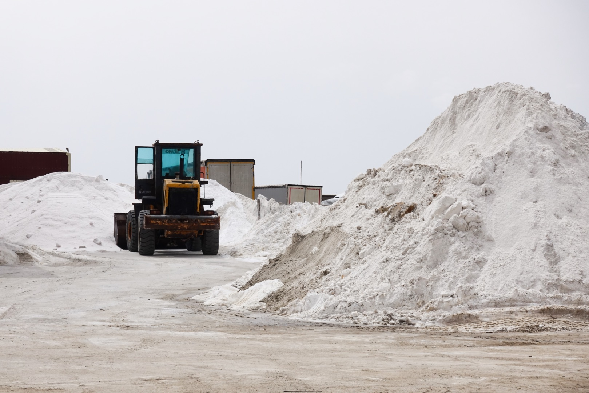

## Giorno 7: incontro con la Vera Turchia

Ci svegliamo all'alba convinti di poter scampare il traffico dell'ora di punta a Istanbul, ma appena iniziamo ad allontanarci dal Corno d'Oro rimaniamo imbottigliati in qualche incrocio… siamo stati davvero ingenui a pensare di poter sfuggire al traffico generato da una città con più di 15 milioni di abitanti!

Per attraversare il Mar di Marmara evitiamo di asfissiare nell'Eurasia Tunnel e imbocchiamo la tangenziale interna O-1, una superstrada a 3 corsie sulla quale siamo costretti a muoverci molto lentamente tra le colonne di un traffico apocalittico. Quando raggiungiamo il *Ponte dei Martiri del 15 luglio* ci rendiamo conto di essere in viaggio da più di un'ora.

L'attraversamento del Bosforo dura poco, ma quando finalmente raggiungiamo la sponda asiatica c'è poco da festeggiare: il traffico non diminuisce e questo mostro di città non accenna a terminare. Quartieri poco affascinanti ci passando accanto senza sosta anche se imboccata l'autostrada E80. Dopo un'altra ora di viaggio il traffico comincia a diminuire, l'agglomerato urbano a diradare.

Istanbul non finisce mai, in moto va affrontata con pace interiore e rassegnazione

All'uscita di Akyazı il portale del casello ci ricorda che non abbiamo ancora comprato il [tagliando HGS](/2019/05/turchia-in-moto-informazioni-pratiche/#strade-e-rifornimento), fortunatamente abbiamo 15 giorni per regolarizzare il pagamento. Ci muoviamo sulla D140 verso Sud, in cerca di un bar dove fare una pausa e reidratarci dopo la sudata nel traffico. Ne troviamo uno a Opet, dove scopriamo che è dura trovare un turco che parli l'inglese, ma tè nero e *simit* non mancano mai.

Dopo pochi chilometri iniziano le colline e finiscono gli infiniti rettilinei che ci hanno annoiato fino ad ora. La strada si attorciglia attorno ai rilievi del *Ponto*, il manto di asfalto è in ottime condizioni, iniziamo a divertirci ammirando un paesaggio verdissimo e coperto di boschi. Ma il divertimento dura poco…

  <h4 class="message-title">La versione di Gabriele e Stefania</h4>
  
Non si sa esattamente come, ma una delle valigie laterali di Arturo si è scoperchiata senza che lui se ne accorgesse. Fortunatamente utilizza una borsa interna e il contenuto non è stato disperso sulla strada… considerando che ha già perso un paio di guanti il futuro del viaggio si prospetta roseo!

  
Simone e Alice proseguono in cerca di un ristorante per il pranzo, mentre noi torniamo indietro per aiutare a setacciare la strada in cerca del coperchio smarrito. Dopo 30 km desistiamo, mentre Arturo decide di fare un secondo tentativo. Ripartiamo in cerca di Simone e Alice, che nel frattempo hanno trovato ristoro in un capanno lontano dalla strada e fuori dal campo telefonico… purtroppo non li vediamo e proseguiamo fino alla città di Nallıhan, dove ci fermeremo ad aspettare tutti davanti ad un pranzo a base di té e <em>lahmacun</em>.

  <h4 class="message-title">La versione di Simone e Alice</h4>
  
Arturo ne ha combinata un'altra delle sue, Gabriele e Stefania tornano indietro per aiutarlo mentre noi proseguiamo in cerca di un locale dove pranzare. Dopo diversi km, individuiamo una casetta poco lontana dalla strada: ci accolgono due vecchietti che parlano solo turco ma capiscono cosa cerchiamo e mettono insieme una frittatona con tutto quel che trovano in casa.

  
I telefoni non prendono e quando vediamo passare Gabriele e Stefania non c'è modo di fermarli, in compenso qualche minuto dopo riusciamo ad intercettare Arturo che si unisce al pranzo improvvisato.

  
Cerchiamo di ripagare l'ospitalità con qualche banconota, ma tutto quel che vogliono i nostri ospiti è un abbraccio: sarà una delle esperienze umane più belle del viaggio.

  <h4 class="message-title">La versione di Arturo</h4>
  
Mentre crogiolavo nella mia persistente condizione di scopa del gruppo, improvvisamente vedo dallo specchietto che l'auto che ho dietro cerca di farmi fermare. Mi trovo da solo, sperduto nelle montagne turche e non penso sia una buona idea farlo, quindi decido di tirare dritto ignorando la cosa.

  
Continuo a guardare lo specchietto e l'autista continua a fare segno di accostare. Insisto e proseguo nonostante debba svuotare la vescica. Dopo circa 15 minuti l'auto cambia strada, proseguo ancora un pochino dopodiché decido di fermarmi per una sosta idraulica. Scendendo dalla moto mi rendo conto di aver perso il coperchio della valigia laterale sinistra! Realizzo subito cosa stessero cercando di dirmi i tipi in macchina: pregiudizio e poca fiducia nel prossimo sono una bruttissima cosa.

  
Telefono a Gabriele: «Ho un problema “serio”…»

Lasciate perdere pianificazione, cautela, amuleti e scongiuri! Il miglior modo per viaggiare tranquilli è portarsi appresso Arturo: agendo da calamita per la sfiga, tutti gli inconvenienti si abbatteranno su di lui e voi potrete viaggiare in tutto relax.

Rifocillati e rassegnati a viaggiare con un pratico sacco di plastica legato con le cinghie, proseguiamo il nostro viaggio in direzione Ankara. Percorsi pochi chilometri, i colori del paesaggio cambiano radicalmente: il verde della vegetazione si dirada e le colline spoglie mostrano stratificazioni rosse, grigie, bianche e azzurre. Di fronte a questo inatteso cambio di scenario non possiamo che deviare sulle strade bianche della zona e goderci questo posto idilliaco.

Ci sforziamo di ripartire per cercare di raggiungere Ankara prima di sera, ma fatti pochi chilometri ci ritroviamo nel bel mezzo della Davutoğlan Kuş Cenneti, una riserva naturale dove trovano riparo centinaia di uccelli. Quando vediamo le indicazioni per un hotel con terme e ristorante finiamo per abbandonare tutti i programmi e passare la notte nel bel mezzo del nulla. Con l'equivalente di 26€ a testa otteniamo 2 stanze, hammam, cena e colazione a buffet.

## Giorno 8: il lago salato Tuz Gölü e l'arrivo a Uçhisar

Un po' a malincuore lasciamo l'*Hattusa Vacation Thermal Club Ankara* e la sua architettura vagamente sovietica, proseguendo verso la capitale turca lungo la solita D140. In meno di un'ora raggiungiamo i primi palazzoni, diventa subito chiaro che stiamo lasciando colori e paesaggi incredibili per tornare ad essere fagocitati da una mostruosa città da quasi cinque milioni e mezzo di abitanti.

Al contrario di Istanbul, la città di Ankara non ha un passato particolarmente grandioso alle sue spalle: la fondazione risale all'età del bronzo e venne abitata da Ittiti, Frigi, Volci, Romani, Bizantini e Ottomani, tuttavia intorno al 1890 la popolazione era inferiore alle 30000 unità. La rinascita di Ankara è dovuta a Mustafa Kemal Atatürk, che a partire dal 1919 la eleva a capitale della neonata repubblica.

L'unico monumento degno di nota è il mausoleo Anıtkabir, sepolcro di Atatürk, che decidiamo di non visitare: dopo l'esperienza di Istabul vogliamo soltanto scappare da questo immenso assembramento di persone e auto. Percorrendo la circonvallazione O-20 rimaniamo attoniti dall'edilizia di Ankara: nonostante sorga in mezzo al nulla e lo spazio non manchi affatto, quasi tutte le costruzioni periferiche sono enormi palazzoni (che in Italia potremmo chiamare grattacieli) che spuntano come funghi in mezzo ai prati. Assurdo.

Finalmente imbocchiamo la E90 in direzione Aksaray e dopo 100km di noiosissima *statalona* raggiungiamo il Tuz Gölü, immenso lago salato situato alla quota di 905 metri sul mare. Ogni estate qui si ripete un fenomeno piuttosto curioso: la forte evaporazione fa aumentare la concentrazione salina, uccidendo la maggior parte del plancton che solitamente si ciba delle alghe *Dunaliella*; la popolazione di questi microrganismi è così libera di aumentare, fino a tingere le acque di un rosso scarlatto.

Purtroppo la giornata odierna è caratterizzata da una fastidiosissima foschia lattiginosa, la linea dell'orizzonte è quasi indisinguibile sull'enorme distesa salmastra. Ci fermiamo per mangiare un boccone al Tuz Gölü Tesisleri, enorme trappola per turisti sulle sponde del lago salato, dove una grande scritta blu è inquadrata dagli obiettivi delle decine di persone vomitate da enormi autobus gran turismo. Di fenicotteri neanche l'ombra. 

Due turisti cinesi attaccano bottone: vogliono sapere come funziona la patente della moto e l'attraversamento delle frontiere, rimangono sbalorditi dalla facilità con cui possiamo viaggiare tra le frontiere europee. Sono di Bejing e parlano un buon inglese.

Troviamo un grande stabilimento dove viene raccolto e pulito il sale del lago, ne approfittiamo per scattare qualche foto lontani dalla folla, poi ripartiamo per non fermarci più. Vogliamo arrivare in Cappadocia! Divoriamo i 170 chilometri che ci separano da Uçhisar.

Girovaghiamo per la cittadina alla ricerca del nostro rifugio per la notte, ma improvvisamente ci si para davanti il *Castello di Uçhisar*: un'imponente roccia vulcanica che svetta sul *Göreme Tarihi Milli Parkı* e permette di ammirare tutto dall'alto.

Raggiungiamo l'hotel Kemal, gestito da una coppia di brasiliani trasferiti in Turchia dopo varie vicissitudini lavorative. Chiediamo a loro informazioni per organizzare un volo in mongolfiera, ma le notizie non sono per niente buone: una grossa società ha acquistato tutte le mongolfiere della zona e quindi bisogna per forza passare da loro per prenotare… scopriamo così che tutti i prossimi giorni sono pieni e non ci rimane che metterci in lista d'attesa. Indossiamo abiti *civili* e corriamo ad esplorare le formazioni rocciose.

Sorseggiamo l'immancabile *çay* da una terrazza panoramica affacciata sui camini delle fate. Il piccolo locale è gestito da una famiglia che in loco alleva galline, asini e i particolari *piccioni capitombolanti*: una razza di uccelli caratterizzata dalle zampe foltemente piumate e la capacità di compiere delle improvvise capriole in aria durante il volo.

Esploriamo le formazioni rocciose dei dintorni mentre ci arrampichiamo fino alla vetta del *castello*, da qui godiamo di un panorama fantastico, ma decidiamo di andarcene prima del tramonto per evitare la discesa al buio. Il centro di Uçhisar non offre particolari attrazioni, dopo aver girovagato tra bancarelle di souvenir ci fermiamo a cenare in un piccolo ristorante panoramico. È praticamente pieno, ma piuttosto che perdere un gruppo di clienti il proprietario ci trova un posto sul divano davanti alla TV: ceniamo ascoltando tutto il repertorio di pop turco del momento.

Rientrati all'hotel riceviamo una notizia buona e cattiva assieme: domani ci dovremo svegliare alle tre e mezza, si vola in mongolfiera!

## Giorni 9 e 10: le valli della Cappadocia

Io e Stefania ci svegliamo alle 4 del mattino per volare in mongolfiera, gli altri 3 intrepidi compagni di viaggio rimangono a letto ad aspettarci. Alla reception troviamo un assonnatissimo tuttofare, svegliato soltanto per aprire la porta di ingresso. Puntualissimo arriva l'archetipo del *trafficone*, sempre presente in ogni luogo turistico che si rispetti: tassista abusivo, broker di voli in mongolfiera, poliglotta improvvisato, costantemente al telefono.

Paghiamo le nostre quote (ben 180€ a testa) e partiamo in direzione Göreme sul taxi che ci deposita nella hall di un albergo. Effettuiamo il check-in per il volo compilando vari fogli con i nostri dati anagrafici e assaltiamo il buffet della colazione, dove troviamo delle fragole buonissime. Pian piano la stanza si riempe di gente, ancora non si parte e un po' tutti cominciano ad insospettirsi… dopo un'ora di attesa è ufficiale: tutti i voli sono annullati a causa del vento.

Il solito *trafficone* ci propone di lasciare in deposito la quota del volo per confermare la nostra presenza nella lista d'attesa del giorno successivo, accettiamo e torniamo a dormire qualche ora nel nostro B&B.

Ricompattato il gruppo, torniamo in sella per esplorare il Göreme Milli Parkı (Parco Nazione di Göreme) senza meta precisa. Ci ritroviamo sulle piste di polverose della *Valle delle Rose*, guidando tra orti e vigneti da cui spuntano enormi pinnacoli di roccia beige e rosa. Sulle pareti rocciose si notano le aperture di case troglodite, scavate nel tufo migliaia di anni fa. Il luogo è davvero affascinante, ma purtroppo i colori sono smorzati dalle nuvole lattiginose che coprono il sole.

Guidiamo fino a Çavuşin, minuscolo borgo ai piedi di una falesia su cui si trova arroccato un villaggio troglodita in stato di abbandono. Forse non è l'esempio più impressionante, ma possiamo visitarlo in solitudine, con la libertà di poter curiosare dappertutto. I nostri stomaci ci riportano a terra, ricondandoci che l'ora del pranzo è vicina.

Ci sediamo ad un tavolo del ristorante Seyyah Han, dove scopriamo l'esistenza del *testi kebabı*. Carne, verdure, funghi, cumino e paprika vengono cucinati per ore all'interno di una giara di terracotta sigillata; prima di essere servita si ravviva a fuoco vivo, la giara viene spezzata con un colpo secco di coltello e la carne morbida e profumata viene impiattata (e mangiata con gusto).

  
In turco la parola <em>kebap</em> definisce tutta la carne arrostita.

  
Quello che genericamente consumiamo in Italia è il <em>döner kebab</em> (letteralmente <em>kebab che gira</em>), o più specificatamente <em>dürüm kebab</em> (<em>kebab nella piadina</em>).

")

Rifocillati e contenti, attraversiamo l'arteria stradale che collega Göreme ad Avanos per imboccare una strada bianca a caso. Ci affacciamo su formazioni rocciose sempre diverse, ogni tanto la coltre di nuvole si apre regalandoci la possibilità di ammirare colori meravigliosi. L'azzurro si alterna a nuvoloni nerissimi, che fortunatamente evitano di scaricarci addosso l'acqua di cui sono carichi.

Il sentiero finisce improvvisamente davanti al ripido terrapieno della superstrada D300, aggirabile con una moto da enduro, ma impraticabile con le nostre pesanti bicilindriche dotate di pneumatici stradali. Ci tocca fare dietrofrónt e *consolarci* con una visita alla Valle dell'Amore.

Le formazioni rocciose note come *camini delle fate* hanno una storia lunga decine di milioni di anni. Circa 60 milioni di anni fa cominciò a formarsi la catena montuosa del Tauro in quella che oggi è la Turchia meridionale; i movimenti tettonici produssero in Anatolia centrale depressioni e burroni, che nelle ere geologiche successive vennero riempite dal tufo prodotto dal depositarsi di ceneri e lapilli eruttati dai vulcani Erciyes e Hasan Daği. Questa roccia molto friabile è stata erosa dall'instancabile lavoro dell'acqua, che ha però risparmiato i “coni” sormontati da uno strato di roccia più compatta.

Il fenomeno diventa chiarissimo ammirando i camini della **Valle dell'Amore**, chiamata così perché le colonne di tufo sormontate da coni di materiale più duro assomigliano inequivovabilmente a… peni eretti! Il posto è unico, aspettiamo il calar del sole ammirando il panorama mentre Arturo fa svolazzare il drone tra i falli di roccia.

Con il sopraggiungere del buio torniamo sulla strada asfaltata e decodiamo di fare un sopralluogo al punto panoramico di Göreme: dovrebbe essere un ottimo posto per ammirare le mongolfiere in volo al mattino. Da già che siamo qui, non perdiamo l'occasione per scattare delle belle immagini durante l'*ora blu*.

**Göreme Sunset Point** è il luogo più affollato che abbiamo visitato in questa giornata. Sarebbe un luogo fantastico se non fosse per l'odore di frizioni bruciate emanato dai taxi abusivi che si incrociano sulla ripida strada che porta alla sommità.

Ceniamo al ristorante Old Cappadocia, dove assaggiamo i vini prodotti in queste valli (niente male!) ed i *manti*: ravioli tipici dell'Anatolia centrale, ripieni di carne e cipolla, conditi con salsa a base di yogurt, aglio, olio, peperoni e paprika… decisamente gustosi!

Torniamo all'hotel Kemal, dove ci aspetta una brutta notizia: la lista d'attesa è molto lunga, non c'è speranza di volare in mongolfiera. Recuperiamo tutti i soldi versati per la prenotazione e ce ne andiamo a dormire un po' delusi.

Ci svegliamo ancora all'alba per ammirare le mongolfiere in volo, ma anche stamattina non si vola causa vento. Il programma iniziale prevedeva di iniziare il trasferimento verso Sud, ma la magia del posto impone di rimanere un giorno in più. Ieri sera ci è sembrato servissero un buon espresso all'Old Cappadocia, così ci torniamo per la colazione. Dopo giorni di brodaglia fatta con il Nescafé, Simone si commuove sorseggiando un espresso fatto come si deve!

Passiamo la mattinata visitando il Göreme Open Air Museum, tra case trogloditiche e chiese paleocristiane scavate nel tufo, in cui si possono ammirare affreschi sopravvissutti ad un millennio di Storia.

")

Da qui proseguiamo verso Est e risaliamo la *Devrent Valley* (o Valle dell'Immaginazione), per poi svoltare verso Nord e dopo qualche curva improvvisare una deviazione sulla prima strada bianca che capita a tiro. La mia [BMW R1200GS](/tag/bmw-r1200gs) “compie” i suoi 90.000 km in mezzo ai prati in Cappadocia, quale posto migliore? Ci sdraiamo sull'erba a godere delle improvvise esplosioni di colore che divampano tra una nuvola e l'altra.

Ci spingiamo fino alla cittadina di Avanos per fare il pieno alle moto, per poi tornare a Göreme per rimpinzare gli stomaci con un dürüm kebab nel ristorante più polveroso della Turchia.

Passiamo il pomeriggio a perderci tra i camini delle fate, seguendo sentieri e strade polverose senza meta precisa. Rischiamo di insabbiarci e finiamo più di una volta in un *cul-de-sac*, ma non importa: quando le nuvole ci danno tregua il paesaggio si illumina di una luce calda, rendendo tutto più magico.

Torniamo alla Valle dell'Amore, superiamo gli avamposti dei turisti e ci piazziamo ad ammirare le torri di arenaria accanto ad un gruppetto di *tamarri roteanti*: danzano senza sosta al ritmo ipnotico della musica turca, sparata a tutto volume dalle casse sfondate di un'auto che ha visto troppi inverni. Arturo si fa prendere dal momento catartico ed inizia a volteggiare con il casco ben calato sulla testa, tra gli applausi e le grida di apprezzamento di tutti i presenti.

## Giorno 11: verso Ovest tra profonde vallate e immensi vulcani

Ci riproviamo con le mongolfiere, e indovina un po'? Ennesima levataccia a vuoto, il vento costringe a terra tutti i palloni aerostatici. Ammiriamo l'ultima alba sul parco di Göreme, purtroppo è ora di cominciare il nostro cammino di ritorno verso Ovest.

Da Uçhisar seguiamo la Valle dei Piccioni fino a raggiungere la D302 e svoltiamo verso Ürgüp: dobbiamo metterci in regola con il pagamento delle autostrade. Veniamo rimbalzati da un piccolo ufficio postale ad uno più grande, che troviamo a forza di chiedere ai passanti. Sconvolgiamo la vita di tutti gli impiegati, fino a trovare una signora in grado di capire il nostro mix di inglese e italiano gesticolato; sfoderiamo passaporti, visti, libretti e banconote fino ad uscirne vincitori, con il [tagliando/transponder HGS]((/2019/05/turchia-in-moto-informazioni-pratiche/#strade-e-rifornimento)) applicato sui nostri bei cupolini in plexiglass.

Usciamo dalla cittadina in direzione Sud (verso Mustafapaşa) e guidiamo lungo tutta la valle scavata dal torrente Damsa. Sono pochi i turisti ad avventurarsi da queste parti, in una manciata di chilometri ci lasciamo alle spalle il trabusto di una delle zone più frequentate della Turchia. Il fondovalle è verdissimo e coltivato. Attraversiamo diversi paesini, molto più rurali ed autentici rispetto alle cittadine del Parco di Göreme.

Non ci fermiamo a visitare le rovine romane di Sobesos, superiamo Şahinefendi e continuiamo a puntare verso Sud fino a Güzelöz: qui prendiamo la strada principale a destra, in direzione Ovest. Poco distante da qui si trovano le numerose chiese rupestri di Soğanlı, che non visitiamo: oggi tocca macinare chilometri. Il fondovalle è sempre verdissimo, ma le pareti della valle sono più scoscese e rossastre, ricorda un piccolo Grand Canyon.

Risalita la lunga vallata, ci ritroviamo a cavalcare sopra un altopiano che sembra estendersi all'infinito, rotto soltanto dalle cime dei grandi **vulcani Erciyes e Hasan Daği**: le colate di magma, lo scroscio dell'acqua, lo sferzare del vento e lo scorrere inesorabile dei millenni hanno plasmato la natura immensa e meravigliosa di questa regione.

")
")

Proseguiamo in direzione Aksaray per un'ottantina di chilometri, fino a raggiungere il bivio per Ihlara. La strada prosegue dritta e monotona fino raggiungere la profonda e ripida spaccatura nel terreno che stavamo cercando: la **Valle di Ihlara**. Avendo passato un giorno in più in Cappadocia non abbiamo la possibilità di cambiare molto i nostri programmi, altrimenti sarebbe stato bello fermarsi qui ad esplorare il fondo valle in un'escursione a piedi.

Discendere fino al fiume nei pressi di Belisırma, dove ci fermiamo a pranzare lungo la riva del torrente. Oltre ai ristoranti non sembra esserci molto altro e l'abitato sembra un paese fantasma.

")
")

Rifocillati, ripartiamo in direzione Konya: metropoli da un milione di abitanti, capitale dei **dervisci rotanti** che ogni 17 dicembre commemorano la morte del capostipite Rumi con una spettacolare cerimonia. Tutti i turchi con cui abbiamo parlato dell'itinerario ci hanno sconsigliato di fermarci qui, sembra proprio che non meriti una visita.

Tiriamo dritto fino alle sponde del lago Beyşehir, fermandoci nell'omonima cittadina per la notte. Il viaggio da Ihlara a Beyşehir è noioso, 300 km di monotone statali turche che non consentono di viaggiare a più di 90 km/h.

Attraversiamo il centro abitato in cerca di un hotel, invano. In punta al pontile più lungo del porticciolo lacustre incrociamo due ragazzini in bici a cui chiediamo consiglio. Fanno cenno di seguirli e per non perderli ci tocca attraversare in moto parchi pubblici, aree giochi per bambini e lunghi tratti di marciapiede. Alla fine ci depositano davanti al Ali Bilir Otel, un grigio palazzone a cui non avremmo dato due soldi… ma che invece si rivela essere un buon albergo ad un prezzo stracciato!

Ceniamo in una bettola accanto l'albergo e poi andiamo in cerca di caffeina nel grande bar che si trova poco dopo il ponte di pietra Taş Köprü. Ce la mettono tutta, ma ci servono un espresso davverso slavato: io e Simone non ci stiamo e proviamo a spiegare alla barista come fare un espresso, con risultati incoraggianti ma non proprio entusiasmanti.

**[Seguici su Facebook](https://facebook.com/motoviaggiatori/) per non perderti il prossimo episodio!**

In questo viaggio abbiamo messo alla prova alcuni prodotti dei nostri partner tecnici:

- caschi modulari [Caberg Helmets](https://www.caberg.it/) Levo: leggeri, silenzionsi e dotati di una visiera panoramica favolosa, sono il top per il mototurismo a lungo raggio
- interfoni [Midland](https://www.midlandeurope.com/it) BT Next Pro, BTX1 Pro S e BTX2 Pro S: audio chiarissimo a tutte le andature con la possibilità di parlare in conferenza tra i piloti delle moto, davvero ottimi e consigliati
- molle progressive [Hyperpro](https://hyperpro.com): un upgrade enorme rispetto alle molle originali della BMW R1200GS, migliorano moltissimo il comportamento della moto in curva senza ridurre il comfort di marcia grazie al coefficiente elastico che cambia a seconda della forza esercitata sulla molla, costano poco ma rendono molto (distribuite da [Rinolfi](https://www.rinolfi.it))
- pastiglie freno [Brembo](http://brembo.com/it) in mescola LA: sinterizzate e specifiche per i freni anteriori delle moto da turismo, frenano forte dopo pochi km di rodaggio e promettono durata superiore (distribuite da [Motorquality](http://www.motorquality.it))
- cupolino maggiorato Adventure [WRS](https://wrs.it) per  BMW R1200GS: permette di rilassarsi parecchio quando si viaggia a velocità sostenute, alleggerendo il carico sulla muscolatura cervicale e riducendo il rumore causato dalla turbolenza, l'archetto di sostegno permette di montare navigatori&co senza ostruire la strumentazione della moto
- olio motore [Putoline](https://www.putoline.com/) SPORT 4 15W-50: semi-sintetico (API SL, JASO MA2), la BMW R1200GS non ne ha *mangiato* una goccia nei 7000km percorsi dal tagliando (distribuito da [Rinolfi](https://www.rinolfi.it))
- S.M.A.R.T. IAT di [Belinassu](http://www.belinassu.it): una sonda plug&play che migliora il tiro del motore ai bassi e medi regimi ingrassando la miscela, semplice da installare e completamente reversibile
- pneumatici [Anlas](http://anlas.com/it/) Capra RD e Capra R: gomme stradali che non disdegnano off-road leggero, ottimo feeling anche su bagnato, il consumo nei 5500km del viaggio è stato regolare
