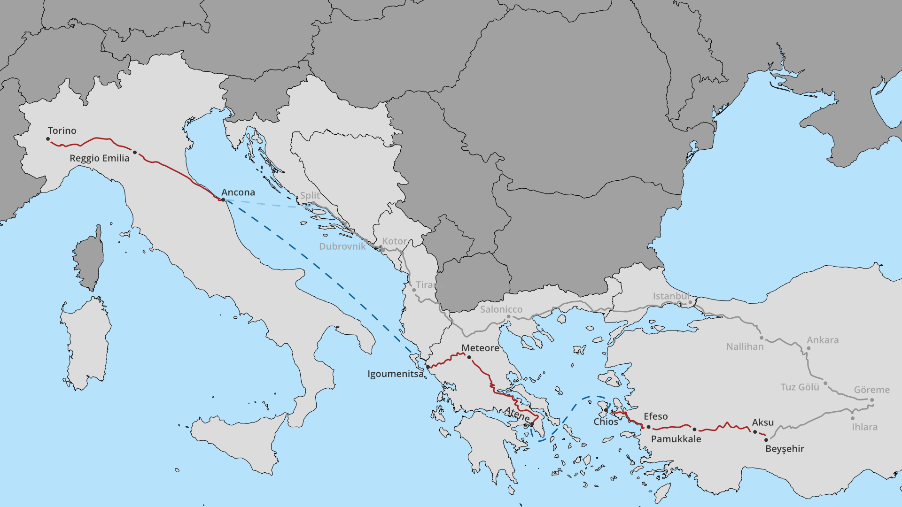

## Giorno 12: I monti del Tauro e le piscine di Pamukkale

Ci svegliamo a Beyşehir e facciamo colazione sulla terrazza panoramica coperta del nostro hotel. Prepariamo le moto, che durante la notte avevamo lasciato proprio davanti all'ingresso, sotto gli occhi vigili del receptionist. 
Mentre gli altri finiscono di prepararsi, io e Gabriele ci avviamo in moto verso la vicina moschea di Eşrefoğlu, piccola ma affascinante. Gabriele parcheggia la moto proprio di fronte all'ingresso, ma viene subito sfrattato da due signore che reclamano il posto per i loro carretti adibiti alla vendita di bambole fatte a mano e altri souvenir. L'edificio risale al XIII secolo e gli esterni austeri, spezzati dal decoratissimo portale, nascondono un ambiente interno accogliente, caratterizzato da colonne e soffitto in legno di cedro, perfettamente conservati. Le rondini nidificano nella grande sala principale ed entrano ed escono in continuazione dall'ingresso principale. Mi chiedo come si faccia a tenere il grande tappeto perfettamente pulito, nonostante la presenza di questi simpatici inquilini.
Raggiunti dai compagni di viaggio, prendiamo una strada che gira intorno al grande lago. La giornata è abbastanza tersa e possiamo godere dei colori dell'acqua e del cielo, così come del verde della vegetazione. Incontriamo una testuggine che attraversa la strada e ci fermiamo a fotografarla. Nei paraggi c'è anche una torre di avvistamento e decidiamo di salire per ammirare meglio il lago. C'è un forte vento. Nel frattempo sopraggiunge una vecchina alla guida di un carretto trainato da due muli. La superiamo e, dopo poco, la strada prosegue tra foreste di cedri e vista sui monti del Tauro innevati. Mentre tentiamo di fare delle foto di questa bellissima strada, Simone ha un piccolo incidente e cade dalla moto cercando di fare inversione, ma per fortuna non si fa male e se la cava con pochi graffi e ammaccature su una delle valigie.
Arriviamo al piccolo borgo di Aksu, notiamo una piazzetta e decidiamo di fermarci per un tè/merenda. La fame però prende il sopravvento e, nonostante sia piuttosto presto, la merenda si trasforma in un prematuro pranzo. Siamo seduti all'aperto in uno tra due locali adiacenti, che si chiama Ünversite Cafe Fast Food. In effetti di fronte c'è un grosso edificio targato Ünversite, ma non si spiega come possa essere un'università, in un villaggio così piccolo. Nel locale c'è solo la famiglia che lo gestisce, genitori e figlia. Chiedo di andare in bagno e la bambina mi ci accompagna per mano. Il bagno è in comune con il locale attiguo e la porta si apre con un pratico robusto filo di ferro. All'uscita dalla toilette, la vecchina che gestisce questo altro locale, mi intervista incuriosita sul nostro viaggio e sulla mia vita personale, parlando come può in inglese.
Lasciamo questo luogo bucolico e, dopo aver costeggiato un tratto del lago Eğirdir, arriviamo finalmente al nostro obiettivo della giornata: Pamukkale.
Il luogo appare decisamente turistico, sembra che tutte le strutture del borgo siano B&B, alberghi e/o ristoranti. Il nostro B&B è abbastanza accogliente, è a conduzione familiare, alle camere si accede da dei terrazzi che affacciano sul cortile interno con piscina. La piscina non viene pulita da un po' quindi non è utilizzabile ma, poco male, il nostro obiettivo è metterci a bagno nelle piscine naturali poco distanti. Decidiamo di riposare un pochino e di rimandare la visita del sito per godere dei colori del tramonto.
All'ingresso bisogna togliere le scarpe e proseguire scalzi per non sporcare le candide formazioni rocciose. L'acqua nelle vasche è a diverse temperature e l'aria esterna non è caldissima, per cui alla fine metteremo solo i piedi a bagno. Il luogo è davvero suggestivo, anche se molte delle pozze di travertino sono vuote ed è abbastanza affollato. Proseguendo verso la cima della collina si arriva al sito archeologico dell'antica città di Hierapolis. La città è dominata da un magnifico teatro romano e si possono notare ovunque i canali che portavano l'acqua termale in città. I colori del fieno e dei papaveri al tramonto rendono la vista incantevole. Torniamo indietro e continuiamo a passeggiare tra le vasche azzurre finché possiamo, così quando arriviamo all'ingresso è ormai buio. All'ingresso incontriamo un altro motoviaggiatore italiano, Roberto. Avevamo notato la sua Ténéré parcheggiata in un campeggio. Lo invitiamo a cenare con noi al nostro B&B e così passiamo la serata a scambiarci i racconti dei rispettivi viaggi.
Presso il B&B è parcheggiata la moto di un altro italiano, membro del motoclub ["Gatti Neri"](http://www.gattineri.net/), che purtroppo ha avuto un brutto incidente poco distante da qui ed è stato portato in Italia per essere curato. Gabriele riesce a contattarlo e fa da tramite con il proprietario del B&B per definire i dettagli dell'organizzazione del rientro del mezzo in Italia.

## Giorno 13: Efeso e la costa egea

Il mattino dopo, a sorpresa, riusciamo ad ammirare le mongolfiere in volo che non eravamo riusciti a vedere in Cappadocia. 
Ci avviamo in direzione Çesme e la strada non offre particolari attrattive. Quando arriviamo al sito archeologico di Efeso, è già ora di pranzo, ma i chioschi e negozi di souvenir di fronte all'ingresso non sembrano offrire più che snack e bevande. Torniamo al bivio precedente e ci fermiamo in un enorme ristorante con tavoli all'aperto e all'interno, popolato di scolari in gita e turisti scesi dai pullman gran turismo. Ci serviamo al buffet cercando di sottrarre qualche patatina fritta alla foga degli studenti.
Finalmente torniamo all'ingresso del parco archeologico e iniziamo a visitarlo. Il sito è ben organizzato e popolato di gatti come, pare, qualsiasi luogo in Turchia. Il pezzo forte è la facciata della biblioteca di Celso, affacciata sull'agorà. Tutta la città è stata distrutta più volte da terremoti, per cui molti degli edifici, tra cui la facciata della biblioteca, sono stati ricostruiti dagli archeologi negli anni 60 e 70. Poco distante si può visitare il teatro, imponente e ben conservato. 
Abbandoniamo il sito soddisfatti e continuiamo verso la costa occidentale della Turchia e verso Çesme, purtroppo il pomeriggio è abbastanza grigio. Arrivati in città, ci consoliamo con una cena a base di pescato in uno degli eleganti ristoranti sul porticciolo turistico.

## Giorno 14: Cambio di programma, Chios

A questo punto il piano iniziale avrebbe previsto che iniziassimo a risalire verso i balcani per 1500 km ma, complici il ritardo sulla tabella di marcia e la stanchezza che comincia a farsi sentire, decidiamo di prendere il mare. Al largo della città possiamo vedere l'isola greca di Chios. Non ci sono traghetti diretti dalla Turchia continentale alla Grecia continentale, per cui ci imbarchiamo sul primo traghetto per l'isola. Ci siamo informati e sappiamo che quella sera stessa potremo prendere un traghetto per Atene da Chios. I traghetti per Chios si possono prenotare su [Anker](https://www.ankertravel.net/en/) e [Feribot.net](https://bilet.feribot.net/). Non tutti i traghetti trasportano veicoli, le tariffe si aggirano intorno ai 20€ per il passeggero e 25€ per la moto.
Il viaggio dura all'incirca mezz'ora. 
Arrivati a destinazione e sbrigate le formalità doganali, prendiamo un caffè e cerchiamo di prenotare, con qualche difficoltà, il traghetto per Atene. Purtroppo scopriamo che non ci sono posti letto disponibili, ma non abbiamo alternative. 
Abbiamo la fortuna di essere capitati qui nella giornata di sole migliore da quando abbiamo iniziato il viaggio, così, ci apprestiamo a visitare l'isola con le migliori premesse. Ci inoltriamo nell'interno, selvaggio e coperto di macchia mediterranea. Sembra che molti boschi siano stati consumati dagli incendi, è un vero peccato. Dalla cima delle colline si scorge di continuo il mare azzurrissimo. Di rado si incontra qualche minuscolo borgo circondato da vigne e orti. Solo qui a Chios si coltiva il tipico mastice, ovvero una resina ottenuta dal lentisco. Viene utilizzata principalmente nell'industria cosmetica e farmaceutica, ma nell'isola si inventano qualsiasi altro tipo di utilizzo pur di venderlo ai turisti, come il caffè aromatizzato al mastice, la gomma da masticare, caramelle o altri prodotti alimentari.
Superiamo alcune splendide calette e scegliamo quella di Agia Dynami per una sosta più lunga. Il posto è davvero quanto di meglio si possa desiderare per un po' di relax e per il pranzo al sacco acquistato in mattinata al porto. La spiaggia è deserta e a nostra disposizione, nonché stupenda. Ci tuffiamo subito nell'acqua cristallina e approfittiamo del calore del sole e dell'ombra degli alberi. La spiaggia prende il nome dalla minuscola chiesetta adiacente.
Dopo pranzo e dopo un po' di riposo, io e Gabriele decidiamo di andare a visitare il vicino borgo di Pyrgi, "il villaggio dipinto". Deve il soprannome alle tipiche decorazioni geometriche bianche e nere delle sue abitazioni ed è Patrimionio UNESCO. Assaggiamo un caffè al mastice nella piazzetta della chiesa dei Santi Apostoli, facciamo qualche foto e, a malincuore, ci accingiamo a dirigerci verso il porto.
Concludiamo una delle giornate più piacevoli e fortunate dell'intero viaggio (in fondo era una tappa non programmata!) con una cena a base di Pita Gyros.

Ci imbarchiamo sul traghetto per Atene. Lo scenario è più o meno apocalittico, ci sono corpi ammassati ovunque e dobbiamo rassegnarci a stenderci sul pavimento. Sarà una lunga notte.

Per altre informazioni sui traghetti per Chios e Atene vi rimandiamo al post sulle [Informazioni Pratiche](/2019/05/turchia-in-moto-informazioni-pratiche)

## Giorno 15: Da Atene alle Meteore

Ci svegliamo all'alba, ci fermiamo nel primo bar all'uscita dal porto del Pireo per fare colazione e poi via, verso nord.
Anche Atene è una metropoli immensa e molto caotica, per cui uscirne richiede un bel po' di tempo. Cerco di consolarmi guardando verso l'acropoli, così lontana, ma così ben visibile, essendo collocata sul punto più alto nei dintorni e inondata dal sole del mattino. L'autostrada prosegue noiosissima per migliorare solo sulla E65, una volta superata Lamia. Fuori da Atene, la Grecia sembra ovunque disabitata.
Arriviamo a Kalambaka più o meno per l'ora di pranzo e ci lanciamo subito a scorrazzare tra le curiose formazioni rocciose e i monasteri che vi sorgono sopra. Purtroppo i monasteri al pomeriggio sono tutti chiusi e ci limitiamo ad ammirarli dall'esterno.

## Giorno 16: Sconfitti dalla pioggia

Per oggi avevamo in programma di prendere delle strade tra le montagne e magari fare un giro sulla costa, ma purtroppo piove. Ormai siamo in piedi e decidiamo di partire e di prendere l'autostrada. Col senno di poi, avremmo potuto dedicare la mattina a visitare uno dei monasteri. Arriviamo ad Igoumenitsa fin troppo presto e non abbiamo molte alternative se non quella di chiuderci in un bar e poi in un ristorante. Come se non bastasse, il pranzo è piuttosto deludente. In Grecia di solito si mangia molto bene, ma qui siamo sul lungomare di una grossa cittadina e il posto è molto turistico.
Non si può certo dire che la giornata sia diventata bella, ma perlomeno smette di piovere, o piove abbastanza poco da consentirci di prendere la strada costiera che porta a Syvota.
Passiamo il pomeriggio a bere caffè e giocare a biliardo in un locale sul porticciolo turistico. Il proprietario, come tanti greci, parla italiano.
Intanto Grimaldi Lines ci annuncia con un SMS che il traghetto partirà con 3 ore di ritardo. Al porticciolo di Syvota ritroviamo Roberto, in attesa del nostro stesso traghetto, e con lui ritorniamo verso Igoumenitsa. Ceniamo insieme in un fast food, per spostarci poi in un locale proprio di fianco, che sembra avere qualche pretesa di essere un posto alla moda, ma, complice la giornata storta o l'atmosfera da fine del viaggio, ci mette solo tristezza.
Decidiamo di andare al porto per informarci sul da farsi e scopriamo che la Stazione Marittima chiuderà entro una certa ora, per cui dobbiamo aspettare il traghetto sul molo all'aperto fino alle 3:00.
Aspettiamo l'imbarco insieme a tanti altri motociclisti e molti di noi, come possono, cercano di sdraiarsi un po' sulla sella.

## Giorno 17: In mare verso Ancona

Il viaggio è interminabile, passata la notte, bisogna inventarsi come passare la giornata, perché arriveremo ad Ancona per le 19:00 circa.
Al nostro arrivo veniamo accolti da un forte temporale, ci armiamo di tute antipioggia e partiamo. Facciamo un pezzo di strada con Roberto e ci separiamo ad una stazione di servizio, lui è più fortunato di noi e deve arrivare solo fino a Jesi. 
Fa davvero freddo e un forte vento spinge la moto lateralmente. Decido che non possiamo pensare di arrivare a Torino in queste condizioni in nottata e approfittiamo della sosta per la cena per prenotare un albergo nei dintorni di Modena. I nostri compagni di viaggio optano per proseguire fino a Torino. 
Ci presentiamo alla reception dell'albergo come derelitti sgocciolanti, vedo la compassione negli occhi del personale. Una lunga doccia calda ci dà grande conforto. Veniamo a sapere che anche Simone, Alice e Arturo hanno gettato la spugna e hanno trovato rifugio in un albergo nei dintorni di Bologna.

## Giorno 18: Verso casa

Al mattino il tempo è decisamente migliorato. Partiamo senza troppa fretta, è lunedì, ma ormai è comunque troppo tardi per arrivare in tempo in ufficio e siamo abbastanza provati dagli ultimi giorni.
Montiamo in sella e il paesaggio a destra e sinistra dell'autostrada è surreale: le colline sono bianche di neve, è il 6 di maggio.
Nonostante la pioggia e le difficoltà degli ultimi giorni, questo viaggio ci riempie dell'esperienza di aver attraversato 7 nazioni in ottima compagnia. Come sempre, i nostri cuori e i nostri occhi sono appagati dall'incontro con gli altri viaggiatori e con le persone del posto, dai colori dei paesaggi, dai sapori nuovi, dalla storia che abbiamo imparato e dalle storie che abbiamo ascoltato o raccontato. Abbiamo subito voglia di ripartire (magari evitando i traghetti)!

**[Seguici su Facebook](https://facebook.com/motoviaggiatori/) per non perderti i prossimi articoli!**

In questo viaggio abbiamo messo alla prova alcuni prodotti dei nostri partner tecnici:

- caschi modulari [Caberg Helmets](https://www.caberg.it/) Levo: leggeri, silenzionsi e dotati di una visiera panoramica favolosa, sono il top per il mototurismo a lungo raggio
- interfoni [Midland](https://www.midlandeurope.com/it) BT Next Pro, BTX1 Pro S e BTX2 Pro S: audio chiarissimo a tutte le andature con la possibilità di parlare in conferenza tra i piloti delle moto, davvero ottimi e consigliati
- molle progressive [Hyperpro](https://hyperpro.com): un upgrade enorme rispetto alle molle originali della BMW R1200GS, migliorano moltissimo il comportamento della moto in curva senza ridurre il comfort di marcia grazie al coefficiente elastico che cambia a seconda della forza esercitata sulla molla, costano poco ma rendono molto (distribuite da [Rinolfi](https://www.rinolfi.it))
- pastiglie freno [Brembo](http://brembo.com/it) in mescola LA: sinterizzate e specifiche per i freni anteriori delle moto da turismo, frenano forte dopo pochi km di rodaggio e promettono durata superiore (distribuite da [Motorquality](http://www.motorquality.it))
- cupolino maggiorato Adventure [WRS](https://wrs.it) per  BMW R1200GS: permette di rilassarsi parecchio quando si viaggia a velocità sostenute, alleggerendo il carico sulla muscolatura cervicale e riducendo il rumore causato dalla turbolenza, l'archetto di sostegno permette di montare navigatori&co senza ostruire la strumentazione della moto
- olio motore [Putoline](https://www.putoline.com/) SPORT 4 15W-50: semi-sintetico (API SL, JASO MA2), la BMW R1200GS non ne ha *mangiato* una goccia nei 7000km percorsi dal tagliando (distribuito da [Rinolfi](https://www.rinolfi.it))
- S.M.A.R.T. IAT di [Belinassu](http://www.belinassu.it): una sonda plug&play che migliora il tiro del motore ai bassi e medi regimi ingrassando la miscela, semplice da installare e completamente reversibile
- pneumatici [Anlas](http://anlas.com/it/) Capra RD e Capra R: gomme stradali che non disdegnano off-road leggero, ottimo feeling anche su bagnato, il consumo nei 5500km del viaggio è stato regolare
