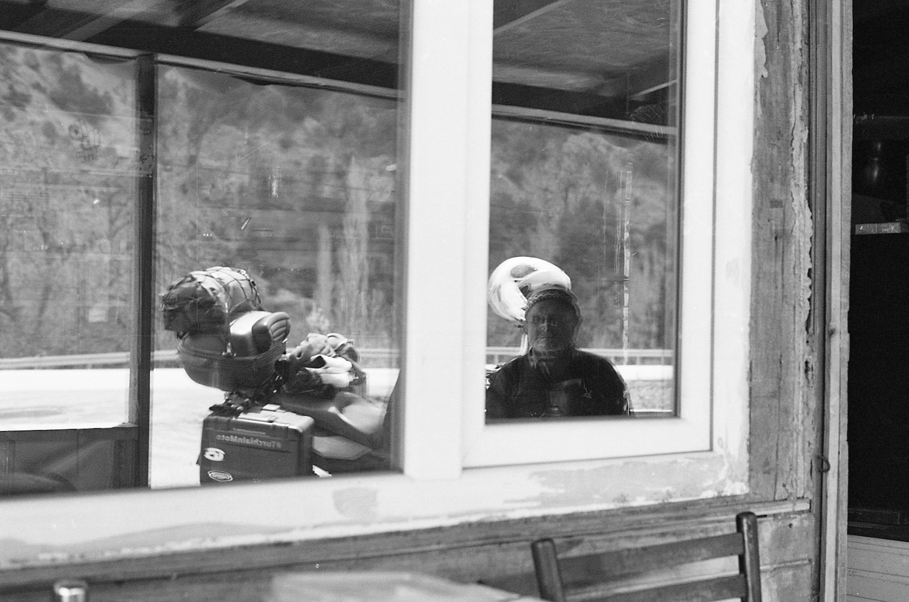
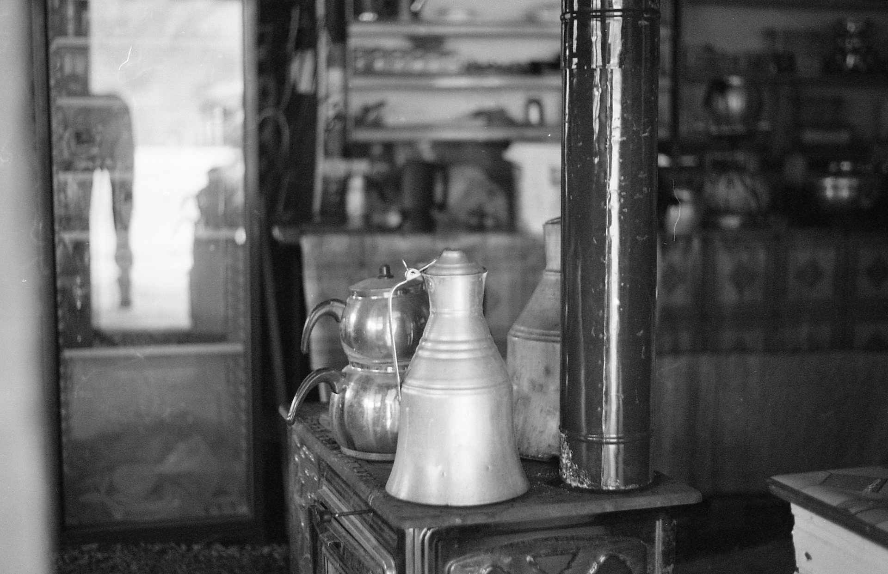
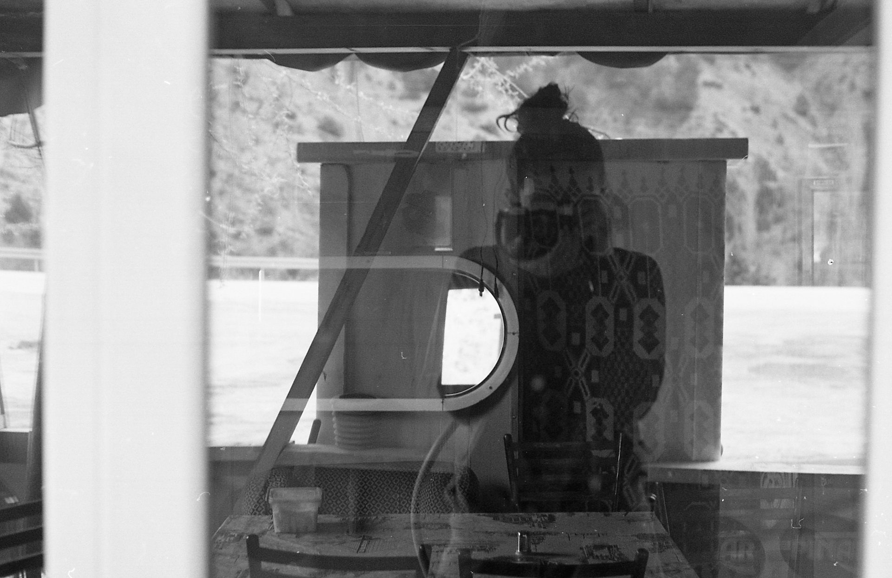
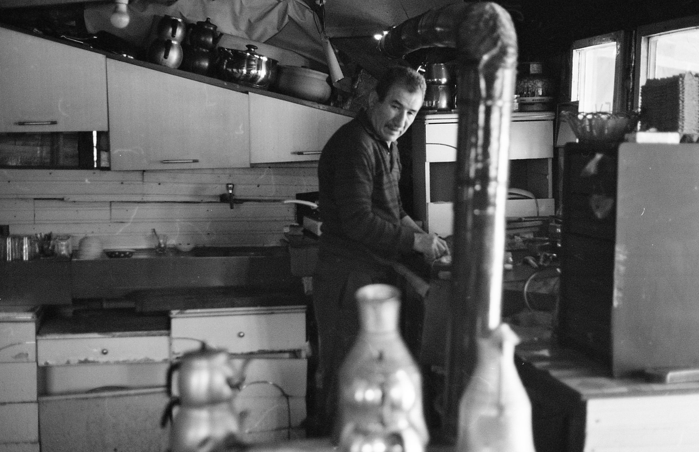
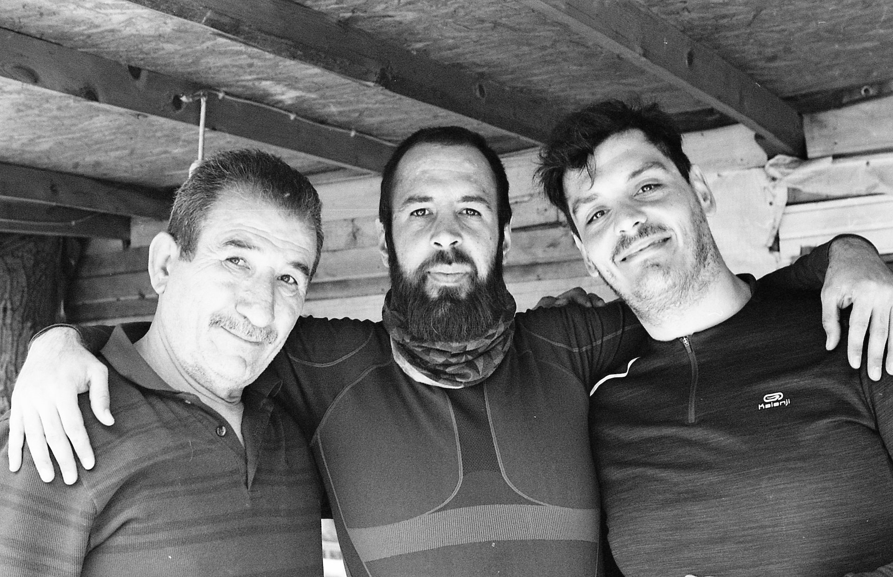
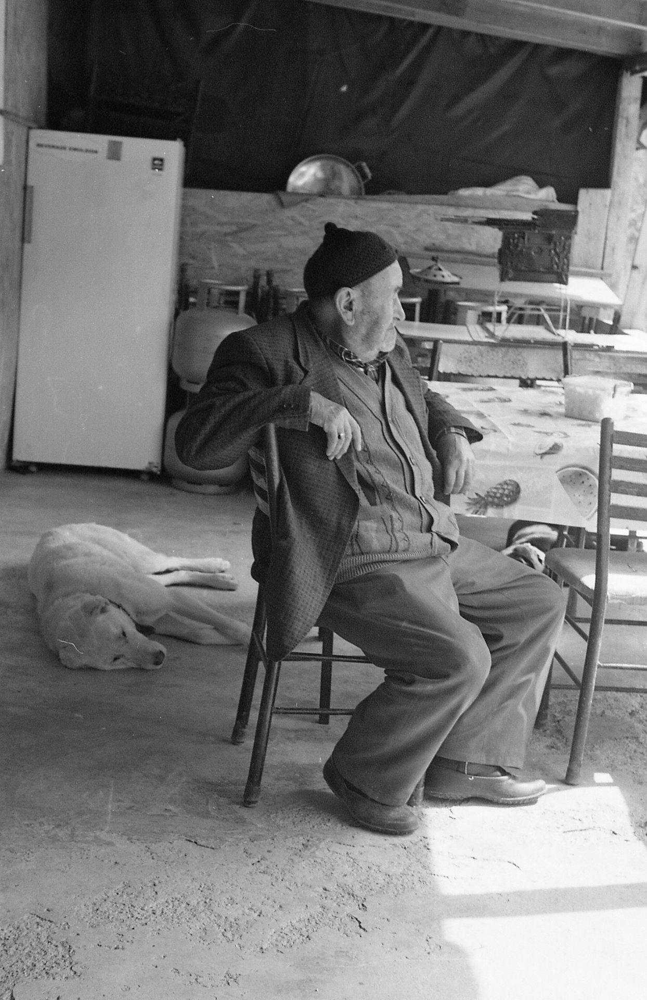
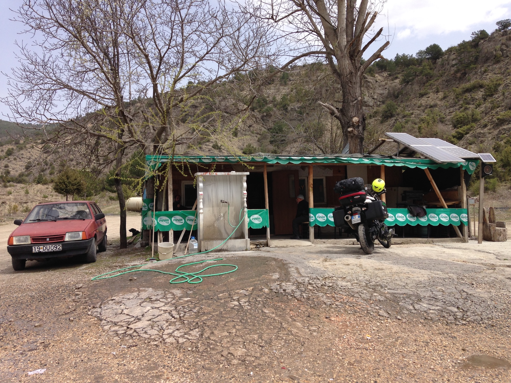
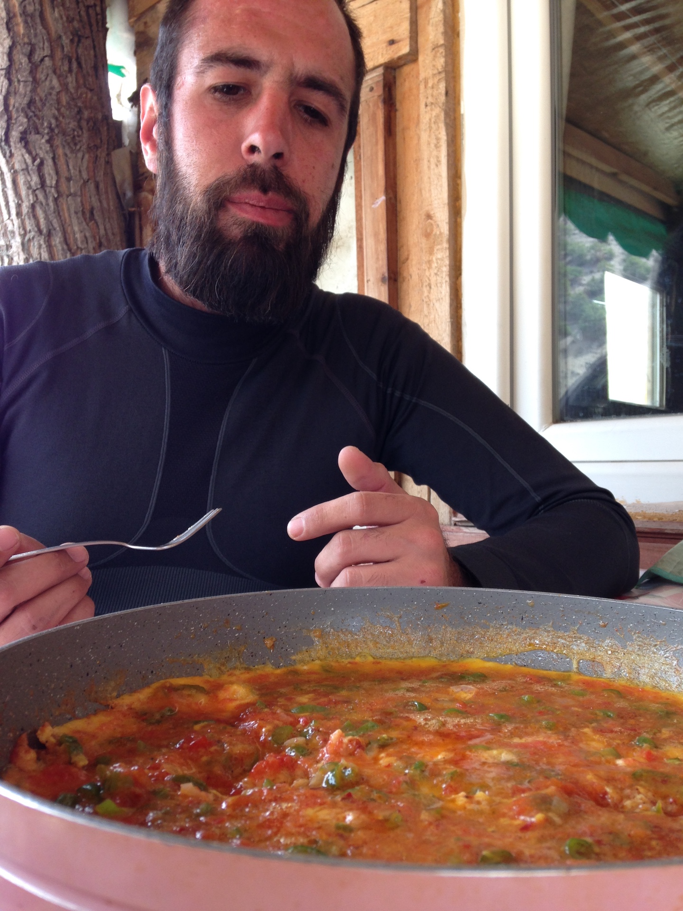

[Turchia](/categoria/viaggi/turchia), siamo in viaggio da un po' e, nonostante siano passati pochi giorni, mi sento già in quel momento in cui non so più di che giorno si tratti e sembra che la mia quotidianità sia sempre stata così, in viaggio sopra una moto.

Abbiamo lasciato Istanbul da poche ore e stiamo attraversando una sconosciuta valle turca, l’asfalto è buono e la strada libera, poche auto, qualche grosso camion, temperatura mite e tartarughe che attraversano la strada: urlo nell’interfono «EHIIII MA INCREDIBILE!! L’HAI VISTA LA TARTARUGAAAA!!????» risposta «MA SEI SCEMO???! SARÀ STATO UN SASSO!!» «MIIIITELOGIUROOO!» «TUSEISCEMO!» «NODAVVERO» ecc. ecc.… Purtroppo scoprirò di aver ragione solo una settimana dopo, quando incontrato Roberto, altro motoviaggiatore, confermerà la presenza di tartarughe sulle strade turche.

La strada mi piace, finalmente curve e tranquillità, dopo giorni di stancanti e noiose lingue d’asfalto dritte e infinite, insomma ce la stiamo godendo.

Non ricordo con esattezza dove, non ricordo con esattezza quando o come, sta di fatto che Gabriele si ferma, mi guarda e afferma «Dobbiamo aspettare Arturo, ha perso il coperchio di una valigia laterale» «EHHHHH?». Non riesco a credere a Gabriele fino al momento in cui non vedo giungere Arturo… Effettivamente da una delle sue valigie svolazza l’arancione della sua borsa interna. (Spoiler: il coperchio non sarà mai più ritrovato, il mistero di come e quando sia volato via non sarà mai svelato).

Gabriele mi guarda, io guardo Gabriele, guardo Arturo che ci ha appena raggiunto. E’ agitato: «torno indietro, lo cerco».

Gabriele e Stefania decidono di seguirlo e invita me e Alice a proseguire ed individuare un luogo dove pranzare. Ognuno per la propria direzione, ripartiamo.

Io e Alice, l’amica che poggia il sedere sul sedile del passeggero, proseguiamo per alcune decine di km; intorno a noi nulla: stiamo attraversando un passo, solo boschi, prati e qualche campo coltivato. Decidiamo di fermarci ed aspettare, facciamo qualche foto, tentiamo di chiamare Gabriele, che ci dice: «Arturo prosegue nella ricerca, noi stiamo tornando verso di voi, trovate cibo». 15 secondi di telefonata, 4,80 euro di traffico andato.

Ripartiamo ancora, superiamo il colle e iniziamo a scendere, pochi km dopo si apre un grande spazio sterrato, lì, nei pressi di un albero, un chiosco, o meglio, una baracca. Rallento, faccio qualche metro nel piazzale e chiedo «Aly, ci daranno da mangiare?» «Proviamo» risponde lei.

Parcheggio di fronte al chiosco/baracca. Quando spengo la moto mi rendo conto del silenzio del luogo. Alice scende, mi sfilo il casco e osservo il posto. Sulla soglia tre anziani ci guardano come se avessero visto un alieno.

Chiedo se possiamo mangiare, oddio, chiedo, mi porto le mani alla bocca con gesti tipicamente italiani e mimo "mangiare".

Capiscono, uno dei tre anziani signori dice si, ci invita a sederci. Io e Alice ci guardiamo, un po' interdetti, un po' impauriti. Questo non è un locale, non è un bar, non è un abitazione… mai scopriremo di che cosa si tratta. Sta di fatto che scegliamo di fidarci e ci accomodiamo nel piccolo dehor, panche di legno crepato dall’acqua e dal sole accolgono i nostri culi.

Stiamo ancora appoggiando caschi e giubbotti quando il signore ci domanda qualcosa in turco. La barriera linguistica è insormontabile, non capiamo un cazzo di turco, i turchi non capiscono un cazzo di italiano, lui, nello specifico, neanche l’inglese. E’ un signore sui 65 anni, baffi e polo. Potrebbe essere il classico pensionato italiano, il luogo ricorda anche una di quelle bocciofile che sorgono nei quartieri di Torino. Li però non giocano a carte e i due commensali seduti nel dehor non so neanche come siano arrivati lì.

Sta di fatto che non riusciamo a capire cosa ci sta chiedendo, fino a che non ci invita ad entrare. La baracca è bassa, sporca e vecchia. Nel centro troneggia una stufa in ghisa, tavoli in legno attorno e, su un lato, una cucina bianca anni '60.

Il signore ci invita a seguirlo, attraversiamo la stanze e lui scosta un tappeto arabo utilizzato come tenda: dietro il buio più profondo, si nota sola uno scaffale in metallo da cui estrae un secchio bianco, di quelli che contengono la vernice per intenderci, e ci mostra l’interno. Uova. Poi recupera dei pomodori, ce li mostra, poi cipolle e poi peperoncini, il gesto che segue accompagnato dal suono *frushh* è inconfondibile, vuole farci una frittata «okkkkey!» diciamo noi. Torniamo fuori, ci sediamo e aspettiamo. Mentre sfumacchio una delle mie sigarette il turco mi fa capire di volerne una, allora mi metto all’opera e gliene giro alcune che gli consegno, lui sorride e se ne accende una all’istante.

Ora, abbiamo trovato il cibo, rimangono da ritrovare gli altri. Ebbene, il cellulare non prende. Mi rivolgo di nuovo al turco mimando un telefono, mi fa capire che per telefonare mi devo spostare, lì non c’è campo. Salgo in moto, scendo di qualche curva e chiamo. Gabriele non risponde e io inizio a preoccuparmi, sono un paio d’ore che non abbiamo notizie. Ritorno da Alice, è ancora viva, scatta qualche foto con la sua vecchia macchina foto analogica.

Aspettiamo e teniamo d’occhio la strada «speriamo ci vedano» penso.

Qualche minuto dopo sento il rumore di una moto, mi giro e scorgo la R1200 di Gabriele che scorre a tutta velocità, ancorata al sellino posteriore Stefania avvolta dal kway sembra volare via. Inutili le nostre grida e le nostre braccia sventolate, non ci sentono ne ci vedono. Okay, inizio a preoccuparmi. Se non ci trova più avanti e non posso chiamarlo? Fino a dove proseguirà? E Arturo dov’è?

Mi consulto con Alice, risalgo in moto e provo a telefonare di nuovo. Ci riuscirò solo dopo qualche tentativo, dice di essersi fermato al primo paese che ha incontrato, ci rivedremo lì.

Nel frattempo la frittata è cotta, la *mise en place* consiste in una forchetta ossidata, del pane a fette e un tovagliolo di carta. Le bevande provengono dalla fontana situata di fronte, la stessa che un camionista poco dopo utilizzerà per inacquare il suo mezzo per rimuovere la polvere.

La frittata giunge al tavolo direttamente nella vecchia padella in cui è stata cotta. Il turco ci augura buon appetito, almeno credo. Sorridiamo e afferriamo le forchette. Stiamo gustando il piatto, che tutto sommato non è affatto male, forse un filo troppo piccante. Il peperoncino turco credo sia un classico e viene infilato ovunque, non è molto piccante ma si fa sentire. Con la forchetta in mano avvisto la moto di Arturo sulla strada, comincio ad urlare, con me anche i commensali Turchi. Dopo che è passato Gabriele hanno capito che era nostra intenzione fermare altri motociclisti, così ci aiutano. Arturo per fortuna ci vede, svolta nel piazzale e scende dalla moto. E’ esausto e nervoso, impreca e bestemmia per non aver ritrovato il coperchio disperso. In compenso si siede a tavola e trova il pasto servito.

Finiamo il pranzo, ci viene offerto l’ennesimo çay di questo viaggio, infilo una zolletta di zucchero e bevo.

L’evento più bello accade ora: mettiamo mano al portafoglio e cerchiamo di chiedere il conto. L’uomo ci guarda e ci fa capire che non vuole soldi, ci sta offrendo il pranzo. Ci rifiutiamo, cerchiamo di lasciargli i soldi sul tavolo, ma niente, non ne vuole sapere. Al che Arturo spalanca le sue braccione lo abbraccia per ringraziarlo, sorridiamo e Alice ci scatta una foto.

Prima di andare via consegno al signore ancora alcune delle mie sigarette che sembra aver apprezzato poco fa.

Saliamo in moto, Arturo segna le coordinate della baracca su maps e ripartiamo.

Se state attraversando la Turchia e vi trovate nel distretto di Nallıhan, nei pressi dell’omonima cittadina andate a fare un saluto al caro amico Turco.

**[Seguici su Facebook](https://facebook.com/motoviaggiatori/) per non perderti i prossimi articoli!**

In questo viaggio abbiamo messo alla prova alcuni prodotti dei nostri partner tecnici:

- caschi modulari [Caberg Helmets](https://www.caberg.it/) Levo: leggeri, silenzionsi e dotati di una visiera panoramica favolosa, sono il top per il mototurismo a lungo raggio
- interfoni [Midland](https://www.midlandeurope.com/it) BT Next Pro, BTX1 Pro S e BTX2 Pro S: audio chiarissimo a tutte le andature con la possibilità di parlare in conferenza tra i piloti delle moto, davvero ottimi e consigliati
- molle progressive [Hyperpro](https://hyperpro.com): un upgrade enorme rispetto alle molle originali della BMW R1200GS, migliorano moltissimo il comportamento della moto in curva senza ridurre il comfort di marcia grazie al coefficiente elastico che cambia a seconda della forza esercitata sulla molla, costano poco ma rendono molto (distribuite da [Rinolfi](https://www.rinolfi.it))
- pastiglie freno [Brembo](http://brembo.com/it) in mescola LA: sinterizzate e specifiche per i freni anteriori delle moto da turismo, frenano forte dopo pochi km di rodaggio e promettono durata superiore (distribuite da [Motorquality](http://www.motorquality.it))
- cupolino maggiorato Adventure [WRS](https://wrs.it) per  BMW R1200GS: permette di rilassarsi parecchio quando si viaggia a velocità sostenute, alleggerendo il carico sulla muscolatura cervicale e riducendo il rumore causato dalla turbolenza, l'archetto di sostegno permette di montare navigatori&co senza ostruire la strumentazione della moto
- olio motore [Putoline](https://www.putoline.com/) SPORT 4 15W-50: semi-sintetico (API SL, JASO MA2), la BMW R1200GS non ne ha *mangiato* una goccia nei 7000km percorsi dal tagliando (distribuito da [Rinolfi](https://www.rinolfi.it))
- S.M.A.R.T. IAT di [Belinassu](http://www.belinassu.it): una sonda plug&play che migliora il tiro del motore ai bassi e medi regimi ingrassando la miscela, semplice da installare e completamente reversibile
- pneumatici [Anlas](http://anlas.com/it/) Capra RD e Capra R: gomme stradali che non disdegnano off-road leggero, ottimo feeling anche su bagnato, il consumo nei 5500km del viaggio è stato regolare
