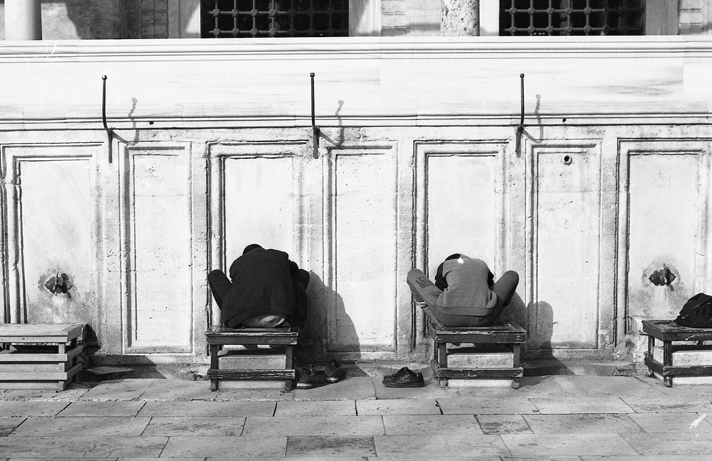

È il 19 aprile 2019, sono le otto del mattino, sto per salire per la prima volta su una moto – una moto vera, s’intende – e il giro di rodaggio prevede 7000 Km. Lo stomaco è un po’ attorcigliato.

«Vuoi fare un viaggio in moto in Turchia?»

Qualche settimana prima Emanuela e Simone mi avevano fatto questa proposta singolare, spiegandomi che Emanuela non sarebbe più potuta partire per un viaggio che avevano già organizzato con altri tre amici e che sarebbe rimasto dunque un posto libero sulla moto di Simone. Mi sembrava un viaggio di una certa portata, troppo grande per decidere di parteciparvi con così “poco” preavviso, e poi l’assenza di Emanuela non era ancora certa. Ho declinato l’invito, promettendo però di pensarci, più per gioco che seriamente, e sperando che Emanuela potesse partire. Alla seconda proposta, quando Simone mi ha comunicato che quasi sicuramente Emanuela non avrebbe partecipato al viaggio, ho declinato ancora, per me il capitolo “viaggio in Turchia” si concludeva così, o almeno è quel che pensavo in quel momento.

Un po' di tempo dopo, infatti, ho incontrato di nuovo Simone che, questa volta quasi ironicamente, mi ha proposto ancora il benedetto viaggio in Turchia. «Se me lo chiedi ancora una volta non riuscirò più a dire di no», ho risposto ironicamente (o forse no) mentre nella mia testa qualcosa ha iniziato a smuoversi, a prendere in considerazione l’idea un po’ folle di partire. Mancavano quattro giorni alla partenza.

Non so dire con esattezza cosa mi abbia spinta il giorno dopo a dire di si, a decidere di partire per un viaggio di settemila chilometri, su un mezzo mai provato prima, con persone mai viste e in un paese che all’inizio non mi infondeva troppa sicurezza. Quasi sicuramente sono state la voglia di viaggiare e una grande curiosità. Curiosità per la Turchia, paese così lontano dal mio immaginario da farmi un po' paura, per quel mezzo sconosciuto, la moto, e quel nuovo amico, Simone, che in fondo fino a quel momento era stato un po’ uno sconosciuto anche lui, e si sa, i viaggi sono determinati in larga parte dalle persone che ci accompagnano e da quelle che si incontrano lungo la strada. Può essere stato per quel bisogno di staccare, di mettermi in gioco e fare qualcosa che mi facesse sentire viva, e la vocina, quella che mi si presenta in queste situazioni, «se vuoi farlo e non lo fai sei una cacasotto» – giuro, dice proprio cacasotto –.

Così, a tre giorni dalla partenza, cominciano i preparativi anche per me. Devo: cambiare nominativo del biglietto del traghetto, fare un’assicurazione sanitaria, trovare abbigliamento da moto, un casco e preparare la valigia, piccola che stia nel bauletto!

Panico. Ma riesco a fare tutto più o meno senza problemi, tranne uno, banale: il casco. Tra le mie conoscenze motociclistiche nessun casco taglia XS, niente caschi usati a poco prezzo, comincio a convincermi che la mia testa sia davvero fuori dal normale e con questa convinzione mi decido a comprarne uno nuovo, ritrovandomi così, il giorno prima della partenza, con Simone in un negozio di moto a 60 Km da casa a provare caschi.

Il mio integrale con fantasia mimetica e strisce verde fluo non si intona affatto con quello di Simo, scoordinati in partenza, sono le 8 del mattino, siamo pronti a partire e io sto per salire per la prima volta su una moto!
Inutile e banale dire quanto il viaggio sia stato pazzesco e come i miei presentimenti positivi rispetto alla compagnia e alla moto non si sbagliassero affatto.

Una squadra eccezionale. Simone. Amico, autista e compagno in sella di lunghe chiacchierate e lunghi silenzi… ma con l’interfono sempre acceso! Arturo. A completare un allegro trio sgangherato con me e Simo, abbiamo condiviso stanze e grasse risate per tutto il viaggio. Gabriele e Stefania. Senza i quali probabilmente questo viaggio non sarebbe esistito, meticolosi avventurieri sempre alla ricerca di qualcosa da scoprire (partiti in coppia e tornati in tre, o almeno così narra la leggenda che i più romantici del gruppo han voluto inventare).

La moto. Ho sperimentato il viaggio in macchina, in aereo, in treno, in bus e in bici, prima di partire ho pensato che la moto potesse essere una specie di compromesso tra macchina e bici, motorizzato, niente fatica (illusa!), ma immersa nel paesaggio come in bici. Niente di tutto questo. Come ogni mezzo di trasporto, dalle proprie gambe all’aereo, viaggiare in moto ha le sue caratteristiche specifiche, i suoi pregi e i suoi difetti, che rendono l’esperienza singolare, almeno a primo impatto. Viaggiare in moto significa essere immersi nel paesaggio, quasi a corpo libero si ha contatto con ciò che ti circonda e da passeggero a tratti si ha quasi la sensazione di volare. Il contatto non è reale come quando si cammina o si pedala, usando le proprie energie per spostarsi nello spazio, però è incredibile quella sensazione di muoversi velocemente in un paesaggio e poterlo sentire addosso. E quando quella sensazione così forte non basta e ne vuoi di più, apri la visiera del casco per sentirlo bene sulla pelle quello spettacolo. Viaggiare in moto significa macinare chilometri e spostarsi velocemente nello spazio, ma rimanendo sempre in stretta relazione con i luoghi che si susseguono e cambiano (esemplare il tratto tra Croazia e Grecia nel quale abbiamo tenuto una media di due frontiere al giorno!).

Viaggiare in moto è fermarsi solo quando indispensabile, perchè fermarsi significa toglierti mille strati di abbigliamento (o in alternativa morirci dentro soffocato) e aprire duemila serrature tra borselli e bauletti per arrivare alla macchina fotografica, al tabacco o all’acqua. Viaggiare in moto è l’eventualità di perdersi per strade sconosciute. Viaggiare in moto è il male alle chiappe e le formiche alle gambe quando ti toccano chilometri e chilometri di autostrada. Viaggiare in moto è perdere coperchi dei bauletti e doversi arrangiare, intrufolarsi nelle strade più piccole, sudare per togliere la moto dalla sabbia dopo averla messa in posa per una foto con sfondo mozzafiato. Viaggiare in moto è anche un po' annoiarsi su strade dritte e anonime, ma è emozione fortissima quando il paesaggio cambia all’improvviso e tutto l’entusiasmo ritorna. Viaggiare in moto è adrenalina pura quando viaggi con pioggia e vento sfrecciando tra i tir in autostrada, e poi è dover trovare un albergo di fortuna perché sei troppo stanco, fradicio e infreddolito per poter andare avanti.

E si, tutto è cominciato quel 19 aprile con lo stomaco attorcigliato, quando per la prima volta mi sono seduta su una moto, quando ho conosciuto i miei compagni di viaggio e mi sono fatta i miei primi 600 Km di autostrada tutti in un colpo. Esperienza che rifarei? Assolutamente si e magari, chissà, nel secondo capitolo, non più da passeggera.
