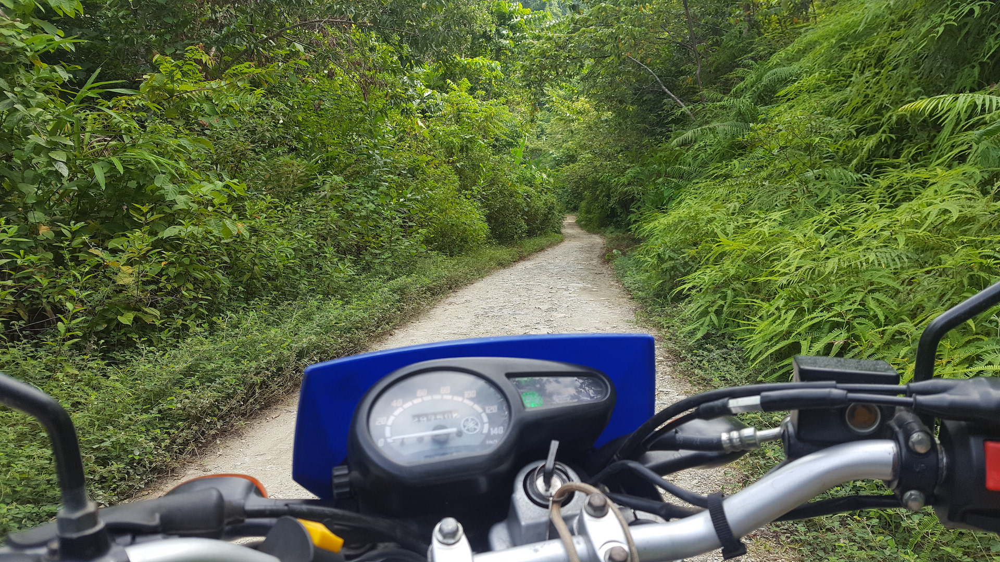
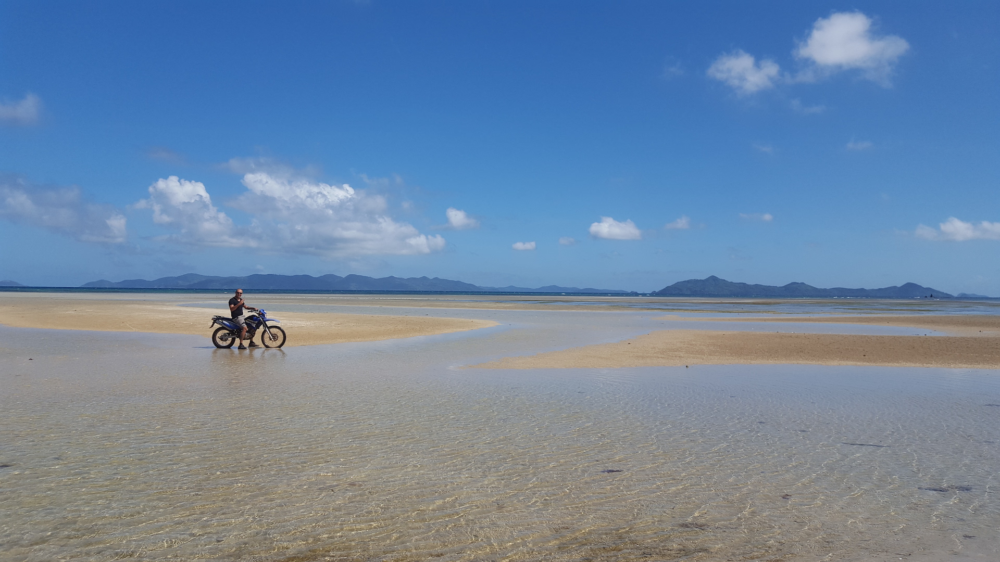
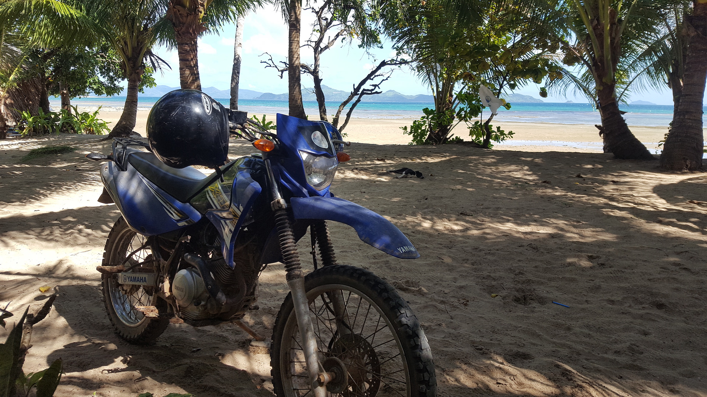
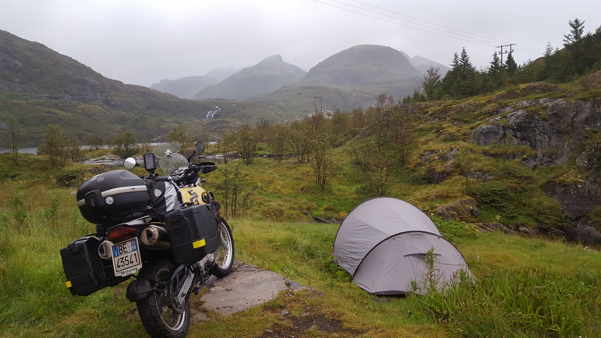
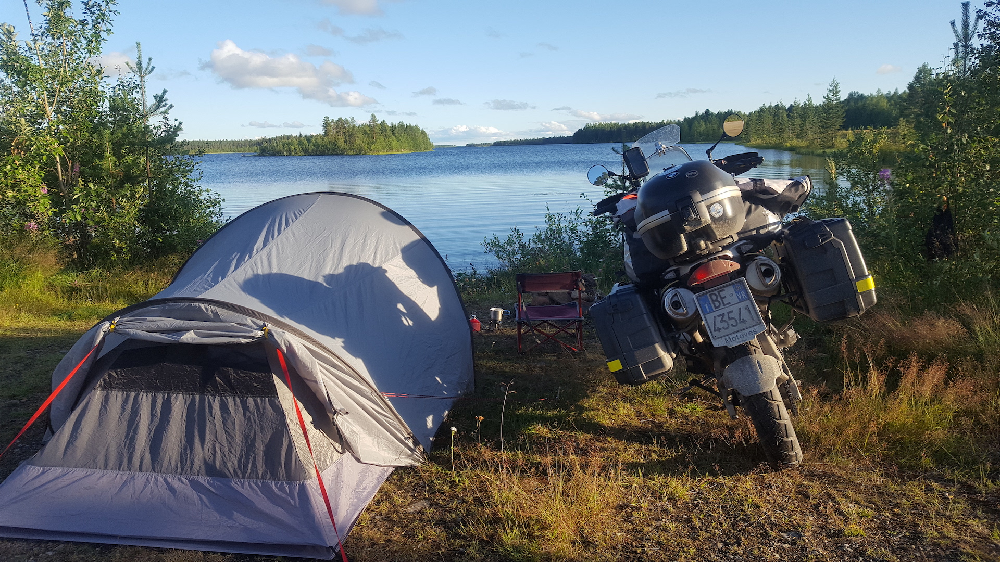
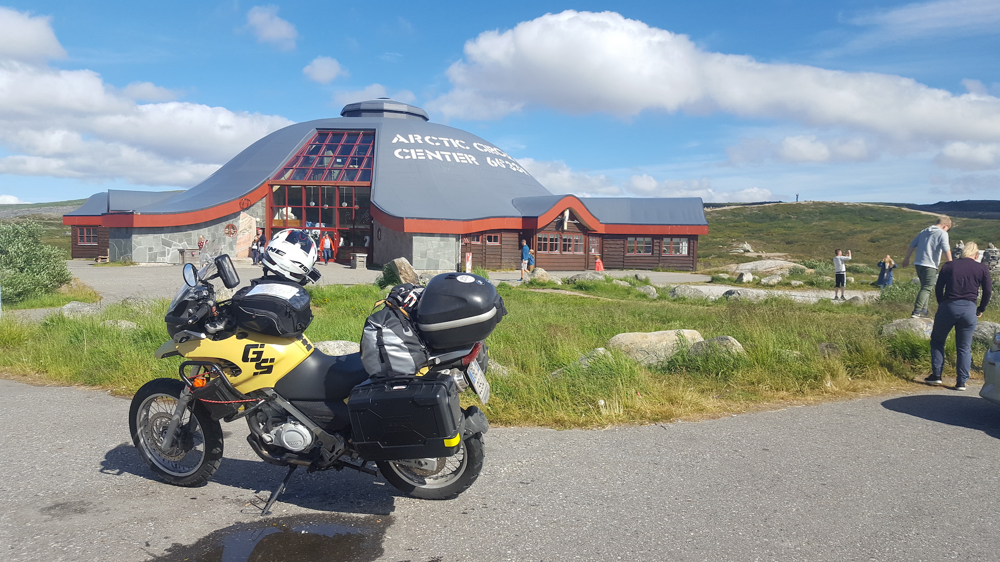
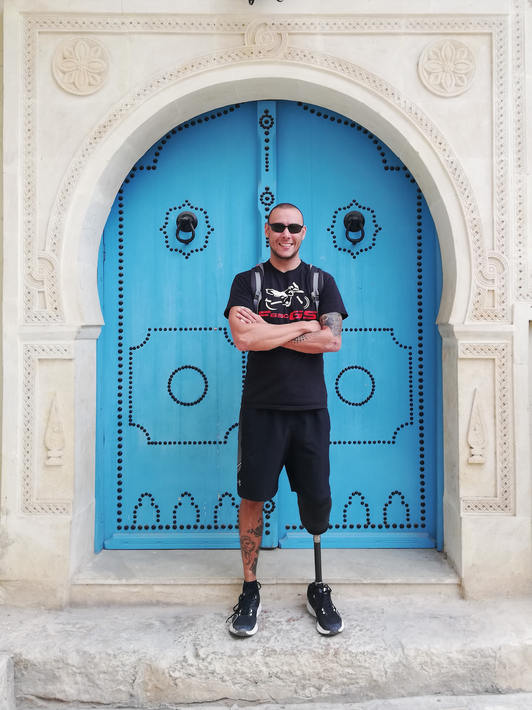
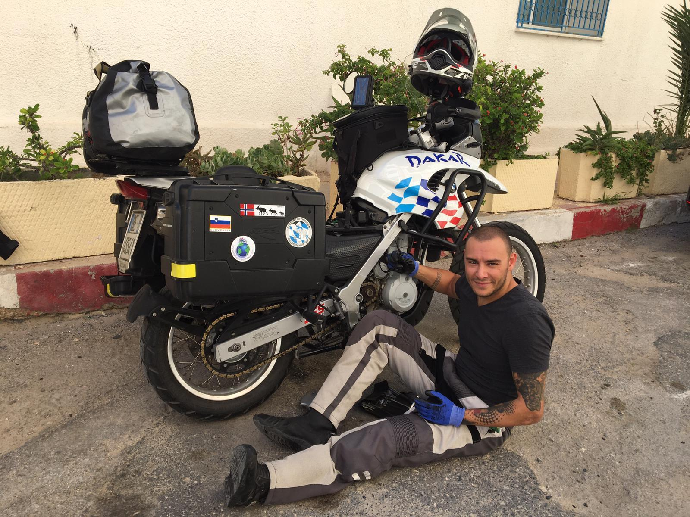
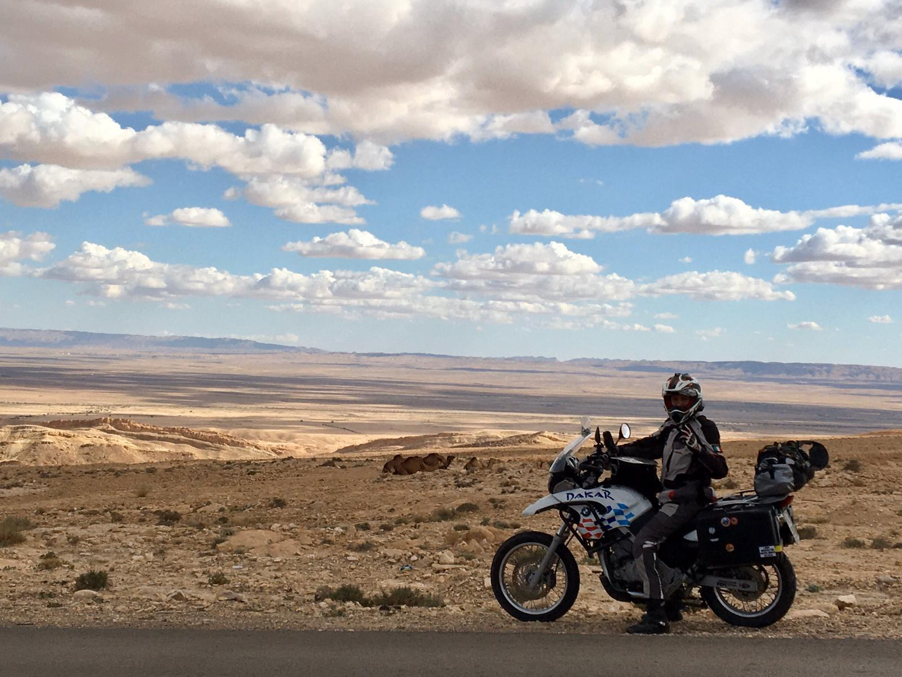

"Karmaontheroad" nasce in seguito all'incidente che mi ha cambiato la vita esattamente 4 anni fa.
Tornando da lavoro in moto, sono stato investito e dopo 41 interventi, 28 anestesie generali, una gamba amputata, una protesi al gomito e una buona dose di viti e bulloni… sono di nuovo in sella.

Credo che la passione per la moto mi abbia salvato la vita, dopotutto da qualche parte dovevo iniziare a ricostruirne una nuova. Perchè la moto? Perchè il viaggio on the road ti mette in contatto col mondo e ti da un forte senso di libertà. La strada, il caldo, il freddo, la pioggia… li senti addosso, ti entrano dentro e ne fanno un esperienza che definirei autentica. E quando sei immerso nel baratro le cose autentiche sono le uniche che contano.

In questi anni sono partito assieme a mia moglie Giulia per delle moto-avventure che hanno lasciato in noi ricordi indelebili: la nostra luna di miele zaino in spalla di due mesi alle Filippine, in cui abbiamo vagabondato tra meravigliose isole, risaie e foreste; il primo viaggio post amputazione (a sei mesi dall'intervento) in cui siamo arrivati fino alle porte del deserto in Tunisia… e come dimenticare il mio viaggio in solitaria a Capo Nord, con un vecchio BMW F650GS del 2001, una tenda e un budget decisamente limitato!

Sono state esperienze incredibili, ma dopo l'amputazione della gamba, avvenuta nel 2019 a causa di complicazioni mediche, mi sono reso conto di essere nato nel *lato giusto del mondo* e questo ha stravolto alcune delle mie priorità. Il viaggio in moto fine a se stesso non mi bastava più, sentivo crescere in me il desiderio trasmettere anche un forte messaggio di speranza.

Questo sogno si è concretizzato qualche mese fa quando mia moglie, anche lei desiderosa di dedicare le proprie energie a chi ne ha più bisogno, ha scovato su internet l'associazione [Legs4Africa](https://www.legs4africa.org). Da lì è iniziato tutto e grazie al loro supporto potremo finalmente partire per un viaggio, sia fisico che spirituale, interamenete dedicato a raccogliere fondi per questa organizzazione che raccoglie protesi usate nei paesi sviluppati per mandarle in Africa… appunto *l'altro lato del mondo* che tanto volevamo raggiungere.

Abbiamo fissato la partenza il 15 ottobre 2020, ma per via dell'emergenza COVID-19 potremmo dover rimandare la aprtenza a causa della chiusura delle frontiere. Stiamo lavorando duramente per avere i visti, il nostro programma di massima è di traghettare da Genova a Tangeri e poi attraversare Marocvo e Mauritania, fino a raggiungere la capitale del Senegal, Dakar. Arriveremo al CNAO – *Centre National d’Appareillage Orthopedique* – dove Legs4Africa africa collabora per fonire le protesi.

Seguiteci sulla [pagina Facebook Karmaontheroad](https://www.facebook.com/Karmaontheroad/) per non perdervi gli aggiornamenti del nostro viaggio benefico!

"Non importa se stai procedendo molto lentamente; ciò che importa è che tu non ti sia fermato"  
– Confucio
