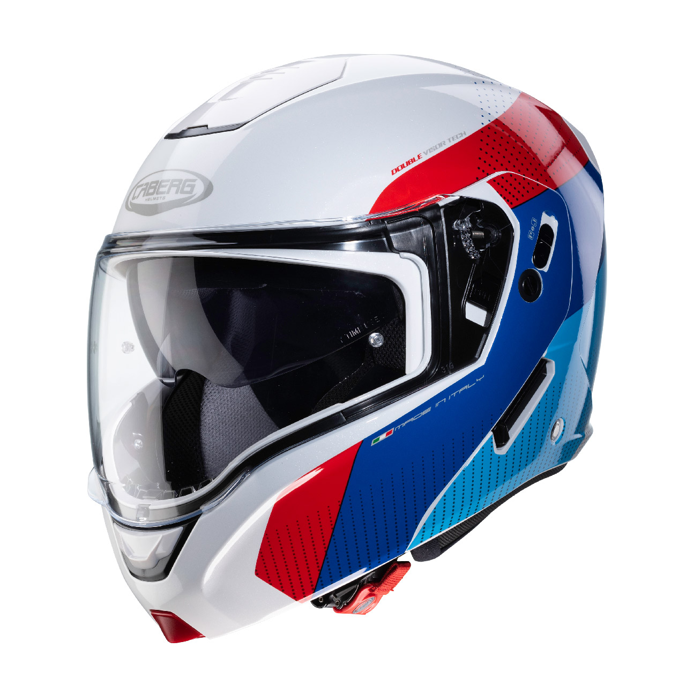
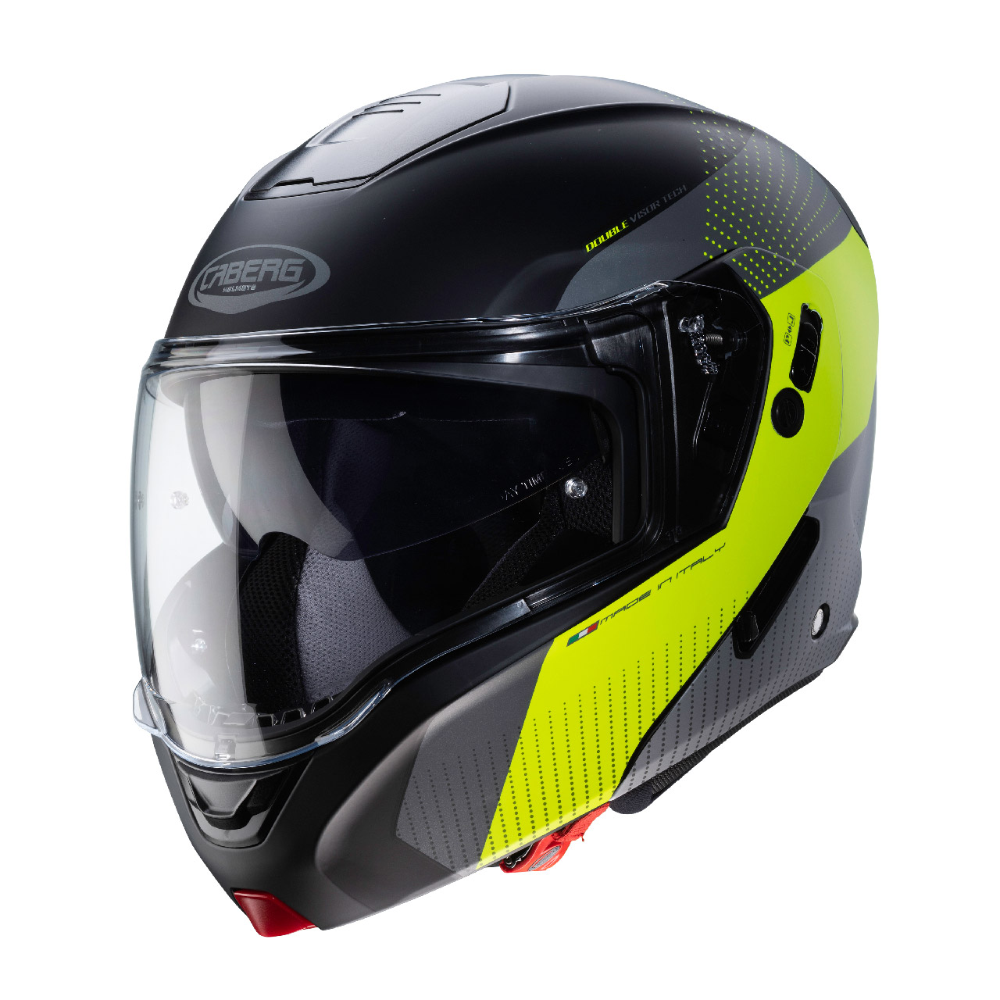
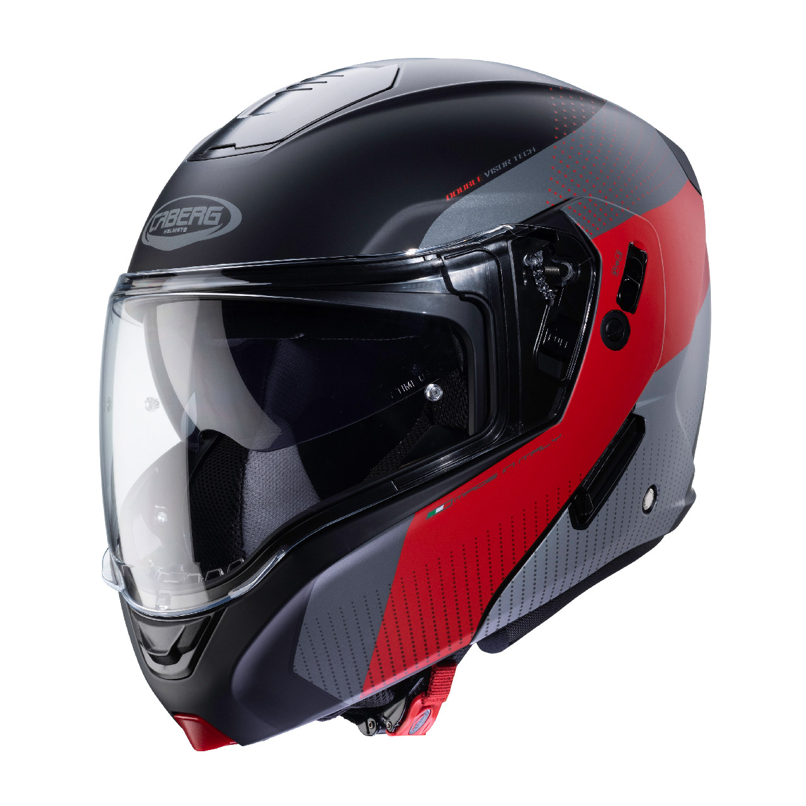
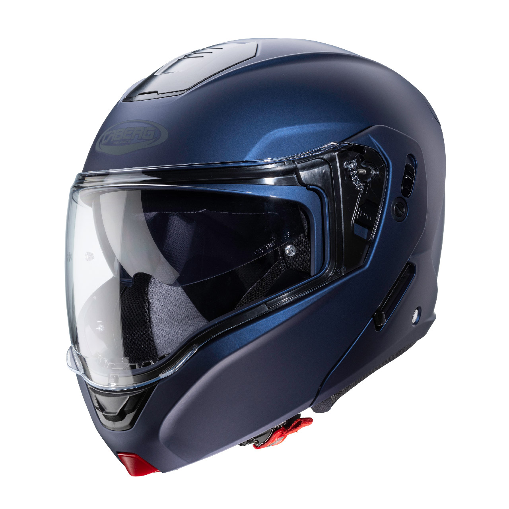
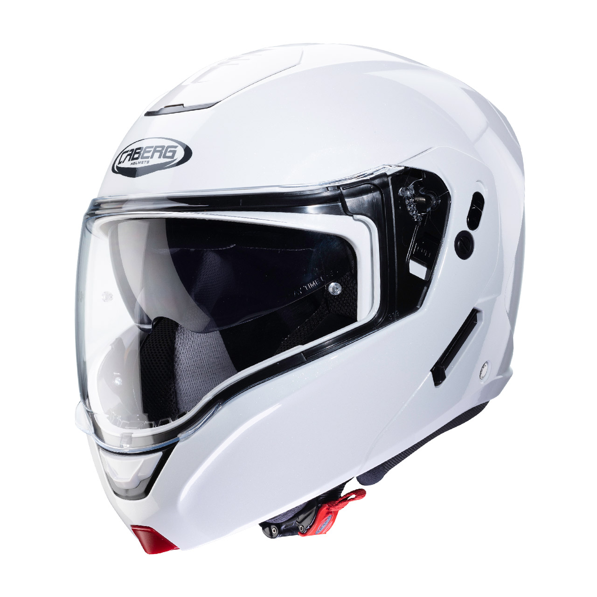
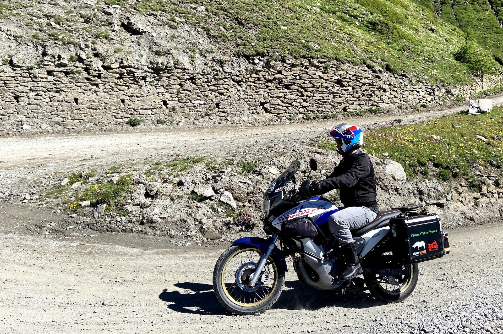

Nel 2019 abbiamo apprezzato le qualità delle visiere ultra-grandangolari sul [Caberg LEVO](/2019/07/recensione-casco-modulare-caberg-levo), un ottimo casco modulare in fibre composite caratterizzato da peso contenuto, ottima ventilazione e silenziosità… ma ad un prezzo non proprio popolare: il listino parte da €389,99.

Ad EICMA 2019 Caberg presenta l'HORUS: un nuovo casco modulare che **eredita contenuti e maxi-visiera del LEVO**, ma ad un prezzo più contenuto (listino da €249,99).

Colori HORUS Scout:

Colori HORUS:

Dopo aver percorso 500 km in tutte le condizioni (città, strade extra-urbane, autostrade e strade bianche) è giunto il momento di fare qualche considerazione e mettere l'HORUS a confronto diretto con il LEVO usato fino a poco fa.

## Peso

La prima cosa che si nota comparando le caratteristiche tecniche è che l'HORUS (in ABS) pesa circa 200 grammi in più rispetto al LEVO (in fibre composite): 1650g contro 1450g. Ammetto di non aver percepito la differenza o di sentirmi più affaticato nell’utilizzo di HORUS piuttosto che LEVO.

## Rumorosità

Dopo svariate prove in autostrada e non, posso dire con certeza che HORUS è un casco **abbastanza rumoroso**, sicuramente più del LEVO. Anche con tutte le prese d’aria chiuse il rumore si fa sentire ed è più impegnativo nei lunghi tragitti.

## Comodità

La calzata dell'HORUS è molto comoda, gli interni (completamente rimovibili e lavabili) sono ben imbottiti e risulta molto simile al Caberg DUKE II; è più confortevole del LEVO, che richiede una certa abitudine. È una cosa che ho notato subito poiché con HORUS calzo la mia taglia abituale (L), mentre con LEVO una in più (XL).

Sia HORUS che LEVO sono molto facili da smontare per permettere le operazioni di pulizia ordinaria. In pochi semplici mosse, si riesce a rimuovere l’imbottitura in tessuto lavabile. Il rivestimento interno del LEVO è in Coolmax® e risulta più traspirante rispetto all'HORUS.

## Visiera

La visiera panoramica è fantastica, praticamente identica a quella montata sul LEVO e dotata di **inserto antiappannante Pinlock di serie**.

Il meccanismo della **visiera parasole integrata** di HORUS è molto più semplice di quello di LEVO, regala purtroppo una sensazione di economicità e inoltre è molto poco fluido, tant’è che a volte mi pare sforzi leggermente.

## Aerazione

L'aerazione di LEVO è superiore, le sue prese d’aria presenti sono così efficaci da non rendere necessario aprire la mentoniera in estate. HORUS mi sembra apportare un minore flusso d'aria, anche se la retina posta sui capelli regala una sensazione di maggiore comfort.

## Ergonomia

Pur indossando guanti non proprio morbidi, su entrambi i modelli risulta molto facile avere accesso alle prese d’aria, aprire e chiudere visiere e mentoniera. Sull'HORUS basta scorrere una levetta per agire sul blocco meccanico della mentoniera (dispositivo che rende sicuro e omologato il casco anche in posizione aperta), a differenza del LEVO che risulta più macchinoso.

## Mentoniera

Su HORUS la mentoniera presenta un doppio meccanismo di aggancio che a mio parere lo rende più robusto rispetto a quello di LEVO. Il punto di rotazione della mentoniera è diverso da quello della visiera, per cui **la mentoniera dell’HORUS rimane sempre vicina alla calotta** limitando l’effetto vela.

## Compatibilità interfono

HORUS presenta *scassi* per l’interfono leggermente più larghi rispetto al LEVO. Questo ha reso molto facile il montaggio del mio interfono [MIDLAND BTX2 PRO S](/2019/09/recensione-interfoni-midland-serie-bt-pro) (sul LEVO gli speaker entravano faticosamente nell'alloggiamento).

# Prezzo

Caberg è riuscita a produrre un casco che costa circa il 35% in meno del top di gamma senza rinunciare ai contenuti, facendo un compromesso su peso e silenziosità. **Se state cercando un casco comodo e completo HORUS fa per voi**. Se invece volete un casco adatto a lunghi viaggi, scegliete il [LEVO](/2019/07/recensione-casco-modulare-caberg-levo) (facendo attenzione a provarlo per bene prima di scegliere la taglia).

## Caratteristiche tecniche

- **Calotta esterna**: LG CHEM HI IMPACT ABS
- **Ventilazione**: aeratore mentoniera e superiore regolabili con due estrattori posteriori
- **Interni**: completamente estraibili e lavabili con rifrangente posteriore, stop wind amovibile e lavabile
- **Visiere**:
  - PANORAMIC ULTRA-WIDE VISOR trasparente antigraffio con Pinlock Max Vision di serie
  - visiera parasole integrata antigraffio
- **Sistema di ritenzione**: fibbia a regolazione micrometrica
- **Taglie disponibili**: XS-S-M-L-XL-XXL
- **Omologazione**: Ece 22.05 P/J

")

